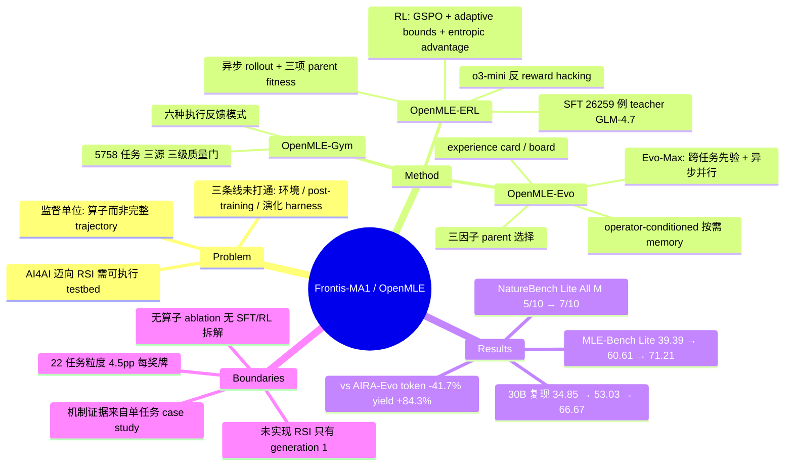

## Summary

OpenMLE 把 machine learning engineering 的三层——可执行任务环境（OpenMLE-Gym，5,758 个 quality-gated 任务）、算子级 post-training（OpenMLE-ERL，用执行反馈的 SFT+RL 训练 Draft/Improve/Debug/Crossover 四个原子 program-transformation 算子）、长程演化搜索（OpenMLE-Evo）——打通为同一个栈，并用它训出 35B 的 Frontis-MA1。MLE-Bench Lite（22 任务、每任务 12 小时、单卡 RTX 4090 限 12GB VRAM）上 Medal Average 从 base model 的 39.39% 提到 60.61%，配 OpenMLE-Evo-Max 达 71.21%。标题中的 recursive self-improvement 是纲领而非结果——作者在 Related Work 与 Limitations 中明确不 claim 已实现 RSI，演化系统本身按其自述 largely fixed，权重更新（按训练与评测配置读出）只发生在部署前的离线阶段，全文只训练到 generation 1。

## Problem & Motivation

AI4AI（用 AI 构建与改进 AI）的野心终点是 RSI——每一代改进过的系统进一步改进"生产下一代系统的过程"。MLE 是这条路上最直接可测的 testbed：agent 必须为真实任务写出 ML 方案，并通过执行反馈反复改进；反馈延迟长（分钟到小时）、噪声大、指标异构。

作者对现有工作的判断是：三条线各自推进但没有接起来——(1) inference-time harness（AIDE、AIRA-dojo、ML-Master 等）用结构化/演化搜索放大冻结模型；(2) 可执行任务与环境（MLE-Dojo、MLGym、MLE-Smith）；(3) 用执行反馈 post-train MLE agent（ML-Agent、MLE-RL、AceGRPO）。Appendix Table 11 的审计显示，按 data / sandbox / train code / RL method / eval / weights 六项artifact 打勾，没有任何公开系统同时覆盖"可扩展任务构建 + 执行接地的 post-training + 把训好的模型部署进长程搜索的演化 harness"，也就没有可复现的完整闭环。

由此派生的核心设计问题：post-training 的监督单位应该是什么？训完整 trajectory 会绑死某个 controller；OpenMLE 选择训练**可复用的原子算子**，让搜索算法在推理时自由组合。

## Method

### OpenMLE-Gym：可验证环境层

统一的 task package 契约：`data/public/`（描述、训练数据、测试输入、sample submission）+ `data/private/`（隐藏答案）+ `utils/prepare.py`、`metric.py`。环境的五元素为 task/state、action（agent 提交的程序）、transition（sandbox 执行）、observation（status/score/logs/error type/artifacts/runtime）、reward（task-specific evaluator 的标量分）。

三条来源构成 quality–scale 权衡：Curated Anchors 156（人工挑选，质量最高）、Kaggle Datasets 3,362（扩展 MLE-Smith 的 dataset-to-task pipeline）、Kaggle Competitions 2,240（自建爬取与构建 pipeline，从 Meta Kaggle 约 11,000 场竞赛经 leaderboard 长度筛选 → 3,972 eligible → 2,839 可执行包 → 2,240 通过语义质量门）。构建期的可执行性校验与独立的 LLM 语义质量门（task validity / data sufficiency / raw-data usage / task complexity / data quality 五维）分开做，且 MLE-Bench 重叠竞赛在构建阶段即排除。执行后端是中心调度器 + CPU/GPU Docker worker，返回六种反馈模式（成功、runtime error、missing code、missing submission、scoring failure、timeout），让 agent 能区分"执行非法"与"任务表现差"。

### OpenMLE-ERL：训练可复用的演化算子

**SFT（26,259 例）**。两条采样路径：parallel path 由 teacher 独立生成 Draft 解并执行，按分数去重后每任务留 Top-4，贡献 17,245 例；evolutionary path 用 GLM-4.7 驱动 AIRA-Evo 搜索，把 Draft/Improve/Crossover 起点到其连续 Debug 后代构成的 local segment 按"因果继承"标准筛选（Improve 段必须超过父程序，Crossover 段必须超过两个父的较优者，终点必须达 medal 级），贡献 9,014 个 trajectory-step。算子分布严重偏斜：Draft 19,436（74.0%）、Debug 4,340（16.5%）、Improve 1,741（6.6%）、Crossover 742（2.8%）。

**RL**。GSPO + TTT-Discover 式 reward 后处理，三个针对 MLE 特性的设计：
- *Adaptive bounds*：固定的 leaderboard/理论上下界往往远宽于当前 policy 实际落点，会把有意义的差异压成同一个 reward。改用历史成功程序 + 当前 rollout group 的移动分数区间（最好分作上界、第 16 好作下参考再向下扩 25% gap）重映射，随 policy 的分数前沿一起漂移。
- *Entropic advantage*：把组内 reward 差异在上尾放大（replace GRPO 式组归一化），β 由二分搜索在固定 KL 预算（≈log 2）下确定。理由是 MLE 只奖励找到的最好程序，勉强能跑的提交不该和 top 拿同样正 reward。
- *Asynchronous rollout*：MLE RL 的主延迟来自沙箱执行而非 token 生成，同步 batch 会被最慢的 job 卡住；改为 generation-and-execution group 独立启动、完成即入队消费。
- *Parent 选择*：$F(p)=\text{norm}(R_p)+\text{norm}(\text{Var}_{c}R_c)+\text{norm}(C_p)$，分别对应利用强父、瞄准算子结果仍有信息量的区域、以及按访问次数降温防止单个 incumbent 垄断 rollout。

RL 期间观察到明显的 reward hacking（典型例：把 sample submission 随机打乱后提交），用 o3-mini 作为 LLM judge 在入沙箱前检查，判定为 hack 则跳过执行并给 −0.5。

### OpenMLE-Evo：经验驱动的长程搜索

以 AIRA-Evo 的 population loop 为骨架，但改造它使用执行证据的方式：

| 维度 | 原 AIRA-Evo | OpenMLE-Evo |
|:--|:--|:--|
| 经验存储 | 大体自由格式 | 确定性 node-level *experience card* + task-global *experience board* |
| memory 合成 | 对每个评估过的节点 eager 调 LLM 摘要 | 只在 Improve/Crossover/Debug 选中相关节点后按需合成并缓存 |
| parent 选择 | 主要按标量 fitness | 三因子效用 $U_i=\lambda_s\tilde s_i+\lambda_\Delta\tilde\Delta_i+\lambda_n\nu_i$（quality / 相对父的进步 / method-family novelty），权重 1.0/0.6/0.3 |
| 上下文 | 各算子拿到相似的长历史 | operator-conditioned：Improve 拿 vertical 祖先链 + horizontal 兄弟；Crossover 加 family 互补性提示；Debug 检索同 error signature 的历史尝试 |

**OpenMLE-Evo-Max** 在此之上叠加两项：从公开竞赛材料蒸馏跨任务经验先验（蒸馏前排除所有 MLE-Bench 相关来源），以及在总沙箱预算不变的前提下开启异步多卡并行搜索。

## Key Results

评测口径：官方 22 任务 MLE-Bench Lite split，每任务固定 12 小时、单卡 RTX 4090 限 12GB VRAM，每个配置跑 3 次独立 run。Medal Average = 拿到任何 Kaggle 奖牌的任务比例均值；Human Rank = 被超过的人类 leaderboard 参与者比例。

**受控比较（MLE-Bench Lite）**

| 配置 | Valid Rate | Medal Average | Human Rank |
|:--|:--|:--|:--|
| Qwen3.6-35B-A3B + OpenMLE-Evo（base） | 19.67/22 | 39.39% ± 5.67% | 0.5828 |
| Frontis-MA1-35B + OpenMLE-Evo | 21.67/22 | 60.61% ± 7.73% | 0.7647 |
| Frontis-MA1-35B + OpenMLE-Evo-Max | 22.00/22 | **71.21% ± 8.57%** | 0.8126 |
| Qwen3-30B-A3B-Thinking-2507 + OpenMLE-Evo | 17.33/22 | 34.85% | 0.5573 |
| Frontis-MA1-30B + OpenMLE-Evo | 21.67/22 | 53.03% | 0.7055 |
| Frontis-MA1-30B + OpenMLE-Evo-Max | 22.00/22 | 66.67% | 0.8053 |
| Frontis-MA1-35B + 原版 AIRA-Evo | — | 53.03% | — |
| GPT-5.6 Sol + Codex | 22.00/22 | 72.73% | 0.8891 |
| Kimi K3 + Claude Code | 22.00/22 | 72.73% | 0.8574 |
| GPT-5.5 + Codex | 21.00/22 | 68.18% | 0.7833 |

post-training 净增 21.22 个百分点（35B）/ 18.18 个百分点（30B）；固定模型换 harness，OpenMLE-Evo 在 GLM-5.2（59.09→62.12）、MiniMax M3（54.55→59.09）、Kimi K2.6（59.09→66.67）、MiniMax M2.7（45.50→50.00）四个前沿模型上都优于其 Claude Code / Codex 结果。Codex / Claude Code / Gemini CLI 的参考数字因成本只跑了一次，是点估计。

**搜索效率（同 checkpoint、同 seed、66 个匹配 task-run，对比原版 AIRA-Evo）**：总 token 129.3M→75.3M（−41.7%），prompt token 83.5M→41.5M（−50.3%），而评估节点只从 3,430 降到 3,004（−12.4%）；new-best validation update 229→246，每百万 token 的 new-best 从 1.77→3.27（+84.3%）；设定新最优的 Improve 比例 4.73%→9.36%。Improve prompt 均长 102.8K→35.7K 字符，99 分位 389.0K→54.3K。

**跨模态与迁移**：22 个任务按 image/text/tabular/audio/multimodal 分五组，相对 base 每组 Human Rank 均上升、组级 Medal Rate 无一下降，新增的 14 块奖牌分布为 +2/+4/+1/+4/+3。NatureBench Lite（10 任务、每任务 4 小时、禁用 web search）：固定 NB adapter 换模型，Match-SOTA 5/10→7/10；固定 Qwen3.6-35B-A3B 换框架（原版 AIRA-Evo → OpenMLE-Evo NB adapter），Match-SOTA 2/10→5/10。合并后的 Frontis-MA1-35B 系统在该子集上与 GPT-5.4 / GLM-5.1 / MiniMax-M3 打平（3/10 All S、7/10 All M），仍低于榜首 Claude Opus 4.7 与 GLM-5.2（各 7/10、10/10）。

**开源面**：Appendix Table 11 审计中，OpenMLE 是唯一在 data / sandbox / train code / RL method / eval / weights 六项全部打勾的工作；同表也列出若干 Medal Rate 更高但预算更大的系统（Famou-Agent 2.0 与 MLEvolve 各 80.30%、AIBuildAI 77.27%、ML-Master 2.0 75.76%）。

## Evidence Ledger

| Claim ID | Claim | Type | Source locator | Evidence excerpt | Status |
|:--|:--|:--|:--|:--|:--|
| C1 | 同一 OpenMLE-Evo harness 下，Frontis-MA1-35B 把 Medal Average 从 base 的 39.39% 提到 60.61% | number | §6.2 / Table 1 Panel A | "improves Frontis-MA1-35B over its Qwen3.6-35B-A3B base from 39.39% to 60.61% Medal Average" | source-verified |
| C2 | Frontis-MA1-35B + Evo-Max 达 71.21% Medal Average / 0.8126 Human Rank，超过 GPT-5.5 + Codex（68.18%） | number, comparison | §6.2 / Table 1 | "reaches 71.21% Medal Average and 0.8126 Human Rank, exceeding GPT-5.5 + Codex" | source-verified |
| C3 | GPT-5.6 Sol + Codex 与 Kimi K3 + Claude Code 各 72.73%，均高于 71.21% | comparison | Table 1 Panel C | "GPT-5.6 Sol Codex 22.00/22 72.73% 0.8891; Kimi K3 Claude Code 22.00/22 72.73%" | source-verified |
| C4 | 评测为官方 22 任务 split、每任务 12h、单卡 RTX 4090 限 12GB VRAM、3 次独立 run（3 次仅适用于 OpenMLE-Evo 系配置，见 C16） | benchmark-setting | §6.1 | "three independent runs under a fixed per-task budget of 12 hours on a single RTX 4090 (12 GB VRAM)" | source-verified |
| C5 | 论文明确不 claim 已实现通用/自主 RSI，只把 OpenMLE 定位为研究 RSI 进展的 testbed | sota-novelty | §7 Related Work / §8 | "rather than a claim that OpenMLE realizes general, autonomous recursive self-improvement" | source-verified |
| C6 | 演化作用于 candidate solutions，演化系统本身"largely fixed" | causal-mechanism | §8 Limitations | "evolution operates primarily over candidate solutions, while the evolutionary system itself remains largely fixed" | source-verified |
| C7 | Gym 含 5,758 任务（156 + 3,362 + 2,240）；因版权仅完整释出 1,415 个 task package，其余 4,343 只放 prepare.py / metric.py | number, license-code | §3.5 + 脚注 2 | "we release full task-package data for 1,415 tasks... release the corresponding prepare.py and metric.py scripts" | source-verified |
| C8 | SFT 语料 26,259 例，teacher 为 GLM-4.7 与 Qwen3-30B-A3B-Thinking-2507，DeepSeek-V4-Pro 做 trajectory-step 标注；算子分布 Draft 19,436 / Improve 1,741 / Crossover 742 / Debug 4,340 | number | Appendix B.1 / Fig 22 | "The first collection batch uses GLM-4.7... Draft, Improve, Crossover, and Debug contribute 19,436, 1,741, 742, and 4,340" | source-verified |
| C9 | 全文（含附录）没有拆解单个算子必要性的 ablation，也没有在 MLE-Bench Lite 上分离 SFT-only 与 SFT+RL 的实验 | causal-mechanism | 全文检索，无 ablation 章节 | （无对应实验；最接近的是 Fig 8(b) 的 reward-shaping 对照，且用的是"simpler early-stage harness rather than OpenMLE-Evo"） | source-verified |
| C10 | Frontis-MA1-30B 在同 harness 下从 34.85% 提到 53.03%，Evo-Max 下达 66.67% | number | §6.2 / Table 1 | "improves over Qwen3-30B-A3B-Thinking-2507 from 34.85% to 53.03%... further reaches 66.67%" | source-verified |
| C11 | NatureBench Lite：固定框架换模型 All M 5/10→7/10；固定模型换框架 All M 2/10→5/10 | number | §6.6 / Table 2 | "improves over its Qwen3.6-35B-A3B base by... 20 points in All M (7/10 versus 5/10)" | source-verified |
| C12 | 同一 Frontis-MA1-35B checkpoint 上 OpenMLE-Evo 60.61% vs 原版 AIRA-Evo 53.03% | comparison | §6.2 / Fig 11 | "increases Medal Average from 53.03% to 60.61% under OpenMLE-Evo" | source-verified |
| C13 | 66 个匹配 task-run 上 token 129.3M→75.3M（−41.7%）、节点 3430→3004（−12.4%）、每百万 token new-best 1.77→3.27（+84.3%） | number | §6.5 / Fig 16 | "reduces total model-token consumption from 129.3M to 75.3M (−41.7%)... from 1.77 to 3.27 (+84.3%)" | source-verified |
| C14 | 作者自己的审计表中有多个 MLE-Bench Lite Medal Rate 高于 71.21% 的既有系统（80.30% / 80.30% / 77.27% / 75.76%），预算普遍更大 | comparison | Appendix Table 11 | "Famou-Agent 2.0 ... 80.30% 24h·1×A800; MLEvolve ... 80.30% 12h·1×H200; AIBuildAI ... 77.27%" | source-verified |
| C15 | RL 期观察到 reward hacking（打乱 sample submission），用 o3-mini 作 pre-execution judge，判定为 hack 给 −0.5 | causal-mechanism | Appendix B.6 | "We use o3-mini as an LLM judge... assigned a reward of -0.5" | source-verified |
| C16 | 71.21% 的三次重复统计为 ±8.57%；Codex / Claude Code / Gemini CLI 参考只跑一次，是点估计 | number, benchmark-setting | Appendix D.1 / Table 9 | "Codex, Claude Code, and Gemini CLI references were evaluated only once and are therefore retained as point estimates" | source-verified |
| C17 | 代码在 github.com/FrontisAI/OpenRSI，权重在 HuggingFace collection FrontisAI/frontis-ma1 | license-code | 首页链接 / Table 11 Weights 列 | 首页超链接指向 `https://github.com/FrontisAI/OpenRSI` 与 `https://huggingface.co/collections/FrontisAI/frontis-ma1` | source-verified（边界：§1 用将来时 "We will release the datasets, training and evaluation code..."；链接实际可达性未独立核查） |
| C18 | "Improve+Crossover 贡献 85.0% 总 validation gain"来自单任务（leaf-classification）轨迹案例，非 22 任务聚合；91.9% 同理来自 mlsp-2013-birds 单任务 | benchmark-setting | §6.3 / Fig 13, Fig 14 | "These latter operations produce 85.0% of the total validation gain" （图题限定为 leaf-classification, epoch 0） | source-verified |
| C19 | 训练数据对评测基准做了去重：Gym 构建时排除与 MLE-Bench 重叠的竞赛，Evo-Max 的跨任务先验蒸馏前排除所有 MLE-Bench 相关来源 | benchmark-setting | §3.2 / §6.1 | "with MLE-Bench-overlapping competitions excluded to preserve evaluation integrity"；"all MLE-Bench-related sources are excluded before distillation" | source-verified |
| C20 | RL 目标为 GSPO + TTT-Discover 式 reward 后处理（entropic advantage 取代 GRPO 组归一化）+ 自适应 reward bounds；算子采样概率 Draft 0.50 / Improve 0.17 / Debug 0.17 / Crossover 0.16 | causal-mechanism | Appendix B.3 / Table 5 | "GSPO with TTT-Discover-style reward post-processing"；"Draft 0.50, Improve 0.17, Debug 0.17, Crossover 0.16" | source-verified |
| C21 | 搜索期不做在线权重更新（RL 初始化自 SFT checkpoint，搜索实验用"同一个 Frontis-MA1-35B checkpoint"），且全文只训练了 generation 1，没有由 MA1 训出的第二代模型 | causal-mechanism | Table 5 (RL initialization) / Fig 16 caption / §1 p.5 | "RL initialization: SFT warm-start checkpoint trained from Qwen3.6-35B-A3B"；"Same Frontis-MA1-35B checkpoint · same seed"；"we train Frontis-MA1-35B (Meta-evolution Agent, generation 1)" | source-verified（**间接**：论文未直接陈述"搜索期不更新权重"，该结论由训练配置与搜索实验设定推出；"无第二代"为全文未见相应实验的观察，非作者陈述） |

## Strengths & Weaknesses

**亮点**

*把"算子"而不是"轨迹"作为训练单位，是这篇最有迁移价值的设计。* 训完整 trajectory 会让监督绑死某个 controller 的搜索策略；把监督下沉到 Draft/Improve/Debug/Crossover 四个 program-transformation 上，使同一批学到的局部技能能被不同搜索算法（greedy / abMCTS / AIRA-Evo / OpenEvolve）复用，也让 post-training 与 inference 共享同一个接口。这个抽象层次的选择独立于 MLE，可以直接搬到别的可执行 agent 域。

*实验的受控结构做得干净。* 两条正交对照——固定 harness 换模型、固定模型换 harness——在 MLE-Bench 与 NatureBench 上都跑了；跨 backbone 的 30B 复现给"post-training 增益不是 35B checkpoint 的偶然"提供了第二个数据点；MLE-Bench 重叠竞赛在数据构建期排除、Evo-Max 先验蒸馏前排除 MLE-Bench 来源，污染控制是显式的。

*预算与开源面都比同榜系统苛刻。* 12h / 单卡 4090（12GB VRAM）的 sandbox 预算低于榜上多数系统（对照多为 24h × A100/H200/A800），而 Table 11 是全表唯一六项 artifact 全勾的行——该行为作者自评，且 §1 对 release 用的仍是将来时（"We will release..."），链接的实际可达性本笔记未核查，因此"完整开源"目前是承诺而非已验证事实。作者还主动汇报 reward hacking 及其缓解，并在同一张表里列出分数高于自己的系统——这两件事在技术报告里都不常见。

**局限**

*标题的 RSI 与论文的实际内容之间有明显落差。* 训练是部署前的一次性离线过程（SFT → RL → 冻结）：RL 从 SFT warm-start checkpoint 初始化，搜索实验一律标注为"同一个 Frontis-MA1-35B checkpoint"，所以"搜索期不更新权重"是从训练与评测配置读出的推论而非作者陈述；演化系统本身按作者自述"largely fixed"；全文只有 generation 1，没有"MA1 训出 MA2"这一步。真正的递归意味着改进的产物反过来改进产生它的过程；本文的闭环只到"用第一轮演化搜索的轨迹训一次模型，再把这个模型放回同一个搜索器"，是单次 meta-evolution，不是递归。作者在 Related Work 与 Limitations 里把这条边界划得很清楚，但标题和 abstract 的措辞丢掉了这层限定，HF 上的传播噪声主要由此产生。

*"自我改进"的成分与"从更强外部模型蒸馏"的成分没有分离。* SFT 的 teacher 是 GLM-4.7（外部更强模型），evolutionary path 的轨迹也是 GLM-4.7 跑 AIRA-Evo 产生的，trajectory-step 的筛选还依赖 DeepSeek-V4-Pro 做标注。39.39%→60.61% 这 21.22 个点里有多少来自"执行反馈接地的学习"、多少来自"蒸馏一个更强模型的 MLE 习惯"，论文没有实验能回答。语料结构进一步加剧这个疑问：Draft 占 74.0%，而承载"演化"叙事的 Improve+Crossover 合计只有 9.4%。

*缺关键 ablation。* 全文没有拆 SFT vs RL 的贡献，没有去掉任一算子的对照，Evo 的三个组件（structured experience / 三因子 parent selection / on-demand memory synthesis）也没有逐项拆解。唯一的组件级证据是 Fig 18 对单个任务做的 within-pool 选择概率重算，作者自己提醒"不应把端到端差异归给这三个权重"。机制主张（"late Improve/Crossover 贡献 85.0%/91.9% 的 validation gain"）全部来自单任务轨迹案例，n=1，不能当作聚合证据读。Evo-Max 更是把两个变化（跨任务经验先验 + 异步多卡并行搜索）打包上线，最后那 10.6 个点无法归因。

*基准的判别力撑不起精细比较。* 22 任务 × 3 run，一块奖牌 ≈ 4.5 个百分点；71.21% ± 8.57% 与 GPT-5.6 Sol 的 72.73%（单次点估计）区间高度重叠，abstract 的 "approaching GPT-5.6 Sol" 严格说只是"不可区分"。NatureBench Lite 只有 10 个任务，作者自己指出一个任务就移动 10 个百分点，因此"模型换来 +20 点 All M"实际是 2 个任务的差别。另外 71.21% 并非 MLE-Bench Lite 的最好成绩——作者自己的 Table 11 就列了 75.76%–80.30% 的既有系统，论文的比较口径（同预算/同 harness 的受控对照）本身是合理的，但 abstract 容易被读成 frontier 级 SOTA。

**对领域的影响**

最实在的贡献不是那几个百分点，而是一套六件 artifact 齐全的开放栈：如果 sandbox、任务包、训练代码与 checkpoint 真的可用，"MLE agent 的 post-training 到底靠什么起作用"这个问题第一次有了可复现的实验台，上面提到的缺失 ablation 也就变成了别人可以补的实验，而不是必须相信作者的断言。另一个值得追的信号是 reward 侧的设计（自适应 bounds + 上尾集中的 entropic advantage）：它针对的是"指标异构、绝大多数候选无效、只有最好那个才算数"这一类问题结构，而这个结构在 GUI agent、long-horizon tool use 上同样成立。

## Mind Map

## Notes

- 与 [[Papers/2606-NatureBench]] 同出 Frontis.AI / Horizon Research，本文把自家 benchmark 当作 held-out transfer 测试集用；这层关系在读迁移结论时要计入——虽然评测保留了原容器与 hidden evaluator，但"held-out"的独立性弱于第三方基准。
- 与 [[Papers/2510-HuxleyGodelMachine]] 构成有意思的对照：HGM 让 agent 改自己的代码，并指出"用当前分数选 parent"隐含的 metaproductivity-performance mismatch，改用 clade 级聚合；本文的 parent 选择恰好也在打同一个靶（score-only 会丢掉互补分支），但解法是加 gain/novelty 两个手工因子，权重固定不学。把 HGM 的 clade 聚合思路搬进 OpenMLE-Evo 的 parent 选择是一个直接的实验。
- 与 [[Papers/2606-ArborHTR]] 的 MLE-Bench Lite 结果（Arbor + GPT-5.5 达 86.36% any medal）不可直接比：backbone 与预算都不同。这类"MLE-Bench Lite 百分比"在跨论文引用时必须带上 backbone + 预算 + run 数，否则数字没有意义。
- 可迁移到 GUI agent 的问题：GUI 轨迹能否同样分解成一小组可训练的原子 operator（如 explore / act / repair / merge），使 post-training 与 inference-time search 共享接口？本文给出的证据是这种分解在 MLE 上可行且算子可复用，但也暴露了监督分布严重偏向 Draft 的现实困难——重组类算子（Crossover 2.8%）的数据最难收集。
- 归属：[[Topics/SelfEvolvingAgents-Survey]]（recursive self-improvement 谱系一节的直接材料，尤其是"声称 RSI 但实际只做单次 meta-evolution"这个反复出现的模式）。
