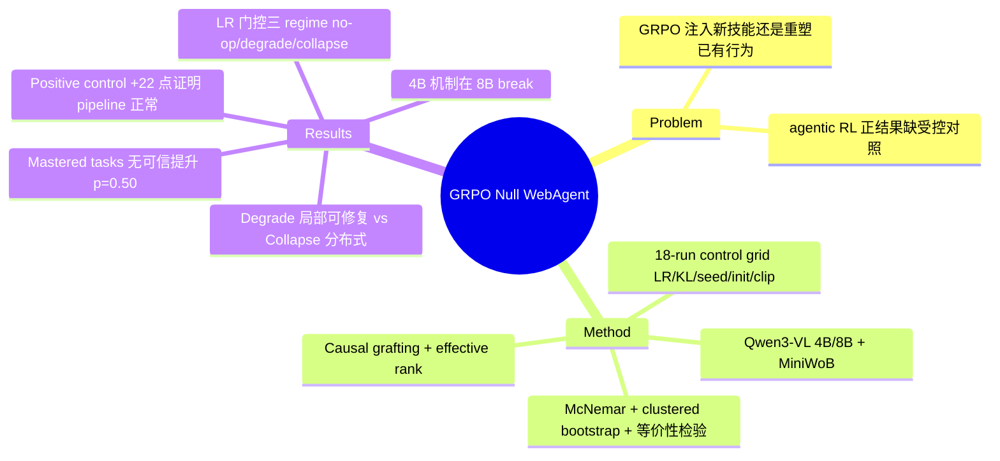

## Summary
一篇"受控阴性结果"论文：在 MiniWoB web agent 任务上，对 Qwen3-VL 4B/8B 跑 18 组 GRPO 受控实验，发现 GRPO 对 SFT 已掌握的任务没有任何可信提升（中高 learning rate 反而可信地变差），并用 causal grafting + effective rank 分析给出 learning rate 门控的两种失败机制（degrade vs collapse）。

## Problem & Motivation
- 核心问题：GRPO 对小模型（4B-8B）web agent 到底是**注入新能力**，还是只是**重塑 SFT 模型已有的行为分布**？这决定资源该投给 RL 还是 supervision/distillation。
- 现有 agentic RL 工作普遍报告正收益，但很少做严格的受控对照（paired statistics、多 seed、等价性检验），"RL 有效"的 claim 可能混杂了 pipeline 差异、checkpoint 选择、evaluation 噪声。
- 本文刻意选择一个"SFT baseline 已基本 mastered"的任务设置，问 GRPO 在此 regime 下还能不能挤出增益。

## Method
**实验设置**：
- 模型：Qwen3-VL 4B / 8B；环境：MiniWoB，11-task grid（主实验，text serialization 观测）+ 10 个 headroom tasks（positive control）+ Set-of-Marks screenshot 观测 track。
- Reward：sparse binary terminal reward `r(τ) = 1[success(τ)]`。
- GRPO recipe：group mean-centered advantage（不除 std）、非对称 clipping（ε_lo=0.20, ε_hi=0.28）、可选 KL anchor（非负 k3 estimator）、warmup + cosine LR schedule。
- **控制网格**：18 runs，变量为 learning rate（3e-6 / 5e-6 / 1e-5 / 2e-5）、KL weight β（0 / 0.05 / 0.10）、seed、initialization（SFT vs base）、clip bounds。
- 评估：11 tasks × 5 seeds = 55 matched episodes，greedy decoding，McNemar 配对检验 + task-clustered bootstrap CI + 等价性检验。

**机制分析工具**：
- **Effective rank**：测各层 residual stream 的有效秩，定位表征损伤。
- **Causal grafting**：把训练后模型的某组件（attention / MLP / embedding）替换回 SFT 权重，看能否恢复成功率，并与 random-restoration null distribution 对比。
- **Failure-mode taxonomy**：逐 episode 分类（reward-hacking / invalid output / correct）。

## Key Results
**主结果（controlled null）**：
- SFT baseline 49.1% (27/55)，最好的 GRPO arm 52.7%（+3.6，95% CI [+0.0, +10.9]，McNemar p=0.50）——不可信。
- Learning rate 单调门控三种 regime：低 LR = no-op；中 LR (1e-5) = **可信变差** −15.0 点（33.3%）；高 LR (2e-5) = **collapse** 到 0.0%（−49.1）。
- **Positive control**：在 sampling 优于 greedy 的 headroom tasks 上，同一 pipeline 的 GRPO 从 20.0% → 42.0%（+22 点，CI [+8, +40]，p=0.007），证明 null 不是 pipeline 坏了，而是任务本身没有 RL 可收割的 headroom。

**机制（double dissociation）**：
- **Degrade regime**（中 LR）：晚层 effective rank 崩掉（layer 35 从 ~9.2 → 1.2），早层完好；graft 回 attention 或 MLP 可把 frontier success 从 11.4% 恢复到 37-40%（接近 SFT），embedding drift 很大但 causally inert——损伤是**局部的**。
- **Collapse regime**（高 LR）：晚层 rank 反而升高（13.9），但 readout 被摧毁（argmax agreement → 0），单独 graft 任何组件都无法修复——损伤是**分布式的**。
- Weight movement 大小不预测失败（collapse 移动得比 degrade 还少）。

**鲁棒性**：25 eval seeds、6 training seed 复现、warmup+cosine、G∈{8,16,32}、SoM track、8B backbone 全部维持 null；更大的 group size 在高 LR 下更早 break。Failure taxonomy 显示几乎无 reward-hacking，失败主要是 invalid output（degrade 63% / collapse 98%）。

**Scale boundary**：rank-capability 耦合在 4B 双向成立，在 8B 上 break——机制不随 scale 平移。

## Strengths & Weaknesses
**Strengths**：
- 方法论示范级：paired McNemar + clustered bootstrap + 等价性检验 + positive control + 多 seed 复现，agentic RL 论文里罕见的统计严格性。
- Positive control 设计是点睛之笔——把"null 是 pipeline 坏了"这一最大质疑直接堵死，并把结论精确限定为"GRPO 只在有 sampling headroom 时重塑分布，不注入新技能"。
- degrade/collapse 的 double dissociation（局部可 graft 修复 vs 分布式不可修复）是有信息量的 mechanistic 发现，比单纯报 null 有价值。

**Weaknesses**：
- 外部效度极窄：单一 benchmark（MiniWoB——2017 年的玩具级 web 环境）+ 单一模型家族（Qwen3-VL）+ 11 个已 mastered 的任务。结论对 WebArena/OSWorld 级真实环境、对更大模型、对 multi-turn credit assignment 场景均不可外推。
- "GRPO adds no skill" 的框架有偷换概念之嫌：null 建立在"已 mastered 任务"上，这本来就是 RL 理论预期没有增益的 regime（advantage 全 0 或近 0）；positive control 恰恰证明有 headroom 时 GRPO +22 点。真正的争议场景——部分掌握、长 horizon、组合泛化——没有测。
- 机制分析承认 checkpoint 数量少、点估计噪声大，且 4B 机制在 8B 上 break，说明结论的机理部分更像 case study。
- 未见代码链接（正文声称 release 统计与 interpretability 测量）。

**影响**：对 agentic RL 社区是一剂有用的清醒剂——报告 RL 增益时必须控制 headroom、做 paired statistics；LR 门控的失败模式对小模型 RL 调参有直接参考价值。

## Mind Map

## Notes
- 与 [[2509-TreeGRPO]] 对照：一个在扩展 GRPO 的 credit assignment，一个在质疑 GRPO 的基本收益前提；矛盾信号值得记入 AgenticRL survey。
- 与 GUI RL 系（[[2500-MobileguiRlAdvancingMobile]]、[[2500-UiR1EnhancingEfficient]] 等）报告的正收益并不冲突——那些工作的任务有明显 headroom；本文的价值是给出"何时 RL 不会有用"的边界条件。
- 值得追问：MiniWoB 上 sparse binary reward + mastered tasks 意味着 group 内 reward 几乎无 variance，GRPO advantage 趋近 0——中高 LR 的"可信变差"本质上可能是在近零信号下放大噪声梯度。这个解释论文未明说，但与 effective rank collapse 一致。
