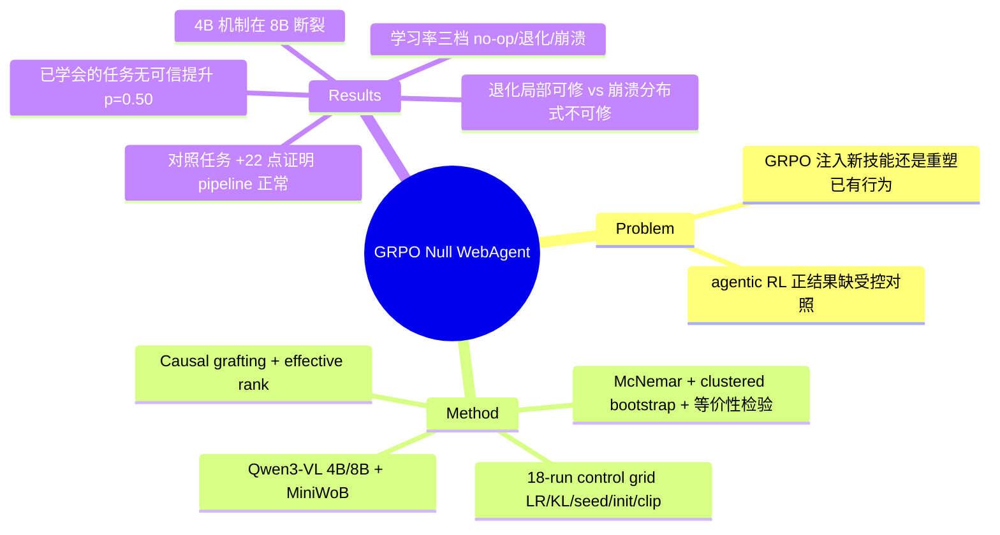

## Summary
一句话：一个任务如果 SFT 已经学会了，再用 GRPO（一种 RL 微调）去练不会有任何真实提升——学习率调大反而会把模型越练越坏，先变差、再彻底崩溃。作者在 Qwen3-VL 4B/8B + MiniWoB 上跑了 18 组严格受控实验坐实这个"阴性结果"，并证明这不是代码写错：换成还有提升空间的任务，同一套方法能涨 22 分。他们还拆开模型看坏在哪——中等学习率是局部损伤（能修），高学习率是整体崩坏（修不了）。

## Problem & Motivation
- 核心问题：对小模型（4B-8B）web agent，GRPO 到底是**真的教会它新本事**，还是只是**把它已经会的行为调得更常出现**？这决定资源该投给 RL，还是投给更多监督数据/蒸馏。
- 现在的 agentic RL 论文几乎都报正收益，但很少做严格对照（配对统计、多随机种子、等价性检验）。"RL 有用"这个结论里可能混进了 pipeline 差异、checkpoint 挑选、评测噪声。
- 本文故意挑一个"SFT 已经基本学会"的任务，问：这种情况下 GRPO 还挤得出提升吗？

## Method
**实验设置**：
- 模型 Qwen3-VL 4B / 8B；环境 MiniWoB（2017 年的简化 web 操作 benchmark，玩具级）。主实验 11 个任务、用文本序列化观测；另加 10 个"还有提升空间"的任务做对照，以及一条用截图+编号标记（Set-of-Marks）观测的实验线。
- 奖励：只有任务成功才给 1 分、否则 0 分（sparse binary）。
- GRPO 配方：组内均值中心化的 advantage（不除标准差）、非对称 clipping、可选 KL 约束、warmup + cosine 学习率。
- **控制网格**：18 次训练，变量是学习率（3e-6~2e-5）、KL 权重、随机种子、初始化（从 SFT 还是从 base）、clip 边界。
- 评估：11 任务 × 5 种子 = 55 个配对回合，贪心解码，用 McNemar 配对检验 + 任务聚类 bootstrap 置信区间 + 等价性检验（严格判断"到底有没有差别"）。

**拆解"坏在哪"的两个工具**：
- **Effective rank（有效秩）**：量某一层的表征还剩多少个真正独立的维度——用来定位是哪层的表征被训坏了。
- **Causal grafting（因果嫁接）**：把训练后模型的某个部件（attention / MLP / embedding）单独换回 SFT 时的权重，看成功率能不能恢复；再和"随机换回一部分"的对照分布比，确认是不是这个部件真的负责。
- **失败类型统计**：逐回合分类——是 reward hacking（钻空子）、无效输出，还是真做对了。

## Key Results
**主结果（坐实"没提升"）**：
- SFT 基线 49.1%（27/55）；最好的一组 GRPO 也只有 52.7%（+3.6，95% 置信区间 [+0.0, +10.9]，McNemar p=0.50）——统计上不可信，等于没涨。
- 学习率像个开关，单调地决定三种结局：低学习率 = 什么也没发生；中学习率（1e-5）= **确实变差** −15 点（降到 33.3%）；高学习率（2e-5）= **直接崩到 0%**（−49.1）。
- **对照实验是关键一步**：在那些"多采样几次就能碰到成功、还有提升空间"的任务上，同一套 pipeline 的 GRPO 从 20% 涨到 42%（+22 点，p=0.007）。这说明前面的"没提升"不是代码坏了，而是**那些任务本身已经没有 RL 能榨取的空间**。

**坏在哪（两种机制，界限清晰）**：
- **中学习率 = 退化**：靠后的层表征塌了（第 35 层有效秩从 ~9.2 掉到 1.2），靠前的层没事；把 attention 或 MLP 换回 SFT 权重，成功率能从 11.4% 修回 37-40%（接近 SFT）——损伤是**局部的、可修的**。embedding 漂移很大，但其实无关紧要。
- **高学习率 = 崩溃**：靠后的层有效秩反而升高（13.9），但"把内部表征读成输出"的能力被彻底破坏（模型输出和正确答案的一致性掉到 0）；单独换回任何一个部件都修不好——损伤是**分布式的、修不了的**。
- 权重改动的大小不能预测会不会失败（崩溃组改动的权重反而比退化组还少）。

**够不够稳**：换 25 个评测种子、6 个训练种子重跑、加 warmup+cosine、group size 取 8/16/32、截图观测线、换 8B 模型——"没提升"全都保持；group 越大，高学习率下崩得越早。失败几乎不是钻空子，主要是无效输出（退化 63% / 崩溃 98%）。

**规模边界**："有效秩 ↔ 能力"这种绑定关系在 4B 上双向成立，到 8B 就断了——机制不会随模型变大而照搬。

## Strengths & Weaknesses
**优点**：
- 方法论堪称示范：配对 McNemar + 聚类 bootstrap + 等价性检验 + 对照实验 + 多种子复现，这种统计严格性在 agentic RL 论文里很少见。
- 那个"还有提升空间的任务"对照是最妙的一步——它直接堵死"你只是代码没写好"这个最大质疑，把结论精确限定成"GRPO 只在还有采样余地时把已有行为调得更常出现，并不教新技能"。
- 把失败拆成"退化（局部可修）vs 崩溃（分布式不可修）"两种，比单纯报一句"没提升"有价值得多。

**局限**：
- 适用范围极窄：单个 benchmark（MiniWoB，玩具级）+ 单个模型家族（Qwen3-VL）+ 11 个已经学会的任务。结论推不到 WebArena/OSWorld 那种真实环境、更大模型，或需要长程 credit assignment 的场景。
- "GRPO 不教新技能"这个说法有点偷换概念：阴性结果建立在"已经学会的任务"上，而这本来就是 RL 理论预期不会有增益的情况（advantage 几乎全是 0）；他们自己的对照实验恰恰证明有空间时 GRPO 能涨 22 点。真正有争议的场景——只学会一半、长程、组合泛化——没测。
- 机制部分作者自己承认 checkpoint 太少、点估计噪声大，而且 4B 的机制在 8B 上就断了，所以这部分更像 case study。
- 没给代码链接（正文说会 release 统计和可解释性测量）。

**影响**：对 agentic RL 社区是一记提醒——报 RL 提升时必须先控制"任务还有没有提升空间"、必须做配对统计；学习率导致的两种崩坏模式对小模型 RL 调参有直接参考价值。

## Mind Map

## Notes
- 与 [[2509-TreeGRPO]] 对照：一个在扩展 GRPO 的 credit assignment，一个在质疑 GRPO 的基本收益前提；矛盾信号值得记入 AgenticRL survey。
- 与 GUI RL 系（[[2500-MobileguiRlAdvancingMobile]]、[[2500-UiR1EnhancingEfficient]] 等）报告的正收益并不冲突——那些工作的任务有明显提升空间；本文的价值是给出"什么时候 RL 不会有用"的边界条件。
- 一个论文没明说、但值得追问的解释：在已学会的任务上，一组采样几乎全成功、reward 没有方差，GRPO 的 advantage 趋近 0；中高学习率下的"变差"很可能就是在接近零信号时放大了噪声梯度——这和观察到的有效秩崩塌是一致的。
