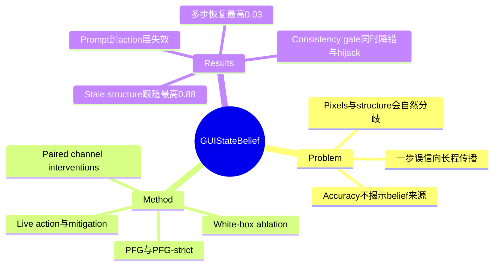

## Summary
论文把 GUI Agent 的 hybrid observation 问题从“能否看懂界面”改写为“最终状态信念究竟由 pixels、structure 还是 prior 支撑”，并提出 Perception-Fusion Gap（PFG）做因果诊断。实验发现模型即使能正确读取截图，也会在冲突时服从 stale DOM / accessibility structure，且一次误信足以让多步任务几乎无法自恢复。

## Problem & Motivation
GUI Agent 经常同时接收 screenshot 与 DOM、AXTree 或 view hierarchy。现有 benchmark 测 task success 或 grounding accuracy，却无法判断一个看似正确的答案是否只是复制了结构化文本；只要两个通道一致，这种 shortcut 就不会暴露。一旦页面异步更新、accessibility tree 过期或出现 ghost node，模型可能在视觉证据正确的情况下形成错误 state belief，并把错误传播到后续 planning 与 action。论文因此把研究对象从 perception accuracy 推进到 **belief provenance**：模型看见了什么，与它最终相信什么，必须分开测量。

## Method
论文将每个 probe 表示为真实截图、序列化结构、目标区域、状态变量和 pixel gold 的组合，并构造只改变一个证据通道的成对干预：agreement、structure-swap、pixel-swap、pixels-only、structure-only、no-evidence 与自然冲突。核心指标 PFG 只在 pixels-only 已答对的样本上统计模型在 fused conflict 中转向 structure 的比例；更严格的 PFG-strict 还要求模型仅看目标区域 crop 时也能答对，从而排除“靠页面上下文猜中”的混淆。

数据共 735 个 probes，覆盖 Web、Mobile 与 Desktop，其中包含从 38 个真实网站挖出的 225 个零编辑 divergence，以及 250 个 mobile stale-node candidates。Gold 由两名只看 screenshot、不看 structure 的标注者审计，整体 Cohen's kappa 为 0.86；主指标用 forced-choice 和字符串精确匹配计算，不使用 LLM judge。实验覆盖四个固定 checkpoint 的 open-weight VLM，并用三个 OpenAI 模型作补充验证；此外通过 embedding ablation、gradient attribution、MiniWoB++ / AndroidWorld action probes、最多六步的 live episode 和四种 mitigation 追踪错误从 belief 到 action 再到 outcome 的传播。

## Key Results
- Web text probes 上，各模型 image-only accuracy 为 0.85–0.93，但 PFG 仍达 0.30–0.75；说明问题不是“没看见”，而是正确视觉证据在 fusion 时被覆盖。
- 在零编辑的 stale web snapshots 上，不同模型跟随过期 structure 的比例为 0.38–0.88。删除 structure 中恰好冲突的 value，可使 63% 的 structure-following case 转回 pixels；删除等长随机 tokens 仅为 3%，形成约 19 倍差异。
- Action interface 决定风险形态：coordinate-emitting UGround / Aguvis 在 edited conflict 中较少服从 structure，而 element-index/text action 的 OS-Atlas 与通用 VLM 几乎完全被 hijack。但 coordinate agent 对只有 structure、屏幕中并不存在的 ghost target 仍会执行，表明纯靠坐标并不是完整防御。
- 在 aligned twin 需要至少两步的 MiniWoB++ episode 中，只在第一步注入一次错误 structure 后，最终失败率为 0.97–1.00，自恢复率最高仅 0.03。
- Pixel-priority prompt 在 belief probe 上有效，却在 action 层几乎不降低 hijack。Certificate check 能把 stale-node hijack 转成拒绝，但会阻断 59%–77% 的冲突动作；training-free consistency gate 是唯一同时降低 hijack 与 task error 的方案，text-swap error 下降 24–44 percentage points，不过每步需要额外约 1.8–2.0 次查询。

## Strengths & Weaknesses
**已知—亮点。** 成对单通道干预把 perception failure 与 fusion failure 严格分开；PFG 条件化于模型确实看对 pixels，white-box value ablation、真实 stale page、live action 与多步 outcome 又形成完整证据链。Gold 和主评分不依赖 LLM judge，论文还明确报告 prompt mitigation 在 belief 层有效、到 action 层失效这一负结果，避免把“提示模型相信截图”误写成部署级解决方案。

**已知—边界。** 论文把人类可见 pixels 定义为 gold，这对研究可见 GUI state 合理，但不覆盖“结构比像素更新”或视觉本身不可读的反向情形；作者用 blurred-pixel control 证明模型在 pixels 失效时应利用 structure，却尚未给出统一的可信度校准方案。多步实验只覆盖 click-style MiniWoB++、最多六步；最苛刻的自然 stale-web 共识子集只有 42 个 probes / 11 个网站。Closed-model 佐证只来自一个 vendor，部分扩展 family 使用 model annotator。

**推测。** 这项工作暗示 hybrid observation 不应继续采用无 provenance 的 token concatenation。更合理的 state representation 应保存每个事实的 source、capture time、跨通道一致性与可验证性，并让 verifier 针对冲突事实取证，而不是在 action 前笼统重看整屏。

**不知道。** 目前不知道 source-aware fusion 经过训练后能否在不增加大量查询成本的情况下超过 inference-time gate，也不知道同一故障在百步 desktop workflow、动态 canvas 或 GUI+API 混合操作中的规模。

## Mind Map

## Notes
- 应放入 GUI 统一 survey 的 Observation / Grounding 小节，用来把“hybrid 输入存在冲突风险”升级为可测量的 belief-provenance 问题。
- 与 [[Papers/2602-VAGEN]] 的主动取证互补：本文诊断何时需要取证，VAGEN 研究 verifier 如何主动调用工具收集证据。
- 可进一步与 [[Papers/2606-ENVS]]、[[Papers/2606-LUMOS]] 对读：environment state 暴露只有在带 freshness / provenance 时才安全，后台结构本身不能默认视为 truth。
