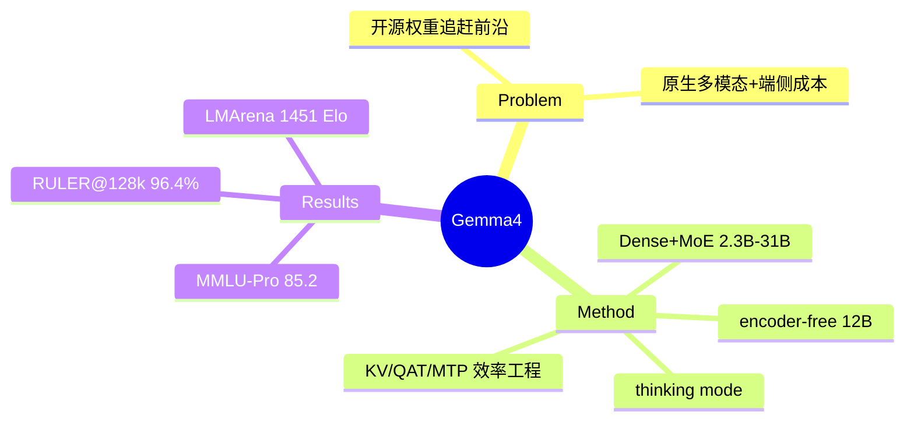

## Summary
Google DeepMind 发布新一代开源权重、原生多模态（文本 / 图像 / 音频）模型 Gemma 4，覆盖 2.3B–31B 的 dense 与 MoE 变体，引入 thinking mode 和一个 encoder-free 的统一 12B 架构，在 STEM、多模态、长上下文上相对 Gemma 3 大幅跳升。

## Problem & Motivation
上一代 Gemma 3/3n 在推理密集任务（数学、代码）和长上下文上与前沿闭源/大开源模型仍有明显差距，且多模态是外挂 encoder、端侧部署内存与延迟成本高。Gemma 4 的目标是在**开源权重**约束下，用中小规模模型（≤31B）追赶前沿人评表现，同时把多模态做成"原生"能力并压低端侧成本。

## Method

**整体架构**：decoder-only Transformer，pre-norm + post-norm 双归一化（RMSNorm + QKNorm）。局部-全局注意力交错（E2B 4:1，其余 5:1），全局层用 pp-RoPE（p=0.25）、局部层用标准 RoPE，RoPE 频率全局 1M / 局部 10k。词表 262k（SentencePiece）。

**模型家族**：
- E2B（2.3B effective / 5B total，含 per-layer embeddings）、E4B（4.5B effective / 8B total）——端侧 dense，保留独立 encoder。
- 12B dense——**统一 encoder-free 架构**，直接吃 raw audio 与 image patches。
- 26B-A4B——MoE，26B 总参 / 3.8B 激活。
- 31B dense——旗舰。

**多模态**：
- 视觉：E2B/E4B 用 150M ViT（patch 16），12B/31B 用 550M ViT；12B 统一版彻底去掉 encoder，用 35M matmul 直接投影 48×48×3 RGB patch。支持 axial 2D-RoPE、可变长宽比、多档 token 数（70–1120）。
- 音频：E2B/E4B 用 305M USM-based Conformer（比 Gemma 3n 的 680M 缩 55%），40ms/16kHz 分块；12B 统一版丢弃 encoder，把 raw audio 直接投到 LLM embedding 空间。

**效率工程**（本报告真正的重心）：
- KV cache：全局层复用 key 当 value（E2B/E4B 除外）+ KV 共享（20/35、18/42），全局 KV cache 减 37.5%。
- QAT 量化：端侧混合 int2/int4 权重 + int8 激活；音频量化 footprint 减 78%（390MB→87MB）。
- MTP drafter：4 层带 cross-attention 的 Transformer 做 speculative decoding，小模型用 top-k 聚类把 262k 词表投影压到 4k。

**训练**：数据截止 2025-01，web/code/图像/音频混合，做了 benchmark 去污与安全过滤。基础设施用 TPUv5p/v6e（12B 用 12288 片 v5p，31B 用 10240 片 v6e），ZeRO-3 分片。Post-training 基本沿用 Gemma 3，关键增量是 **thinking mode**（先输出 reasoning trace 再回答），主要提升数学与代码。

## Key Results
相对 Gemma 3 27B 的跳升非常大：
- **文本推理**：MMLU-Pro 31B 85.2 vs 67.6；AIME 2026 89.2 vs 20.8；Codeforces Elo 2150 vs 110。
- **视觉**：E4B 在 MMMU-Pro（52.6 vs 49.7）、MATH-Vision（59.5 vs 46.0）上已能匹敌/超过 Gemma 3 27B。
- **音频**：E2B/E4B 翻译约 +12%、转写约 +17%，同时 encoder 缩 78%。
- **长上下文**：RULER@128k，31B 96.4% vs 66.0%。
- **人评（LMArena，2026-06）**：Gemma 4 31B Elo 1451±8（Rank 43，最强 dense 开源），26B-A4B 1438±8（Rank 61），号称可比 10× 更大的模型。

## Strengths & Weaknesses

**Strengths**
- 效率工程是硬货：KV cache 37.5% 缩减、音频量化 78% 缩减、encoder-free 统一架构、MTP + 词表聚类，这些是可复用的端侧部署 recipe，比 benchmark 数字更有参考价值。
- 原生多模态（含音频）在 ≤31B 规模做到位，且给出了完整的内存 footprint 表（31B 量化后 19.2GB），对落地有实际指导。

**Weaknesses / 存疑**
- **AIME 20.8→89.2、Codeforces 110→2150 这种"从地板到天花板"的跳升，绝大部分是 thinking mode + 数据/后训练带来的，架构贡献被刻意混在一起，report 没做"同数据、开/关 thinking"的干净 ablation**，无法区分是模型变强还是"会用 CoT 了"。拿 Gemma 4（带 thinking）打 Gemma 3（不带）本身就是不对等比较。
- **几乎不与同代竞品（Qwen3、Llama 4、GPT/Gemini）在自报 benchmark 上正面对表**，只在 LMArena Elo 上侧面比较，规避了最该回答的问题——同尺寸下 Gemma 4 到底比 Qwen3 强还是弱。
- 训练数据只说"web/code/图像/音频"，token 数、配比、来源、去重细节全无——技术报告的老毛病，可复现性为零。
- encoder-free 统一架构只上了 12B 一档，E2B/E4B 仍是外挂 encoder；报告没解释为何不全线统一，也没给"统一 vs 外挂"在同规模下的对照，这个最有 insight 的设计反而缺 ablation。
- LMArena Rank 43 意味着离真正前沿还有一截，"rival frontier"是营销措辞。

对领域影响：作为开源权重的端侧多模态基座，效率 recipe 有复用价值；但作为"研究"它 insight 稀薄，主要价值是工程集成与可下载的权重。

## Mind Map

## Notes
- 最该追问的是 thinking mode 的贡献占比：把它拆出来后，架构本身相对 Gemma 3 的净增益有多少？report 没给，这是它最避重就轻的地方。
- encoder-free 直接投影 raw patch/audio 的路线值得单独跟踪——如果统一架构真能无损，端侧多模态的部署栈会大幅简化，但目前证据只有 12B 一个点。
- 与竞品缺乏对表，落地选型时需自行在目标 benchmark 上复测，不能直接采信 report。
