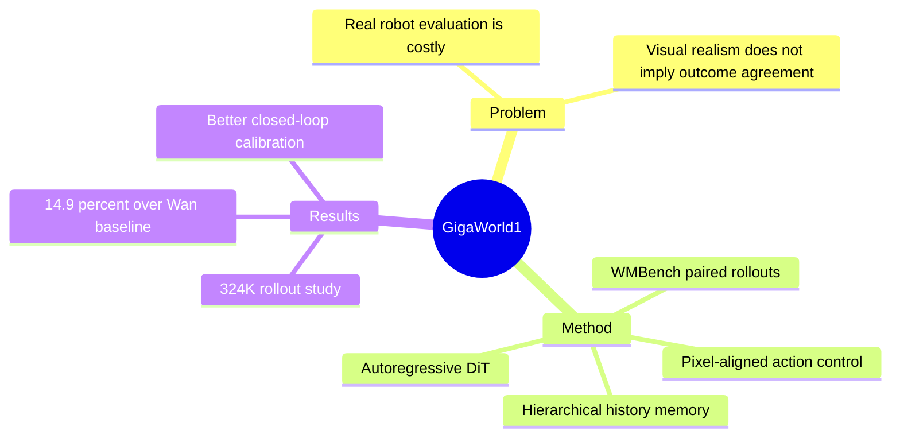

## Summary
GigaWorld-1 把 robot world model 明确定位为 policy evaluator，并通过 WMBench 的 paired real/world-model rollouts 研究哪些属性能保留真实 policy outcome。核心结论是 evaluator 质量主要取决于 long-horizon action fidelity、可迁移 physical prior 与空间对齐 control，而非短期视频观感；据此设计的模型比最强通用 Wan baseline 的综合 evaluator score 高 14.9%。

## Problem & Motivation
robot policy checkpoint 的真实评估需要硬件、人类监管和大量 closed-loop rollout，成为迭代瓶颈；learned world model 虽可作为低成本 surrogate，但视觉逼真的 rollout 未必保持真实成功/失败或 policy ranking。论文因此把目标从 video generation 转为 **evaluator–world agreement**：在同一组 policy、checkpoint、task 与 initial condition 上，world-model rollout 是否保留 real-robot outcome、相对难度与 failure profile。

## Method
工作由 benchmark、controlled study 与最终模型三部分组成：

1. **WMBench**：包含 2,989 条 paired trajectory、8 类 rigid/deformable manipulation task，teleoperation 与 policy rollout 约 1:1；严格 episode-disjoint split 后训练 82,470 秒、测试 7,200 秒。测试从 held-out first frame 开始，让目标 policy 与 world model 形成 closed loop，再比较生成 outcome 与真实 rollout。
2. **Evaluator study**：分析 7 个 video world model、4 种 action representation 与 324,000+ challenge rollout。WMES 用 0–3 ordinal outcome score 衡量，自动指标覆盖 JEPA/semantic/subject/trajectory、motion 与长时 PSNR/FID/FVD，并研究它们与 WMES 的相关性。
3. **GigaWorld-1 architecture**：以 Wan 1.3B/5B 为 video diffusion backbone，用 LoRA 与 control branch 改造成 autoregressive DiT；history frame 经 memory patchification，采用 hierarchical history 与 Relative RoPE；head view 使用 pixel-aligned end-effector pose map，wrist view 用 ray map表示 camera geometry，再与 noisy latent channel-concat。
4. **Data/training**：约 12,980 小时语料由 physical video（1,298h）、open robot（5,377h）、egocentric hand（2,411h）与 Giga robot demonstration（3,894h）组成，经多阶段 AR learning、可选 scene LoRA 与 distillation 训练。

## Key Results
- GigaWorld-1-Plus 的六项 evaluator metric 平均为 0.6834，Nano 为 0.6717；强 robot baseline Cosmos-Predict2.5 为 0.6123，通用 Wan 2.2 5B 为 0.5948，因此 Plus 分别提升 11.6% 与 14.9%。
- Plus 在 JEPA Similarity、Semantic Alignment、Trajectory Accuracy 上分别达到 0.9337、0.8926、0.3561；channel-concat action control 的 Trajectory Accuracy 为 0.3528，显著高于 ControlNet 0.2566、cross-attention 0.1620 与无控制 0.1576。
- 对 5,000+ video 的 VLM-assisted WMES，和人类评分 exact agreement 为 87.80%，相邻等级 agreement 为 99.16%，QWK 0.7349、Spearman 0.7574；这支持低成本筛选，但仍非完全自动替代人类。
- 模型在 40 秒 autoregressive generation 中保持最佳 PSNR/FID/FVD，并在 WMBench closed-loop task 上较 challenge baseline 更接近真实 success-rate diagonal；OOD case 也覆盖外观、类别、背景与成功/失败 outcome shift。

## Strengths & Weaknesses
**亮点**：最重要的贡献不是又一个 video model，而是把 surrogate evaluator 的成功标准改成 real-world outcome agreement，并通过 paired rollout 与 closed-loop protocol 测量它。大规模 controlled study 还提供了实用设计结论：广泛 physical prior 与 robot controllability 必须平衡；action condition 应与空间 latent 对齐；memory 对 long-horizon evaluator 不可缺。代码、部分权重、数据处理与 WMBench 工具已公开。

**局限**：WMBench 仍只有 8 类 manipulation task，未覆盖 mobile manipulation、dexterous in-hand 或 safety-critical autonomy；结论主要来自 video-centric model，不一定适用于 structured state/3D hybrid simulator。VLM label 虽接近人类，但 uncertain case 仍需人工复核。closed-loop 结果显示 video model 常对 contact-sensitive failure 有 optimistic bias，这正是 policy evaluator 最危险的误差类型；论文的 aggregate video metric 改进也不等于已达到可替代真实评估的 calibration。公开仓库当前亦标注若干组件、distilled weight 和 RL post-training 为 coming soon。

## Mind Map

## Notes
这篇论文对 policy-evaluation 研究给出一个很强的原则：benchmark 单位应是“同一 policy 在 real 与 learned environment 中的 outcome consistency”，而不是孤立生成帧。后续应优先报告 false-success rate，因为 optimistic evaluator 会系统性放行危险 checkpoint。
