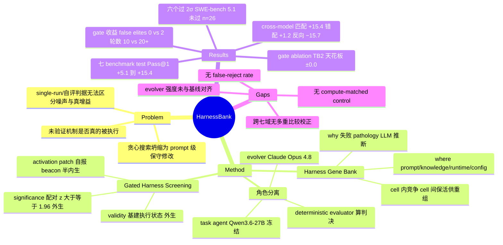

## Summary

HarnessBank 把 agent harness 自演化拆成两件事：用 MAP-Elites 式的 (where, why) 双坐标 Harness Gene Bank 保留互补的 harness 变体供重组，用 validity / activation / significance 三道**确定性** gate 在训练子集上筛掉无效、未激活与噪声级的 offspring。冻结 Qwen3.6-27B 时，七个 benchmark 的 test Pass@1 提升 +5.1%~+15.4%（六个过 paired-2σ 判据，SWE-bench 那个 +5.1% 自己都没过），cross-model 实验表明演化出的 harness 是 model-specific 的 correction 而非普适最优配置。但 Table 3 的 gate ablation 显示：在 TB2 上去掉 2σ gate 后 test Pass@1 变化是 **±0.0**——gate 的全部可测收益在"少收假精英、能收敛"的地板与效率轴上，不在天花板上。

## Problem & Motivation

Harness（system prompt、注入知识、tool interface、control loop、recovery 策略、runtime config）是模型权重冻结时唯一还能改的东西，但它一直靠手工工程。已有的 harness self-evolution 工作（Self-Harness、HarnessFix、AHE）用贪心搜索 + 自生成反馈来自动化这个过程，作者指出两个结构性缺陷：

1. **搜索坍缩**。贪心地反复利用当前最优候选，会在几次激进 offspring 失败后收敛到保守的增量修改（多半是 prompt 级），而且容易保留"记住了某几道训练题"而非"修好了复发失败机制"的 patch。
2. **筛选不可信**。用 single-run improvement、non-regression 规则或 model-predicted utility 来选候选，既没验证提出的机制**是否真的被执行到**，也没验证观测增益是否**超过执行噪声**。sandbox crash、verifier timeout 这类基建 artifact 还会被错误归因给 harness 修改。

对本 vault 关心的 exogenous-vs-endogenous verification 轴而言，这篇的价值在于它是目前把"gate 到底独立到什么程度、gate 到底扛不扛收益"写得最明确的一篇——包括它自己给出的否定性证据。

## Method

**问题设定**。冻结 LLM $M$，harness $H = \mathcal{K} \cup \mathcal{X}$ 切成不可变 kernel（评测、记账、自演化、接口关键代码）与可变 surface $\mathcal{X}$。目标是在训练集 $\mathcal{D}_{tr}$ 上最大化 $U(H;\mathcal{D})$（每任务 $K=3$ 次 attempt 的平均分），测试集 $\mathcal{D}_{te}$ 只在演化结束后用一次。

**四个角色分离**（§3.2），这是 gate independence 的关键：
- **task agent** — 冻结的 Qwen3.6-27B，在当前 harness 下执行任务；
- **evolver agent** — **Claude Opus 4.8**，读轨迹、诊断失败、生成 offspring；与 task agent 不同模型、不同家族；
- **deterministic evaluator** — 负责 sampling、scoring、activation logging 与统计检验，**gate 的判决由它算，不由任何 LLM 判**；
- **Harness Gene Bank (HGB)** — 存档。

**Harness Gene Bank**。cell 用 (where, why) 双坐标索引：where ∈ {prompt, knowledge, runtime, config}（改了哪个组件），why ∈ 一个不断扩张的 pathology 集合（针对哪种失败机制，由 LLM 从失败轨迹推断）。同一 cell 内竞争、只留最优；不同 cell 的 harness 全部保活，供后续 recombination。父代按 quality-biased 规则从 $\{H_0\} \cup \mathrm{Im}(\mathcal{A}_t)$ 里取 $\mathcal{D}_{tr}$ 上得分最高者。作者明确说明为什么坐标必须是语义的而不是 per-task 的：按任务索引的 archive"overfits by construction"，因为它用来选 harness 的正是它索引的那些任务。

**Gated Harness Screening**（§3.3）。offspring 先只在随机采样子集 $\mathcal{D}_{sub} \subset \mathcal{D}_{tr}$ 上跑，过三道 gate 才拿到全 $\mathcal{D}_{tr}$ 评测资格：

| Gate | 判据 | 证据来源 | 独立性 |
|:--|:--|:--|:--|
| validity | ledger 是否 protocol-valid；sandbox crash / verifier timeout 走 repair-and-retry 而非记成 agent 失败 | 基建执行状态 | 外生 |
| activation | patch 自带 activation specification，触发时发 deterministic beacon；$\sum_{i,k} b_{i,k} > 0$ 才算激活 | **patch 自报的埋点** | 半内生 |
| significance | 与父代在**同一批任务**上配对：$\delta_i = \frac{1}{K}\sum_k [s_{i,k}(H') - s_{i,k}(H_t)]$，要求 $\hat\Delta > 0$ 且 $z = \hat\Delta/(\hat\sigma_\delta/\sqrt{|\mathcal{D}_{sub}|}) \ge 1.96$ | benchmark 得分 + 配对 t 统计量 | 外生（但见下） |

注意规格不一致：§1 说是"四道 sequential gate"，含一个独立的 gain gate；§3.3 说是"three logic gates"，Eq. 15 也只乘三项——gain 条件 $\mathbb{I}[\hat\Delta > 0]$ 被并进了 significance gate。这是写作层面的口径不齐，不影响实现语义。

通过筛选的候选在全 $\mathcal{D}_{tr}$ 上复评（"confirm"步），再按 competitive selection 入 cell。循环在至多 $R$ 轮或连续 $P$ 轮无 cell 更新后停止——**论文正文没有给出 $R$ 和 $P$ 的数值**，只能从 Table 3 反推（收敛在 10.0 轮，cap 在 >20 轮）。

## Key Results

**主结果（Table 1，冻结 Qwen3.6-27B）**。Test Pass@1 全部优于 vanilla：

| Benchmark | 域 | Train Pass@1 | Test Pass@1 | Ret. |
|:--|:--|:--|:--|:--|
| TB2 | Terminal Operation | 37.7 → 44.0 (+6.3) | 36.1 → **45.4** (+9.3) | 148% |
| LiveCode | Code Generation | 64.6 → 85.6 (+21.0) | 58.1 → **71.8** (+13.7) | 65% |
| Omni-MATH | Math Reasoning | 78.4 → 91.1 (+12.7) | 54.3 → **66.0** (+11.7) | 92% |
| BrowseComp+ | Web Research | 30.7 → 46.8 (+16.1) | 16.9 → **30.8** (+13.9) | 86% |
| GDPval | Knowledge Work | 73.6 → 82.0 (+8.4) | 43.7 → **52.9** (+9.2) | 110% |
| AppWorld | App & API Control | 51.9 → 69.7 (+17.8) | 41.3 → **56.7** (+15.4) | 86% |
| SWE-bench | Repo-Level Bug Fix | 55.4 → 69.3 (+13.9) | 47.4 → **52.6** (+5.1) | 37% |

六个增益过 $z \ge 1.96$，$p$ 从 $<10^{-4}$ 到 0.033，AppWorld 最强（$z=6.44$, $n=168$）。SWE-bench 用 101/26 split，训练侧强 credit（+13.9%, $n=101$），测试侧 +5.1% 但 $z=0.78$ 不过判据，作者自标 preliminary。**摘要标题里 "5.1% to 15.4%" 的下界正是这个论文自己不 credit 的数**。Test Pass@3 在每个 credited 域也涨（+5.5 ~ +15.4），说明是可解任务集合扩大，不只是单次命中率。

**Gate ablation（Table 3, TB2）——本篇对 survey 最重要的一格**：

| 配置 | Test Pass@1 | False Elites | Rounds |
|:--|:--|:--|:--|
| HarnessBank (K=3, 2σ) | **45.4** | **0** | **10.0** |
| w/o 2σ | **±0.0** | +2 | >20 (cap) |
| w/o confirm + 2σ | −1.6 | +3 | >20 (cap) |
| Vanilla | −9.3 | — | — |

去掉 2σ gate 后天花板**一分不动**，论文自己解释："Deployment is unchanged (train-argmax already picks VF)"。gate 的可测价值全在别处：混进 2 个 false elite（其中一个是 inert 的，activation beacon 从未触发），且循环再也停不下来。作者给的终止侧证据是：在收敛后、候选中性的那些轮里，用 single-run 或 K=3-mean 判据会有 **62–76%** 的轮次出现 phantom progress，所以只能跑到 cap；paired-2σ 则停在 10 轮 floor。只有把 confirm 复评一起去掉（w/o confirm + 2σ）天花板才掉 −1.6。

**与已有方法比较（§4.3, Figure 4）**。GEPA（prompt-only）与 DGM（开放自改但无 gate）在同 split、同 paired-2σ 尺子、可比预算（780–2,310 rollouts，任一域内相差 2.1× 以内）下：五个 sealed test 里 HarnessBank credit 4 个、DGM 1 个、GEPA 0 个。DGM 的两个反面案例很有信息量：LiveCode 上它从 15 代里挑了个 15 任务 $K=1$ 的尖峰（0.733，复评回落到 0.533），最终 $z=0.66$ 不被 credit；Omni-MATH 上它交付的 harness **比 vanilla 还差（−1.1%）**——"an ungated loop can deploy a regression"。GEPA 在 LiveCode 跑 47 轮找不到超过种子的变体（thinking-runaway 不是 prompt 能治的），五个 cell 里三个直接交 vanilla。

**Cross-model dissociation（Table 2）**。演化出的 harness 遵循 pathology→patch 匹配律：AppWorld 上 27B 的失败是 empty engagement turns，匹配 patch（VF）给 +15.4，错配 patch（SV）只给 +1.2；397B/Gemini 是 careless error，匹配 patch（SV）给 +13.6/+13.5，错配给 +0.2/+5.8。Omni-MATH 上两代 Qwen 共享 thinking-runaway，27B 演化的栈几乎无损迁移（原生 +11.7，迁移 +11.0，都 credited）；Gemini 反而是"想得太少"，移植过来的 recovery 根本不触发（−1.5），而把杠杆反向拧到饱和给 +15.3；反向拧错叠在演化后的 397B harness 上是 **−15.7**，即有害而非中性。

**诊断侧的自我否证**。作者报了一个 why 标签错的案例：AppWorld 上循环把 capability limit 误诊成 knowledge gap，gate 把对应 patch 挡了（目标任务 0/24 → 0/24，$p=1.0$）。因为 why 只影响"试哪些候选"、credit 完全来自 gate，标错最多浪费一个候选。TB2 上 gate 还双向砍掉过一个显著为负的候选（−6.4%）。

## Evidence Ledger

| Claim ID | Claim | Type | Source locator | Evidence excerpt | Status |
|:--|:--|:--|:--|:--|:--|
| C1 | task agent 默认冻结 Qwen3.6-27B，evolver 是 Claude Opus 4.8，二者不同模型 | benchmark-setting | §4.1 | "with the backbone frozen; by default Qwen3.6-27B. Claude Opus 4.8 serves as the evolver agent." | source-verified |
| C2 | §1 称"four sequential gates"含独立 gain gate，§3.3 与 Eq. 15 只有三道（validity × activation × significance） | causal-mechanism | §1 vs §3.3 / Eq. 15 | §1 "applies four sequential gates"; §3.3 "integrates three logic gates" | source-verified |
| C3 | gate 判决由 deterministic evaluator 按 $\hat\Delta>0$ 且 $z\ge1.96$ 计算，非 LLM 判断 | causal-mechanism | §3.2 / Eq. 13-14 | "The deterministic evaluator controls sampling, scoring, activation logging, and statistical tests." | source-verified |
| C4 | activation gate 的证据是 patch 自身声明 activation spec 并发出的 deterministic beacon | causal-mechanism | §3.3 / Eq. 11 | "declares an activation specification and emits a deterministic beacon when triggered" | source-verified |
| C5 | TB2 上 w/o 2σ：Test Pass@1 ±0.0、false elites +2、rounds >20 (cap)，对照 45.4 / 0 / 10.0；deployment 不变 | number | Table 3, §4.7 | "Deployment is unchanged (train-argmax already picks VF)" | source-verified |
| C6 | w/o confirm + 2σ：Test Pass@1 −1.6、false elites +3、rounds >20 (cap) | number | Table 3 | "w/o confirm + 2σ  −1.6  +3  >20 (cap)" | source-verified |
| C7 | 论文未报告 compute-matched control（同筛选预算但丢弃判决）；无 gate 变体反而多花轮次 | benchmark-setting | §4.7 / Table 3（全文检索确认缺失） | "the loop stops only at the cap, whereas paired-2σ stops at the 10-round floor" | source-verified |
| C8 | 收敛后中性候选轮次中，single-run 或 K=3-mean 判据有 62–76% 出现 phantom progress | number | §4.7 | "phantom progress appears in 62–76% of rounds under single-run or K=3-mean crediting" | source-verified |
| C9 | 论文未报告 gate 的 false-reject / false-accept **率**，只有个案（SWE-bench z=0.78；GDPval 训练次优者测试最优 +11.5 vs +9.2） | number | §4.2, §4.7（全文检索确认无 rate） | "a variant ranked below the winner on train scored highest on test (+11.5% vs. +9.2%)" | source-verified |
| C10 | 摘要 "5.1% to 15.4%" 的下界即 SWE-bench，该结果未过论文自己的判据且标为 preliminary | sota-novelty | Abstract, §4.2 | "at n=26 even a real +5% effect sits below the bar (z=0.78), so we report it as preliminary" | source-verified |
| C11 | 六个 credited 增益均过 z≥1.96，p 从 <1e-4 到 0.033，AppWorld 最强 z=6.44, n=168 | number | §4.4 | "All six test gains are credited ... (p from <10^-4 to 0.033; AppWorld strongest at z=6.44, n=168)" | source-verified |
| C12 | 每个 credited 域 Test Pass@3 也上升 +5.5 ~ +15.4 | number | §4.4, Table 1 | "pass@3 also rises on every credited domain (+5.5 to +15.4%)" | source-verified |
| C13 | 七域 train/test 不相交；测试集仅演化后使用一次；screening 在 $\mathcal{D}_{sub} \subset \mathcal{D}_{tr}$ 上做 | benchmark-setting | §3.1, §3.2, §3.3, §4.1 | "The test set is used only after evolution to assess the train-selected harness" | source-verified |
| C14 | 预算 780–2,310 rollouts/域，各方法任一域内相差 2.1× 以内；主指标 Pass@1 over K=3 | benchmark-setting | §4.1, §4.3 | "on comparable budgets (780–2,310 rollouts each, within 2.1× on any domain)" | source-verified |
| C15 | 基线 GEPA/DGM 用 Qwen3.6-27B 同时作 task agent 与 proposer，而 HarnessBank 的 evolver 是 Claude Opus 4.8；论文未声明比较时改用 Qwen 作 proposer | comparison | §4.3 与 §4.1 | "same frozen Qwen3.6-27B as task agent and proposer, same splits, same paired-2σ ruler" | source-verified |
| C16 | DGM 在 Omni-MATH 交付的 harness 差于 vanilla（−1.1%）；LiveCode 上挑 15 任务 K=1 尖峰 0.733 复评回落 0.533，z=0.66 未 credit | comparison | §4.3 | "on Omni-MATH the harness it ships is worse than vanilla (−1.1%)" | source-verified |
| C17 | Table 2 匹配/错配数值：AppWorld +15.4/+1.2、+0.2/+13.6、+5.8/+13.5；Omni-MATH Gemini 移植 −1.5，反向叠加 397B −15.7 | number | Table 2, §4.6 | "−15.7 when stacked on the evolved 397B harness" | source-verified |
| C18 | 七个 benchmark：TB2、LiveCode、Omni-MATH、BrowseComp+、GDPval、SWE-bench（后五取自 EvoAgentBench）、AppWorld | benchmark-setting | §4.1 | "five from EvoAgentBench (LiveCode, Omni-MATH, BrowseComp+, GDPval, SWE-bench) ..., and AppWorld" | source-verified |
| C19 | 论文正文未给出轮数上限 $R$ 与无更新耐心 $P$ 的具体数值 | benchmark-setting | §3.2（全文检索确认缺失） | "terminates after at most R rounds or after P consecutive rounds without a cell update" | source-verified |
| C20 | SWE-bench 为 101/26 split，训练 +13.9%（n=101），测试 +5.1% | number | §4.2, Table 1 | "runs the same loop on a 101/26 split ... (+13.9%, n=101) and lifts the test (+5.1%)" | source-verified |
| C21 | §4.5 称结论在 deterministic 与 judge-based verifier 下都成立，即部分域喂给 gate 的分数来自 LLM judge；论文未指明 judge 模型 | causal-mechanism | §4.5（全文检索确认未命名） | "under both deterministic and judge-based verifiers" | source-verified |
| C22 | 论文只报了部分域的测试集规模（AppWorld n=168、SWE-bench n=26），Table 1 无 n 列 | benchmark-setting | §4.4, §4.2/§4.3, Table 1 | "AppWorld strongest at z=6.44, n=168"; Table 1 无 n 列 | source-verified |
| C23 | 七域逐域按双侧 5% credit，未做跨域多重比较校正；最弱 credited p 为 0.033 | benchmark-setting | §4.4, §3.3 | "p from <10^-4 to 0.033"; "Each is a single comparison" | source-verified |

> Verification 边界：以上 status 由独立 verifier 依 primary source 核定，仅表示**原文一致性**，不表示结果已被独立复现。C7 / C9 / C19 / C21 / C22 / C23 为否定性 claim（"论文未报告 X"），由 verifier 全文检索后确认缺失；若后续版本补充相应内容，须重核。

## Strengths & Weaknesses

**Gate 的独立性：三层，不是一层。** 这是本篇对 exogenous-vs-endogenous 轴最有用的贡献，但要拆开看：

- **significance gate 是本 vault 迄今见过最外生的形态**——判决是一个确定性统计量（配对 $t$ 检验的 $z$），由既不是 task agent 也不是 evolver 的 deterministic evaluator 计算，evolver（Claude Opus 4.8）与 task agent（Qwen3.6-27B）也不共享 backbone。这排除了"LLM judge 给自己写的 patch 打分"这一大类循环论证。
- **但 activation gate 是自报的**。beacon 的 activation specification 由 evolver 写进它自己的 patch 里；论文没有任何机制审计这个 spec 是否名副其实（一个 patch 完全可以在不做实事的路径上发 beacon）。所以"三道 gate 都是外生"是不成立的表述，正确表述是"判决算法外生、激活证据自报"。
- **打分本身在部分域是 LLM judge 给的**。§4.5 明说结论在 deterministic 与 judge-based verifier 下都成立，但从未指明 judge 是哪个模型。如果某域的 judge 与 task agent 同族，gate 输入端的独立性就是未审计的。论文对此完全沉默。

**Gate 扛不扛收益？TB2 的答案是：天花板上不扛，地板与效率上扛。** 这是本篇最诚实也最容易被读者忽略的一格。Table 3 的 "w/o 2σ → ±0.0" 意味着：TB2 上那 +9.3 的 test 增益来自 evolver 找到的 VF 机制，而 train-argmax 无论有没有 gate 都会选中它。gate 在因果链上的位置其实是**预算分配器 + archive 守门员**，而不是部署决策者——部署决策始终是 $\mathcal{D}_{tr}$ 上的 argmax。gate 的收益兑现在三处：false elites 0 vs +2、轮数 10.0 vs >20（预算减半）、以及"不会像 DGM 那样交付一个比 vanilla 差 1.1% 的 harness"。后者是地板收益，但注意它是**跨方法比较**（DGM 无 gate）得出的，不是 HarnessBank 自身 ablation 得出的——HarnessBank 去掉 gate 后并没有产生 regression，只是停不下来。

**没有 compute-matched control，而且缺口是双向的。** 理想对照是"花同样的 screening rollouts、把判决丢掉"。论文给的 w/o 2σ 只做到一半：候选照样在 $\mathcal{D}_{sub}$ 上跑（per-candidate 的测量预算保住了），换掉的只是接受规则（2σ → mean-improves）。但总预算没有 match——无 gate 变体跑 >20 轮而不是 10 轮，即**多花**了预算仍然 ±0.0。这个方向的不匹配对论文有利（"给你双倍预算也追不上"），却也正因此不能反过来支持"gate 的判决产生了增益"：既然天花板没动，就没有增益需要归因。真正缺的对照是另一个方向——把省下的那 10 轮预算还给无 gate 变体之外的东西（比如更多 offspring、更大 $\mathcal{D}_{sub}$），看天花板是否能被单纯的算力买到。论文没做。

**Train-on-test 风险：设计上是干净的，这点要给分。** $\mathcal{D}_{sub} \subset \mathcal{D}_{tr}$，screening、full 复评、archive 准入、最终 argmax 全在训练侧；测试集只在演化结束后被访问一次。§4.4 还主动处理了 multiple-comparison："每个域的 test 增益是一次单独比较（训练侧选出的赢家在 held-out 上打一次分），演化中的大量候选比较无法灌水它"。这个论证在域内成立。**但域间不成立**：七个域各自按双侧 5% 判 credit，没有任何跨域校正，最弱的 credited $p=0.033$ 在 Bonferroni 下（$0.05/7 \approx 0.007$）会掉出来。论文对此未置一词。

**基线比较存在 proposer 强度混淆。** §4.1 说 HarnessBank 的 evolver 是 Claude Opus 4.8；§4.3 说 GEPA/DGM 跑在 "same frozen Qwen3.6-27B as task agent and proposer"。两处合起来最自然的读法是：基线用 Qwen3.6-27B 当 proposer，HarnessBank 用 Claude Opus 4.8 当 evolver。若如此，"HarnessBank 4 credited / DGM 1 / GEPA 0" 这个比分里有多少来自 gate、多少来自"提议者是个强得多的模型"，就分不开了。rollout 预算对齐（2.1× 以内）只对齐了 task agent 侧的执行成本，没对齐 evolver 侧的 token 成本与能力。这是本篇结论中最脆的一环，而论文没有提供 evolver-matched 的对照。

**False-reject 只有个案，没有率。** 论文报了两个 gate/选择漏掉真增益的例子——SWE-bench 的 +5.1% 因 $n=26$（$z=0.78$）不被 credit，GDPval 上训练排名次优的变体在测试上反而最高（+11.5% vs +9.2%，即选择环节漏掉 2.3 个点）。这两个例子恰好说明 $z\ge1.96$ 这条线在小 $n$ 下是**保守到会丢东西**的，但论文没有把它量化成 FR rate，也没有讨论阈值该随 $|\mathcal{D}_{sub}|$ 怎么调。false-accept 侧倒是有个近似的率：收敛后中性轮里 62–76% 会在 naive 判据下出现 phantom progress。

**其他 reproducibility 缺口。** 轮数上限 $R$ 与耐心 $P$ 的数值从未给出；Table 1 没有 $n$ 列，七个域里只有两个域的测试集规模可查；代码 "publicly available upon acceptance"（即当前不可得）。

**值得肯定的部分。** 语义坐标而非 per-task 坐标的 archive 设计给了明确的反 overfit 论证（"按任务索引的 archive 用它索引的任务来选 harness，构造上就过拟合"）；cross-model dissociation 是难得的机制证据——匹配 patch 有效、错配近零、反向叠加 −15.7，这种非对称性很难用"随便改点什么都有用"解释；作者主动报告了 why 标签误诊的案例并说明为什么它无害（credit 只来自 gate）；SWE-bench 明确标 preliminary 而非塞进主结论——虽然摘要的数字范围还是把它包进去了，这是全文最不一致的一处。

**对本 vault 的用处**：这是 component attribution 轴上一个几乎理想的样本——它同时提供了"gate 可以做到相当外生"的正面样例、"gate 的收益落在地板而非天花板"的自证否定、以及"缺 compute-matched control"这一整类工作的共同缺口。survey 里应把 Table 3 的 ±0.0 当作核心引证。

## Mind Map

## Notes

- **survey 用法**：这篇应当放在 exogenous verification 的"最优实践 + 自证边界"位置。核心引证是 Table 3 的 `w/o 2σ → ±0.0` 与论文自己的解释 "Deployment is unchanged (train-argmax already picks VF)"——它把"gate 扛收益"这个直觉证伪在了天花板轴上，同时把 gate 的真实价值定位到地板/效率轴（false elites 0 vs +2，轮数 10 vs >20）。
- **可提炼的一般命题**：在 harness 演化里，gate 与 deployment selector 是两个不同的组件。gate 决定"谁配拿到全量评测预算 + 谁能进 archive"，selector（这里是 train-argmax）决定"交付什么"。绝大多数报告 gate 收益的工作没有把这两者分开，因此把 selector 的功劳算给了 gate。HarnessBank 是少数把这层区分暴露出来的（尽管是被 ablation 逼出来的）。
- **gate 独立性的分层**很值得成为 survey 的一个小分类维度：判决算法独立性 / 证据来源独立性 / 打分器独立性。本篇在第一层做到了外生（确定性统计量 + 独立 evaluator + evolver 与 task agent 不同族），第二层是自报（activation beacon 由 patch 自己声明），第三层未审计（judge-based verifier 未指明模型）。
- **待查**：作者机构在 arXiv HTML 里没有渲染出来（只有上标 1,2 与泄漏的 `\corresponding` 宏），institute 字段暂留空。作者中 Chuanrui Hu / Yafeng Deng 同时出现在被引的 EverMemOS 与 EvoAgentBench 作者列表里，疑为同一组，但未经证实，不写入 frontmatter。
- **可跟进的实验**：本篇缺的 compute-matched control 其实很容易补——固定总 rollout 预算，对照组把 2σ 判决换成随机接受（保留同样的 $\mathcal{D}_{sub}$ 测量开销），看天花板与 archive 组成的差异。这可能是一个低成本、高信息量的 follow-up，也可作为我们自己评价其他 harness-evolution 工作时的标准问句。
- **关联笔记**：[[2607-HarnessEvolution]]（固定 LLM 只变 harness 版本，35 个 release 无单调趋势、token +70%——与本篇"harness 修改可以带来真增益"看似矛盾，实则互补：前者测的是人工迭代，后者测的是有 gate 的定向搜索，矛盾点值得在 survey 里对照）、[[2607-HarnessHandbook]]、[[2605-CodeAgentHarness]]、[[2507-SelfEvolvingAgentsSurvey]]、[[2508-SelfEvolvingAIAgentsSurvey]]。
