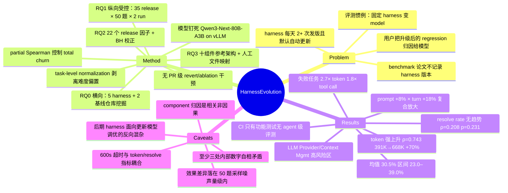

## Summary

把常规实验设计反过来：固定 LLM（Qwen3-Next-80B-A3B-Instruct，本地 vLLM 自托管），只变 agent harness 版本，把 Qwen Code CLI 的 35 个连续 release 逐个跑 50 道 SWE-bench Verified 任务（各 2 次，共 3500 次执行）。结果是 resolve rate 无显著单调趋势（Spearman ρ=0.208, p=0.231，均值 30.5%），但 token 消耗强显著上升（ρ=0.743, p<0.0001，前九个 release 约 391K/任务 → 最新约 668K/任务，+70%），即 harness 持续开发只推高了成本、没推高效果。作者进一步用 release 级与 component 级相关分析把波动归因到开发模式与架构层，但归因全部是观测性相关 + 人工 case study，没有做过 PR 级 revert/ablation 重跑。

## Problem & Motivation

论文的问题设定本身是它最重要的贡献。已有的 coding agent 评测几乎都把 harness 当固定基建、在同一 harness 下比不同 foundation model；反过来，harness 本身在以每天 2 次以上的速度演进（且多数 CLI 默认自动更新），却从没有人测过这层 middleware 的版本变化对 agent 质量的影响。作者指出实践中的现象：用户在 harness 升级后报告质量退化，但归因几乎一律指向底层模型（论文脚注 1 列了 Cursor、Claude Code、Gemini CLI、Codex、Qwen Code 六条社区 issue 作为证据）。

这个 formulation 可证伪且方向明确：如果把模型钉死，观察到的质量波动就只能来自 harness。它同时暴露一个方法论问题——现有 benchmark 报告普遍只记录模型版本、不记录 harness 版本，导致跨论文的数字根本不可比。

## Method

**两层设计。** RQ0 是横向 landscape：挖 5 个开源 coding agent harness（Gemini CLI、Codex、OpenCode、OpenHands CLI、Qwen Code）的 GitHub 仓库数据，对照两个成熟非 agent 项目（VS Code、GitHub CLI），刻画 release/commit/issue 速率。RQ1–RQ3 是纵向受控实验，只做 Qwen Code CLI 一个 harness。

**受控实验的关键约束。** 35 个 release（v0.0.10–v0.10.3，排除 v0.0.11 因已知 runtime bug；v0.0.1–v0.0.9 因不支持本地 OpenAI-compatible endpoint 而排除）逐个用 `npm install` 装好，全部对同一个自托管模型跑。模型是 Qwen3-Next-80B-A3B-Instruct（80B 总参数 / 3B 激活的 MoE），跑在 vLLM v0.18.0 上暴露为 OpenAI-compatible endpoint，采样参数用 Qwen Code CLI 默认值。任务是从 SWE-bench Verified 剔掉 8 道 gold patch 都跑不通的题后、按难度分层抽的 50 道（Easy 20 / Medium 25 / Hard 5 / Very Hard 0），每任务 600 秒超时、跑 2 遍。指标三个：resolve rate、token consumption、tool call 数，另外单独跟踪 conversation turns。

**归因方法（这是本文对 component attribution 最相关的部分，也是最弱的一环）。**

- *RQ1 效应确认*：Spearman 检验 release 序号与指标的单调趋势；Wilcoxon 检验两次 run 的分布一致性。为剥离任务难度偏置，做 task-level normalization——每道题取它在 35 个版本 × 2 次 run 上的均值作 baseline，每个版本的值表示为相对该 baseline 的百分比偏差。
- *RQ2 项目级归因*：抽 22 个 release 级因子（churn、commit 组成、贡献者数、issue 活动、release 间隔等，PR 按 conventional commits 规范分类为 feat/fix/refactor），用 z=±0.75σ 把 35 个 release 分成 Good/Neutral/Bad 三档，再做 Spearman 相关 + Mann-Whitney U/Cliff's d，BH 校正 FDR 到 α=0.05。同时报 absolute（累积）与 delta（相邻版本差分）两套分析。
- *RQ3 架构级归因*：先按 Hassan-Holt 流程从 5 个 harness 反推出一个十组件 reference architecture（UI、Agent Controller、LLM Provider、Tool System、Context Management、Persistence、Security、Extensibility、Config/Service Locator、Communication Backbone），再把每个 release 窗口里改动的文件按**人工制定的路径→组件映射表**归到组件（跨组件文件的 churn 平均分摊，如 `sharedTokenManager.ts` 同时算 LLM Provider 和 Context Management 各一半）。为剥离"大 release 同时改很多组件"的伪相关，用 **partial Spearman correlation 控制 total codebase churn**（把组件因子和质量指标都对总 churn 回归后相关残差），partial 值相对 raw 塌陷的信号被判为 confound 而剔除。

需要明确的是：全文没有任何"回滚某个 PR 再重跑 benchmark"的干预实验。PR 级的因果叙述（§5.4、Finding 13、Finding 18）全部是人工挑选的 case study，把某次版本跳变的数字与该窗口内的若干 PR diff 并列陈述。

## Key Results

**harness 单独造成的效果差异（模型钉死）**：resolve rate 在 35 个 release 上均值 30.5%、最低 23.0%、最高 39.0%（早期 v0.0.14），与 release 顺序无显著单调相关（ρ=0.208, p=0.231）。另有一个常被忽略的量：agent 能产出非空 patch 的任务比例随版本在 52%–94% 之间大幅摆动，但通过测试的只有 23%–39%——harness 更新明显改变了 agent 的行为，却没抬高正确性上限。

**harness 单独造成的效率差异**：token 消耗强显著上升（ρ=0.743, p<0.0001）；前九个 release 约 391K token/任务，最新版本近 668K/任务，涨幅超 70%；中途在 v0.1.4 探到约 217K 的低谷。task-normalized 后趋势不变（ρ=0.751, p<0.0001），最新版本比该任务 baseline 高出最多 19.6%，最早版本则低 24.2%——即 harness 自身贡献的成本区间跨度约 44 个百分点。tool call 数在 6.9–14.3 次/任务之间波动。

**token 膨胀的成分分解（本文唯一一处真正的组件级机制拆解）**：初始 prompt payload（system prompt + tool schema + 任务描述，其中任务描述跨版本恒定）从最早到最新 release 增长约 8%；同时新版本平均多用 18% 的 LLM turn；token 与 turn 数近乎完美相关（ρ=0.941, p<0.0001）。由于完整对话历史每轮都要重新前置，turn 数增加会机械地放大 token，而变大的 system prompt 又在每一轮被重复计入——两者相乘构成成本膨胀。

**失败任务更贵**：解决的任务平均 7.2 次 tool call / 258.7K token，未解决的 12.95 次 / 697.7K token，即失败任务多烧近 2.7× token、1.8× tool call；token 用量与任务成功之间无正相关（ρ≈-0.02, p=0.91）。

**具体 regression 案例**：v0.1.4→v0.1.5（相隔一天），resolve rate 原地不动（26.0%），token 从 216.6K 涨到 329.9K（+52%），tool call 从 7.28 涨到 10.59；作者点名该窗口 6 个 PR 中的两个——#969 重写 glob/grep/ripgrep 工具实现（+834/−776 行）、#981 重构 tool output 回传格式（+795/−607 行）。v0.4.1→v0.5.0 则是 effectiveness regression：resolve rate 从 39.4% 掉到 32.5%，作者归因于 PR #1235 改动 LLM Provider 层的 OpenAI converter 请求/响应转换管线（+346/−8 行）。两次变更都通过了项目全部 CI 检查。

**架构组件的敏感度（相关，非因果）**：absolute 分析里 LLM Provider 的 add_del_ratio 与 token efficiency 正相关最强（AE1: ρ=+0.490, partial ρ=+0.492），Context Management 的 add_del_ratio 与 token efficiency 负相关（AE4: ρ=−0.346, partial ρ=−0.392，partial 值反而大于 raw）。delta 分析里 LLM Provider 的 add_del_ratio 与 effectiveness 负相关（DE2: ρ=−0.336, partial ρ=−0.221, p=0.049），Security 的 fix_ratio 与 token/tool-call efficiency 均正相关（DE4/DE6: ρ=+0.346/+0.341）。作者的结论是 LLM Provider 与 Context Management 是高风险区，Extensibility 与 Security 是安全区。

**RQ0 背景数字**：最活跃的 harness 比基线项目发版频繁 13–28×（OpenCode 18.0 次/周、Codex 12.4、Gemini CLI 10.3、Qwen Code 10.0，对照 VS Code 0.8、GitHub CLI 0.6）；OpenCode 单月峰值 136 次 release。

**根因主张**：作者检查 Qwen Code CLI 的公开 CI/CD、测试套件与 GitHub Actions，发现只有功能测试，没有任何针对 agent 级指标（resolve rate、token、tool call）的自动评测——项目维护 300+ 个测试，无一评估 agent 在代表性 benchmark 上的表现。他们据此提出 "non-functional agentic regression testing" 的缺失是这些 regression 能进生产版本的可能解释（明确说不主张这是唯一原因）。

## Evidence Ledger

| Claim ID | Claim | Type | Source locator | Evidence excerpt | Status |
|:--|:--|:--|:--|:--|:--|
| C1 | 35 个 Qwen Code release（v0.0.10–v0.10.3）× 50 道 SWE-bench Verified × 2 run = 3500 次执行，模型固定为 Qwen3-Next-80B-A3B-Instruct（vLLM v0.18.0 自托管） | benchmark-setting | §3.1.2 / §3.3 Model Serving / §5.2.3 | "35 versions × 50 tasks × 2 runs = 3,500 total executions"; "using vLLM (v0.18.0), exposed as an OpenAI-compatible API endpoint" | source-verified |
| C2 | resolve rate 跨 release 无显著单调趋势（ρ=0.208, p=0.231），均值 30.5%，区间 23.0%–39.0%（峰值在早期 v0.0.14） | number | §5.3 Finding 5 | "weak and non-significant (ρ=0.208, p=0.231) … stable mean of 30.5% … as low as 23.0%, yet peaked at 39.0%" | source-verified |
| C3 | token 消耗强显著上升（ρ=0.743, p<0.0001）：前九个 release ≈391K/任务 → 最新 ≈668K/任务，涨幅超 70% | number | §5.3 Finding 6 | "first nine releases averaged approximately 391K tokens per task, whereas the latest versions consumed nearly 668K per task, an increase of over 70%" | source-verified |
| C4 | task-normalized 后趋势保持（ρ=0.751, p<0.0001），最新版本高于 per-task baseline 达 19.6%，最早版本低 24.2% | number | §5.3 / Figure 8 | "(ρ=0.751, p<0.0001). The latest releases consumed up to 19.6% more tokens … earlier versions operated at 24.2% below the baseline" | source-verified |
| C5 | 未解决任务比已解决任务多耗近 2.7× token（697.7K vs 258.7K）、1.8× tool call（12.95 vs 7.2） | number | §5.3 Finding 7 | "resolved tasks require 7.2 tool calls and 258.7K tokens, compared to 12.95 tool calls and 697.7K tokens" | source-verified |
| C6 | 初始 prompt payload 增长约 8%，新版本平均多 18% LLM turn，token 与 turn 数 ρ=0.941, p<0.0001 | causal-mechanism | §5.3 Finding 8 | "grew by ~8% … newer releases require 18% more LLM turns on average … near-perfect correlation (ρ=0.941, p<0.0001)" | source-verified |
| C7 | v0.1.4→v0.1.5：resolve rate 不变（26.0%），token +52%（216.6K→329.9K），tool call 7.28→10.59；归因 PR #969 与 #981，两者均通过 CI | causal-mechanism | §5.4 Case Studies | "same resolve rate (26.0%), but token consumption surged 52% to 329.9K, and tool calls jumped to 10.59 per task" | source-verified |
| C8 | 全文的 PR 级归因均为人工 case-study 观察，未做任何回滚单个 PR 并重跑 benchmark 的干预实验 | causal-mechanism | §5.4 / §7.3.2 / §8.2（全文检索 revert/ablation/rollback/bisect 无结果） | "we manually examined two representative cases to trace specific code changes behind the quantitative trends" | source-verified |
| C9 | RQ3 用人工路径→组件映射（跨组件文件 churn 平均分摊）+ 控制 total churn 的 partial Spearman；Context Mgmt add_del_ratio ρ=−0.346/partial −0.392；LLM Provider add_del_ratio ρ=+0.490/partial +0.492 | causal-mechanism | §7.2 / Table 10 (AE1, AE4) / §9 Construct Validity | "Each modified file is then mapped to one of the ten reference components using the file path-to-component taxonomy" | source-verified |
| C10 | delta 分析中 LLM Provider 的 add_del_ratio 与 effectiveness 负相关（DE2: ρ=−0.336, partial ρ=−0.221, p=0.049） | number | Table 11, DE2 / Finding 18 | Table 11 row DE2 — Effectiveness / LLM Provider / add_del_ratio / −0.336 / p=0.049 / partial −0.221 | source-verified |
| C11 | 论文未做 harness 效应量与模型效应量的任何定量对比；明确声明结论只表示 harness 重要，不构成跨 model-harness 组合的普适定量预测 | sota-novelty | §9 External Validity | "Our findings should be interpreted as evidence that agent harness matters, not as universal quantitative predictions for all model-harness combinations." | source-verified |
| C12 | 内部数字不一致：§8.2 称 "139% token increase in v0.1.5" 与 "182% increase in v0.3.0"，而 §5.4 对同两次 transition 报的是 52% 与 +131% | number | §8.2 vs §5.4 | §8.2: "the 139% token increase in v0.1.5 and the 182% increase in v0.3.0"; §5.4: "surged 52%" / "(+131%)" | source-verified |
| C13 | 内部数字不一致：v0.5.0 的 token 在 Finding 13 记为 450K、在 Finding 10/18 记为 561K；v0.5.0 的 resolve rate 在 Finding 18 记为 32.5%、在 Finding 10 记为 27% | number | §6.3.2 F13 / §6.3.1 F10 / §7.3.2 F18 | F13: "dropped from 517K to 450K (-12.9%)"; F18: "token consumption remained elevated at 561K"; F10: "jump from 27% to 34%" | source-verified |
| C14 | 剔除 8 道 gold patch 失败的题后分层抽 50 道（Easy 20/Medium 25/Hard 5/Very Hard 0），每任务 600 秒超时 | benchmark-setting | §3.2 + Table 1 + §3.3 Agent Execution | "we excluded 8 tasks … whose evaluation environments failed even under the gold patch"; "timeout of 600 seconds per task" | source-verified |
| C15 | 最活跃 harness 发版频率为基线的 13–28×（OpenCode 18.0/周、Codex 12.4、Gemini CLI 10.3、Qwen Code 10.0 vs VS Code 0.8、GitHub CLI 0.6） | number | §4.3 Finding 1 + Table 3 | "OpenCode leads with 18.0 releases per week … Codex at 12.4/week and Gemini CLI at 10.3/week" | source-verified |
| C16 | 作者检查公开 CI/CD、测试套件与 GitHub Actions，只发现功能测试，无 agent 级指标自动评测；项目维护 300+ 测试 | causal-mechanism | §8.2 | "revealed functional testing, but no automated evaluation of agent-level benchmark quality metrics"; "more than 300 unit tests" | source-verified |
| C17 | v0.0.11 因已知 runtime bug 被排除；v0.0.1–v0.0.9 因早于本地 OpenAI-compatible endpoint 支持（v0.0.10 引入）被排除 | benchmark-setting | §5.2.1 footnote 7 + §3.1.2 | "Version v0.0.11 is excluded due to a known runtime bug that severely restricted tool availability" | source-verified |
| C18 | Replication package 目前不公开，参考文献条目写明 "To be made publicly available upon acceptance"，全文无 DOI/Zenodo/GitHub 链接 | license-code | References (Sghaier et al., 2026) + §1 contribution (5) | "Replication Package for 'Don't Blame the Large Language Model …'. To be made publicly available upon acceptance." | source-verified |
| C19 | Abstract 写 "nearly double the computational tokens and tool calls"，而 §5.3 Finding 6 对应结果是 "over 70%"（391K→668K） | number | Abstract vs §5.3 Finding 6 | Abstract: "consume nearly double the computational tokens and tool calls"; §5.3: "an increase of over 70%" | source-verified |
| C20 | 四位作者均属 Queen's University（Canada）；LaTeX 元数据以 ACM TOSEM 为目标；arXiv v1 2026-07-04、v2 2026-07-20 | benchmark-setting | Title block + LaTeX metadata + arXiv 提交历史 | "Queen's University Canada"; "journal: TOSEM journalyear: 2026"; "[v1] Sat, 4 Jul 2026 … [v2] Mon, 20 Jul 2026" | source-verified |

## Strengths & Weaknesses

**实验设计的方向是对的，而且此前没人做。** 把模型钉死、只变 harness，是唯一能让 harness 效应可辨识的设计。为此把模型自托管在 vLLM 上（消除 API 侧静默换模型、限流、超时），逐版本 `npm install` 重跑 3500 次执行，代价是几周机时——这个成本换来的是"观察到的波动不可能来自模型漂移"这一条硬结论。同样值得肯定的是 task-level normalization：先用每道题在全部 35 个版本上的均值做 baseline，再看各版本的相对偏差，这样"某版本恰好多啃了几道难题所以更贵"的解释被排除掉了。

**效率结论稳，效果结论不稳——而论文对两者用了同一套修辞。** 这是我认为最需要在引用时区分的一点。token 是连续量、per-task 归一化后 ρ=0.743/0.751 且 p<0.0001，这个信号站得住。resolve rate 则是 50 题上的二值比例：以均值 30.5% 计，单次 run 的二项抽样标准差约 6.5 个百分点，两次 run 因高度相关（binary 一致率 87.7%）几乎无法把它降到 4.6 pp 以下。35 个 release 从这样一个分布里各抽一次，纯噪声就足以产生 18–26 pp 的极差；而论文观察到的极差是 16 pp（23.0%–39.0%）。换言之，**跨 release 的 resolve rate 离散度完全落在 50 题采样噪声的量级之内**，论文"successive releases often differ markedly in quality"的表述缺乏支撑，倒是它自己的零结论（无显著趋势）非常稳。论文全程没有给 per-release resolve rate 的置信区间。（此段为我的推算，非论文所述。）

**归因链条到 component 就断了。** RQ3 的 attribution 是"release 窗口内某组件的 churn 特征"与"该 release 的质量指标"之间的 partial Spearman 相关，n=35（delta n=34）。partial 相关只线性剔除了 total churn 这一个混杂变量，剔不掉组件之间的共变——一个 release 同时改 LLM Provider 和 Context Management 是常态，两者的贡献在这个设计里不可分。存活下来的效应量在 ρ≈0.33–0.49 之间，多个 p 值贴在 0.042–0.050 上，即使做了 BH 校正也只能读作弱提示。真正的 component 级归因需要的是"同一 release 回滚掉目标 PR 后重跑 50 题"，全文没有这样的干预（C8）。因此 Finding 14–18 那些"LLM Provider 是高风险区"的说法，应当作为 hypothesis 引用而非结论。

**唯一一处经得起机制解读的分解是 Finding 8。** prompt payload +8%、turn 数 +18%、token 与 turn ρ=0.941，加上"完整对话历史每轮前置"这一确定性的算术事实，构成了一个可验算的成本模型：静态 prompt 膨胀会被动态 turn 数放大。这条比 RQ3 的相关表格更有价值，因为它把成本回归到了两个可独立测量、可独立干预的量上。

**方向被反转的混杂：论文没讨论。** 论文消除了"harness 版本与当时可用模型版本纠缠"的传统混杂，但引入了它的镜像——35 个 release 全部对同一个固定 checkpoint 评测，而后期 release 的 prompt、tool schema、context 策略是针对**当时**的 Qwen 系模型（Qwen Code 面向整个 Qwen family，期间该系列本身在迭代）调优的。把 v0.10.3 拿去配一个更早期 release 所面向的模型，可能系统性地低估后期 harness。论文的辩护是"CLI 专为 Qwen 模型族设计，所以任何 regression 都可归于 harness 演进而非 harness-模型错配"（§3.1.2），但"模型族"不等于"这一个 checkpoint"，且 Threats to Validity 一节并未把这条列为威胁。对本篇的核心结论（成本单调上升）影响可能有限，对 effectiveness 无提升的结论则影响不小。

**600 秒 wall-clock 上限与被测量本身耦合。** token 消耗和 turn 数都被一个时间预算截断，而不同 release 的单轮延迟并不相同（改动 streaming I/O 层、tool 实现都会影响）。一个每轮更慢的版本会在预算内跑更少轮，从而**同时**压低它的 token 数与 resolve rate。论文既没报告 timeout 触发率，也没分析这层耦合。

**内部数字自相矛盾，至少三处（C12、C13，以及 Finding 18 的 v0.4.1=39.4% 与 Finding 5 "峰值 39.0% 出现在最早期版本、此后再未恢复"直接冲突）。** 加上 abstract 用 "nearly double" 描述正文的 "over 70%"（C19），这些不是致命错误，但说明数字在写作过程中没有单一真值来源。引用本文任何具体版本号对应的数值前应回查 replication package——而 package 目前尚未公开（C18）。

**外部效度的边界要说清楚。** 纵向部分只有一个 harness（Qwen Code CLI）、一个模型（Qwen3-Next-80B-A3B-Instruct，一个 3B 激活的 MoE）、50 道题（含 0 道 Very Hard）。30.5% 的 resolve rate 基线远低于当前主流 coding agent 在 SWE-bench Verified 上的水平，这个 regime 下"harness 改动改不动正确性上限"的结论，未必能外推到模型能力更强、harness 更成熟的组合。论文自己承认了模型与 harness 单一性，也承认了 resolve rate 二值指标不计部分进展。

**对领域的影响。** 最有操作性的产出其实不是那 18 条 finding，而是两条方法论要求：(1) 报告 coding agent 结果时必须记录 harness 版本，否则跨论文数字不可比；(2) harness 项目需要 non-functional agentic regression testing——把 resolve rate/token/tool-call 纳入 CI 预算门禁。第 (2) 条的现实阻力被论文自己点破了：在每天十几次发版的节奏下跑代表性 agentic evaluation 的算力成本太高，这本身就是一个值得做的研究问题（如何用远小于 50×2 次全量执行的预算，可靠检出 harness 引入的效率/效果 regression）。

## Mind Map

## Notes

- **对 component attribution 综述的定位**：这是目前唯一一篇把"模型固定、harness 变动"做成纵向受控实验的工作，应当作为该 survey 的方法论锚点。但要严格区分它证明了什么和暗示了什么——证明的是**harness 演进单独就能让单位任务成本翻 70%**；暗示但未证明的是**具体哪个组件负责**。survey 里如果要引"LLM Provider 与 Context Management 是高风险组件"，必须带上"该结论来自 n=35 的 release 级 partial 相关，未做组件级干预"。
- **可比性提醒**：本文所有绝对数字（30.5% resolve rate、391K/668K token）都绑定在 "Qwen3-Next-80B-A3B + 50 题 + 600s 超时" 这个具体 setting 上，不能与其他 SWE-bench Verified 报告直接并列。
- **与 vault 内其他笔记的关系**：[[Papers/2607-HarnessHandbook]]（同为 harness 演进主题，但解决的是"改 harness 时怎么定位行为对应的实现"，是本文诊断出的问题的一种下游对策）；[[Papers/2605-CodeAgentHarness]]（把 code 视作 agent harness 的 survey，视角不同）；[[Papers/2608-LongHorizonHarness]]（提出新 harness 设计，同样缺 role-level ablation，与本文的"归因到组件很难"形成呼应）；[[Papers/2607-AgentBenchmarkBudget]]（直接对应本文的统计软肋——多少 task 才够支撑一个 pairwise 比较结论；本文用 50 题在 35 个 release 之间做比较，正是该文警告的 partial-evaluation 场景）。
- **可延伸的问题**：论文自己指出 agentic regression testing 的障碍是成本（每次发版跑 50×2 次执行不现实）。一个自然的问题是——能否用远小于全量的预算（比如挑选对 harness 变更最敏感的少数任务、或直接监控 prompt payload 大小与 turn 数这两个 Finding 8 已验证的 proxy）可靠地预警 regression？Finding 8 的 ρ=0.941 恰好说明 turn 数可能是一个极廉价的 token 成本 proxy。
- **待核**：v0.5.0 的真实 token 与 resolve rate 数值（C13 的矛盾）需等 replication package 公开后回查；在此之前不要在任何下游写作中引用单个版本号对应的具体数值。
