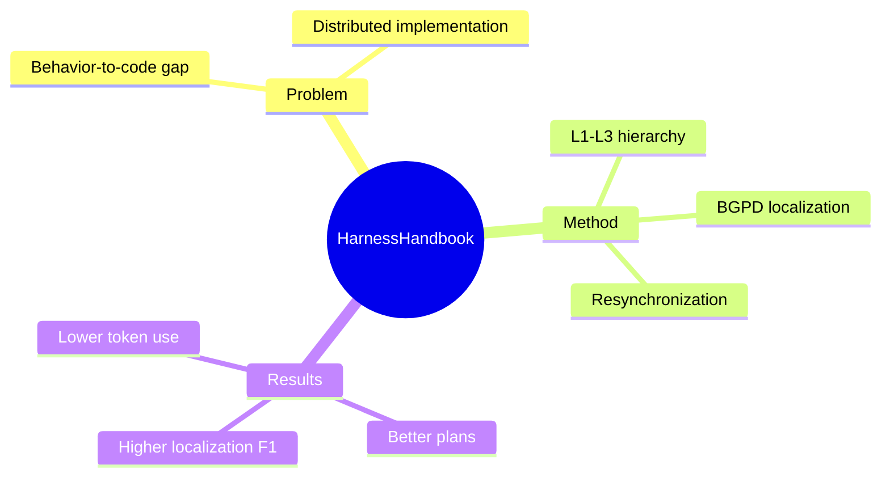

## Summary
论文提出 Harness Handbook 与 Behavior-Guided Progressive Disclosure（BGPD），把修改请求中的 runtime behavior 映射到分散的 source implementation，从而提高 coding agent 的 localization 与 edit planning 质量并降低 token cost。

## Problem & Motivation
Agent 能力不只来自 foundation model，还来自负责 prompt construction、state management、tool invocation 和 control flow 的 harness。生产 harness 随 model、API 与 environment 变化而持续演化，但用户的修改请求通常用行为描述，repository 却按 file、function 与 module 组织；一个行为还可能横跨 execution stage、shared state 和 cold path。传统 code search、repository index 或 long-context 虽能帮助阅读，却没有显式解决“behavior 到全部 implementation site”的映射，因此 behavior localization 成为修改前的关键瓶颈。

## Method
Harness Handbook 用 L1–L3 hierarchy 重组 repository：L1 给出 system overview 与 global data flow，L2 描述 execution stage 的责任、输入输出和依赖，L3 将行为单元链接到可验证的 source locator；state-register view 则补充跨 stage 的 shared-state 关系。它支持 function-as-leaf 与 file-as-leaf 两种粒度，并坚持 progressive disclosure 与 behavior–implementation alignment：失效 locator 会被冻结，而非由模型猜测。

构建流程分三阶段：先以 deterministic static analysis 提取 function、boundary、location、signature 和 resolved call edge；再用 LLM-assisted behavioral organization 把 source unit 归入 execution-stage skeleton；最后合成 L1–L3 document tree 与 state-register view并验证 source grounding。BGPD 从相关 stage 出发，经 shared state 与 call relation 扩展 candidate，随后回到当前 repository 验证 file/function/region evidence。planner 据此生成 edit plan，executor 应用修改，任何非空 diff 都触发 scoped resynchronization。

## Key Results
- 在 Codex harness 的 30 个修改请求上，Handbook-Assisted plan 的总体 win rate 为 38.3%，baseline 为 28.3%；Terminus-2 上分别为 45.6% 与 26.7%。
- 平均 planner token 从 Codex 每请求 0.102M 降至 0.089M（-12.7%），从 Terminus-2 的 0.058M 降至 0.053M（-8.6%）。
- 对 Opus 4.8 与 GPT-5.5 reference plan 的 file/symbol localization，24 个 Recall、Precision、F1 对比全部改善，F1 增益为 5.0–18.8 个百分点；zero-overlap 的 Wrong 最多降低 25.9 个百分点。
- 不同 request type 的增益为 16.3–33.3 个百分点，覆盖 Query、Cross-file 与 Search-Hostile 修改，说明收益主要出现在分散、冷门或跨 module 的 implementation site。

## Strengths & Weaknesses
方法的强点是让 repository 继续充当 source of truth：LLM 负责 behavior organization，但 locator 必须回到当前代码验证，无法解析的内容会冻结或进入 coverage record。实验还同时报告 plan quality、localization accuracy 与 token cost，避免把“看了更多上下文”误当作 representation 本身更好。

主要限制是实验只覆盖 Codex 与 Terminus-2 两个 open-source harness、每个 30 个请求，而且核心终点是 read-only edit plan，并未验证执行后的 test pass rate、regression 或真实维护成本。Plan quality 依赖三位 LLM judge，reference plan 也来自强模型，因此仍可能共享 model bias；Handbook 的初次构建、长期 resynchronization 成本以及在非 Python/Rust codebase 上的稳健性尚未得到充分量化。

## Mind Map

## Notes
这项工作把 coding agent 的失败点前移到了“修改前是否找全 site”，比单纯优化 patch generation 更接近真实维护瓶颈。值得进一步验证 Handbook 是否能作为 regression-impact graph，并在多次连续修改后保持 behavior mapping 的 calibration。
