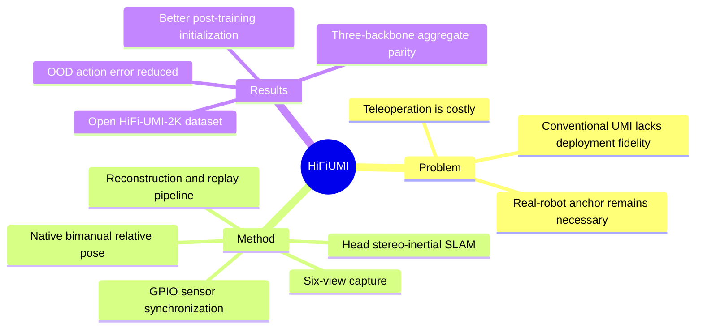

## Summary

HiFi-UMI 把 robot-free UMI data 从主要用于 pre-training 的辅助数据源推进到 target-task post-training：通过 trajectory、inter-gripper pose、synchronization 与 field of view 的 hardware–software co-design，训练无需 target-task real-robot teleoperation 的可部署 manipulation policy。在其受控但不 sample-matched 的评测中，HiFi-UMI-only post-training 相对 in-domain teleoperation 的 aggregate success-rate gap 在 StarVLA-QwenPI、OpenPI-π0.5 和 LingBot-VA 上分别为 -2.5、+3.1 和 -0.6 percentage points。另在 StarVLA-QwenPI 上，4,000-hour UMI pre-training 将十个 unseen tasks 的 mean OOD action error 降低 41%，并在相同 task-specific post-training data 下把 aggregate real-robot success 提高 18.1 percentage points。

## Problem & Motivation

Real-robot teleoperation 能直接产生 embodiment-aligned trajectories，但需要目标机器人、teleoperation rig、人工 reset 与安全监管，难以扩展。传统 UMI 虽然便携，却受 wrist-view occlusion、online SLAM drift、跨 gripper relative pose 重建误差、software-level temporal alignment 与有限 FoV 影响，因此通常只承担 pre-training，部署前仍需少量 real-robot data 作为 anchor。本文提出更根本的问题：如果 robot-free demonstrations 本身足够高保真，能否完全移除 target-task post-training 阶段的 real-robot anchor？

## Method

HiFi-UMI 是一套从 capture hardware 到 dataset export 的联合数据生产系统：

1. **Pose acquisition**：采用 head-mounted offline stereo-inertial SLAM，并在同一 head-camera frame 内定位双手 marker cubes。与分别追踪 wrist 相比，head view 更稳定；双手在同一坐标系中被观测，使 inter-gripper relative pose 可直接测量，而非依赖 cross-camera co-visibility 事后重建。
2. **Sensing 与 gripper**：每只手配置两个 non-parallel fisheye cameras，形成 six-view capture；全部 cameras、IMUs 与 encoders 由同一 GPIO trigger 同步。full-palm glove gripper 通过不对称接触区域兼顾小物体精细操作与较大物体支撑。
3. **Online quality control**：采集时检测 underexposure、motion blur、过快运动及手部离开 head-camera FoV 等异常，并通过语音反馈让 operator 就地修正；online slicing 同时记录 task/subtask boundaries。
4. **Data engine**：raw captures 依次经过 offline trajectory reconstruction、automatic cleaning、simulation retargeting/replay、AI-assisted annotation、human verification，以及 distribution-aware analysis/export。训练 episode 包含 synchronized multi-view video、calibrated bimanual trajectories、gripper state、language annotation、subtask boundaries 与 quality-control metadata。
5. **Policy interface**：UMI trajectories 被转换为 deployment robot 的 end-effector action convention；所有 backbone 使用 chunk-anchored relative pose increments 与 absolute gripper opening。实验覆盖 StarVLA-QwenPI、OpenPI-π0.5 两个 VLA 和 LingBot-VA WAM，并在每个 backbone 内固定 architecture、initialization、optimization、action representation 与 deployment stack，仅替换 task-specific data source。
6. **Evaluation**：deployment 使用 stationary bimanual robot；policy 只接收四个 wrist views，head stereo pair 仅用于 capture reconstruction。四个任务覆盖 contact-rich wiping、bimanual deformable manipulation、precision insertion 与 semantic sorting。

## Key Results

- **Capture fidelity**：约 2 m accumulated head-trajectory workspace 内的 mean translational end-effector error 为 3 mm；cross-sensor timing offset 小于 40 μs，六个 25 fps cameras 的 frame-drop rate 小于每 270,000 frames 一帧。
- **Dataset scale**：完整 processed corpus 包含 20,000+ hours、4.32M+ episodes 与 480+ scenes；公开的 HiFi-UMI-2K 子集包含 2,000 hours、482,100+ episodes 与 110+ scenes，并以 CC BY 4.0 发布。
- **Practical-pipeline parity**：四个 tabletop bimanual tasks、三个 backbones、共 960 次 real-robot rollouts 中，UMI minus teleoperation 的 aggregate gaps 分别为 -2.5、+3.1、-0.6 percentage points。该结果比较的是 practical data-production pipelines：每任务使用 3,200 条 UMI trajectories，而 teleoperation 约为 300 条；前者不来自 evaluation scene，后者来自同一场景。
- **Task-specific scaling**：OpenPI-π0.5 在 Remote Insertion 上随 UMI demonstrations 从 400 增至 800、1,600、3,200 条，success rate 从 37.5% 提升至 65.0%、70.0%、85.0%；增至 6,400 条后为 82.5%，表明在 40-rollout resolution 下约于 3,200 条处 plateau。
- **Reusable initialization**：StarVLA-QwenPI 的 4,000-hour UMI pre-training 使十个 pre-training-unseen tasks 的 mean action MSE 降低 41%，且所有任务均改善。在相同的每任务 3,200 条 HiFi-UMI post-training trajectories 下，该 initialization 又把 aggregate real-robot success 提高 18.1 percentage points。

## Evidence Ledger

| Claim ID | Claim | Type | Source locator | Evidence excerpt | Status |
|:--|:--|:--|:--|:--|:--|
| C1 | 约 2 m workspace 内的 mean translational end-effector error 为 3 mm，external tracking 只用于精度评估。 | number | [Sec. 3.4, Table 2](https://arxiv.org/html/2607.25895#S3.SS4) | “mean translational error of 3 mm against base-station tracking ground truth (used only for this accuracy evaluation, not for routine capture)” | source-verified |
| C2 | Cross-sensor timing offset 小于 40 μs，six-camera frame-drop rate 小于每 270,000 frames 一帧。 | number | [Sec. 3.4, Table 2](https://arxiv.org/html/2607.25895#S3.T2) | “Cross-sensor timing offset: <40 μs”; “Dropped frames (6 cameras @ 25 fps): <1 per 270,000 frames” | source-verified |
| C3 | 完整与 released corpora 分别达到所报告的 hours、episodes 与 scenes 规模。 | number | [Sec. 4, Table 3](https://arxiv.org/html/2607.25895#S4.T3) | “Collected: 20,000+ hours, 4,320,000+ episodes, 480+ scenes”; “Released: 2,000 hours, 482,100+ episodes, 110+ scenes” | source-verified |
| C4 | HiFi-UMI-2K 以 CC BY 4.0 发布，允许 redistribution 与 derivative/commercial use，但要求 attribution。 | license-code | [Sec. 4](https://arxiv.org/html/2607.25895#S4) | “permits redistribution and derivative use, including for commercial purposes, provided the source is attributed” | source-verified |
| C5 | 三个 backbone 的 UMI-minus-teleoperation aggregate gaps 分别为 -2.5、+3.1、-0.6 percentage points。 | comparison | [Sec. 6.2](https://arxiv.org/html/2607.25895#S6.SS2) | “Taking UMI minus teleoperation ... -2.5, +3.1, and -0.6 percentage points ... respectively” | source-verified |
| C6 | Parity evaluation 覆盖四任务、三个 backbones、每个 task-policy pair 40 rollouts，共 960 次 rollouts。 | benchmark-setting | [Secs. 6.1.2–6.1.4](https://arxiv.org/html/2607.25895#S6.SS1) | “four tabletop manipulation tasks”; “three policy backbones”; “six conditions receive 960 real-robot rollouts in total” | source-verified |
| C7 | 每任务使用 3,200 条 UMI 与约 300 条 teleoperation trajectories，且两种数据的 evaluation-scene exposure 不同。 | benchmark-setting | [Sec. 6.1.3](https://arxiv.org/html/2607.25895#S6.SS1.SSS3) | “3,200 UMI trajectories but 300 teleoperation trajectories”; “The comparison is not sample matched” | source-verified |
| C8 | 4,000-hour UMI pre-training 使十个 unseen tasks 的 mean OOD action error 降低 41%，且每个任务均改善。 | number | [Sec. 6.3, Figure 14](https://arxiv.org/html/2607.25895#S6.F14) | “a 41% reduction in mean OOD error, and every unseen task improves” | source-verified |
| C9 | 在相同 task-specific data 下，UMI-pretrained initialization 把 aggregate real-robot success 提高 18.1 percentage points。 | comparison | [Sec. 6.3, Figure 15](https://arxiv.org/html/2607.25895#S6.F15) | “Initialization is therefore the only controlled difference”; “raises aggregate StarVLA-QwenPI success by 18.1 percentage points” | source-verified |
| C10 | Remote Insertion 的五个 UMI demonstration scales 对应 37.5%、65.0%、70.0%、85.0%、82.5% success。 | number | [Sec. 6.2.1, Figure 10a](https://arxiv.org/html/2607.25895#S6.F10) | “37.5% with 400 ... 65.0% with 800 ... 70.0% and 85.0% ... decreasing from 85.0% to 82.5%” | source-verified |
| C11 | 论文联合实现四个 fidelity factors，但没有逐项 controlled degradation，无法确定各自 marginal contribution。 | causal-mechanism | [Sec. 7, Limitations](https://arxiv.org/html/2607.25895#S7.SSx2.SSS0.Px3) | “realized jointly by trajectory accuracy, inter-gripper relative pose, synchronization, and field of view”; “do not isolate these factors through controlled degradation” | source-verified |

## Strengths & Weaknesses

**亮点**：论文最有价值之处不是单纯扩大 UMI corpus，而是把“robot-free data 为什么不能用于 deployment post-training”转化为可操作的 system-design 问题，并同时处理 pose、relative geometry、synchronization、FoV、replay validation 与 annotation。实验在三个结构差异较大的 backbones 内进行 matched comparison，并主动保留对 UMI 不利的 evaluation-scene shift；同时把 post-training parity、pre-training OOD transfer 与 downstream data efficiency 串成一条较完整的 evidence chain。

**局限**：parity comparison 不是 sample matched，UMI trajectories 约为 teleoperation 的十倍，因此不能推出 equal-sample efficiency。评测仅覆盖四个 tabletop bimanual tasks、一个共享 gripper/wrist-camera interface 的 robot embodiment；pre-training gain 也只在 StarVLA-QwenPI 上验证。每个 task-policy pair 只有 40 rollouts，一个 success 即对应 2.5 percentage points，task-level 小差异缺乏足够统计分辨率。最关键的是 fidelity factors 没有 controlled degradation ablation，因此当前证据只说明整套联合设计足够有效，不能说明哪一项是必要条件或各项贡献多大。

## Mind Map

## Notes

这里的 **zero-robot post-training** 应严格理解为“target-task post-training 不使用 real-robot teleoperation data”，而不是整个模型历史完全不含 robot data，也不是 evaluation 不需要真实机器人：OpenPI-π0.5 与 LingBot-VA 仍从各自 public base checkpoints 初始化，最终结论仍来自 real-robot rollouts。

下一步最有信息量的研究不是继续扩大同类数据，而是做正交 fidelity ablation：固定 sample count 与 scene coverage，分别降级 pose accuracy、temporal synchronization、relative-pose accuracy 和 FoV，并测量 nominal success、recovery behavior 与 contact-sensitive failure。这样才能把“high fidelity 有效”转化为可迁移的 deployment specification。
