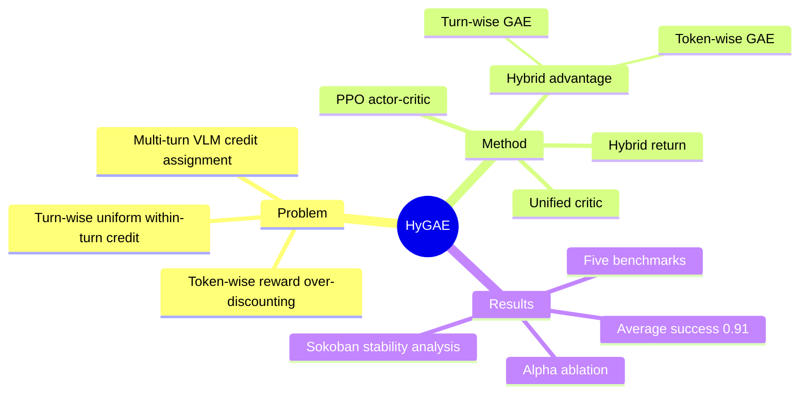

## Summary

HyGAE 面向 VLM multi-turn agentic RL，将 turn-wise 与 token-wise GAE 线性混合，并在特定 discount-factor 关系下用一个 unified critic 同时提供两级 value。作者在五个 multi-turn benchmark 上报告平均成功率 0.91，较表中最强 RL baseline Token-PPO 的 0.81 高 0.10，并称五项均达到 SOTA。其价值在于把两类 credit assignment 统一成简洁的 actor-critic 目标，但结论目前主要来自 Qwen2.5-VL-3B-Instruct 和 3–7 turns 的受控环境，对 larger backbone 与 long-horizon interaction 的泛化尚未回答。

## Problem & Motivation

Multi-turn VLM agent 不仅要根据当前视觉 observation 生成动作，还要利用此前 action、environment feedback 与中间 reward 调整后续决策；作者观察到 frozen VLM 容易忽略这些历史信息并重复无效动作。现有 multi-turn RL 通常二选一：token-wise RL 能在 turn 内提供细粒度的 language-generation credit，但环境 reward 会穿过大量 reasoning token 被反复 discount；turn-wise RL 保留中间环境反馈，却把同一 advantage 均匀广播给整段输出，缺少 token-level differentiation。显式 hierarchical actor-critic 可以同时建模两层，但会增加架构与训练开销。论文因此追问：两种 POMDP formulation 是否能在同一个优化目标和 critic 中统一，而不引入额外 hierarchy。

## Method

**两种 POMDP 视角。** 在 turn \(t\)，VLM autoregressively 生成 token sequence \(\mathbf{a}_t=(a_t^1,\ldots,a_t^{I_t})\)，环境执行其中的 action 并返回 reward 与下一轮 observation。Token-wise formulation 把每个 token 当作 action，只有 turn 末 token 接收环境 reward；turn-wise formulation 则把整段 token sequence 当作一个 macro-action。

**Hybrid advantage。** 作者先把 turn action 的 log-probability 分解为各 token log-probability 之和，由此指出 turn-wise 与 token-wise surrogate 的形式只差 advantage。HyGAE 对每个 token 使用
\[
\widehat{\mathsf A}_t^i=\alpha\widehat{\mathbf A}_t+(1-\alpha)\widehat A_t^i,
\]
其中 \(\widehat{\mathbf A}_t\) 是同一 turn 内共享的 turn-wise GAE，\(\widehat A_t^i\) 是随 token 位置变化的 token-wise GAE，默认 \(\alpha=0.5\)。在 turn discount 满足 \(\boldsymbol{\gamma}_t=\gamma^{I_t}\) 时，Theorem 1 声称 hybrid、turn-wise 与 token-wise surrogate 具有相同 policy gradient。

**Unified critic 与 hybrid return。** Theorem 2 进一步指出，在同一 discount 关系下，turn boundary 的 turn-wise value 等于该处 final-token value，因此一个 value model 可以在 turn 末提供 turn-wise estimate、在中间位置提供 token-wise estimate。训练 critic 时，作者不是简单地把 turn return 常数广播到所有 token，而是把 turn-wise return 沿 turn 内位置按 discounted reward 回传，再与 token-wise return 混合：
\[
\widehat{\mathsf G}_t^i=\alpha\widehat{\mathbf G}_t^i+(1-\alpha)\widehat G_t^i.
\]
Policy 使用标准 PPO clipping 与 hybrid advantage 更新，critic 则以 hybrid return 为 TD target。

**Bias–variance 解释。** 论文给出的 bound 表明，turn-wise estimator 倾向于较小 bias、较大 variance，token-wise estimator 则相反；线性混合旨在折中两者。该结论依赖论文给定的 discount、value-error 与 TD-error variance 假设，不能直接外推为所有 agentic-RL 设置中的普遍保证。

## Key Results

- **总体结果（Table 1）**：以 Qwen2.5-VL-3B-Instruct 为 backbone，HyGAE 在五类 benchmark 的汇总成功率为 **0.91**；同 backbone 的 Token-PPO、Turn-PPO、GRPO、RL4VLM、VAGEN-Base 分别为 **0.81、0.47、0.38、0.55、0.74**。相对最强 RL baseline Token-PPO，绝对提升为 **0.10**。
- **逐 benchmark（Table 1）**：Sokoban 为 **0.83**，FrozenLake 为 **0.80**；Navigation 的 Base / Common Sense 分别为 **0.90 / 0.86**，平均 **0.88**；Primitive Skill 的 Place / Stack / Draw / Align 为 **1.00 / 1.00 / 1.00 / 0.99**，平均约 **1.00**；VIRL 的 ID / OOD 为 **0.72 / 1.00**，平均 **0.86**。
- **稳定性诊断（Section 5.3）**：在 Sokoban 的跨 run 比较中，PPO 为 **0.5797 ± 0.2105**，HyGAE 为 **0.8222 ± 0.0711**；作者据此将更高均值与更低波动解释为优化更稳定。
- **\(\alpha\) ablation（Table 2）**：默认 \(\alpha=0.5\) 在 Sokoban、FrozenLake、Primitive Skill 上分别得到 **0.83、0.80、1.00**；纯 token setting \(\alpha=0\) 为 **0.59、0.72、0.98**，纯 turn setting \(\alpha=1\) 为 **0.38、0.70、0.25**。
- **失败与敏感性（Figure 4）**：Sokoban 诊断显示，把 turn return 在 turn 内均匀广播，或完全移除 value model 改用 REINFORCE，都会 training collapse；是否把很小的 token-wise KL reward 聚合进 turn reward 则影响较小。

## Evidence Ledger

| Claim ID | Claim | Type | Source locator | Evidence excerpt | Status |
|:--|:--|:--|:--|:--|:--|
| C1 | 在 \(\boldsymbol{\gamma}_t=\gamma^{I_t}\) 条件下，hybrid、turn-wise 与 token-wise surrogate 具有相同 policy gradient。 | causal-mechanism | Section 4.2, Theorem 1 | “the hybrid surrogate yields the same policy gradient as the original objective” | source-verified |
| C2 | 在相同 discount 关系下，一个 shared value model 可同时承担 turn-wise 与 token-wise value estimation。 | causal-mechanism | Section 4.2, Theorem 2; Figure 3 | “This equivalence implies that we can use exactly one shared value model” | source-verified |
| C3 | HyGAE 在五个 benchmark 上平均成功率为 0.91，并比其他方法高 0.10。 | comparison | Abstract; Table 1 | “it achieves an average success rate of 91% and a significant improvement of 10% over other methods” | source-verified |
| C4 | 作者声称 HyGAE 在五个任务上均达到 SOTA。 | sota-novelty | Section 1; Table 1 | “HyGAE achieves SOTA performance on all tasks, with an average success rate of 0.91.” | source-verified |
| C5 | HyGAE 在 Sokoban 与 FrozenLake 上分别为 0.83 与 0.80。 | number | Section 5.2; Table 1 | “our method reaches 0.83 on Sokoban and 0.80 on Frozen Lake” | source-verified |
| C6 | HyGAE 在 Navigation Base / Common Sense 上为 0.90 / 0.86，平均 0.88。 | number | Section 5.2; Table 1 | “while maintaining a high average score of 0.88 on Navigation” | source-verified |
| C7 | HyGAE 在 Primitive Skill 四项平均约 1.00，在 VIRL ID / OOD 平均 0.86。 | number | Section 5.2; Table 1 | “HyGAE achieves a near-perfect average score of 1.0 on Primitive Skill and a robust 0.86 on the VIRL task.” | source-verified |
| C8 | Sokoban 跨 run 结果中，PPO 为 0.5797 ± 0.2105，HyGAE 为 0.8222 ± 0.0711。 | number | Section 5.3, Numerical analysis on bias-variance | “PPO obtains a success rate of 0.5797 ± 0.2105, whereas HyGAE reaches 0.8222 ± 0.0711.” | source-verified |
| C9 | \(\alpha=0.5\) 在所报告的三个 ablation benchmark 上优于纯 token 与纯 turn setting。 | comparison | Section 5.4; Table 2 | “the default choice α = 0.5 achieves the best performance on Sokoban, FrozenLake, and Primitive Skill.” | source-verified |
| C10 | 均匀广播 turn return 或移除 value model 使用 REINFORCE 会在 Sokoban 诊断中导致 training collapse。 | causal-mechanism | Section 5.3, Figure 4 | “broadcasting the turn-level return uniformly across all tokens within a turn or omitting the value model entirely (i.e., using REINFORCE), lead to training collapse” | source-verified |
| C11 | RL 实验使用 Qwen2.5-VL-3B-Instruct，论文没有报告 larger backbone 的 RL scaling。 | benchmark-setting | Section 5.1; Appendix B.2, Table 7 | “Base Model Qwen2.5-VL-3B-Instruct” | source-verified |
| C12 | 五个环境的 max turns 仅为 3、3、4、3、7，long-horizon 泛化未被实验覆盖。 | benchmark-setting | Appendix B.1, Table 3 | “Sokoban 4 3 10K 128 Base”; “VIRL 10 7 1K 32+18 In-Domain, Out-of-Domain” | source-verified |
| C13 | VIRL 被简化为只执行与 ground-truth trajectory 对齐的生成动作。 | benchmark-setting | Appendix B.1, VIRL | “we modify the environment to execute only the generated actions that are aligned with the ground-truth trajectory.” | source-verified |
| C14 | Sokoban 与 FrozenLake 的 train/test 均由同一 gym environment 以不同 random seeds 生成。 | benchmark-setting | Appendix B.1, Sokoban and FrozenLake | “both of which are generated by the same gym environment with different random seeds.” | source-verified |
| C15 | Figure 5 的 qualitative analysis 只展示 Sokoban 与 VIRL 样例，没有形成系统的 HyGAE failure taxonomy。 | benchmark-setting | Section 5.5; Figure 5 | “Qualitative examples on Sokoban (up) and VIRL (bottom)” | source-verified |

## Strengths & Weaknesses

**Strengths**

- **统一方式简洁**：核心只是混合两种 GAE signal，并通过 discount relation 复用一个 critic；相比显式 hierarchical model，方法更容易嵌入现有 PPO actor-critic pipeline。论文同时给出 policy-gradient equivalence、value consistency 与 bias–variance bound，使设计不只停留在 heuristic。
- **同 backbone 对照较充分**：Table 1 中五种 RL baseline 均围绕 Qwen2.5-VL-3B 训练，HyGAE 在 grid planning、embodied navigation、robotic manipulation 与 street-view navigation 上都取得表中最高汇总结果。
- **揭示实现敏感点**：Figure 4 与 Table 2 不只比较最终分数，还暴露 hybrid return、critic target 和 \(\alpha\) 对训练是否稳定的影响；这对复现 agentic PPO 比单一 leaderboard 数字更有价值。

**Weaknesses**

- **外推范围窄**：训练只覆盖 Qwen2.5-VL-3B-Instruct，五个环境最多 3–7 turns；尚无 larger VLM、显著更长 trajectory 或真实开放式 computer-use task 的证据。
- **benchmark 口径偏受控**：Sokoban 与 FrozenLake 的 train/test 来自同一 generator，仅 random seed 不同；VIRL 又只执行与 ground-truth trajectory 对齐的动作。这些设置适合算法诊断，但会削弱对开放环境 robustness 的支持力度。
- **稳定性依赖精确实现**：均匀 broadcast return 或去掉 critic 会 training collapse，说明收益并非“任意混合 token/turn signal”都能获得；\(\alpha\) 在 Primitive Skill 上也从 0.25/0.75 的 0.73、纯 turn 的 0.25 跳到默认值的 1.00，超参数鲁棒性仍需更多任务与 seeds 检验。
- **failure analysis 不足**：Figure 5 主要展示 frozen model 的重复动作与 HyGAE 的成功修正，没有系统统计 HyGAE 自身在哪类视觉误判、错误 feedback 或 long-horizon dependency 下失败。论文也未单列 Limitations section。

## Mind Map

## Notes

- 论文最值得后续验证的不是再复现一个短 horizon 分数，而是检查 \(\boldsymbol{\gamma}_t=\gamma^{I_t}\) 与 unified critic 在 response length 波动更大、reward 更稀疏的 long-horizon GUI / computer-use setting 中是否仍稳定。
- 可尝试把固定 \(\alpha\) 改为按 turn、token position 或 critic uncertainty 自适应，但应先区分这是否真正改善 bias–variance trade-off，还是只增加调参自由度。
- 论文提供 Project Page，但正文未给出 GitHub code link，因此 frontmatter 的 `code` 为空。
