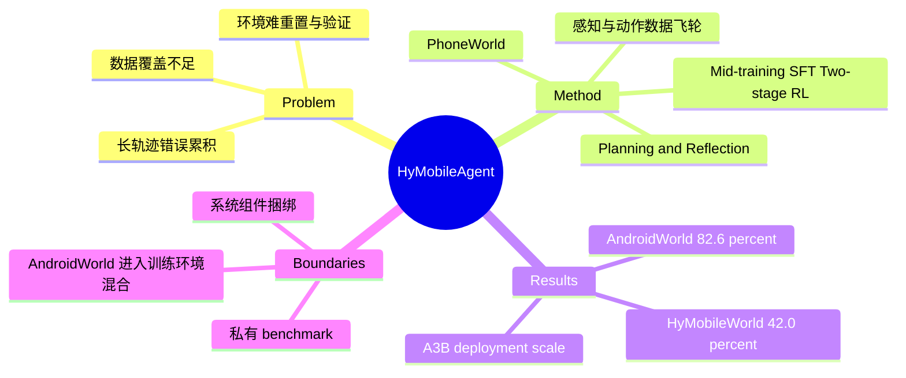

## Summary

HyMobileAgent 不再把提升移动 GUI agent 简化为扩大模型，而是围绕 A3B 规模 backbone 联合扩展感知与动作数据、可重置环境、真实设备 rollout 以及 mid-training、SFT 和 RL。它在 AndroidWorld 达到 82.6% strict success、在私有 HyMobileWorld 达到 42.0%，但这些数字验证的是整套工程系统，不能被直接归因于某个独立算法组件。

## Problem & Motivation

移动 GUI agent 的瓶颈并不只在模型容量：真实应用状态难以复现，成功判定昂贵，长轨迹中的错误会累积，而公开视频和开源轨迹又缺少足够精确的 action supervision。只扩大 backbone 无法同时解决数据覆盖、环境可验证性和在线探索吞吐。论文因此提出 data-environment co-scaling：让训练数据、可控环境和执行基础设施同步增长，以较小的激活参数规模换取更强的端到端能力。

## Method

- **Vision-native backbone**：以 Hy3.0-VL-A3B 为基础，使用 any-resolution 视觉输入和 32K context，维持适合部署的 A3B 参数规模。
- **GUI perception flywheel**：通过 mock UI synthesis、rejection sampling 与 icon augmentation 扩充 grounding、UI understanding 和 question answering 数据；同时把 tutorial video 转换为结构化交互样本。
- **Action data pipeline**：构建百万规模 action 数据流水线，在 2,000 余台 sandbox 与真实设备上执行，并自动归因失败，减少无效轨迹进入训练集。
- **PhoneWorld environment**：由 18 类可复用交互组件生成 34 个 mock apps，形成 34,242 个可验证、可重置的 single-app tasks，为 SFT 和 RL 提供稳定状态与自动 reward。
- **Planning and reflection**：把规划、状态跟踪、dead-loop detection 与失败后的 reflection 显式组织进 agent loop，而不是只依赖逐步 reactive action prediction。
- **Staged training**：依次执行 mid-training、SFT 和两阶段 RL；第一阶段使用 capability-specific 的离线 reward，第二阶段在 PhoneWorld、AndroidWorld 与真实应用的环境混合上进行 trajectory-level online RL。其采样基础设施约含 500 台 AndroidWorld devices、1,200 台 real-app rollout devices 和 1,000 台 PhoneWorld/Android virtual machines。

## Key Results

- 在公开 AndroidWorld 上，HyMobileAgent 的 strict success rate 为 **82.6%**，高于同为 A3B 规模的 UI-Venus 1.5（77.6%）5.0 个百分点，也高于表中 Gemini 3.1（80.2%）。
- 在 150 个真实设备任务组成的私有 HyMobileWorld 上，成功率为 **42.0%**；任务平均分为 native-app、mini-program 和 cross-app 三类。该结果接近 Seed 2.0 Pro 的 44.7%，并高于 UI-Venus 1.5 A3B 的 9.7%、MAI-UI 8B 的 12.3% 和 AutoGLM 9B 的 20.7%。
- 论文还构建了私有 HyMobileGrounding（3,030 个真实手机截图 grounding 实例）和 HyMobileQA（1,040 个 open-ended QA 实例），使评估覆盖 grounding、QA 与 end-to-end action 三条轴线。

## Strengths & Weaknesses

**Strengths.** 最有价值的贡献是把 GUI agent 的 scaling unit 从“模型参数”扩展到“数据—环境—设备—训练闭环”，并用 PhoneWorld 把 reset、verifier 和大规模 rollout 统一起来。这一系统视角解释了为何小激活规模模型仍可获得较强执行性能，也为后续训练基础设施提供了可复用的设计脉络。

**Weaknesses.** 论文同时改变了 backbone adaptation、数据合成、PhoneWorld、planning/reflection、mid-training、SFT、两阶段 RL 和设备规模；即使整套系统有效，现有结果也不足以因果分离各组件的贡献。HyMobileWorld、HyMobileGrounding 和 HyMobileQA 均为 in-house benchmark，任务、grader 与完整评测资产未公开会限制复现和横向比较。AndroidWorld 虽为公开 benchmark，但其环境本身进入 online RL 的混合采样，82.6% 更适合解释为 environment-specific co-scaling 的结果，而不是对完全未见环境的纯 OOD 泛化证明。

## Mind Map

## Notes

- 摘要把 42.0% 对应的内部评测写作 “HyMobileOnline”，正文、图表和 benchmark 定义统一使用 “HyMobileWorld”；本笔记按正文名称记录。
- 最关键的后续实验不是继续堆更多环境，而是做 factorized scaling：分别固定模型、数据量、环境多样性、设备并发和 RL 阶段，绘制 compute-normalized capability curve，回答收益究竟来自覆盖、验证密度还是在线探索。
