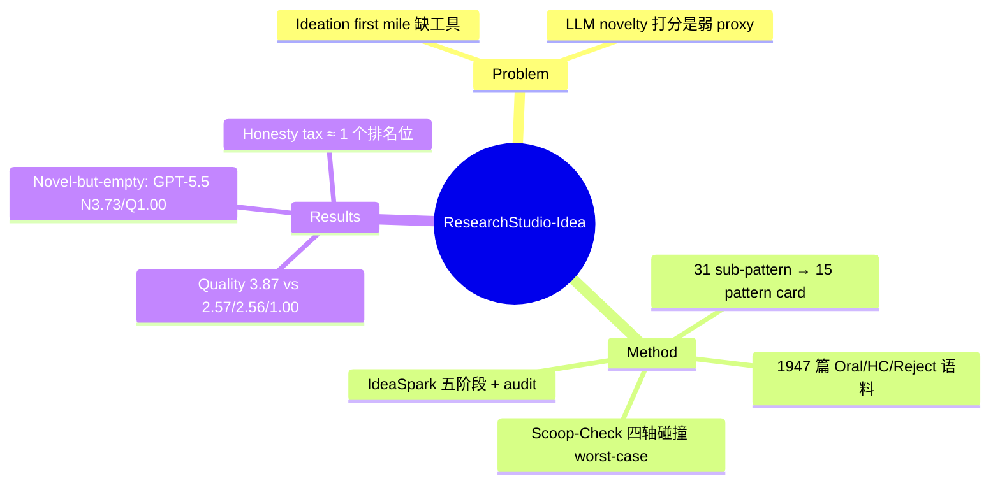

## Summary
从 ICLR/ICML/NeurIPS 2021–2025 的 1,947 篇论文（Oral/高引/Reject 三类 outcome）中聚类归纳出 15 个可复用 ideation pattern，并封装成三个 skill：Paper-Search（多源检索）、Scoop-Check（先行工作碰撞检查）、IdeaSpark（端到端 evidence-grounded ideation 工作流）；自动评审下 IdeaSpark 的 idea 质量大幅领先 bare/generic-skill baseline。

## Problem & Motivation
LLM 让"生成研究方向"变得廉价，但真正的 ideation 需要文献 grounding、bottleneck 诊断、与已有工作的 differentiation、以及风险评估——这是研究的"first mile"。现有两类工作各有缺口：端到端 AI Scientist 系（AI Scientist、Agent Laboratory、AI co-scientist 等）把 ideation 埋在全流程自动化里，产出常被评为 incremental；novelty 评估系（NovBench、RINoBench、OpenNovelty）只做事后打分，且 RINoBench 已证明 LLM 的 novelty 判断可与专家 gold 严重偏离。作者的切入点：会议 outcome（谁被 Oral、谁被高引、谁被拒）里藏着"好方向如何被构造和差异化"的可复用信号，应该被挖出来做成 inference-time skill，而非 acceptance predictor。

## Method
**语料与 pattern 归纳**（论文的实证主体）：
- 1,947 篇 ICLR/ICML/NeurIPS 2021–2025 论文：1,014 Oral、260 高引（HC）、722 Reject（含 non-trivial reviews），经 OpenReview API + Semantic Scholar 收集。
- Pipeline：Claude Sonnet 4.6 抽取 8 字段 innovation signature → domain-agnostic 改写（去掉领域名词、保留机制）→ text-embedding-3-large (3072d) + UMAP (10d) + HDBSCAN (min_cluster_size=10) 聚类 → 31 个 sub-pattern cluster（silhouette 0.584，**902/1891 = 47.7% 论文未入簇**）→ Opus 4.7 单次 pass 合并为 15 个 ideation pattern（作者自认稳定性未验证，预期范围 12–18）。
- 每个 pattern 做成结构化 card：research context、bottleneck 类型、differentiation 策略、precedent、failure mode。
- 验证性分析：Reject-only 重聚类后全部映射回同一 15-pattern 词表——**被拒论文与 Oral 用同一策略空间，分开它们的是执行质量而非策略选择**（如 Audit-and-Pivot pattern 同时占 Oral 份额 19.5% 和 Reject 份额 21.5% 之首）。组合分析：modal composition k=2，双 pattern 论文 Oral 率 58.2% vs 单 pattern 52.7%。

**Scoop-Check**（novelty 碰撞检查）：把 novelty claim 分解为四轴——problem framing、core mechanism、key insight、application domain；live literature search 后 deep-read 最近候选，逐轴匹配，level = 5 − (匹配轴数)，L5 = 无重叠、L1 = 四轴全撞（fully scooped）。**最终 verdict 取所有检索到先行工作的 worst-case（min）**，理由是一篇足够近的论文即可 scoop，取均值会被无关论文稀释。

**IdeaSpark 五阶段工作流**：
- Phase 0 文献 grounding：4 源分工检索（arXiv/OpenReview 管 0–6 月窗口，OpenAlex/Semantic Scholar 管 6–24 月），跨源去重；抓 full-text cache，**Phase 1 硬性 gate 在该 cache 上，防止退化为 abstract-only 推理**；关键词检索外加 meaning-based pass 抓术语漂移的近邻。
- Phase 1 bottleneck 诊断：构建 method-lineage tree，区分 additive gap（叶节点未满足需求）与 subtractive gap（共同祖先的 load-bearing 假设）；祖先节点可标 awareness-only（不可引用）防 fabrication；出口二元——proceed 或带诊断的 stop。
- Phase 2 pattern-guided 生成：pattern 选择与候选生成分离；**频率/饱和度先验被刻意移出生成阶段**（早期设计中会导致输出向高频 pattern 同质化），只作为 audit 上下文。
- Phase 3 quality gauntlet：针对候选机制的窄域碰撞检索 + 四项 corpus-anchored audit（reject 教训、recipe 应用、anti-pattern 实质核查、paper-pointed threat），verdict ∈ {advance, revise, abandon}；**审判与修复分离**，修复步不得改判、不得动 kill-switch 承诺。
- Phase 4 输出 idea card（title/motivation/method 三件套 + 附件里的 falsification、feasibility、differentiation delta）。

## Key Results
- 评测：100 个 seed 取自 ICLR 2026 Oral（后于归纳语料与假定训练数据，做 forward held-out），每 seed 3 轮 blind 评审，随机换 label 消位置偏差。两个自动评审均为 LLM skill：quality 是自研 listwise 排名 skill（A 问题位置 / B 方法深度 / C problem-fit，带 A/C gate，rank 1→4 分），novelty 直接用 Scoop-Check。
- **Quality（1–4）**：IdeaSpark 3.87±0.35（**88/100 seed 排第一**）；Opus-self-gen（generic skill + live retrieval）2.57；Opus-4.8 bare 2.56；GPT-5.5 bare 1.00±0.00（300 次判定全部垫底）。同 backbone 阶梯说明增益来自 corpus-grounded pattern card + 多阶段 audit，而非模型或 retrieval 本身——**generic 结构化 skill 完全不涨分**。
- **Novelty（1–5）**：GPT-5.5 bare 最高 3.73（214/300 落在 L4），IdeaSpark 2.92，Opus-self-gen 2.86，Opus bare 2.32。作者由此提出 **"novel-but-empty" 失效模式**：GPT-5.5 输出近乎同一份 topic-agnostic 模板（"diagnostic-heads + contrastive-pairs + uncertainty-routing"），因为太模糊而无先行工作可撞，被判"新颖"。结论：单轴 novelty 无意义，必须看 quality × novelty 平面；skill 系统集中在 L3（同 framing/domain、不同 mechanism），是"诚实的 novelty 轮廓"。
- **Honesty tax**（5-seed pilot）：保留 IdeaSpark 自我标注的未决设计 flag 会让排名掉约一位、落到 bare Opus 之后；说明评审惩罚诚实披露，故评测前统一剥离。

## Strengths & Weaknesses
**亮点**：
- 含 722 篇 Reject 的对照语料是稀缺资源；"rejects 与 orals 共享策略空间、差在执行"的发现把分类学降级为诊断词表而非生成过滤器，方法论上清醒（且与"频率先验导致同质化、故移出生成阶段"的教训一致——分类是分析输出，不是生成先验）。
- "novel-but-empty" 的定量刻画（GPT-5.5 novelty 3.73 / quality 1.00）是对整个 LLM-ideation 评测领域的有效批评：vague 即"novel"，单轴 novelty 打分是坏 proxy。
- 工程细节可信：full-text hard gate、审判/修复分离、awareness-only 节点防 fabrication、honesty-tax 的受控测量，都是被真实失效逼出来的设计。
- Limitation 节诚实：明确承认 quality judge 结构性偏向 novel mechanism（benchmark/system 类贡献被压分）、只测 idea 阶段、无 acceptance claim。

**局限**：
- **评测闭环自指**：novelty 评审就是自家 Scoop-Check，quality 评审是自研 skill 且运行在 Opus 4.8 上——与 IdeaSpark 的 runtime backbone 相同。GPT-5.5 quality 1.00±0.00（零方差、300 判全垫底）无法排除 cross-family judge bias。作者承认"judges may share blind spots with generators"，但没做 cross-backbone judge 对照。
- **Scoop-Check 自身零验证**：四轴匹配全靠 LLM 判断，无 precision/recall、无误判率、无与人类的 agreement；明明引用了 NovBench（1,684 对）和 RINoBench（1,381 条专家判定）却不在其上测自己的 checker。worst-case-min 规则对检索 recall 极敏感——最近的先行工作没被检索到，level 就虚高；且检索窗口不做 as-of backdating（作者自认）。
- 47.7% 语料未入簇，15-pattern 合并是单次 Opus 4.7 pass；acceptance-bias 分析只覆盖有 cluster-primary 的子集（482/1014 Oral、367/722 Reject）。
- Quality 是四选一强制排名，3.87/4 只说明"几乎总排第一"，是相对量非绝对量；baseline 弱（两个 bare prompt + 一个自动生成的 generic skill），没有与 Scideator、Idea Novelty Checker 等已有 ideation/novelty 系统对比。
- 零人类评审（作者列为 next stage）。

## Mind Map

## Notes
- 与 vault 的 `idea-generate` / `idea-evaluate` skill 直接同构：Phase 3 的 advance/revise/abandon + 审判修复分离、Phase 0 的 full-text hard gate 都值得抄。Scoop-Check 的四轴分解可作为 idea-evaluate 里 novelty 检查的操作化模板——但要记住它未经校准，worst-case-min 依赖检索 recall。
- "Reject 与 Oral 共享策略空间"呼应 memory 里的 claims-not-on-taxonomies 原则：作者把 taxonomy 当 clustering 输出与诊断词表，拒绝当生成先验，这个降级是对的。
- 相关笔记：[[2603-EvoScientist]]、[[2605-AIAutoResearch]]、[[2604-AutoResearchBench]]、[[2605-AutoResearchClaw]]。
