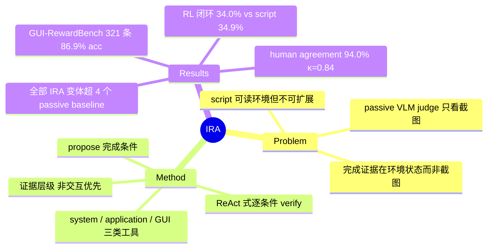

## Summary

GUI 任务评估的核心难点在于完成证据常存在于环境状态（文件、系统配置、应用设置）而非截图中。IRA（Interactive Reward Agent）用 propose-then-verify 框架：先由 VLM 从指令与首尾截图提出任务完成条件，再通过调用 system / application / GUI 三类工具在 post-execution 环境中逐条核验。在自建 GUI-RewardBench（321 条 Ubuntu 轨迹）上达 86.9% accuracy 超过全部 passive VLM evaluator，作为 RL reward 训练 GUI agent 达 34.0% OSWorld 成功率、接近 script reward 的 34.9%。

## Problem & Motivation

自动化 GUI 任务评估的产出可直接作为 test-time scaling 与 post-training 的 reward 信号，但现有两条路各有硬伤：script-based evaluator 能检查文件、配置与环境变量，却需要逐任务人工写脚本，无法扩展到新任务；VLM-based evaluator（WebRL、ZeroGUI、DigiRL、DistRL 等的 judge 组件）可扩展，但只看执行轨迹截图——而大量任务的完成证据（导出的文件内容、应用偏好设置、系统状态）根本不出现在屏幕上。此前测量已量化了 passive judge 的天花板（[[2510-CUARewardBench]] 最佳单模型 ORM precision 82.9%；[[2504-AgentRewardBench]] 无一 judge precision >70%），瓶颈假设是**信息不足而非判断力不足**——IRA 是对这一假设的直接检验。

## Method

**Propose-then-verify 框架**，同一 VLM backbone 承担两个阶段（GPT-5.5 / GPT-5.4 / Qwen3.6-35B-A3B 三种）：

1. **Condition Proposer**：给定任务指令与初始/最终截图，VLM 生成显式的任务完成条件集 {C_i}（Eq. 3）
2. **Interactive Verifier**：对每个条件执行 ReAct 式 reasoning–action–observation 循环（Eqs. 4–6），按证据层级选择工具：
   - **System tools**：`execute_vm_command`、`get_vm_file`、`get_accessibility_tree`
   - **Application tools**：`check_word_file` / `check_excel_file` / `check_ppt_file` 等结构化文档检查
   - **GUI tools**：交互式点击 / 输入导航（兜底手段）
   - 证据层级优先非交互式来源，减少易错且可能扰动状态的 GUI 探索
3. **Judgment**：每条件二值 verdict y_i，聚合为最终 reward（Eq. 8）

**GUI-RewardBench 构建**（Section 4）：用 UI-TARS-1.5 与 EvoCUA-8B 在 Ubuntu 桌面生成轨迹；327 条候选各 replay 三次、剔除 6 条不稳定后得 321 条，覆盖 10 类应用；按证据类型分为 192 条 artifact-verification（生成文件/文档）、89 条 hidden-state（应用偏好、配置）、40 条 visible-state（截图可判）。Ground truth 由任务专属 evaluation script 在每次 live 评估后执行产生。

**RL 应用**（Section 5.7）：用 [[2509-DARTGUI]] 的 RL 方法训练 Qwen3.6-35B-A3B GUI agent，IRA 替代 script 作为 reward source。

## Key Results

- **GUI-RewardBench 主结果**（Table 1）：IRA + GPT-5.5 **86.9% accuracy / 84.9 F1**，GPT-5.4 85.4 / 84.2，Qwen3.6 85.0 / 83.9；passive baseline 中最佳 DistRL 78.8 / 76.7（WebRL 47.0、ZeroGUI 67.6、DigiRL 78.5）。所有 IRA 变体超过所有 passive evaluator，增益 +6.2~9.1pp
- **RL 闭环**（Table 3）：OSWorld 任务上 script reward 34.9% vs IRA reward 34.0% 成功率；在自动生成的无 script 任务上 IRA reward 达 33.5%
- **Human agreement**（Appendix A.8）：100 条自动生成任务上与人类标注一致率 94.0%，Cohen's κ=0.84；分应用看 LibreOffice 最弱（κ=0.62，n=35），VSCode / GIMP κ=1.00
- **Ablation**（Figure 6）：GUI-only 交互（去掉 system/application tools）使 Qwen3.6 precision 升但 recall 大降——"找不到证据"被误判为"任务失败"；full IRA 改善所有三个 backbone 的 precision–recall trade-off
- **成本画像**（Table 2 / Table 6）：GPT-5.5 平均 2.34 次 tool call/任务（median 14.9K tokens），Qwen3.6 7.31 次（25.9K tokens）；GPT 系偏 command-oriented 检查，Qwen 更依赖 GUI 探索
- **失败分析**（Appendix A.11）：主要错误源于 misaligned completion conditions——granularity 不当、过度字面化解释、遗漏 persistence 要求；即瓶颈在 propose 阶段而非 verify 阶段

## Evidence Ledger

| Claim ID | Claim | Type | Source locator | Evidence excerpt | Status |
|:--|:--|:--|:--|:--|:--|
| C1 | IRA (GPT-5.5) 在 GUI-RewardBench 上 86.9% accuracy，为全场最佳 | number | Table 1 / Abstract | "IRA achieves 86.9% accuracy on GUI-RewardBench, outperforming existing evaluator baselines" | source-verified |
| C2 | GUI-RewardBench 含 321 条轨迹、10 类 Ubuntu 应用 | number | Abstract / Sec 4 | "a benchmark of 321 GUI task trajectories spanning 10 Ubuntu desktop application categories" | source-verified |
| C3 | 三个 IRA 变体全部超过四个 passive baseline；最佳 passive DistRL 78.8% | comparison | Table 1 | "WebRL 47.0%, ZeroGUI 67.6%, DigiRL 78.5%, DistRL 78.8%; IRA 85.0/85.4/86.9%" | source-verified |
| C4 | IRA reward RL 达 34.0% OSWorld，接近 script reward 的 34.9% | number | Table 3 | "Replacing script rewards with IRA on the same OSWorld tasks yields 34.0% success, comparable to 34.9%" | source-verified |
| C5 | 100 条生成任务上 human agreement 94.0%、κ=0.84 | number | Sec A.8 | "IRA agrees with human labels on 94.0% of the trajectories, yielding Cohen's κ=0.84" | source-verified |
| C6 | 组成：192 artifact / 89 hidden-state / 40 visible-state；327 候选三次 replay 剔 6 条 | benchmark-setting | Sec 4 | "sample 327 candidates, replay them three times, and remove 6 unstable ones" | source-verified |
| C7 | GPT-5.5 平均 2.34 tool calls/任务（14.9K median tokens），Qwen3.6 7.31（25.9K） | number | Table 6 (A.4) / Table 2 | "fewer tool calls per task (2.34 and 2.53) than Qwen3.6 (7.31)" | source-verified |
| C8 | GUI-only ablation 令 Qwen3.6 recall 大降；full IRA 改善所有 backbone 的 precision–recall trade-off | causal-mechanism | Fig 6 + ablation text | "its precision improves, but its recall drops sharply... improves the precision–recall trade-off across all three backbones" | source-verified |
| C9 | 主要错误来自 misaligned completion conditions（granularity / 字面化 / persistence） | causal-mechanism | Appendix A.11 | "errors mainly arise from misaligned completion conditions, including incorrect granularity, overly literal interpretations, and missed persistence requirements" | source-verified |
| C10 | Human-IRA 分歧集中于 LibreOffice（κ=0.62）；VSCode / GIMP κ=1.00 | number | Table 9 (A.8) | "LibreOffice (n=35) 85.7%, κ=0.62; VSCode κ=1.00; GIMP κ=1.00" | source-verified |
| C11 | 在无 script 的自动生成任务上用 IRA reward 做 RL，达 33.5% OSWorld 成功率 | number | Table 3 / Sec 5.7 | "training on generated out-of-distribution (OOD) tasks with IRA achieves 33.5%, only 1.4 percentage points below the script-based setting" | source-verified |

## Strengths & Weaknesses

**亮点**：
- **问题定位准，检验的是领域的真瓶颈**：passive VLM judge 的可靠性上限已被 [[2510-CUARewardBench]]（82.9%）与 [[2504-AgentRewardBench]]（<70%）量化，script verifier 又不可扩展。IRA 走第三条路——给 judge 环境访问权，把 script 的 evidence access 与 VLM 的 scalability 结合，直接检验"passive judge 的瓶颈是信息不足而非判断力不足"这一假设
- **分解可审计**：per-condition 二值 verdict 让判断可逐条溯源，比端到端整体判断更 debuggable，失败分析（A.11）也因此能精确定位到 propose 阶段
- **做了 RL 闭环验证**：34.0% vs 34.9% 说明 IRA 可实际替代 script reward——这正是 CUARewardBench 指出 UPE 缺失的一环；33.5%（无 script 的生成任务）支持可扩展性主张
- Benchmark 有 replay 稳定性协议（三次重放筛选），比一次性采集的评测集更可信

**局限**：
- **Ground truth 的循环依赖**：GUI-RewardBench 标签由任务专属 script 产生，benchmark 天然只覆盖"script 可判"的任务；而 IRA 的核心卖点恰是 script 覆盖不了的任务，这部分能力无法用该 benchmark 直接度量。Human agreement 实验（94.0%）部分补位，但仅 100 条生成任务
- **对比条件不对等——信息优势而非判断力优势**：IRA 拥有 post-execution 环境访问，passive baseline 只有截图。+8.1pp（vs DistRL）应读作"环境访问的价值"，不能读作"IRA 的 VLM 更会判断"。这是贡献本身，但结论表述需要这个边界
- **适用边界**：需要 live post-execution 环境（VM）——适合训练场景，不适用纯离线轨迹评估；评估器自身与环境交互存在状态污染风险，evidence hierarchy（非交互优先）是缓解设计但残余风险未量化
- **瓶颈转移到上游**：主要错误在 condition proposal（A.11），propose-then-verify 把难题从"看图判断"转成"任务语义形式化"，后者错了 verify 再准也没用
- 规模与范围：321 条、Ubuntu-only、replay-stable 筛选自带偏置；作者自认 live 环境 UI drift、异步行为不可完全消除
- IRA reward RL 结果（34.0%）略低于 script（34.9%），是"接近替代"而非超越

**影响**：把"RM-as-verifier vs script-as-verifier"之争推进为 **agent-as-verifier**——reward 评估本身 agent 化。与 [[2606-ARMThinker]]（通用多模态 tool-use RM）、[[2607-SeekJudge]]（CUA RL reward framework）构成同期收敛信号：2026 年中 reward 建模的共识正从"训更强的 judge model"转向"给 judge 工具与环境访问权"。

## Mind Map

## Notes

- 与 [[2607-SeekJudge]] 对读值得专门做：同期同题（CUA RL reward），路线差异待比较
- RL 实验复用 [[2509-DARTGUI]] 的训练方法；benchmark 轨迹由 UI-TARS-1.5 与 [[2607-EvoCUA15]] 系 EvoCUA-8B 生成
- 与 [[2500-GuiPraProcessReward]] 的关系：GUI-PRA 是 process（step-level）reward agent，IRA 是 outcome（post-execution）reward agent，二者在"reward agent 化"谱系上互补
- 开放问题：hidden-state 任务中 verifier 的 GUI 探索是否会改变被评估状态（如打开偏好面板本身写入配置）？paper 的 evidence hierarchy 缓解但未报告污染率
- 开放问题：condition proposal 的失败模式（granularity / persistence）提示可以在 propose 阶段引入任务模板先验或 self-consistency，是明确的 follow-up 空间
