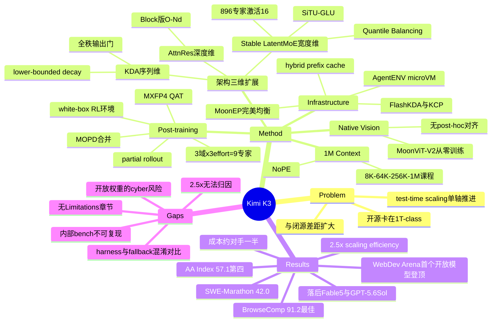

## Summary

Kimi K3 是首个开放权重的 3T-class 模型：2.8T 总参数 / 104B 激活参数的 native multimodal MoE，1M-token context，用 Kimi Delta Attention (KDA) + Attention Residuals (AttnRes) + Stable LatentMoE 三条"信息流"改造分别扩展序列、深度、宽度维度，相对 Kimi K2 取得约 2.5× 的整体 scaling efficiency 提升。Post-training 在 general / general-agent / coding-agent 三个域 × low/high/max 三档 reasoning effort 上做 RL 得到 9 个专家模型，再用 Multi-Teacher On-Policy Distillation 合并回单一模型。整体性能落后 Claude Fable 5 与 GPT-5.6 Sol，但在评测套件内稳定领先其余开源与闭源模型。

## Problem & Motivation

作者的问题定位很明确：test-time scaling（reasoning RL、agent 并行）这条轴上开源社区推进很快，但 **pre-training scale 这条轴几乎停滞**——近期开源模型大多停留在 1T-class 参数量。当越来越精巧的 reasoning / agentic RL 方法被施加到规模相近的预训练底座上时，开源进展会趋同收敛，而与最强闭源系统的差距继续拉大。

因此 K3 的选择是**两条轴同时推到前沿**：把预训练底座推到 3T-class，同时在 1M context 下 scale RL、reasoning effort 与 long-horizon 交互。这不是一个方法论问题，而是一个"开源生态该把算力花在哪"的战略判断——论文的隐含假设是 post-training 的收益上限受预训练底座封顶。

## Method

### 架构：三个维度的信息流扩展

架构围绕 token / depth / width 三个混合方向组织（Fig. 2）：

- **序列维度 — Hybrid Attention**：每个 block 为 3 层 KDA + 1 层 Gated MLA（3:1），backbone 末尾额外加一层 Gated MLA 保证最后一层是 global attention。KDA 是带 channel-wise forget gate 的 delta-rule 线性注意力。K3 相对 Kimi Linear 的两处改动：(1) **lower-bounded decay**——把 log-decay 的映射从无界的 negative-Softplus 换成 scaled sigmoid $g=g_{\min}\text{Sigmoid}(e^A z)$，取 $g_{\min}=-5$，使 16-token tile 上的累积 log-decay 落在 $(-80,0)$、倒数 rescaling 因子留在 BF16 动态范围内，于是**对角 tile 也能走 dense Tensor Core matmul**，消掉了原本 intra-chunk 的 position-pair 瓶颈；(2) 输出门从 low-rank 改为 input-dependent 全秩投影。
- **深度维度 — Attention Residuals**：把 Transformer "用 attention 取代 recurrence" 的方法论搬到深度上——每层用可学习的 pseudo-query 对所有前置层输出做 softmax attention，而非均匀累加。为控制 $O(Ld)$ 显存/跨 stage 通信，实际用 **Block AttnRes**：L 层切成 N 个 block，块内求和、块间做 full attention，开销降到 $O(Nd)$。K3 用 8 个 block、每块 12 层。
- **宽度维度 — Stable LatentMoE**：shared expert 走全宽路径，routed expert 在压缩的 latent 空间（3584 = 0.5×hidden）里工作，从而把 routed expert 池扩到 896、每 token 激活 16（sparsity 56）。极端稀疏引出两个失效模式，对应三个组件：aggregation 后加 RMSNorm + **SiTU-GLU**（对 SwiGLU 的 gate 与 up 两支都做 $\beta\tanh(x/\beta)$ softcap，$\beta_1{=}4,\beta_2{=}25$）抑制激活爆炸；**Quantile Balancing** 用 router-score 分位数直接解出每个 expert 的 bias（配合直方图估计做全局 batch 分位数），替代 DeepSeek-V3 的固定步长 sign 更新。

**Native vision**：MoonViT-V2 是 27 层、约 401M 参数的 ViT，**完全从零开始用 next-token prediction 训练**，放弃了 SigLIP 对比学习初始化。理由是稳定性——SigLIP-init 的 MoonViT-3D 梯度范数持续更高且频繁 spike。文本与视觉从训练第一步就联合优化，无 post-hoc 对齐阶段。优化器为 Per-Head Muon（按 head 分块做 Newton–Schulz 正交化）。

**长上下文**：全程 NoPE，位置信息隐式来自 KDA 的 recurrent gating/decay，因此外推到 1M 不需要 RoPE rescale 或插值。四阶段课程：预训练 8K→64K，cooldown 阶段 256K→1M。

### Post-training：域×effort 的专家矩阵再蒸馏

三阶段：SFT 冷启动 → 分域分 effort 做 RL → MOPD 合并。

RL 的三个域各覆盖大量子任务；reasoning effort 通过 **per-problem token budget 惩罚**实现：给每个问题一个由 cold-start 模型估的初始预算 $b_0(x)$，超过 $\tau b_0(x)$ 的轨迹 reward 直接置 $-1$，再按课程 anneal $\tau$ 得到 max/high/low 三档。3 域 × 3 档 = 9 个 teacher，MOPD 用 per-token 的 teacher/student log-ratio（clip 后）作为稠密 reward 把它们蒸回一个 student。为对付 long-horizon 的长尾延迟，rollout 采用 **partial rollout**：一轮里只要 $\lambda$ 比例轨迹完成就暂停生成，未完成的排队到下一轮续跑——代价是极端 off-policy，靠 per-token 正则容忍。非可验证任务用 Agentic GRM（强制"读产出→生成 rubric→打分→记 scorepad"协议 + 长度预算反 verbosity hacking）。

**环境设计**是这篇报告里信息量较高的部分：统一 white-box RL environment 把 agent harness 拆成可组合模块（工具接口、system prompt、context 管理、skill、memory、subagent），可实例化 Kimi Code / Claude Code / Codex / OpenClaw / Hermes 等主流 harness，训练时动态换配置以防过拟合单一 harness；knowledge-graph-guided task synthesis 用 agent 递归扩展一个 DAG 概念图来控制任务粒度与覆盖；kernel optimization 任务带 hacking-detection（惩罚 CUDA graph replay、input caching、降精度）；personal assistant 任务在 Gmail/Notion/Slack/Canvas 的 mock 实现上跑多日、跨应用、数千次 tool call 的 living environment；Autonomous Execution Tasks 只给目标+约束+verifier 接口，reward 来自 verifier 对最终环境状态的判定，并用 public/hidden verifier 配对防 hacking。

**Deployment-aware**：整个 post-training（含 SFT 与 RL）全程 MXFP4 权重 / MXFP8 激活的 QAT，rollout 与 training 共享量化方案以消除 train–inference mismatch；MTP 层被 fine-tune 成 EAGLE-3 draft model，直接优化 acceptance rate 的 LK loss 而非 KL 代理。

### Infrastructure

四块与架构耦合的系统工作：(1) FlashKDA 把 intra-chunk 计算与跨 chunk 状态传播重叠，并设计 **KDA Context Parallelism**——KDA 的 delta rule 会把 token-dependent 矩阵 $M_t$ 作用在入态上，无法像 vanilla linear attention 那样直接求和，KCP 把每段效果分解为"累积转移"+"从零起算的局部态"两个可本地计算量，用一次固定大小 all-gather + prefix scan 复原；(2) **MoonEP** 用动态冗余专家实现完美负载均衡，并证明每 rank 至多 $E/R$ 个冗余专家就一定存在可行方案且该界基本紧——完美均衡使计算 shape 静态可知，消除逐层 host 同步，通信 buffer 从 $S\times K\times R$ 降到 $S\times K$；(3) 1M agentic RL 用 co-located 训练 + 外部 CPU DRAM KV cache pool + auto-throttling 调度 + AgentENV microVM sandbox（增量 checkpoint、pause/resume/fork/snapshot）；(4) 服务端把定长 KDA state 和逐 token 的 MLA KV **打包进同一个 paged pool**，并把 prefix hash 粒度（512-token hash block）与物理块粒度（1024–6144 token）解耦，使任意 512-token 边界都可命中。

## Key Results

**公开 benchmark（Table 2，全部 max reasoning effort）**：Kimi K3 整体紧随 Claude Fable 5 与 GPT-5.6 Sol，稳定领先 Claude Opus 4.8 / GPT-5.5 / GLM-5.2。

| 类别 | Kimi K3 | 对比 |
|:--|:--|:--|
| GPQA Diamond | 93.5 | GPT-5.6 Sol 94.1，Fable 5 92.6 |
| HLE-Full (无工具 / 有工具) | 43.5 / 56.0 | Fable 5 53.3 / 63.0，均落后 |
| CritPt | 23.4 | Fable 5 28.6，GPT-5.6 Sol 32.3，GPT-5.5 27.1 |
| DeepSWE | 67.5 | GPT-5.6 Sol 73.0，Fable 5 70.0 |
| ProgramBench | 77.8 | 最佳（GPT-5.6 Sol 77.6） |
| Terminal-Bench 2.1 | 88.3 | GPT-5.6 Sol 88.8 |
| FrontierSWE | 81.2 | 第二，Fable 5 86.6 |
| SWE-Marathon | 42.0 | 领先 Fable 5 (35.0) 7 分 |
| BrowseComp | 91.2 | 最佳（GPT-5.6 Sol 90.4） |

Agentic 方向拿下多个第一：BrowseComp 91.2、DeepSearchQA 95.0 F1、ResearchRubrics 76.2、MCPMark-Verified 94.5、AutomationBench 30.8、τ³-Banking 33.4、Harvey Lab-AA 94.6。主要失守的是 Elo 制的 knowledge-work 套件（GDPval-AA v2 第三 1686、AA-Briefcase 第二 1548）以及更难的 computer-use 套件（OSWorld 2.0 58.3 vs Fable 5 66.1）。

**第三方独立评测**：Artificial Analysis Intelligence Index v4.1 = 57.1，580 模型中排第 4（Fable 5 59.9、GPT-5.6 Sol 58.9）；Vals Index 74.7，39 模型中第 2；**WebDev Arena 1,678 Elo 排第 1/99，为首个登顶该榜的开放模型**；Text Arena 第 8/200，Agent Arena 第 4/37。

**成本效率**：BrowseComp 上以 $2.03/task 拿到最高分，约为 GPT-5.6 Sol 的一半、比 Claude 系列最大 effort 便宜一个数量级；Kimi Code Bench 2.0 上落后 Fable 5 4.0 分但只花其 38% 成本。

**内部评测（Table 3）**：Swarm Bench 76.3 与 Deep Research Bench 90.0 明显领先；Kimi Webdev Bench 上盲评专家以 **+31.0 的 Win−Lose 净胜**偏好 K3 over Claude Opus 4.8，3D/WebGL/Shader 子类高达 +59.1。落后的是 Agent Behavior Bench（65.0 vs GPT-5.6 Sol 76.4）、MIRA Bench、24/7 ClawBench 2.0、Agentic Vision Bench、KWV Bench。

**Cyber 能力**：Tier 1 漏洞发现中，经人工复核的发现约 70% 被确认为真实漏洞，含 6 个项目里的 16 个此前未知漏洞（含一个 Linux kernel 远程可触发堆越界写、一个 RDMA 子系统的 Dirty-COW 类提权原语）；Tier 2 端到端 exploit 开发解出 14/36（38.9%）vs GLM-5.2 8/36（22.2%），但 10 个成功来自 user-space 轨，kernel 轨两个模型都解不出四分之三。UK AISI 与 NIST CAISI 的联合独立评估结论一致：ExploitBench 32% vs GLM-5.2 24%，但在 41 个任务上实现任意代码执行 **0 次**。

**Case study**：GPU kernel 优化上把 AttnRes 延迟从 283.6 ms 降到 114.4 ms、DSA/KDA 运行时分别降 55.1%/73.6%，与带 fallback 的 Fable 5 持平而显著优于 Opus 4.8 / GPT-5.6 Sol / GPT-5.5；单次 48 小时自主运行完成一个推理芯片原型（4 mm² 内 100 MHz 收敛时序，RTL 仿真解码吞吐 >8,700 tokens/s）；还自建了 MiniTriton 编译器。

**Scaling law 侧证**：在各自独立搜过最优超参的前提下，cosine decay 的最终 loss 一致优于 WSD——作者指出此前"WSD 匹配或超过 cosine"的报告可能来自共享超参的不公平比较。

## Evidence Ledger

| Claim ID | Claim | Type | Source locator | Evidence excerpt | Status |
|:--|:--|:--|:--|:--|:--|
| C1 | 2.8T 总参 / 104B 激活 / 1M context 的 MoE | number | p.1 Abstract; §1 | "a 2.8T parameter Mixture-of-Experts model with 104 billion activated parameters ... 1-million-token context window" | source-verified |
| C2 | 896 routed experts、每 token 激活 16（sparsity 56）、每层 2 个 shared expert | number | §2.3, p.6 | "896 routed experts with 16 active experts per token, corresponding to a sparsity of 56" | source-verified |
| C3 | 架构+数据+训练改进合计带来约 2.5× overall scaling efficiency 提升，由 held-out OOD 验证集上的拟合 scaling-law 曲线得出 | number | §3.2, p.10; Fig. 7 | "Evaluated on held-out OOD validation data, the scaling law curves ... approximately 2.5× gain in overall scaling efficiency" | source-verified |
| C4 | K2→K3：61→93 层、1.04T→2.78T 总参、32.6B→104.2B 激活、384→896 expert、8→16 激活、128K→1M 训练 context、61 MLA→69 KDA+24 MLA | number | Table 1, p.11 | "#Layers 61 93 ... Total Parameters 1.04T 2.78T ... 61 MLA / 69 KDA + 24 MLA" | source-verified |
| C5 | 每 block 3 KDA + 1 Gated MLA；MLA 全用 NoPE，因而无需 RoPE rescale 即可外推到 1M | causal-mechanism | §2.1, §2.1.2, §3.4 | "extrapolates directly to 1M-token contexts without any positional-encoding modification, such as RoPE rescaling" | source-verified |
| C6 | MoonViT-V2（27 层 / ~401M）完全从零用 next-token prediction 训练，视觉评测上与 SigLIP-init baseline 持平 | comparison | §2.4, p.9; Table 1 | "MoonViT-V2 matches the SigLIP-initialized baseline across vision evaluations" | source-verified |
| C7 | 弃用 SigLIP 初始化的主要理由是训练稳定性（SigLIP-init 梯度范数持续更高且频繁 spike） | causal-mechanism | §2.4, p.9; Fig. 6 | "the SigLIP-initialized MoonViT-3D shows persistently higher gradient norms with frequent spikes" | source-verified |
| C8 | 3 RL 域 × 3 effort 档 = 9 个专家模型，经 MOPD 合并为单一模型 | benchmark-setting | §4.1.2–4.1.3, p.12–13 | "Crossing these three domain experts with three reasoning effort levels ... yields a total of nine expert models" | source-verified |
| C9 | MXFP4 权重 / MXFP8 激活的 QAT 贯穿整个 post-training（含 SFT 与 RL），rollout 与训练共享量化方案 | number | §4.1.4, p.14 | "QAT throughout the entire post-training stage, covering both SFT and RL ... rollout and training share the same quantization scheme" | source-verified |
| C10 | Table 2 主表分数：GPQA 93.5、HLE 43.5/56.0、CritPt 23.4、DeepSWE 67.5、ProgramBench 77.8、TB2.1 88.3、FrontierSWE 81.2、SWE-Marathon 42.0、BrowseComp 91.2 | number | Table 2, p.27 | "GPQA Diamond 93.5 ... FrontierSWE 81.2 ... BrowseComp 91.2" | source-verified |
| C11 | SWE-Marathon 领先 Fable 5 7 分；FrontierSWE 第二（86.6 之后）；TB2.1 88.3 接近 GPT-5.6 Sol 88.8 | comparison | §6.1.4, p.28 | "it scores 42.0%, 7 points ahead of Claude Fable 5 ... nearly matches GPT-5.6 Sol (88.3% vs. 88.8%)" | source-verified |
| C12 | BrowseComp 91.2 用了 300K 触发的 context compaction；用满 1M context 且不做 context 管理时为 90.4% | benchmark-setting | §6.1.3, p.26 | "context-compaction strategy triggered at 300K tokens; evaluated with the full 1M-token context window ... achieves 90.4%" | source-verified |
| C13 | 整体落后 Fable 5 与 GPT-5.6 Sol、稳定领先 Opus 4.8 / GPT-5.5 / GLM-5.2；Fable 5 结果含 fallback，GPT-5.6 Sol 结果含 cyberguards | comparison | §6.1.2, §6.1.4, p.26 | "closely trails the strongest proprietary models ... while consistently outperforming Claude Opus 4.8, GPT-5.5, and GLM-5.2" | source-verified |
| C14 | Artificial Analysis Intelligence Index v4.1 = 57.1，580 模型中第 4（Fable 5 59.9 / GPT-5.6 Sol 58.9） | number | §6.3, p.31; Table 5 | "Intelligence Index v4.1 of 57.1, ranking fourth of 580 models" | source-verified |
| C15 | WebDev Arena 1,678 Elo 第 1/99，为首个登顶该榜的开放模型 | sota-novelty | §6.3, p.31; Table 5 | "first of 99 models on the WebDev Arena (1,678 Elo ...) — the first open model to top this leaderboard" | source-verified |
| C16 | BrowseComp 最高分 $2.03/task、约 GPT-5.6 Sol 一半成本；KCB 2.0 落后 Fable 5 4.0 分但只花 38% 成本 | number | §6.4, p.31–32 | "the best score (91.2%) at $2.03 per task — half the cost of GPT-5.6 Sol"; "4.0 points behind Claude Fable 5 at 38% of its cost" | source-verified |
| C17 | Kimi Webdev Bench 盲评：整体 Win−Lose +31.0，3D/WebGL/Shader 子类 +59.1 | number | Table 4, p.29 | "3D / WebGL / Shader ... +59.1% ... Overall 58.6% 13.8% 27.6% +31.0%" | source-verified |
| C18 | Tier 2 exploit：14/36 (38.9%) vs GLM-5.2 8/36 (22.2%)，14 个成功中 10 个来自 user-space 轨 | number | §6.2.2, p.30 | "solving 14 of 36 tasks (38.9%) versus 8 of 36 (22.2%) for GLM-5.2 ... 10 of the 14 come from the user-space track" | source-verified |
| C19 | UK AISI + NIST CAISI 联合评估：ExploitBench 32% vs GLM-5.2 24%，但 41 个任务中任意代码执行 0 次 | number | §6.2.2, p.30 | "32% vs. 24% on ExploitBench ... achieving arbitrary code execution on 0 of 41 tasks" | source-verified |
| C20 | MoonEP 证明每 rank 至多 E/R 个冗余专家即保证存在均衡方案，且该界基本紧 | causal-mechanism | §5.2.1, p.19; App. E | "We prove that a balanced plan always exists with at most E/R redundant experts per rank and that this bound is essentially tight" | source-verified |
| C21 | AgentENV：checkpoint/resume 低至 133 ms / 49 ms，内存 overcommit 至 6.5×；训练与评测共创建 51,219,741 个 sandbox、1,505,678 个镜像 | number | §5.3.2, p.22 | "checkpoint and resume latencies as low as 133 ms and 49 ms"; "51,219,741 sandboxes across 1,505,678 images" | source-verified |
| C22 | 全量权重公开于 huggingface.co/moonshotai/Kimi-K3；MoonEP / AgentENV / FlashKDA / MiniTriton / nano-kpu 均给出 GitHub 链接 | license-code | p.1 fn.1; fn.3–6; ref [14] | "https://huggingface.co/moonshotai/Kimi-K3"; "github.com/MoonshotAI/MoonEP" | source-verified |
| C23 | Kernel 优化：AttnRes 283.6→114.4 ms，DSA/KDA 分别降 55.1%/73.6%；与带 fallback 的 Fable 5 持平并显著优于 Opus 4.8 / GPT-5.6 Sol / GPT-5.5 | number | §7, p.33 | "reducing AttnRes latency from 283.6 ms to 114.4 ms, cutting DSA and KDA runtime by 55.1% and 73.6%" | source-verified |
| C24 | 单次 48 小时自主运行完成推理芯片原型：4 mm² 内 100 MHz 收敛，RTL 仿真解码 >8,700 tokens/s | number | §7, p.33 | "In a single 48-hour autonomous run ... closes timing at 100 MHz and achieves an RTL-simulated decode throughput of over 8,700 tokens/s" | source-verified |
| C25 | 四阶段 context 课程：预训练 8K→64K，cooldown 256K→1M | number | §3.4, p.12 | "The window grows from 8K to 64K tokens during pre-training, and from 256K to 1M tokens during the cooldown phase" | source-verified |
| C26 | 报告无独立 Limitations 章节，且未披露预训练 token 总量、总训练 FLOPs 或 GPU-hours | number | 全文 §1–8 + App. A–F | 章节列表止于 "8 Conclusion"，全文未出现 token 总量 / 总 FLOPs / GPU-hour 数字 | source-verified |
| C27 | 各自独立搜过最优超参后，cosine decay 的最终 loss 一致优于 WSD | comparison | §3.2, p.10 | "Under their respective optimal hyperparameter settings, cosine decay consistently achieves a lower final loss than WSD" | source-verified |
| C28 | 内部评测领先 Swarm Bench (76.3) 与 Deep Research Bench (90.0)，落后 Agent Behavior Bench / MIRA Bench / 24-7 ClawBench 2.0 / Agentic Vision Bench / KWV Bench | comparison | Table 3, p.29; §6.2.1, p.30 | "leads Swarm Bench (76.3) and Deep Research Bench (90.0) by clear margins"; "trails the leaders mainly on Agent Behavior Bench, MIRA Bench ..." | source-verified |

> 全部 28 条高风险 claim 均由独立 verifier 定位到原文并判为 source-verified。这只表示"原文确实包含该数字/断言"，不表示结果已被独立复现——除第三方榜单（Artificial Analysis / Vals AI / LMArena / UK AISI+CAISI）外，主表与内部评测均为作者自测。

## Strengths & Weaknesses

**亮点**

1. **问题选得对**：作者点出的"开源在 test-time scaling 轴狂奔、在 pre-training 轴停在 1T-class"是一个真实且少有人正面回应的结构性问题。把底座推到 3T-class 并开放权重，本身就改变了开源生态的可用上限——WebDev Arena 首个登顶的开放模型是这个判断的直接兑现。
2. **KDA 的 lower-bounded decay 是"约束换算力"的干净例子**：把 log-decay 从无界改成有界 sigmoid 只是一行公式改动，却把倒数 rescaling 因子锁进 BF16 动态范围，从而让对角 tile 也能吃 Tensor Core，直接消掉 intra-chunk 主瓶颈。这属于 simple & scalable 的那类改动，可迁移性高。
3. **AttnRes 的抽象值得单独记**：Transformer 用 attention 替代了序列维的 recurrence，但深度维仍是"逐层均匀累加"的 RNN——把同一方法论搬到 depth 上是一个干净的类比，Block 版把开销从 $O(Ld)$ 压到 $O(Nd)$ 也让它在 3T 规模可用。
4. **系统贡献可复用且已开源**：MoonEP 的 $E/R$ 冗余专家上界（存在性 + 基本紧）把"负载均衡"从启发式调参变成有保证的规划问题，静态 shape 顺带消除逐层 host 同步；KDA Context Parallelism 解决了 delta-rule 无法像 vanilla linear attention 那样直接求和的核心障碍；hybrid KDA–MLA 的 prefix cache 把 hash 粒度与物理块粒度解耦，是任何 linear/full 混合架构上线都会撞到的问题。
5. **RL 环境设计的信息量高于算法**：统一 white-box harness（训练时动态换 harness 配置防过拟合单一 scaffold）、AET 的 public/hidden verifier 配对、kernel 任务的 hacking-detection（显式惩罚 CUDA graph replay / input caching / 降精度）——这些是把 "long-horizon agent 怎么训" 落到实处的具体机制，比"我们做了大规模 agentic RL"这类表述有用得多。
6. **cost-efficiency 被当作一等指标**：BrowseComp 上最高分且成本约为 GPT-5.6 Sol 一半，是比单纯分数更有说服力的开源价值论证。

**局限与需要打折扣的地方**

1. **2.5× scaling efficiency 无法归因，也无法外部审计**。论文自己说的是"architectural, data, and training improvements 合计"带来 2.5×——即 KDA / AttnRes / LatentMoE / 数据配方 / 超参重搜是**同时变的**，没有任何逐组件 ablation 把这 2.5× 拆开。更关键的是全文不披露预训练 token 总量、总 FLOPs 或 GPU-hours（C26），Fig. 7 的两条拟合曲线也没给拟合区间与拟合方法细节。这意味着"2.5×"目前只能作为厂商自报的聚合指标看待，无法被第三方核验，也无法用来指导别人的架构选择。
2. **主表的可比性有明显裂缝**。(a) 每个模型跑各自的 harness（K3 用 Kimi Code、GPT 用 Codex、Claude 用 Claude Code），harness 与模型的耦合无法拆开；(b) Fable 5 的成绩"含 fallback"，而 SWE-Marathon 上 Fable 5 在 **35% 的任务上触发了 fallback**——"领先 7 分"这条最亮眼的 coding 结论建立在一个对手明显受损的对照上；(c) SWE-Marathon 用的是作者自己按 H20 重标定的分支（非官方 v1.1），PostTrainBench 也从 H100 换到 H20；(d) BrowseComp 的 91.2 用了 300K context compaction，而论文的卖点之一恰是 1M context——不做 context 管理时反而降到 90.4（C12），这个对比作者放在配置说明里而非正文，读者容易漏掉。这些不是造假，但把"consistently outperforms"这句话的强度打了折。
3. **内部 benchmark 承担了过多结论**。Kimi Code Bench 2.0、Swarm Bench、Deep Research Bench、Kimi Webdev Bench 等全部是 in-house 且"frequently refreshed"，既不可复现也存在训练-评测同源的风险（RL 环境里就有 web development、deep research、personal assistant 任务，与这些内部 bench 的分布高度重合）。Webdev Bench 的 +31.0 盲评净胜是 vs Opus 4.8 而非 vs Fable 5，选择性也值得注意。
4. **薄弱面被诚实报告但未被分析**。CritPt 23.4 明显落后（GPT-5.6 Sol 32.3），HLE 有无工具都落后，Agent Behavior Bench 65.0 vs 76.4 差距不小。论文只写"research-level reasoning remains a key direction"，没有 failure mode 分析——而 cyber 那节反倒给出了四类失败模式（收尾阶段无法从已有 primitive 完成 exploit chain、mitigation 下策略选择差、陷入无效 debug 循环、提交前验证不足）。这四条其实是通用的 long-horizon agent 失效模式，值得反过来用到 coding/agentic 的分析上，作者没做这个连接。
5. **开放权重 + 已验证的 0-day 发现能力，是这篇报告最该展开却最短的部分**。模型在真实代码库上找出 16 个此前未知漏洞（含 Linux kernel 远程堆越界写与 RDMA 提权原语），论文对此只加了一句"我们把评测视为能力下界"。作者选择公布 Anthropic/OpenAI 模型拒答从而无法比较的事实、并用 GLM-5.2 作唯一基线，回避了"权重开放后这部分能力不可撤回"这一核心问题。没有 Limitations 章节、没有 release 决策论证，是这份技术报告在 responsible-release 维度的实质性缺口。
6. **无 Limitations 章节**这件事本身值得记一笔：47 页里 case study 占了完整一节（含"两小时复现 I–Love–Q 关系"、"48 小时设计推理芯片"这类高冲击但零对照的展示），却没有一节讨论方法边界。case study 的时间对比（"研究者通常需一到两周"）没有对照实验支撑，属于宣传性叙述而非证据。

**对领域的影响判断**

- 最可能被后续工作直接采纳的是 **hybrid linear-attention + NoPE 在 1M context 上的可行性证据**：它给出了一个 3T 规模的存在性证明，说明长上下文不必靠 RoPE 外推补丁。
- **AttnRes（深度维 attention）**如果在其他团队复现有效，会是一个比 KDA 更通用的结构改动，值得单独追一篇。
- 系统侧的 MoonEP / KCP / hybrid prefix cache 有较高的直接复用价值，属于"论文贡献主要在实现里"的类型，值得后续做 repo-digest。
- 对我们关心的 GUI/computer-use 方向：K3 在 OSWorld-Verified 84.8 已接近 Fable 5（85.0），但在更难的 OSWorld 2.0 上 58.3 vs 66.1 差距扩大——说明开放模型在"简单可验证的 computer-use"上已追平，瓶颈转移到长程、状态依赖强的真实桌面任务。

## Mind Map

## Notes

- **arXiv 版本晚于模型发布**：参考文献 [60] 指向 2026-07-16 的官方 blog，而 arXiv v1 提交于 07-27，说明权重先于报告发布约 11 天。第三方评测（Artificial Analysis / Vals AI / LMArena / UK AISI）截止 07-23~07-24，是发布后才积累的。
- **值得另起一轮 repo-digest 的代码**：MoonEP (`github.com/MoonshotAI/MoonEP`)、AgentENV (`github.com/kvcache-ai/AgentENV`)、FlashKDA (`github.com/MoonshotAI/FlashKDA`)。三者都是"贡献主要在实现里"的系统工作，尤其 MoonEP 的 $E/R$ 界与在线规划 kernel、KCP 的 prefix-scan 实现。
- **待追的前置工作**：Attention Residuals 目前只以 "Kimi Team. Attention Residuals. Preprint. 2026"（ref [57]）形式引用，未见公开 arXiv 编号——AttnRes 的完整 ablation（尤其 N≈8 block 数的选取依据）应在那篇里，值得检索是否已放出。Kimi Linear (arXiv 2510.26692) 是 KDA 的原始出处，LatentMoE (arXiv 2601.18089) 是 Stable LatentMoE 的基础。
- **可交叉阅读**：[[Papers/2602-KimiK25]]（同系列前作，Agent Swarm / PARL；K3 的 Swarm Bench 直接沿用其 swarm 定义）、[[Papers/2604-DeepSeekV4]]（同为百万 token 长上下文方向的对照）。
- **一个可追的矛盾点**：K2.5 的结论之一是"从 SigLIP 初始化视觉塔"，K3 明确推翻并主张对比预训练在 MLLM 规模上作为初始化"不必要"。同一团队两代之间的方法反转是有价值的信号，但 K3 只给了梯度范数曲线（Fig. 6）与一句"matches across vision evaluations"，没给具体对照分数——这个反转的证据强度目前弱于其结论强度，若要引用需标注。
- **可能的 idea 方向**：论文在 cyber 一节给出的四类 long-horizon 失效模式（无法从已有 primitive 完成收尾、mitigation 下策略选择差、陷入无效 debug 循环、提交前验证不足）在 coding/agentic 域同样成立，但作者没有把它们做成可测量的诊断维度。把"失效模式分类"从事后叙述变成训练期可观测信号，可能比再加一个 benchmark 更有价值——不过要注意这类想法容易落到"测量/基建类"，需要配一个可学习组件才有亮点。
