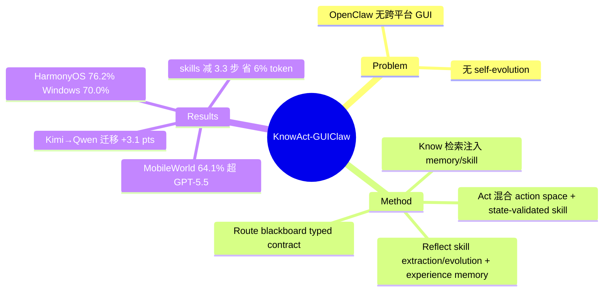

## Summary

针对 OpenClaw 缺乏跨平台 GUI 交互和 self-evolution 两个短板，提出 Know-Route-Act-Reflect 四段闭环框架：host agent 负责任务分解与信息路由，可插拔 GUI subagent 负责执行，配合可进化的 experience memory 与 state-validated skill library。用 Kimi-K2.6 做 host+executor 在 MobileWorld GUI-Only 达 64.1%，超过 GPT-5.5（62.4%）与 Seed-2.0-Pro（63.2%）；Kimi 轨迹蒸馏的 memory/skills 迁移给 Qwen3.5-35B executor 带来 37.9%→41.0%（约 +8% 相对）。

## Problem & Motivation

OpenClaw 作为 leading agent framework 有两个瓶颈：(1) 跨平台 GUI 交互支持不足——无法覆盖 Android/iOS/HarmonyOS/Windows 等多设备生态；(2) 没有内置 self-evolution 机制——不能从执行轨迹中持续积累经验。作者提出 "Know Deeply, Act Perfectly" 范式：把用户交互经验（memory）与任务执行（skill）打通，主张积累的交互经验能直接提升执行准确率。系统层面的目标是在不做任何 SFT/RL 训练的前提下，纯靠 framework + 通用基座模型（Qwen3.5 / Kimi-K2.6）追平甚至超过闭源 SOTA 模型。

## Method

**整体架构：Host-Executor 双层 + Know-Route-Act-Reflect 闭环**

- **Host Agent**（Qwen3.5-397B 或 Kimi-K2.6）：维护对话历史、user profile、workspace memory 与外部工具，决定"做什么、用哪个 app"；能用非 GUI 工具直接解决的信息获取子任务不下发。
- **GUI Subagent**（Qwen3.5-35B-A3B 或 Kimi-K2.6）：负责视觉感知、action 归一化、设备后端、skill 校验与轨迹记录，把 GUI 建模为 POMDP 跑 observe-reason-act 循环。

**Know（检索注入）**：语义相似度检索历史 GUI memory 和候选 skill 作为 advisory context（不覆盖指令）；policy memory 直接注入不参与排序。

**Route（任务分解 + blackboard）**：路由策略输出单 GUI 任务或多 app workflow；每个子任务是 (goal, hint, inputs, outputs) 四元组，跨 app 数据经短生命周期 blackboard 显式传递——缺 input 或未声明 output 时 workflow "fail closed"，不允许模糊摘要向下游传播。这是全文最干净的设计。

**Act（混合 action space）**：A = A_gui ∪ A_skill ∪ A_shortcut ∪ A_ask。

- **Skill**：参数化过程（app scope、参数、reliability counter、有序步骤），稳定值（package name、坐标）固化、任务相关值留 placeholder 运行时 ground；执行前逐步做 deterministic state contract 校验（不可用时退化为视觉校验），mismatch 时走 bounded recovery / 跳过 optional obstacle / 回退普通 GUI 执行。
- **Shortcut**：Android deeplink/intent 当作 one-step skill，但必须先验证目标页面正确、参数齐备、app 状态允许——manifest 暴露的 intent 只是 discovery evidence 不是可信 action。

**Reflect（轨迹蒸馏与进化）**：

- **Skill extraction**：把 GUI 事件重写为结构化证据（动作序列、参数、截图、state contract），vision LLM 在受限 prompt 下产出候选 skill，经归一化与可执行性校验后入库。
- **Skill evolution**：修复与新建分离——复用的 skill 失败时优先修复该 skill（允许收窄 description、加 guarded obstacle handling、刷新过期 target；禁止整体替换或加入 destructive 终结动作）。
- **Experience memory**（借鉴 ReasoningBank）：从轨迹归纳少量 textual policy，成功/失败分开 prompt，去重、限额、过滤短异常轨迹；服务于后续 routing（选 app/分解）与执行（layout hint、shortcut 可靠性）。

**无训练**：全程 in-context，不做 SFT/RL。

## Key Results

- **MobileWorld GUI-Only（117 任务/20 app/50 步上限）**：Kimi-K2.6 + host+memory+skills 64.1%，vs GPT-5.5 62.4%、Seed-2.0-Pro 63.2%、Gemini-3.1-Pro-Preview 58.1%、Claude-Opus-4.7 56.4%、裸 Kimi-K2.6 55.6%、GUI-Owl-1.5-32B 43.9%。
- **Ablation（Table 2）**：Qwen3.5-35B executor：baseline 24.8% → +host&memory 34.5%（+9.7）→ +skills 37.9%（+3.4）；397B executor：40.7% → 43.3%（+2.6）→ 46.2%（+2.9）。memory 对小模型增益远大于大模型。
- **Skill 收益（Table 3）**：调用 skill 的任务上平均减少 3.3 个 GUI step，总 token 降 5.9-6.2%，单跑 SR +4.9%（35B）/+1.9%（397B）。
- **跨模型迁移**：Kimi-K2.6 轨迹蒸馏出的 memory/skills 给 Qwen3.5-35B 用，37.9%→41.0%（+3.1 pts，约 8% 相对提升，即 abstract 中 "8.5%" 的出处）。
- **跨平台**：自建 AndroidDaily（235 任务）resolved 子集 78.61%、全集 64.89%，超 UI-TARS-1.5（56.64%）与 Step-GUI-8B（52.50%）；HarmonyOS 48/63（76.2%）、Windows 21/30（70.0%）。abstract 称覆盖 iOS，但 iOS 单独数字未在获取内容中确认。
- **失败分析**：HarmonyOS 的惯性滚轮 picker、Windows 的图标 grounding 与短时 notification 时序是主要失败源；人评指出相当一部分端到端失败来自 app 可用性与环境不匹配而非策略本身。

## Strengths & Weaknesses

**Strengths**

- Blackboard 的 typed information contract（fail closed 而非传模糊摘要）和 shortcut 的 "manifest≠可信 action" 验证协议，是系统论文里少见的严谨设计，直指多 app workflow 中 error propagation 的真实痛点。
- Skill 的 state-contract 校验 + 修复优先于新建的 evolution 规则，明确回应了 Misevolution（2509）指出的 skill 库自我污染问题——有护栏的进化而非放任积累。
- 跨模型迁移实验（Kimi 经验→Qwen executor +3.1 pts）是对 "memory/skill 是模型无关资产" 这一 claim 的直接验证，多数 self-evolving 论文没做这一步。
- 全程无训练，纯 framework 层贡献，与 EvoCUA 系（训练侧 self-evolution）形成正交互补。

**Weaknesses**

- 64.1% vs 裸 Kimi-K2.6 的 55.6% 中，host 架构（分解+非 GUI 工具直接解题）贡献了大头，memory+skills 的净增量在大模型上只有 +2.6/+2.9 pts（397B ablation），"self-evolving 带来强提升" 的叙事被 host 的 scaffolding 收益稀释。
- MobileWorld 只有 117 个任务，64.1% vs 62.4% 差约 2 个任务，无显著性检验；skill 收益也在同 benchmark 的重复任务分布上测得，evolution 的长期收益（多轮次、任务分布漂移）未验证。
- AndroidDaily 是自建 benchmark 且部分靠 LLM judge + 人评，与 UI-TARS-1.5 等 baseline 的对比可比性存疑。
- 与 OpenClaw 的关系更像 "借壳"：论文实际贡献是一个独立的 host-executor GUI 框架，OpenClaw 只提供 configuration-centric 的运行时组件管理，两个 "OpenClaw 短板" 的说法有蹭热点之嫌。

## Mind Map

## Notes

- 与 [[2606-MemGUI]]（proactive context management）、[[2600-UiMemSelfEvolving]]（memory for online RL）、[[2604-SkillClaw]]（跨用户集体 skill 进化）同属 memory/skill 进化谱系；本文的差异点在 state-contract 校验的 skill 执行与修复优先的 evolution 规则。
- 与 [[2607-EvoCUA15]] 正交：EvoCUA 走训练侧（online RL），本文走 framework 侧（无训练 in-context 进化），两者的 self-evolution 定义不同。
- MobileWorld 上下文：[[2604-ClawGUI]] 的 ClawGUI-2B 17.1%、UI-Venus-72B 16.4%（小模型区间），本文在 frontier 模型区间竞争。
