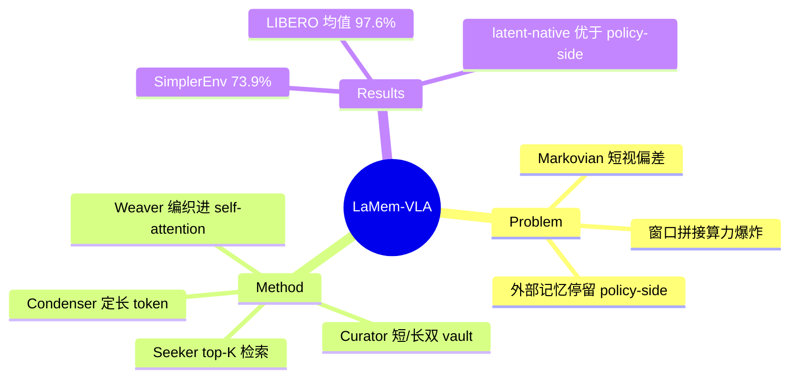

## Summary
针对 VLA 的 Markovian 短视偏差，LaMem-VLA 把历史经验重构成"context-native latent memory token"，直接编织进 VLA 的 embedding 序列参与 self-attention，而非当作 policy-side 外部条件；在 SimplerEnv-Bridge 达 73.9%、LIBERO 五套件均值 97.6%。

## Problem & Motivation
主流 VLA 基本假设 Markovian——只从当前观测预测动作，缺乏时序上下文，导致长程、时序依赖任务（判断任务进度、状态转移）失败，作者称之为 "temporal short-horizon bias"。现有两类补救都有缺陷：(1) **时序上下文拼接**（concatenate 历史帧）算力随窗口增长、有固定 memory ceiling，窗口外的证据被丢弃；(2) **外部记忆条件化**（MemoryVLA 等）把历史存进独立 memory bank，记忆停留在模型 native embedding 空间之外，只能作为 policy-side 的辅助上下文在 VLA 推理**之后**被消费，无法直接引导动作形成。作者提出的核心问题：能否把历史记忆做成一种"生成式的 latent faculty"，把短期视觉证据与长期语义证据流畅重构成紧凑 memory token？

## Method
核心主张：把历史经验当作 **context-native latent memory**，在模型 embedding 空间内存储、检索、消费。四个协同组件：

- **Latent Memory Curator（curator）**：把历史分解成两个互补 vault。short-term vault (ℳ^short) 经压缩模块 𝒞_s 存 visual token，保留近期感知证据；long-term vault (ℳ^long) 存 action hidden state，保留任务进度与动作连续性。容量 L=16，超出时按 cosine similarity 合并最相似的相邻单元（redundancy-based consolidation, Eq.5）。
- **Latent Memory Seeker（seeker）**：从当前多模态认知（visual + instruction token）构造 context-aware query，对 mean-pooled query q_t 用 cosine similarity 各取 top-K=8 单元，得到原始证据 Z^short、Z^long。
- **Latent Memory Condenser（condenser）**：用轻量 transformer memory former ℱ_v / ℱ_c 把冗余证据压成定长 token——L_s=8 个 short-term token、L_l=4 个 long-term token，均处于与 VLA 推理相同的 C 维 embedding 空间。
- **Latent Memory Weaver（weaver）**：构造增广输入 S_t = [M^short; M^long; X_t; I; Q^action]，加可学习 source embedding (b_s, b_l) 区分两条记忆流；memory token 与当前观测、语言、action query 一起进 self-attention，输出的 action token Z^action 在扩散动作专家处理前就已 "memory-grounded"。

**Backbone**：7B Prismatic VLM（Open-X Embodiment 预训练）+ ~300M 扩散 action expert（DDIM 10 步）。

## Key Results
- **SimplerEnv-Bridge**（Bridge v2 训练，real-to-sim 泛化）：均值 73.9%。分任务 Spoon on Towel 83.3% / Carrot on Plate 75.0% / Stack Cube 41.7% / Eggplant in Basket 95.8%。超 CogACT 16.6 分、π₀ 4.7 分，高于 MemoryVLA(71.9%)、SemanticVLA(65.1%)。
- **LIBERO**（Franka，五套件）：均值 97.6%。Spatial 98.8 / Object 99.0 / Goal 97.2 / Long-10 95.8 / Long-90 97.0。较 MemoryVLA 整体 +1.1，长程套件 Long-10 +2.4、Long-90 +1.4；较 CogACT +4.4、π₀ +3.5（前四套件）。
- **Ablation**：w/o Dual Memory 57.3%(SimplerEnv)/92.1%(LIBERO-90) → 单去 short 65.6/95.4、单去 long 64.6/94.8 → full 73.9/97.0。**Latent-native vs policy-side**：policy-side 条件化 71.9/94.8、raw retrieval 条件化 69.8/95.1、full 73.9/97.0——验证"进 embedding 空间"确有增益。K=8 最优（K=2→66.7、K=12→71.8）；(L_s,L_l)=(8,4) 最优，L_s=32 后饱和。

## Strengths & Weaknesses
**亮点**：范式上把记忆从 "policy-side 外挂" 挪进 "native latent token" 并证明这一步有 2 分量级增益（71.9→73.9），不是纯口号；定长 token 避开了窗口拼接的 context 爆炸；short(视觉)/long(语义) 二分直觉清晰；ablation 系统。

**硬伤/存疑**：
- **纯仿真**，作者自己承认无真机验证，sim-to-real dynamics gap 完全没碰——对一篇讲"长程记忆帮助真实操作"的论文这是致命短板。
- **架构组件全是常规件**（transformer block、mean pooling、cosine top-K retrieval），novelty 全在 orchestration，容易被质疑是工程拼装。
- **Top-K 不可微**，作者也点明离散检索不进梯度，端到端优化打折。
- 收益在饱和曲线上——K>8、token 数偏大都掉点，说明对超参敏感、"甜点"窄。
- 相对 MemoryVLA 的整体提升只有 1.1 分（LIBERO），主要靠长程套件拉开；SimplerEnv 的 Stack Cube 仅 41.7%，长程稳健性仍有天花板。

对领域的意义：为 VLA 记忆机制提供了一个"记忆应当活在 embedding 空间内"的可验证论点，值得后续在真机与可微检索方向跟进。

## Mind Map

## Notes
- 关键对照是 MemoryVLA（外部记忆库）；本文的核心 delta 就是"记忆进 native embedding 空间 + 双 vault 分工"。可与 [[2603-HybridMemory]]、[[2606-AgentMemorySystem]] 一起看记忆机制的谱系。
- 待验证疑问：latent-native vs policy-side 的 2 分增益是否稳健于真机？离散 top-K 换成可微检索（如 Gumbel-softmax / soft attention over vault）能否再涨？
