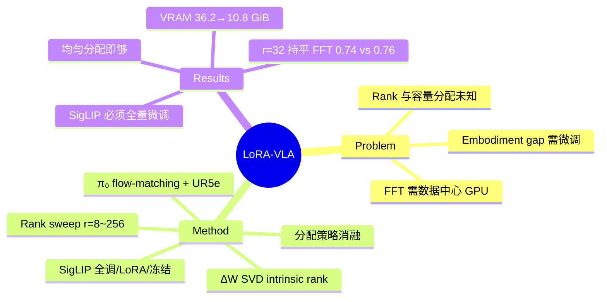

## Summary

对 π₀（flow-matching VLA）在 UR5e 工业装配任务上做 LoRA 微调的系统性实证研究：LoRA r=32 + 全量微调 SigLIP vision encoder 与 Full Fine-Tuning（FFT）无统计显著差异，同时把静态峰值 VRAM 从 36.2 GiB 降到 10.8 GiB。

## Problem & Motivation

把 billion 级 VLA 部署到工业机器人上必须做微调以弥合 embodiment gap（预训练数据与目标机械臂 kinematics 不匹配），但 FFT 需要数据中心级 GPU，且工业场景有数据隐私约束（数据不能出厂）。已有 LoRA-for-VLA 实践多是"默认配置直接用"，两个问题没被系统回答：

1. 性能如何随 LoRA rank 变化（scaling 曲线在哪饱和）？
2. 对于 VLM backbone 与 action expert 分离的 flow-matching VLA，adapter 容量应该怎么在组件间分配？

## Method

**对象与平台**：π₀（PaliGemma VLM backbone + 独立 action expert，flow-matching 输出连续动作）；UR5e + Robotiq 夹爪，GELLO 遥操作（60 Hz）采数据；双 Stereolabs 相机（ZED 2i + ZED Mini），3 路 RGB 672×376。

**任务与数据**：4 个精密装配任务——bolt insertion（easy/hard）、pick & place、bearing press-fit；每任务 200 episodes，共 800 条 / 约 5.5 小时演示。

**实验设计**（三组消融）：
- **Rank sweep**：r ∈ {8, 16, 32, 64, 128, 256}，均匀分配到 VLM 与 action expert；α=r；LoRA 挂在 Q/K/V/O projection + FFN 层
- **分配策略**：非对称配置 (r_VLM=16, r_AE=128) 与 (r_VLM=128, r_AE=16) vs 均匀分配
- **Vision encoder 处理**：SigLIP 全量微调 / LoRA / 冻结 三种变体；另有冻结整个 VLM 的对照

**训练**：AdamW，cosine schedule（1k warmup，peak 2.5e-5），action horizon H=30，bfloat16，batch 32（H100）/ 24（RTX 4090）。

**分析工具**：对 FFT 权重增量 ΔW 做 SVD，度量各组件的 intrinsic rank（95% 谱能量所需秩），解释 LoRA 容量应该放在哪。

**评测指标**：Average Task Progress（ATP）= 每次 rollout 完成的 sub-goal 数占该任务总 sub-goal 数的比例，每任务 20 rollouts。

## Key Results

**性能（ATP，95% CI）**：
- FFT：0.76 (±0.07)；LoRA r=32：0.74 (±0.08)——差异不显著（p>0.05）
- r=8/16：约 0.65–0.66（略低但不显著）；r=32 后饱和，更高 rank 无提升
- 冻结 VLM：0.15（p<0.001）；冻结 SigLIP：0.14（p<0.001）；SigLIP 只用 LoRA：0.43（p<0.001，medium effect）→ vision encoder 必须全量微调
- 非对称分配（VLM-heavy 或 AE-heavy）均不如均匀 r=32

**效率**：
- FFT：3,238M 可训练参数，36.2 GiB 静态 VRAM
- LoRA r=32（SigLIP 全调）：496M（15.0%），10.8 GiB（降 70%）
- LoRA r=32 + SigLIP 也用 LoRA：91M（2.7%），7.0 GiB——但性能崩到 0.43，不可取

**Intrinsic rank 分析**（FFT ΔW 的 SVD，95% 能量所需秩）：
- Action expert MLP：441±133；SigLIP MLP：597±135；VLM MLP：1,402±579（层间异质性明显，VLM 末层 MLP 峰值约 3,500）
- r=32 只能覆盖 action expert 约 57%、VLM 约 37% 的谱能量——但性能已持平 FFT，作者推测剩余谱能量多为噪声，任务关键的改变集中在低秩子空间

**结论 recipe**：LoRA r=16–32、VLM 与 action expert 均匀分配、SigLIP 全量微调；消费级 GPU（RTX 4090）可训。

## Strengths & Weaknesses

**Strengths**：
- 问题设定务实：工业部署 + 数据隐私 + 消费级 GPU 是真实约束，结论直接可操作（r=32 recipe）
- 实验设计干净：rank sweep + 分配策略 + 组件冻结三组消融正交，且报告显著性检验与 CI，比多数 VLA 论文的实验纪律好
- "vision encoder 必须全量微调"是最有信息量的发现（0.74 → 0.43 → 0.14 的梯度），指出 embodiment adaptation 的瓶颈在视觉 domain shift 而非语义/动作层
- SVD intrinsic rank 分析尝试解释"为什么低秩够用"，高 intrinsic rank 与低秩 LoRA 有效的矛盾被明确指出而非掩盖

**Weaknesses**：
- 单一平台（UR5e）+ 单一架构（π₀），结论对其他 VLA（如 discrete-token 类、OpenVLA 系）是否成立完全未知
- 每任务仅 20 rollouts，统计功效有限——"FFT 与 LoRA 无显著差异"可能只是检测不出小效应（作者自己承认）
- α=r 的 scaling convention 在大 rank 下可能导致 gradient collapse，rank 饱和现象可能是超参伪影而非本质（rsLoRA 未验证）
- VRAM 数字只算参数 + optimizer states，不含 activation memory，"10.8 GiB 上消费级 GPU"的宣传口径偏乐观
- 无 per-task 结果拆分，4 个任务的难度差异被 ATP 平均掩盖

**影响推测**：对工业界做 VLA 落地是有用的工程参考；学术上"vision encoder 全调 + 其余 LoRA"这一非对称 recipe 与 LLM 社区"LoRA 挂全部模块"的惯例形成有价值的对照。

## Mind Map

## Notes

- 与 [[2510-EfficientVLASurvey]] 的 PEFT 章节互补：本文提供了 survey 缺少的受控实证数据点。
- 与 OpenVLA-OFT（[[2502-OpenVLA-OFT]]）的 fine-tuning 实践可对照：不同架构下 LoRA 配置结论是否一致值得追踪。
- 开放问题：intrinsic rank 高但低秩够用——"剩余谱能量是噪声"这个推测若成立，对理解 fine-tuning 的本质（task-relevant subspace 维度）有普遍意义，值得在更多架构上验证。
