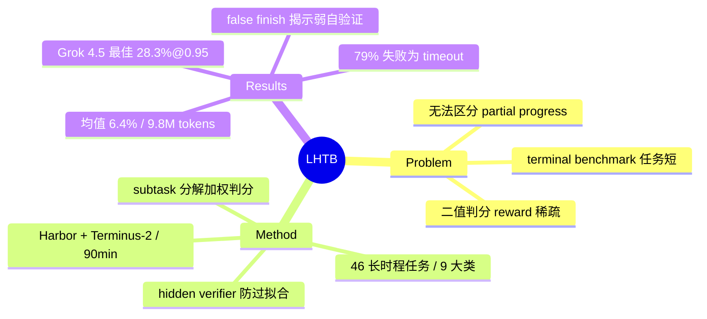

## Summary

针对现有 terminal benchmark 任务短、只看最终结果导致 reward 稀疏的问题，提出 46 个长时程终端任务的 Long-Horizon-Terminal-Bench：每个任务分解为带权重的 graded subtasks 给 dense reward 和 partial credit，实测 17 个 frontier model 平均每任务消耗 9.8M tokens / 239 episodes / 88.9 分钟，最强的 Grok 4.5 在 R≥0.95 阈值下 pass@1 也只有 28.3%。

## Problem & Motivation

- 现有 terminal benchmark（如 Terminal-Bench 2）任务多在 20–30 分钟、20–30 episodes 内完成，且只用最终结果二值判分：完成 95% 步骤的 agent 和一开始就失败的 agent 得分相同，reward 信号极稀疏，无法区分"有实质进展"和"完全没做"。
- 真实专业工作流（复现实验、修 SLAM pipeline、气候数据分析、EDA 芯片设计）本质是 long-horizon 的：需要数百步执行、long-context 状态管理、反复调试，短任务 benchmark 系统性低估了这类难度。
- 作者主张：在这个难度级别，dense reward 不是锦上添花而是必需——否则大量模型在严格阈值下并列 0 分，benchmark 失去区分度。

## Method

**任务构造**（46 题，从 120 个候选筛选而来）：
- 沿用 Terminal-Bench / Harbor 任务格式：自然语言 instruction + Docker 环境 + 配置文件 + oracle 实现或 simulator 用于判分。部分任务改编自 APEX-Agents，其余新建。
- 每题是一个"故意做坏"的完整终端项目，agent 只能通过 terminal 检查代码、跑命令、分析 images/audio/video/NetCDF 等 artifacts 来诊断修复。每题配套：公开 asset 生成脚本、weak baseline、官方 gold solution、多步 solve.sh、hidden verifier。
- **防公开测试过拟合**：公开 checks 只验证命令行行为、文件格式和少量简单例子，reward 权重低；大部分 reward 放在 hidden stress cases（动态生成更难输入：嵌套 manifest、gzip+base64 包装、字段重命名、注入噪声、旋转裁剪图像等）。gold solution 必须在完整 hidden suite 上拿满 1.0（相当于验证 grader 本身）。
- **难度校准**：反复用 DeepSeek-V4-Pro 在 1.5 小时预算下跑，调整任务设计直到"有挑战但原则上可解"。

**Dense reward 判分**：
- 每题分解为语义上有意义的 subtasks {s_1,…,s_K}，总 reward R = Σw_k·r_k / Σw_k（权重默认相等，必要时给最终目标更高权重）。
- 三类 subtask check：**binary**（unit tests 全过、服务在指定端口响应等，r∈{0,1}）；**continuous/thresholded**（指标在容差内得 1.0，随误差线性衰减；或 held-out 样例匹配 oracle 的比例）；**episode-aggregating**（跨 episodes 聚合，如通关关卡比例、simulator 平均 normalized reward，衡量长时程行为的可靠性而非单次成功）。
- 判成功阈值：τ=0.95（relaxed）和 τ=1.0（perfect）双阈值报告，另报 mean reward。

**评测设置**：Harbor 框架 + Terminus-2 harness，单一长时程 terminal session，90 分钟 timeout；例外是 GPT-5.3 用 Codex 作为 harness。共评测 17 个 frontier model（GPT-5.6-sol/5.5/5.4/5.3 Codex、Grok 4.5/4.20、DeepSeek V4 Pro、Gemini 3.1 Pro、GLM 5.1/5.2、Kimi K2.6/K2.7 Code、MiniMax M3、Qwen 3.6 Plus/3.7 Max、Doubao Seed 2.1 Pro、Hy3）。

## Key Results

- **规模压力**：平均每 run 9.8M tokens、239 episodes、88.9 分钟（90 分钟预算），比 Terminal-Bench 2（20–30 分钟/20–30 episodes）高一个量级。
- **主结果（v2）**：Grok 4.5 最强——28.3%（13/46）@R≥0.95、19.6% @R≥1.0，mean reward 0.51，约 $11/任务；GPT-5.6-sol 和 GPT-5.5 各 15.2%（7/46），约 $21/任务；MiniMax M3 / Kimi K2.7 Code / DeepSeek V4 Pro 各 6.5%（3/46）；全体均值 6.4% @0.95、3.2% @1.0。阈值收紧到 1.0 时大多数模型 pass rate 归零。
- **dense reward 的必要性**：17×46=782 个 run 中仅 50 个（6.4%）通过 R≥0.95，241 个（30.8%）几乎无进展（R<0.05），中间 491 个（62.8%）有 partial reward 但二值判分下全算失败；[0.85,0.95) 区间就有 68 个 run，比通过数还多。pass rate 与 mean reward 只有中等相关（Spearman ρ=0.74），会给出不同的模型排名。
- **失败模式**：79% 的 unresolved run（518/660）是 90 分钟预算耗尽时 agent 仍在工作，但这些 timeout run 的 mean reward 仅 0.10–0.35（离完成很远）；19% 是 early exit。124 个自主提前退出的 run 中有 14 个"false finish"（R≥0.75 就自判完成退出，实际没过 hidden verifier）——agent 系统性高估完成度、吝于做最终验证。
- **成本**：$3.6–$26/任务；GPT-5.4 最贵（约 $26）但 pass rate 远低于 Grok 4.5，说明单纯堆推理开销买不到 long-horizon 能力。

## Strengths & Weaknesses

**亮点**：
- Hidden verifier + stress cases + "gold solution 必须拿满 1.0" 的三件套是 benchmark 工程上的好设计：既防公开测试过拟合，又相当于对 grader 本身做了 sanity check。
- dense reward 必要性的论证有数据支撑：62.8% 的 run 落在 partial 区间、near-miss（68 个）多于通过（50 个），二值判分确实会把整个中间地带压成零——这对把此类环境改造成 RL 训练环境也有直接价值（dense reward 可直接当训练信号）。
- false-finish 分析（14 个 R≥0.75 提前退出）把"agent 自我验证差、stopping 判断不校准"这个失败模式落到了具体数字上。

**局限**（个人评估，前四条为已知事实推出，后两条部分为推测）：
- **统计噪声**：46 题 × pass@1 单次 run，1 题 = 2.2 个百分点，6.5% 和 4.3% 两档之间只差 1 题；未报告方差或重复实验，中下游排名基本不可信。
- **难度校准只用 DeepSeek-V4-Pro 一个模型**：任务被筛成"对 DeepSeek 难"，可能引入对特定模型家族的偏置。
- **79% 失败是 timeout**：固定 90 分钟 wall-clock 预算下，benchmark 部分测的是"推理/serving 速度"而非能力上限——API 更快的模型天然占便宜（推测：Grok 4.5 的优势可能部分来自此）。
- **harness 不统一**：GPT-5.3 用 Codex、其他用 Terminus-2，破坏了受控比较。
- **正文自相矛盾**：abstract 说 nine categories，§2.4 说 21 high-level categories；Figure 4 的 782−50=732 个未通过 run 与 Figure 6 的 660 个 unresolved 对不上号。v1（7/9）到 v2（7/13）四天内从 15 模型/最佳 15.2% 改成 17 模型/最佳 28.3%，headline 数字剧烈变动。
- **可扩展性**：subtask 分解和权重全靠人工设计（"默认相等、必要时调高"），46 题尚可维护，规模化到数百题的成本存疑。

## Mind Map

## Notes

- 与 Terminal-Bench 2 / SWE-Bench 的本质区别不在任务领域而在**判分粒度**：subtask-level dense reward + hidden stress verifier。这套 grader 基建对 agentic-RL 训练环境（参见 [[Reports/2026-07-08-WebAgentTrainingInfra-Pulse]] 关注的 web agent 训练基建脉络）比对评测本身可能更有价值。
- 疑问：timeout 主导失败时，"long-horizon 能力"和"单位时间产出效率"如何解耦？给 3 小时预算重跑一遍，排名会变多少？论文没做 budget ablation。
- 任务部分源自 APEX-Agents，terminal-only 化改造。
