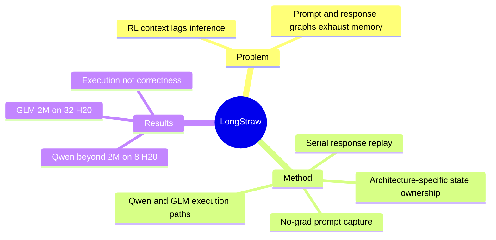

## Summary
LongStraw 是面向 million-token GRPO post-training 的 architecture-aware execution stack：先用 no-grad 执行共享长 prompt，再逐个重放短 response branch，把 live autograd graph 从完整序列缩到单条 response。它在固定 8 张或 32 张 H20 下验证了超过 2M token 的执行容量，但作者明确说明尚未证明 distributed gradient correctness 或真实策略学习效果。

## Problem & Motivation
Long-context inference 已接近 million-token，但 RL post-training 常停留在 256K 或更短；这对 agent 尤其关键，因为 tool output、文档、observation 和历史决策会沿 trajectory 累积。与 inference 可以 prefill 后丢弃 forward graph 不同，GRPO 必须对共享 prompt 下的多条 response 评分并反向传播，prompt graph、response graph、KV/recurrent state 与 distributed communication 共同挤占显存。论文追问的不是“加更多 GPU 能到多长”，而是在固定 accelerator budget 下，如何通过 state lifetime 与 physical ownership 扩大可执行上下文。

## Method
LongStraw 改变计算图边界而非 GRPO objective：

1. **Capture once**：共享 prompt 只做一次 no-grad prefill，保留后续 token 所需、且与架构匹配的 conditional state。
2. **Serial suffix replay**：在参数不变时预先计算 old/reference scores，再逐条重建短 response 的 autograd graph，backward 后立即释放，最后统一执行 optimizer transaction；group size 主要增加调度时间而非同时存活的 graph 数量。
3. **Qwen path**：针对 Qwen3.6-27B 的 48 个 GDN recurrent layer 与 16 个 full-attention layer，在 8-way context parallelism 下保留 GDN state 与紧凑 KV pages，并做全局 LSE/output merge。
4. **GLM path**：针对 GLM-5.2 的 MLA/DSA + MoE 结构，把 prompt latent/index pages 放在 CPU，按层 staging，配合 whole-layer checkpointing、CP32/EP32 与 IndexShare reconstruction。

关键代价是 stored prompt state 被 `stopgrad`：训练只保留 response 对参数的显式梯度，省略 prompt state 对参数依赖产生的梯度项。

## Key Results
- Qwen3.6-27B 在 8 张 H20 上完成 2.097M positions 的 grouped scoring 与 response backward，group size 从 2 增到 8 仅增加 0.21 GB peak allocated memory。
- 同一 8-H20 envelope 下，Qwen 完成约 4.25M context、group size 8 的 response replay，并在 prefix-frozen 设定下执行 8 个连续 optimizer-shaped step（共 64 次 member replay），peak 为 83.894 GB/rank；摘要另将 stress envelope 表述为 4.46M positions。
- GLM-5.2 在 32 张 H20 上使 2,097,152-token prompt 通过全部 78 层、两次完整 backward 并到达 terminal optimizer calls；该点不是 OOM ceiling，且没有尝试更长 GLM context。
- 这些是 execution receipt，不是训练正确性结果：Qwen 的 shard-local K/V adapter gradient 未完整聚合，历史 GLM path 使用 CP-local DSA 且绕过部分 gradient finalization，两条路径都 detach prompt state，也都没有测 policy improvement。

## Strengths & Weaknesses
**亮点**：论文非常诚实地区分 execution capacity、response-operator fidelity、distributed-update consistency 与 full-gradient parity，并给出逐项 audit matrix；这种 claim discipline 比单报 context record 更有价值。其核心观点也简单而通用：固定预算的极限取决于 tensor lifetime、ownership 与 replay schedule，而非某个单独 attention kernel。

**局限**：当前 workload 使用预先给定的 synthetic responses 和 deterministic rewards，不包含 online rollout、reward model、data filtering、checkpoint reload 或反复学习，因此不能声称完成真实 RL training。Qwen 和 GLM 都缺少正确的全局 gradient composition，prompt gradient 被截断，模型 native context 又低于压力测试长度；即使系统能跑完，也不知道这些超长 context 对 task behavior 是否有用。serial replay 还以显著 wall-clock 开销换显存，论文没有给出完整训练 throughput/quality trade-off。

## Mind Map

## Notes
这项工作更像严谨的 systems feasibility report，而不是已完成的 RL algorithm。后续最关键的验收应是短上下文下与 conventional full-sequence training 做逐参数 gradient/optimizer-delta parity，再扩到 repeated online RL loop。
