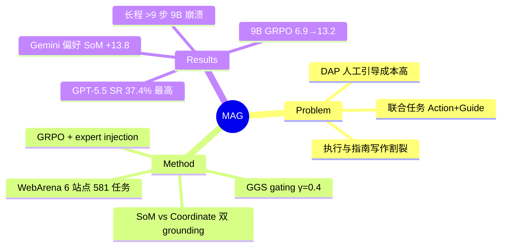

## Summary

提出 MAG benchmark：把 web 任务执行（action generation）和面向用户的分步操作指南写作（guide generation）统一成一个多模态任务，配套 live 评测 harness 与两种 grounding 方案；并用注入 expert 轨迹的 GRPO 把 9B 开源模型的成功率从 SFT 的 6.9% 提到 13.2%，但最强 frontier 模型也只有 37.4% SR。

## Problem & Motivation

商业 Digital Adoption Platform（DAP）靠人工在网页上叠加操作引导，成本高。现有研究两头割裂：web agent benchmark（WebArena 等）只测任务完成率，不管 agent 能否向人解释每一步；guide/tutorial 生成的工作又不真正执行任务、无法验证指南是否可操作。MAG 的核心 formulation 是：agent 在 live 网站上逐步完成任务的同时，每一步生成一句用户可跟随的 guide，两者联合打分——即"会做"且"会教"。

## Method

**Benchmark 构建**
- 任务来自 WebArena 的 6 个 live 站点（GitLab、Map、Reddit、Shopping、Shopping Admin、Wikipedia），共 581 个源任务；基于 OpAgent 的成功 demonstration 在 live 站点上 replay，563 个任务通过完整标注（gold 轨迹 396 train / 167 test；harness 层面划分为 407 train / 174 test，其中 7 个 test 任务无 gold 轨迹）。
- 每步标注：screenshot + 两种 grounding 形式的 action + 人工校验的 guide 句（LLM 起草、3 名标注者校验）。Gold 数据含 4,760 个 Set-of-Mark 步骤、5,779 个 coordinate 步骤。
- Action space 为 7 个动词：click / type / select / scroll / press_enter / go_back / finish。
- **两种 grounding 方案受控对比**：Set-of-Mark（编号元素选择）vs 原始像素坐标，其余 pipeline 完全一致。

**Harness 与指标**
- Harness 统一处理页面渲染、元素标记、候选菜单生成、输出解析、浏览器执行与 live functional check。
- SR：live 站点功能性校验的任务成功率。
- Guide quality（G）：BLEU-1/BLEU-2/ROUGE-1/ROUGE-L 四项均值，**单参考**。
- GGS（Gated Guide Score）：`GGS_i = S_i(γ + (1−γ)G_i)`，γ=0.4——任务失败则 guide 得 0 分，成功则保底 0.4。
- OFCR：输出格式正确率（防止 mark ID / 坐标泄漏进给用户看的 guide 文本）。
- Guide Tax = SR − GGS，度量指南质量造成的损失。

**GRPO 训练（Qwen3.5 9B）**
- Reward 只用二值任务成功，guide 不参与 RL 打分。
- Plain GRPO 十次尝试全部 stall：全失败 group 无 reward variance。解法是 **expert trajectory injection**——训练前用 GPT-5.5 在 407 个训练任务上跑两遍 harness，缓存成功轨迹（112 + 122 次成功，并集 139 个任务），每个 group 混入至多 2 条 expert 轨迹 + 6 条 on-policy rollout；advantage 只做 mean-centering 不 rescale，零方差 group 丢弃。共训 10 轮。

## Key Results

主表（174 test 任务，live 评测）：

| 模型 | Grounding | SR | GGS | OFCR |
|:-----|:----------|:---|:----|:-----|
| GPT-5.5 | Coord | **.374** | .226 | .995 |
| GPT-5.5 | SoM | .356 | .207 | .999 |
| Gemini 3.5 Flash | SoM | .345 | .201 | .949 |
| Gemini 3.5 Flash | Coord | .207 | .104 | .964 |
| Claude Sonnet 4.6 | SoM | .276 | .156 | .883 |
| Qwen3.5 9B SFT | SoM | .069 | .040 | .976 |
| Qwen3.5 9B GRPO r10 | SoM | .132 | .080 | .978 |
| Qwen3.5 9B GRPO r10 | Coord | .081 | .051 | .998 |

核心发现：
1. **Grounding 偏好是模型特异的**：Gemini 用 SoM 比 coordinate 高 13.8 个点（p<0.001）；GPT-5.5 和 Claude 无显著偏好；9B 只有 SoM 才能被 GRPO 提起来（6.9%→13.2%），coordinate 下几乎不动。
2. **Expert injection 是 RL 能跑起来的前提**：无注入的 plain GRPO 十次全无持续增益，reward variance 与 expert 覆盖率同步。
3. **GRPO 增加能力而非只做集中**：pass@6 随 greedy SR 同步 +6.9 个点；action 分布迁移——scroll 从 34.9% 降到 13.5%，click 升到 57.9%，重新学会 go_back。
4. **长程是最大缺口**：gold 步数 >9 的任务上所有 9B 变体 SR ≤2%，API 模型维持 26–34%。
5. **执行与讲解耦合**：成功 episode 的 guide 质量 0.369 显著高于失败的 0.258；所有模型都付出可观 Guide Tax（GGS 远低于 SR）。

## Strengths & Weaknesses

**Strengths**
- Problem formulation 有新意且贴真实需求（DAP 场景）："会做 + 会教" 的联合评测此前确实空缺，GGS 的 gating 设计让 guide 分数无法脱离执行成功空转。
- SoM vs coordinate 的受控对比是干净的实验设计，"grounding 偏好模型特异" 这一结论对 web agent 部署有直接参考价值。
- Expert trajectory injection 解决 sparse binary reward 下 GRPO 全失败 group 无梯度的问题，做法简单（缓存 + 混入 group），并给了 plain GRPO 十次失败的负结果作为证据——这种诚实的 negative evidence 少见。
- Limitations 一节自我批判到位（±2 点统计不确定度、单 seed、单参考指标）。

**Weaknesses**
- **Guide 评测是软肋**：BLEU/ROUGE 单参考只测 n-gram 表面重合，不测指南的可跟随性（faithfulness / usability）；一句措辞不同但同样正确的 guide 会被压分。这对一个以 guide generation 为半壁招牌的 benchmark 是根本性缺陷。
- GGS 里 γ=0.4 意味着成功任务哪怕 guide 是垃圾也保底 0.4 分，"Guide Tax" 的量级部分由指标设计决定，跨论文可比性存疑。
- 任务源自 OpAgent 的成功 demonstration，**任务分布偏向"已有 agent 能解"的任务**；即便如此最强模型只有 37.4%，说明难度足够，但也意味着分布外任务类型缺失。
- 仅 WebArena 6 站点，向真实商业网页（DAP 的实际场景）的迁移完全未验证——与 motivation 之间有落差。
- 13.2% 的 9B 成功率依赖 GPT-5.5 expert 轨迹，本质是 RL 包装下的知识蒸馏 + on-policy 修正；宣称 "GRPO nearly doubles SR" 时基线选 SFT 的 6.9% 而非 base 的 8.1%，措辞占了便宜。
- 文中任务计数存在轻微不一致（563/581、167/174），细读才能对上。

## Mind Map

## Notes

- Expert injection 与 DAPO/off-policy-mixed GRPO 一类做法同源，可与 vault 中 agentic-RL 相关笔记对照：当环境 reward 稀疏且 base policy 成功率 <10% 时，纯 on-policy group-based RL 的失效几乎是必然，off-policy 专家数据混入是最省事的 bootstrap。
- "grounding 偏好模型特异" 值得记住：给 web agent 选 SoM 还是坐标不应一刀切，应按 backbone 实测。
- Guide generation 若换成 LLM-judge 或用户模拟器评可跟随性，会比 BLEU/ROUGE 有说服力得多——这是一个明显的后续工作空位。
