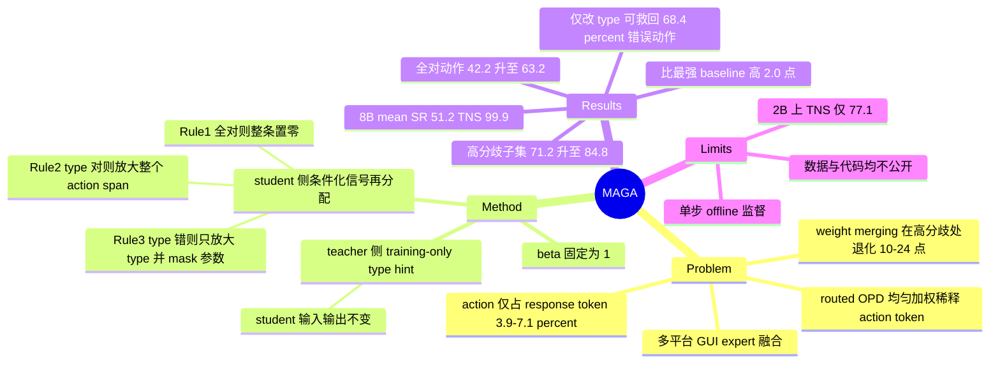

## Summary

把 mobile / desktop / web 三个 domain-specific GUI expert 融合成单一 agent 时，weight merging 会在 expert 分歧处破坏可执行动作，而常规 routed on-policy distillation (OPD) 对所有 response token 一视同仁、导致真正被执行的 action token 欠监督。MAGA 按 action 结构重新分配蒸馏信号：student 侧按 "全对 / 类型对参数错 / 类型错" 三种情况分别置零、放大整个 action span、或只放大 type 并 mask 参数；teacher 侧在训练时给 teacher（不给 student）追加一条只含正确 action type 的 hint。在 MobileWorld / OSWorld / WebVoyager 上，8B 规模的 mean SR 达 51.2%，比最强 baseline 高 2.0 个百分点，Teacher-Normalized Score 达 99.9%。

## Problem & Motivation

GUI agent 正在被部署到 mobile、web、desktop 三类环境，但现有 agent 大多是 domain-specific 的，逐环境维护一套模型带来部署复杂度并割裂用户体验，因此需要把多个专家模型合并成一个 cross-environment policy。

现有两条合并路线各有硬伤：

- **Weight merging**（Model Soup、TIES）直接平均专家参数。GUI domain 之间共享 Click、Scroll 这样的 action type，但各自的 domain-specific 模型对具体决策会有分歧；在这些高分歧样本上，merge 后模型的动作成功率相比单个专家下降 10%–24%（C3）。GUI action 会直接改变界面状态，一次错误动作可能把系统推离目标状态，因此这种退化不是均匀的性能损失。
- **Routed OPD** 用 per-sample 路由到对应 frozen teacher 打分，避开了参数冲突，但把 response 当成扁平 token 序列均匀加权。而在 GUI 场景中，只有末尾那段短的 structured action 会被真正执行——它只占 response token 的 3.9%–7.1%，也只拿到 4.0%–7.0% 的蒸馏信号（C9）。作者据此判断：常规 OPD 把监督预算花在了长 reasoning 上。

作者同时指出所依赖的 OPD 方法（UI-MOPD）只在两个 domain 上评测过，跨域可扩展性未被检验（C13）。

## Method

**动作的结构分解.** 一个 GUI action 写作 $a=(z,p_z)$：离散 action type $z$ 决定 type-specific 的参数 schema $p_z$（坐标、文本、URL、按键组合等；坐标归一化到 $[0,1000]$）。据此把 response token 划分为互斥的 reasoning / type / parameter 三段，用 token weight $w_t$ 去缩放 routed-OPD advantage $\widehat{A}_t=\mathrm{sg}[\log\pi_{T_d}(y_t)-\log\pi_\theta(y_t)]$。

**Student 侧条件化信号再分配.** 按 rollout 的动作正确性分三条规则：

| 情况 | reasoning | type | param | 意图 |
|:--|:--|:--|:--|:--|
| Rule 1：type 与参数全对 | 0 | 0 | 0 | 整条轨迹移出蒸馏，不再优化 evaluator 已完全接受的动作 |
| Rule 2：type 对、参数错 | 1 | $1+\beta$ | $1+\beta$ | 放大整个 action span，避免被长 response 稀释 |
| Rule 3：type 错 | 1 | $1+\beta$ | 0 | 只纠正 type；错误 type 选中的参数 schema 语义上无效，故 mask 掉 |

$\beta=1$ 在所有实验中固定（即选中的 action token 权重翻倍），未做跨 domain/尺度调参（C16）。正确性判定复用已有 rule-based reward 中的 exact-action acceptance 分支：类型和每个必需参数都被接受才算全对，无部分给分；这是 offline evaluator 信号，不是 live 交互的 task success（C15）。不同 action family 的接受阈值见原文 Table 6（如 Click 类要求点距 ≤ 0.07 倍短边）。

**Teacher 侧 hint.** 训练时给被路由到的 domain-specific teacher 的 user turn 末尾追加一条只含参考 action type 的提示（模板 `Hint: the correct action for this step is a {HINT} action`），不含坐标、文本、URL、按键或 reasoning，且**永远不加到 student prompt**（C16）。teacher 不解码，只对 student 采样出的 token 打分，所以 student 的输入输出分布不变，改变的只是 advantage 中的 teacher 项。

**整体.** 每个 offline 输入采样一条 one-step response，走三条 allocation 规则之一得到 $w_t$，再乘上 hint 版 advantage 构成最终 loss；teacher 全程 frozen，只更新 student。student 侧与 teacher 侧同时关闭时，目标函数精确退化为普通 routed OPD。实现上 mask 在 rollout 之后用增量累积解码定位，不需要重新编码或额外调用模型。

## Key Results

**主表（Table 1，8B）**：MAGA 在 MobileWorld / OSWorld / WebVoyager 上分别为 34.2 / 45.3 / 74.3 SR，mean SR 51.2%、TNS 99.9%；最强 baseline UI-MOPD 为 49.2 / 95.4，Weight Soup 48.1 / 92.3，TIES 47.7 / 92.7，混合数据 SFT 48.3 / 94.8。相对 UI-MOPD 的提升是 mean SR +2.0、TNS +4.4（C1、C2）。MAGA 的 mean SR 比三个 teacher 的均值（50.9）高 0.4 个百分点，其中比 OSWorld / WebVoyager teacher 高 2.4 / 2.1，比 MobileWorld teacher 低 3.4——作者据此称其跨域保留更均衡（对照 Weight Soup 的 +0.7 / −8.5）。

**2B 规模**：MAGA mean SR 25.3、TNS 77.1，在 unified 方法里均最高，但 WebVoyager 上被 Weight Soup 高出 2.1 个百分点（C4）。注意 2B 的 teacher mean 是 32.6，即小模型上的融合仍有显著能力损失。

**Ablation（Table 2，8B）**：去掉 student 侧 MW/OSW/WV 分别下降 3.4 / 3.8 / 1.4 点；去掉 teacher 侧 hint 使 MW 降 2.6、WV 降 0.7，OSWorld 不变；两侧全去（= 普通 routed OPD）为 29.1 / 44.4 / 70.0（C8）。

**机制侧诊断**（均在 900 条 held-out 单步样本、每域 300 上做，与训练数据不相交）：

- 训练后完全正确的动作从 42.2% 升到 63.2%（+21.0），type 错误 30.9%→14.6%，参数错误 26.9%→22.2%，三种 allocation 情况在测试集上都真实出现（C5）。
- 136 条 type 预测错误的 response 中，只把 type 换成 ground truth、让 frozen student 重新生成参数，可救回 68.4%；需要坐标参数的 87 条里救回 57 条（C6）。这是支撑 "优先加强 type 监督" 的直接证据。
- 61.5% 的动作与被路由的 teacher 一致，14.8% 只与其他域 teacher 一致，20.6% 不匹配任何 teacher 且错误，3.0% 不匹配任何 teacher 但正确（C14）。
- teacher 对 action token 的 likelihood 比 reasoning token 平均高 +0.072（type +0.068、param +0.073）（C12）。

**高分歧案例（Table 4）**：66 条 MobileWorld 高分歧任务（29 Click / 37 Swipe，筛选条件为三个 teacher 坐标两两最大距离 > 0.07），准确率从 Weight Soup 的 47/66（71.2%）升到 56/66（84.8%），纠正 10 个错误、引入 1 个新错误（C7）。

**作者自陈的负面结果**：student 未能稳定超过每个 teacher，归因于 action 只占 response token 的 3.9%–7.1%（C9），以及只在 single-step 数据上训练、与真实多步执行不对齐；失败轨迹的平均交互步数明显长于成功轨迹（OSWorld 56.9 vs 13.5）。

## Evidence Ledger

| Claim ID | Claim | Type | Source locator | Evidence excerpt | Status |
|:--|:--|:--|:--|:--|:--|
| C1 | 8B mean SR 51.2%，比最强 baseline 高 2.0 点 | number | Abstract / Sec 4.2 / Table 1 | "at 8B it achieves a mean success rate of 51.2%, exceeding the strongest baseline by 2.0%" | source-verified |
| C2 | 8B TNS 99.9%，比 UI-MOPD 高 4.4 点 | number | Sec 4.2 / Table 1 | "improving mean SR by 2.0% and TNS by 4.4%" … "Maga obtains a TNS of 99.9%" | source-verified（Table 取整值相减为 4.5，4.4 只在整数成功计数下复现） |
| C3 | 高分歧样本上 weight merging 使 SR 降 10%–24%（900 抽样中 66 条） | number | Figure 1(a) caption / Introduction | "we identify 66 tasks where domain-specific models exhibited high disagreement, and weight merging reduces success rate … by 10%–24%" | source-verified |
| C4 | 2B 上 MAGA mean SR / TNS 最高，但 WebVoyager 被 Weight Soup 高 2.1 点 | comparison | Sec 4.2 / Table 1 | "although Weight Soup scores 2.1% higher on WebVoyager, Maga achieves the highest mean SR and TNS" | source-verified |
| C5 | 900 held-out 样本上全对动作 42.2%→63.2%（+21.0），type 错 30.9%→14.6%，参数错 26.9%→22.2% | number | Sec 4.4 / Table 3 | "Before training, 42.2% of actions are fully correct, 30.9% have a wrong action type and 26.9% have the correct type" | source-verified |
| C6 | 136 条错 type response 中只改 type 可救回 68.4%；坐标类 57/87 | number | Sec 4.7 / Figure 4 / Appendix A.5 | "correcting only the action type recovers 68.4% … 57 out of 87 actions requiring coordinate parameters are successfully recovered" | source-verified |
| C7 | 66 条高分歧 MobileWorld 任务准确率 47/66 → 56/66，纠正 10 引入 1 | number | Sec 4.8 / Table 4 | "Maga corrects 10 Weight Soup errors while introducing one new error, increasing accuracy from 47/66 (71.2%) to 56/66" | source-verified |
| C8 | 8B ablation：去 student 侧降 3.4/3.8/1.4；去 teacher 侧 MW −2.6、WV −0.7、OSW 不变 | number | Sec 4.3 / Table 2 | "student-side removal lowers SR by 3.4, 3.8, and 1.4 points … Teacher-side hint removal lowers MobileWorld and WebVoyager by 2.6 and 0.7" | source-verified |
| C9 | action 只占 response token 的 3.9%–7.1%，仅获 4.0%–7.0% 蒸馏信号 | number | Sec 4.9 / Table 5 / Appendix C / Table 7 | "The action accounts for only 3.9%–7.1% of response tokens" … "action tokens receives 4.0%–7.0% of the total logged distillation signal" | source-verified |
| C10 | 评测为 MobileWorld GUI 子集 117 题、OSWorld 全集 369 题、WebVoyager 140 题子集（14 站点各 10 题） | benchmark-setting | Sec 4.1 / Table 1 caption / Appendix A.1 | "SRs are derived from integer success counts over 117, 369, and 140 tasks" … "140 tasks, with ten tasks from each of 14 websites" | source-verified |
| C11 | 训练用 343k 专有工业数据（web 200k / mobile 93k / desktop 50k），因隐私与 NDA 不可发布；32 张 H20 训练 1 epoch | license-code | Sec 4.1 / Appendix A.1 / A.2 | "Our training corpus contains 343k proprietary industrial examples. 200k from the web domain, 93k from the MobileWorld domain, and 50k from the OSWorld domain" | source-verified |
| C12 | action token 相对 reasoning token 的 teacher likelihood 平均高 +0.072（type +0.068、param +0.073） | number | Sec 4.6 / Figure 3(b) / Appendix A.5 | "action tokens show an average likelihood gain of +0.072 … positive average gains of +0.068 and +0.073" | source-verified |
| C13 | 作者称所依赖的 OPD 方法只评测过两个 domain，本文推广到三个 | sota-novelty | Related Work (Model merging) | "Existing evaluation also covers only two domains … We therefore introduce Maga … generalize it to three GUI domains" | source-verified |
| C14 | 61.5% 匹配对应 teacher，14.8% 只匹配他域 teacher，20.6% 无匹配且错误，3.0% 无匹配但正确 | number | Sec 4.5 / Figure 3(a) | "61.5% of actions match the domain-specific teacher. In comparison, 14.8% match only other domain-specific teachers" | source-verified（四项和为 99.9%，取整所致） |
| C15 | student 侧门控是 offline rule-based exact-action evaluator（类型 + 全部必需参数，无部分给分），非 live task success | causal-mechanism | Appendix A.4 | "It is an offline evaluator signal, not task success from live interaction … Partial parameter credit does not pass" | source-verified |
| C16 | hint 只含参考 action type、只加到 teacher prompt、从不给 student；$\beta=1$ 全实验固定 | causal-mechanism | Sec 3.3 / Appendix A.2 / A.3 | "never added to the student prompt" … "We set β=1 in all experiments" | source-verified |
| C17 | 论文未提供公开代码仓库 | license-code | 全文 + abs 页 | "The data are subject to privacy requirements and non-disclosure agreements and therefore cannot be released." | source-verified（全文与 abs 页均无作者代码链接） |

## Strengths & Weaknesses

**Strengths**

- **问题定位准且可测量**。"executed 的只有 action token，而它只占 response 的 3.9%–7.1%、只拿到 4.0%–7.0% 的蒸馏信号"（C9）是一个能直接量化的结构性错配，比大多数 "加权重要 token" 类工作的动机更硬。
- **oracle type intervention 是本文最有信息量的实验**。136 条错 type 的 response 里只改 type、参数全部由 frozen student 重新生成就救回 68.4%（C6），说明失败大量来自离散 type 决策而非参数生成能力——这条证据独立于主表，直接支撑 Rule 3 只放大 type、mask 参数的设计。
- **方法本身简单**：三条基于 rule-based reward 的 token 权重 + 一条 teacher-only 文本 hint，没有引入新模型、新奖励模型或额外前向，mask 在 rollout 后用增量解码定位。这符合 "简单可扩展" 的取向。
- **teacher-side hint 的形式约束清楚**：只给 type、不给坐标/文本、不进 student prompt（C16），因此不构成对 student 的信息泄漏；student 的 rollout 分布未变。

**Weaknesses**

- **主表增益的绝对量级相对 benchmark 规模偏小，且无方差报告**。三个 benchmark 分别 117 / 369 / 140 题（C10），MobileWorld 上 1 题 ≈ 0.85 点，所以 ablation 中 1.4–3.4 点的差异只相当于个位数题目；论文未报 seed 或多次运行的方差。（推测：部分组件的域间不一致——如 w/o Rule 2 在 WebVoyager 与完整 MAGA 同为 74.3、w/o teacher-side 在 OSWorld 同为 45.3——可能就落在噪声范围内。）
- **相对 mixed-data SFT 的净收益需要放在 8B 语境下看**。8B 上简单 SFT 已达 mean 48.3 / TNS 94.8，已经超过 Weight Soup 与 TIES；MAGA 相对它是 +2.9 点。这说明 "merging 会退化" 的动机在 8B 上主要针对参数合并类方法，而不针对最朴素的混合训练基线。
- **2B 上融合远未追平专家**：TNS 仅 77.1（teacher mean 32.6 vs MAGA 25.3），"almost the same average performance with teachers" 的结论只在 8B 成立，摘要里的这句表述未限定尺度。
- **训练信号来自 offline single-step 的 exact-action 匹配**（C11、C15），ground truth 取自 SFT 数据集最后一步的动作。这意味着：(a) "正确" 是与参考动作的规则匹配，不是任务成功；(b) 同一界面状态下多条合法路径会被判错并触发放大监督。作者自己指出 single-step 训练限制了多步泛化。
- **可复现性差**：343k 训练数据因隐私与 NDA 不可发布（C11），也没有公开代码（C17），外部只能在自有数据上重实现。
- **hint 引入的 prompt 不匹配未被分析**（推测）：advantage 是 teacher 在 hinted prompt 下的 log-prob 减 student 在原 prompt 下的 log-prob，二者条件不同，因此这一项不再是同分布下的 reverse-KL 估计；论文只从 "监督更可靠" 的直觉论证，没有讨论这种 off-condition 打分是否会引入偏置。
- **$\beta=1$ 无敏感性实验**（C16）。放大系数是本方法唯一的超参，缺 sweep 让人无法判断结论对它的稳健性。

**对领域的意义**：把 GUI agent 的 "结构化动作空间" 当成蒸馏/RL 信号分配的先验，而不是当成解析后处理，是一个可以迁移到其他 tool-use / structured-output agent 的思路（凡是 "长 reasoning + 短可执行输出" 的场景都有同类稀释问题）。但本文的具体实现深度绑定 offline single-step 参考动作，要迁移到多步在线设置需要重新定义正确性门控。

## Mind Map

## Notes

- 与 [[Papers/2607-UIMOPD]] 是直接的 baseline / 前作关系：UI-MOPD 提出 platform-conditioned routed OPD（desktop + mobile 两域，32B teacher → 8B student），本文指出其 token 级信号均匀分配且只评了两域，据此加上结构化 action 权重并扩到三域。两篇的 MobileWorld / OSWorld 绝对数字不可直接比较（teacher 规模、训练数据、评测子集都不同）。
- 与 [[Papers/2607-DirectOPD]] 可对读：后者关注 weak-to-strong 的 OPD 一般机制，本文是同一族技术在 GUI structured action 上的特化。
- 与 [[Papers/2606-MergeVLA]] 的对照值得做：VLA 侧的多技能融合是否也有 "action token 被 reasoning 稀释" 的同构问题？如果 VLA 的 action 是连续 chunk 而非离散 type + 参数，Rule 3 那种 "type 错就 mask 参数" 的结构先验就没有对应物。
- 待查：文中 affiliation 用上标 1/2/3 标注，但 HTML 全文只出现 "Work done during internship at Ant Group" 一处机构名，上标 1 与 3 对应的单位未在可获取文本中给出；institute 字段暂只填 Ant Group。
- 可延伸的问题：本文把 "正确性" 定义为对单步参考动作的规则匹配，Rule 1 会把所有匹配上的轨迹整条移出蒸馏。若参考动作只是众多可行路径之一，这等于在鼓励模仿单一路径并对等效替代路径施加放大惩罚。在多步在线设置下，能否用 "是否推进到可达目标状态" 替换 exact-action gate，是这条线自然的下一步。
