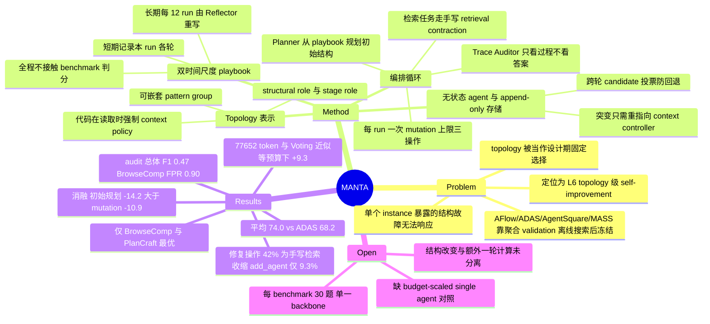

## Summary

MANTA 把 multi-agent 的 communication topology 从设计期固定的对象变成 inference time 可改写的对象：先按任务从 long-term playbook 规划初始 topology，跑完一轮协作后由 Trace Auditor 只看过程证据（明确不看答案对错）判断结构是否失效，触发时执行一次受限结构突变（≤3 个操作）再跑最后一轮。在 Gemma 4 31B 统一 backbone、5 个 benchmark × 30 题 × 3 run 的设置下平均 74.0，比最强 baseline ADAS 的 68.2 高 5.8 点。但增益高度集中在 BrowseComp 与 PlanCraft，且全部 162 次修复操作中 42.0% 是绕开 Planner 的手工 retrieval contraction 规则，而非 Planner 生成的拓扑突变。

## Problem & Motivation

LLM multi-agent system 的能力很大程度由 topology 决定——谁跟谁通信、信息如何路由、在哪里做校验、中间结果如何被修正。作者的判断是：这一层目前几乎全部在**设计期**被固定。手工系统（CAMEL / ChatDev / MetaGPT / multi-agent debate）用预定义角色与交互模式；自动化设计方法（MASS 联合优化 prompt 与 topology，AFlow 用预定义算子搜 workflow，ADAS 用 meta-agent 迭代提案，AgentSquare 搜模块化设计）把 topology 提升为优化目标，但优化依据是**聚合 validation 性能**，选出的 workflow 在任务执行开始后就冻结。

由此产生的具体缺陷是：一个按平均表现选出的结构，无法响应**这一个 instance** 上暴露的结构性故障。论文在 Appendix 给了直接对照——BrowseComp 上 AFlow 的 answer-review-revise 序列后段复用最初的 evidence，ADAS 只保留一个 reasoning agent 而没有独立检索路径，AgentSquare 有 reflection 与工具但没有专门的证据校验通路，MASS 的重复 debate 让 agents 在同一批证据上互相强化。这些都不是"搜得不够好"，而是"结构固定"这一前提本身的后果。

作者把要解决的问题形式化为 **topology-level self-improvement**：不更新权重、不做离线搜索，在解每一个任务的过程中改进自己的通信结构，并把结构经验跨 run 传递。论文用一张 L0–L7 分层图（output / prompt / trace / skill / memory / agent role / topology / weights）给自己定位在 L6。

## Method

**Topology 表示。** 每个 agent 有两类角色：structural role（coordinator / worker / verifier / debater / voter，决定图上的位置）与 stage role（worker 产出带证据的贡献，critic 检查并修订可见 claim），可另配 domain persona 与允许工具列表。Agent 归属于有预定义交互结构的 **pattern group**，group 可嵌套（一个 agent 可把工作委派给子群并综合其汇报），树之外还可加直连边。每个 agent 有 **context policy**，控制它能看到哪些消息、哪些发送者、哪些共享证据，消息传播多远，收到全文还是摘要——这些策略由代码在**读取时**强制执行，而非写在 prompt 里。执行前有确定性校验：group membership、attachment 环、role、agent 预算。作者声明该表示把单 agent 与六种固定 workflow 都涵盖为特例。

**编排循环。** (1) *Query-conditioned planning*：Planner 拿到任务与经验记忆，**不能访问 benchmark 身份或人工设计的 topology**，输出一份紧凑 plan（交互模式、agent 数量、可选 verifier 或嵌套群），由确定性代码展开成完整 topology 并校验。Plan 无效或不可解析时回落到确定性默认结构（coordinator-worker star，预算为 1 时用 singleton）。(2) *Turn execution*：按群结构递归执行，agent 之间传的是**结构化 relay packet**（答案、证据、置信度、未解决问题）而不是原始对话记录；shared-context controller 执行可见性策略，相同工具调用被去重，append-only evidence ledger 累积跨分支的 claim 与证据。(3) *Trace auditing and repair*：LLM Auditor 扫描结构化产物、工具记录、relay packet、置信度、未决问题与证据可见性，**不能查看 benchmark 答案或判分**；至少一个 repairable flag 达到 medium/high severity 时该 run 被标为 flagged。Planner 随后给出**一次** mutation，最多三个操作。

**Mutation 算子（Table 6）**：`add_agent`、`expand_agent_to_group`（把一个 agent 变成新嵌套子群的 hub）、`set_group_pattern`（如 star→debate、star→chain）、`add_edge` / `remove_edge`、`set_context_policy`。操作施加在 topology spec 的副本上并做完整结构校验（唯一群成员、合法标识与角色、无环挂载、合法群模式、agent 上限），不通过则在实例化任何 agent 之前被拒绝，再由保守 repair compiler 尝试映射成一个局部编辑，仍不行就直接终局。

**Retrieval-heavy 任务走另一条路。** 检索型任务用同样的 audit 与预算闸门，但用一个**确定性突变**：resource guard 选出调用搜索最多的非 coordinator agent（确定性 tie-break），把整个 topology 换成只含该 agent 的 singleton，授予全局证据访问权，下达聚焦的证据恢复指令。论文明确说明这条 **retrieval contraction 不增加 agent，也不属于 Planner 的 mutation 语言**。

**双时间尺度 playbook。** short-term playbook 只活在当前 run 内，记录每一轮用了什么 topology、Auditor 报了什么 flag、建议了什么修复、controller 做了什么决定；long-term playbook 存跨 run 的通则（任务特征 + 过程风险 → topology 选择），Planner 在初始规划与选择修复时都会读它，Skill Reflector 每 N run 从近期执行 trace 的摘要重写其中的 lesson。**这条学习回路不接触 benchmark 反馈**：每个 run 只拿到 process 派生的标签（"procedurally clean" = audit 无 flag 且以 decision-grade consensus 收敛），ground truth 仅用于论文评测。

**跨 mutation 的状态管理。** Agent 在 stage 之间是无状态的，没有私有对话历史，全部会话状态放在三个 append-only 存储（packet store / evidence ledger / turn candidates）里，stage prompt 每次从这些存储重建。Mutation 只是把 context controller 重新指向新的 spec，因为所有读取都是惰性的，所以不迁移、不重算、不截断；被移除的 agent 留下的 packet 与 ledger 条目仍在。两个额外机制值得注意：Auditor 的一句话建议会作为**显式不可信的诊断**注入修复轮每个 stage directive，agent 被要求先核对再用；最终答案在**各轮 candidate 之间投票**，所以变坏的 mutation 无法覆盖 mutation 之前更好的答案。

**配置（Table 5）**：初始 agent 上限 5，修复后总上限 10，每 run 1 次 mutation，每次 ≤3 操作，根交互模式 {singleton, star, chain, debate, voting}，meta-agent temperature 0.0，反思批量 12 run。三个 meta-agent（Topology Planner / Trace Auditor / Skill Reflector）与 task agent **共用同一 backbone**。

## Key Results

**设置**：全部方法用 Gemma 4 31B（medium reasoning effort），每 benchmark 30 题，重复 3 次独立 run（因此每 benchmark 90 run，全部 450 run）。

**主表（Table 1，成功率均值，下标为标准差）**

| 类别 | 方法 | BrowseComp | StableToolBench | PlanCraft | WorkBench | MATH | Average |
|:--|:--|--:|--:|--:|--:|--:|--:|
| Reasoning Models | Single Agent | 34.4±4.2 | 74.4±7.9 | 61.1±1.6 | 41.1±5.7 | 85.6±6.3 | 59.3±2.5 |
| | CoT | 26.7±5.4 | 50.0±7.2 | 62.2±12.6 | 35.6±4.2 | 75.6±3.1 | 50.0±3.3 |
| | Self-Consistency | 37.8±1.6 | 51.1±1.6 | 61.1±15.7 | 15.6±1.6 | 78.9±4.2 | 48.9±3.3 |
| | Self-Refine | 14.4±3.1 | 68.9±1.6 | 62.2±15.0 | 35.6±4.2 | **96.7±2.7** | 55.6±3.2 |
| Static MAS | Voting | 43.3±2.7 | 85.6±1.6 | 61.1±1.6 | 41.1±1.6 | 92.2±1.6 | 64.7±0.8 |
| | Group Chat Debate | 61.1±3.1 | 82.2±5.7 | 72.2±3.1 | 21.1±4.2 | 91.1±4.2 | 65.5±1.9 |
| | Fully Linked Debate | 58.9±9.6 | 81.1±5.7 | 73.3±2.7 | 21.1±4.2 | 91.1±1.6 | 65.1±2.5 |
| | Orchestrator w/o Discussion | 53.3±2.7 | 82.2±1.6 | 74.4±1.6 | 23.3±4.7 | 94.4±3.1 | 65.5±1.3 |
| | Orchestrator w/ Discussion | 64.4±4.2 | 80.0±0.0 | 73.3±2.7 | 20.0±2.7 | 93.3±0.0 | 66.2±1.1 |
| | Orchestrator Tree Structure | 54.4±5.7 | 78.9±3.1 | 62.2±3.1 | 16.7±2.7 | 94.4±1.6 | 61.3±1.6 |
| Adaptive MAS | AFlow | 12.2±3.1 | 66.7±5.4 | 21.1±4.2 | 61.1±4.2 | **96.7±0.0** | 51.6±1.7 |
| | ADAS | 48.9±1.6 | 77.8±4.2 | 57.8±13.4 | **66.7±0.0** | 90.0±0.0 | 68.2±3.2 |
| | AgentSquare | 32.2±1.6 | **88.9±5.7** | 34.4±6.8 | 62.2±3.1 | **96.7±2.7** | 62.9±1.7 |
| | MASS | 50.0±2.7 | 50.0±5.4 | 70.0±0.0 | 46.7±0.0 | 95.6±1.6 | 62.5±1.2 |
| Ours | **MANTA** | **76.7±4.7** | 82.2±3.1 | **76.7±3.3** | 43.3±2.7 | 91.1±5.7 | **74.0±1.8** |

5 个 benchmark 中 MANTA 只在 BrowseComp 与 PlanCraft 取得最优；StableToolBench 被 AgentSquare（88.9）与 Voting（85.6）超过，WorkBench 被 ADAS（66.7）、AgentSquare（62.2）、AFlow（61.1）大幅超过，MATH 被 Self-Refine / AFlow / AgentSquare（均 96.7）超过。5.8 点的平均领先主要来自 BrowseComp（比次优的 Orchestrator w/ Discussion 高 12.3 点）。

**消融（Table 2，BrowseComp / WorkBench / PlanCraft / StableToolBench 四者平均）**

| 设置 | Success (%) | Input tok | Output tok | Total tok |
|:--|--:|--:|--:|--:|
| Full MANTA | 71.7 | 94,811 | 5,504 | 100,315 |
| No initial Topology Planner（换成固定 coordinator-worker） | 57.5 | 105,941 | 6,099 | 112,040 |
| No topology mutation | 60.8 | 67,528 | 4,577 | 72,105 |
| No long-term playbook update | 67.5 | 97,145 | 5,474 | 102,620 |
| No long-term playbook | 66.7 | 74,067 | 4,289 | 78,356 |

任务条件化的**初始规划**贡献最大（−14.2），mutation 次之（−10.9），playbook 冻结/移除的降幅较小（−4.2 / −5.0）。注意 mutation 臂同时多花了约 28K token。

**Token（Table 4，四 benchmark 每 run 均值）**：MANTA 77,652（其中 meta-level 9,416 + inner-agent 68,236，meta 约占 12%），Single Agent 21,811，Voting 80,781，Orch. w/o Disc. 115,298，Orch. Tree 135,421，Fully Linked 162,938，Orch. w/ Disc. 184,207，Group Chat 201,651；AFlow 151,070（offline 132,517 + inference 18,553），ADAS 275,403（offline 247,675 + inference 27,728），AgentSquare 157,993（143,056 + 14,938），MASS 181,026（53,148 + 127,878）。

**Playbook 迁移（Table 3，mutation budget 设为 0）**：用 30 个 source-benchmark run 构建 playbook（每 10 run 更新一次）后冻结，在 30 个 target 任务上评测。跨域（PlanCraft ↔ WorkBench）均值 Δ：MANTA **+3.3**（43.3→50.0 与 70.0→70.0），ADAS −3.3，AgentSquare −13.3，MASS −58.3（两个方向均降到 0.0）。MANTA 同域：PlanCraft 70.0→73.3、WorkBench 43.3→46.7，均值 +3.3。

**Trace auditing（450 run）**：无 repair flag 的 run 正确率 **83.2%**，被 flag 的 run **62.5%**，相差 20.7 点；Auditor 命中 117 个错误 run 中的 75 个。分 benchmark（Table 8，每 benchmark 90 run，以"答案错误"为正类）：BrowseComp flag 83 / prec 0.25 / rec 1.00 / FPR 0.90 / F1 0.40；StableToolBench 67 / 0.21 / 0.88 / 0.72 / 0.34；PlanCraft **1** / 1.00 / 0.05 / 0.00 / 0.09；WorkBench 47 / 0.81 / 0.75 / 0.23 / **0.78**；MATH **2** / 0.50 / 0.13 / 0.01 / 0.20；总计 200 / 0.38 / 0.64 / 0.38 / 0.47。

**修复行为**：共 151 次 repair、162 个操作——deterministic retrieval contraction 68（**42.0%**）、`set_group_pattern` 44（27.2%）、`expand_agent_to_group` 33（20.4%）、`add_agent` 15（9.3%）、`set_context_policy` 1（0.6%）、`remove_edge` 1（0.6%）、`add_edge` **0**。140 次 repair 只用 1 个操作，11 次用 2 个，无一次用满 3 个。60.9% 的 repair 使 flag 总数下降，17.9% 不变，21.2% 上升；146 个具名非检索 target 中 59.6% 在下一次 audit 中消失。写入 long-term memory 的更严条件（audit 干净 + decision-grade consensus）对应 85.8% 的正确率，对比全体 74.0%。

**Process flag 与正确率的关联（Table 10）**：9 个模式中 7 个与更低成功率相关，最强四个的落差超过 30 点（evidence lost before synthesis −60.7，missing validator −46.1，branch collapse −38.6，give-up shaped candidate −32.1）；message compaction loss（+2.2）与 tool error cascade（+5.4）没有落差，论文自己指出这两类是可恢复事件、应在 severity gate 中降权。

## Evidence Ledger

| Claim ID | Claim | Type | Source locator | Evidence excerpt | Status |
|:--|:--|:--|:--|:--|:--|
| C1 | MANTA 五 benchmark 平均 74.0±1.8，最强 baseline ADAS 68.2±3.2，领先 5.8 点 | number | Table 1；§Results | "MANTA achieves the strongest average score of 74.0 ... leading the next best method by 5.8 points" | source-verified |
| C2 | 全部方法用 Gemma 4 31B（medium reasoning effort），每 benchmark 30 题 × 3 次独立 run | benchmark-setting | §Models and evaluation benchmarks；Table 1 caption | "All methods use Gemma 4 as the backbone model ... we evaluate 30 questions and repeat each experiment over three independent runs" | source-verified |
| C3 | MANTA 仅在 BrowseComp、PlanCraft 最优；StableToolBench 82.2 < AgentSquare 88.9，WorkBench 43.3 < ADAS 66.7，MATH 91.1 < 96.7 | comparison | Table 1 | "76.7 ... 82.2 ... 76.7 ... 43.3 ... 91.1" | source-verified |
| C4 | 消融：Full 71.7；去初始 Topology Planner 57.5；去 topology mutation 60.8；冻结 playbook 67.5；去 playbook 66.7 | number | Table 2 | "Replacing task-conditioned planning with a fixed topology causes the largest drop, from 71.7 to 57.5" | source-verified |
| C5 | 去掉 mutation 的变体总 token 72,105，Full MANTA 100,315——mutation 臂多耗约 28K token 换 10.9 点 | number | Table 2 | "No topology mutation | 60.8 | 67,528 | 4,577 | 72,105" | source-verified |
| C6 | MANTA 总 token 77,652 为所评 MAS 最低；但 ADAS 的 inference token 仅 27,728，其 247,675 属 offline search | number | Table 4 | "MANTA achieves the lowest overall token consumption among the evaluated multi-agent systems" | source-verified |
| C7 | 论文未提供把 single agent 推理预算放大到 MANTA 水平（约 3.6×）的对照臂；Table 4 不含 CoT/Self-Consistency/Self-Refine 的 token | benchmark-setting | Table 4 | "Single | Single Agent | — | 17,767 | 4,044 | 21,811" | source-verified |
| C8 | Trace Auditor 不可访问 benchmark 答案或判分，long-term playbook 只接收 process 派生标签，ground truth 仅用于评测 | causal-mechanism | §Trace auditing and repair；§Two-Horizon Playbook Memory | "Ground-truth outcomes are used solely for evaluation and are never exposed to the Planner or either playbook" | source-verified |
| C9 | 450 run 中无 flag 的 run 正确率 83.2%，flagged 62.5%，差 20.7 点；Auditor 命中 117 个错误 run 中的 75 个 | number | §How Well Does Trace Auditing Work；Table 9 | "Runs with no repair flag are correct 83.2 percent of the time, compared with 62.5 percent for flagged runs" | source-verified |
| C10 | 初始 audit 作为错误检测器：总体 prec 0.38 / rec 0.64 / F1 0.47；BrowseComp 90 run 中 83 run 被 flag（FPR 0.90），PlanCraft 仅 1、MATH 仅 2 | number | Table 8 | "BrowseComp | 83 | 0.25 | 1.00 | 0.90 | 0.00 | 0.40" | source-verified |
| C11 | 162 个修复操作中 68 个（42.0%）是 deterministic retrieval contraction，该规则不经 Planner、不属于 mutation 语言 | causal-mechanism | Table 11；Appendix §Topology Mutation Operators | "This retrieval contraction does not add agents and is not part of the Planner's mutation language" | source-verified |
| C12 | `add_agent` 仅占 9.3%（15 次），`add_edge` 0 次；140 次 repair 用 1 个操作、11 次用 2 个、无一次用满 3 个 | number | Table 11；§Which operators are used | "140 repairs use one operation and 11 use two; none reaches the three-operation limit" | source-verified |
| C13 | mutation budget 实验采用累积记账：budget b 下任务只要在 ≤b 的任一 budget 成功即计为已解决 | benchmark-setting | §Effect of Mutation Budget | "at budget b, a task is counted as solved if it has succeeded at any evaluated budget up to b" | source-verified |
| C14 | Playbook 迁移（budget 0）跨域均值：MANTA +3.3、ADAS −3.3、AgentSquare −13.3、MASS −58.3 | comparison | Table 3 | "MANTA | 43.3→50.0 | 70.0→70.0 | +3.3" | source-verified |
| C15 | 配置上限：初始 5 agent、修复后 10 agent、每 run 1 次 mutation、每次 ≤3 操作、meta temperature 0.0、反思批量 12 run；meta-agent 与 task agent 同 backbone | benchmark-setting | Table 5；Appendix §MANTA Configuration | "All meta-agents ... use the same backbone model as the task agents, with temperature 0" | source-verified |
| C16 | 修复轮把 Auditor 一句话诊断作为"显式不可信"文本注入每个 stage directive；最终答案在各轮 candidate 间投票 | causal-mechanism | Appendix §Worker Context Management Under Topology Mutation | "Final answer selection votes over these candidates, so a mutation that makes the answer worse cannot overwrite a better incumbent" | source-verified |
| C17 | 论文把两项对照（process flag 的人工标注 precision/recall、同一 trace 前缀出发的 equal-budget paired replay）列为"可提供进一步分辨"的扩展，未报告任何对应结果 | benchmark-setting | §Complementary validation | "Two extensions can provide further resolution. Human annotation ... A paired replay can compare ... with an equal budget continuation" | source-verified |
| C18 | 论文正文与附录未给出代码仓库链接；arXiv HTML 标注 License CC BY 4.0 | license-code | 全文；arXiv 页眉 | "License: CC BY 4.0" | source-verified |
| C19 | 公平性声明仅为"同样的最大 agent 数与可比推理预算"，优化类 baseline"尽可能匹配搜索预算"，无严格 token 等量约束 | benchmark-setting | Appendix §Experimental Setup and Fair Comparison | "all multi-agent methods are constrained to the same maximum number of agents and comparable inference budget" | source-verified |
| C20 | 案例分析称 premature consensus 的修复"补上 star 缺的那条边"，但 Table 11 中 `add_edge` 全程计数为 0 | number | §Rewiring communication and inserting a critic；Table 11 | "added the one edge the star lacked, a direct link between worker and verifier" / "add_edge | 0 | 0.0%" | source-verified |
| C21 | Table 2 的 Full MANTA 为 71.7，而 Table 1 中同样四个 benchmark（BrowseComp/WorkBench/PlanCraft/StableToolBench）的 MANTA 均值为 69.7，论文未解释该差异 | number | Table 1 + Table 2 | (76.7+82.2+76.7+43.3)/4 = 69.725；Table 2 "Full MANTA | 71.7"；全文无调和说明 | source-verified |
| C22 | Table 10 中 evidence lost before synthesis 落差 −60.7、missing validator −46.1、branch collapse −38.6、give-up shaped candidate −32.1；message compaction loss +2.2、tool error cascade +5.4 无负向落差 | number | Table 10 | "Evidence lost before synthesis | 7 | −60.7"；"Message compaction loss | 131 | +2.2" | source-verified |
## Strengths & Weaknesses

**已知 Strength — 演化信号与评价信号被真正切开。** 这是本文相对同类 self-evolving 工作最值得肯定的一点。Trace Auditor 不能查看 benchmark 答案或判分，long-term playbook 只接收 process 派生标签，ground truth 仅用于论文评测。它甚至给出了这条切割的**代价**：作为答案错误的检测器，audit 的总体 precision 只有 0.38、F1 0.47。多数 self-evolving 论文会回避这个测量，因为它会暴露"演化信号其实就是打分模型"的循环。MANTA 反而把它做成一张表，并明确标注"'false positive' 只意味着被 flag 但答案正确"，不是过程检测的真值。

**已知 Strength — 附录的自我拆台密度很高。** 三处尤其少见：(i) 承认 146/146 的 target 一致性是 schema 不变量而非语义正确的证据；(ii) 指出 message compaction loss 与 tool error cascade 两个 flag 与成功率无关联，应在 severity gate 中降权；(iii) 在 §Complementary validation 里列出两个"可提供进一步分辨"的扩展——人工标注的 process flag 精度，以及从同一 trace 前缀出发的 equal-budget paired replay——并且没有报告任何对应结果。措辞是前瞻式的而非"我们没做"，但效果相同：第三点正好是本文最需要的实验（见下），作者点到了，只是没做。

**已知 Strength — "修复 ≠ 加人" 有数据支撑。** 162 个操作里 `add_agent` 只占 9.3%，主导的是 `set_group_pattern`（27.2%，如 star→chain 序列化重复写操作）与 `expand_agent_to_group`（20.4%）。对具体故障的响应也是定向的：重复状态修改在 39 个目标中有 33 个用串行化回应，缺校验在 19 个中有 15 个用加 critic 回应，工具失败分支在 51 个中有 28 个用扩子群回应。这比"多 agent 更好"的粗糙叙事信息量大得多。

**Weakness（最重要）— 平均分领先的来源与"topology 自演化"这一叙事不匹配。** 三条证据叠在一起指向同一个结论：
1. 5.8 点的平均领先几乎全部来自 BrowseComp（比次优高 12.3 点）；去掉 BrowseComp，MANTA 在其余四个 benchmark 上只赢 PlanCraft 且只赢 2.3 点。
2. BrowseComp 的 90 个 run 里有 83 个被 audit flag（FPR 0.90，precision 0.25）。也就是说在这个 benchmark 上"是否需要修复"这个判断**几乎恒为真**，adaptive 退化成固定的两阶段流水线。
3. 修复动作的 42.0% 是 deterministic retrieval contraction——一条手写规则（选搜索调用最多的非 coordinator agent，塌缩成 singleton，给全局证据访问权），论文自己说明它**不经 Planner、不属于 mutation 语言**。

合起来：主结果的最大增益块，很可能等价于"在检索型任务上，第一轮 fan-out 失败后固定收缩成一个有全局证据的单 agent"。这是个有用的工程结论，但它不是 topology 自演化，也不需要 LLM Auditor 或 playbook。论文没有做"仅保留 retrieval contraction、去掉 Planner 与 playbook"的消融来隔离这一项。（推测，但三条证据方向一致。）

**Weakness — 预算匹配只做到"可比"，且关键对照缺失。** 附录的公平性声明是"same maximum number of agents and comparable inference budget"，优化类 baseline"尽可能匹配搜索预算"——没有 token 等量约束。实测数据里：
- **与 static MAS 的对比反而是本文最干净的部分**：MANTA 77,652 token 得 74.0，Voting 80,781 token 得 64.7，两者近似等预算，+9.3 点可信。
- **与 single agent 的对比不成立**：Single Agent 21,811 token 得 59.3，MANTA 用了 3.6 倍 token 得 74.0，而论文没有任何"把单 agent 预算放大到 78K"的对照臂（Self-Consistency 是自然候选，但 Table 4 根本没报它的 token，且它 48.9 的分数低于 Single Agent 的 59.3，说明该实现被这个 reasoning backbone 拖累了，不能当作预算放大的代表）。
- **"token 最省"的说法依赖记账口径**：MANTA 总量最低是把 ADAS 的 247,675 offline search 计入总量的结果。但 offline 成本可跨全部任务摊销，MANTA 的 77,652 是**每 run 都付**。只看推理期，ADAS 的 27,728 比 MANTA 便宜 2.8 倍，AgentSquare 14,938 便宜 5 倍。论文没有给出摊销点（跑多少任务后 MANTA 才更省）。
- **mutation 的收益没有等预算对照**：消融的 "No topology mutation" 同时砍掉了结构改变**和**多出来的那一轮计算（72,105 → 100,315 token）。缺的臂是"同一 topology 再跑一轮"。本文其实还有第三个混淆项——修复轮会额外注入 Auditor 的一句话诊断作为提示，所以增益也可能来自这段自然语言反馈而非拓扑改变。这三者（结构 / 额外一轮 / 诊断文本）在现有实验里完全绑在一起。作者在 §Complementary validation 提出的 paired replay 正是拆开它们的正确设计，但没有执行。

对照 vault 里 [[Papers/2606-SkillMemoryBudget]] 的结论——online 增强模块在 token-matched vanilla 面前普遍失守——MANTA 在 static-MAS 这一侧过了关（等 token 下确有增益），在 single-agent 与 mutation 归因这两侧没有过关。

**Weakness — mutation budget 的单调性是记账方式的必然，不是发现。** 原文的计分规则是"budget b 下，任务只要在 ≤b 的任一 budget 上成功过就计为已解决"。这在定义上就不可能下降，等价于 best-of-b 的累积覆盖率。它能说明"更多修复机会能覆盖更多任务"，但完全不能支持"预算 3 比预算 1 的系统更好"，因为缺少同样是 best-of-b 的对照（例如同一 topology 重跑 b 次取最优）。同理，最终答案在**各轮 candidate 之间投票**这一机制本身就是一次跨轮 best-of-N 选择，是 MANTA 独有而单轮 baseline 没有的优势，论文未做隔离。

**Weakness — 统计功效。** 每 benchmark 30 题，一题 = 3.33 个百分点。于是 playbook 迁移那张表里所有的 "+3.3" 都恰好等于**一道题**：跨域两个方向合计 43.3→50.0（2 题）与 70.0→70.0（0 题），同域两个方向各 1 题。论文用这些数字论证"MANTA 学到的是可继承的结构知识而非固定 workflow"，证据强度撑不住这个结论。baseline 侧的负值（MASS −58.3）倒是量级足够大。主表也没有做显著性检验，而 BrowseComp 上 MANTA 的标准差是 ±4.7。

**Weakness — WorkBench 是一个未被解释的反例。** 该 benchmark 上 static MAS 全线崩塌（15.6–23.3），而 Single Agent 有 41.1，说明多 agent 化本身在这个任务族里是有害的。MANTA 拿到 43.3——只勉强回到单 agent 水平，被 ADAS 的 66.7 甩开 23.4 点。关键在于 **singleton 就在 MANTA 的根交互模式集合里**，而 WorkBench 恰恰是 audit 质量最高的 benchmark（F1 0.78，precision 0.81，47/90 被 flag）。如果拓扑适配真的在工作，这是它最该收敛到单 agent 的场景，但它没有。这提示 Planner 有系统性的"多 agent 偏好"，或者过程信号无法表达"整个多 agent 组织本身是错的"这类诊断——现有的 mutation 算子里也确实没有"收缩规模"这一族（唯一的收缩是检索专用的手写规则）。

**Weakness — 泛化面很窄。** 单一 backbone（Gemma 4 31B，medium reasoning effort），无跨模型验证，也就无法判断增益中有多少来自这个特定模型的行为特性（例如它在 CoT / Self-Consistency 提示下反而变差，说明 prompt-level 干预与该 backbone 的交互很强）。每 benchmark 只取 30 题，抽样方法未说明（BrowseComp 原始规模远大于此）。未见代码仓库链接，可复现的只有附录里的 prompt 模板。

**小瑕疵。** (i) 消融表的 Full MANTA 为 71.7，而主表在同样四个 benchmark 上的均值是 69.7，论文未解释差异（推测是不同 run 或单次评测）；(ii) 案例分析说 premature consensus 的修复"补上了 star 缺的那条边"，但 Table 11 里 `add_edge` 全程计数为 0——实际用的应是 `set_group_pattern`（star→debate），叙述与算子统计对不上；(iii) 摘要只说"在 PlanCraft 上取得最佳结果"，主表里 BrowseComp 也是加粗最优，摘要低估了自己。

**对领域的意义。** 把 topology 从"部署前搜索目标"改成"执行中可写对象"这个 problem formulation 是对的，而且它明确指出了本 vault 综述里那句"这类工作多为 offline 搜索，演化在部署前完成"所留下的空位。真正可继承的技术点有三个：无状态 agent + append-only 共享存储 + 读取时解析可见性，使得拓扑突变**零迁移成本**（这是让 test-time 结构改变变得便宜的关键工程前提）；只用过程信号做演化闸门并如实报告其精度；以及跨轮 candidate 保留，使坏的突变不会造成回退。有待后续工作解决的是归因——在把"额外一轮计算"、"自然语言诊断"、"手写检索收缩"这三项分离出去之后，纯粹由拓扑变更贡献的增益还剩多少，目前是未知的。

## Mind Map

## Notes

**与 vault 已有笔记的关系**

- [[Papers/2605-MetaTeam]]（Evolve as a Team）是最近的邻居，也是最有价值的对照：两者都把"演化对象"从单 agent 提到团队组织层，都是 training-free、只更新 scaffold。**分歧在演化的时间尺度**——Meta-Team 在任务**之间**演化（post-task 分布式反思 → 更新 agent patch / teammate profile / 团队角色构成），MANTA 在任务**之内**演化（一轮协作后的 trace 审计 → 一次受限结构突变），跨 run 只保留原则性的 playbook。两者的证据强度也形成对比：Meta-Team 的组织消融（collaborative 53.9 > centralized 49.8 > partitioned 44.5 > no-evolution 40.8）直接隔离出协同交换的净增益，而 MANTA 的 mutation 消融把结构改变、额外一轮计算、诊断文本注入三者绑在一起。若做 survey，二者应放在同一小节并按"演化时机"轴区分。
- [[Papers/2606-RAAS]] 是同问题的相反解法：同样针对 agentic system architecture，但走的是训练侧——在 Agentic Supernet 上用 GRPO 式 peer-comparison + 多 trial 聚合学 query-conditioned 架构分布，演化在部署前完成。MANTA 恰好是 RAAS 所属那条路线（MaAS / RAAS / AFlow / ADAS）在推理期的对立面。RAAS 用两个 backbone（gpt-4o-mini、qwen-2.5-72b）验证，MANTA 只有一个，这一点上 RAAS 更稳。
- [[Papers/2606-SkillMemoryBudget]] 提供的是**检验标准而非同主题**：它用 token-matched vanilla 对照证伪了一批 online 增强模块。按该标准审 MANTA，结论是**部分通过**——vs static MAS（77,652 vs Voting 80,781，+9.3 点）这一侧成立；vs single agent（21,811 → 无放大预算对照）与 mutation 归因（+28K token 与 +10.9 点绑定）这两侧不成立。这条对照关系应写进任何引用 MANTA 主结果的地方。
- [[Topics/SelfEvolvingAgents-Survey]] §7.1 现有表述是"这类工作多为 offline 搜索，演化在部署前完成"——MANTA 正好是该句的例外，survey-refresh 时应把它作为 topology 演化的 inference-time 分支补入，同时在 §7 的 credit assignment 讨论里加一条：MANTA 的演化信号是**纯过程信号**（不接触 ground truth），与 DGM/HGM 用 benchmark 表现做 parent selection 形成对照，且论文实测了这种过程信号与正确率的相关强度（无 flag 83.2% vs flagged 62.5%）——这是该 survey §3.5"演化时机与 gate 轴"目前缺少的定量锚点。

**核验与元数据**

- 22 条高风险 claim 由独立 verifier 逐条定位原文，全部 source-verified，无降级、无冲突。
- `institute` 留空是核查结果而非遗漏：arXiv HTML 的作者块只渲染出上标数字与 dagger（MaoXun Huang¹,†、Jerry Wang²,†、Yi-Cheng Lai³,†、Zhenxing Zhang¹、Claire Cardie¹、Hen-Hsen Huang³），没有 affiliation 元素、没有脚注文本，全文检索 univers / institute / academia sinica / cornell / laborator 均无命中。等 v2 或正式版补齐。
- Table 3 的 WorkBench 同域方向按字面相减为 +3.4（43.3→46.7），论文自己在表与正文中都写 +3.3；笔记沿用论文口径。

**待跟进的疑问**

1. 把 deterministic retrieval contraction 单独接到一个固定的两 agent baseline 上，能拿到 BrowseComp 上多少分？这决定了主结果里"拓扑自演化"的真实份额。
2. 论文的 mutation 语言里没有"缩小系统"的算子（唯一收缩是检索专用手写规则）。WorkBench 上多 agent 化明显有害而 MANTA 未能收敛到 singleton，是否正是这个表达能力缺口造成的？
3. Auditor 用与 task agent 相同的 backbone。换更弱/更强的 auditor backbone，process flag 的 precision（现为 0.38）如何变化？如果 audit 质量是瓶颈，这应该是最有杠杆的一处 scaling。
