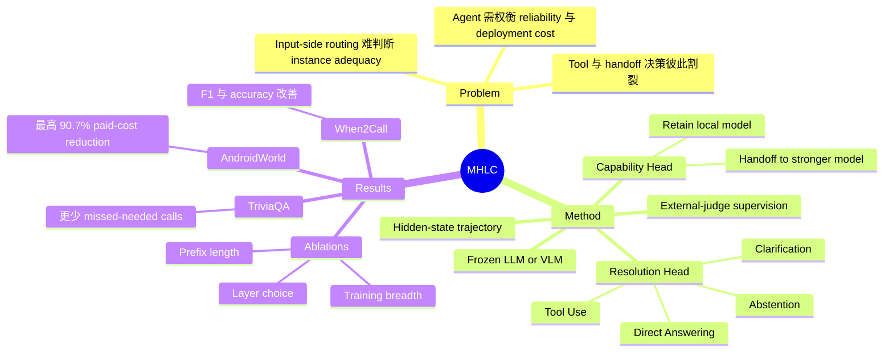

## Summary

Multi-Head Latent Control（MHLC）在冻结的 LLM/VLM 上训练两个读取生成期 hidden-state trajectory 的轻量控制头，以同一接口分别决定是否 handoff 给更强模型，以及执行 Clarification、Tool Use、Abstention 或 Direct Answering。论文报告其在 AndroidWorld 将 Qwen3-VL-4B→32B routed execution 的 score 从小模型的 0.47 提至 0.60，同时减少 90.7% paid API cost；在 When2Call 与 TriviaQA 上也改善 intervention/tool-use decision。其价值在于把 latent self-assessment 变成可执行的 agent control signal，但效果依赖外部 judge 监督、hidden-state access 与 control-head calibration。

## Problem & Motivation

LLM agent 的可靠部署不仅要生成下一 token，还要判断当前模型是否足以完成任务、是否需要更强模型、额外信息或外部工具，以及何时应 abstain。现有 model routing 多依赖 prompt/category 等 input-side signal，multi-agent orchestration 往往引入较重 scaffolding 或专门训练，而 decoding-side 方法主要在大模型已被调用后加速生成。作者因此把问题改写为 deployment-time latent control：能否直接从冻结模型自己的生成轨迹中读取 instance-level adequacy 与 intervention need，从而减少不必要的大模型和工具调用。

## Method

- **输入表示**：只读取与已生成 token 对齐的 hidden states，不使用 prompt 或其他 conditioning signal；variable-length trace 经投影压缩成 fixed-budget representation。两类任务可选择不同层：默认 Capability Head 使用 final-layer trace，Resolution Head 使用经验选择的 middle-layer trace；两者沿用同一个固定 latent encoder architecture，backbone 不更新。
- **Capability Head**：输出标量 \(p_{\mathrm{cap}}\in[0,1]\)，估计当前模型对该 instance 是否 adequate。训练数据是一个 120K-example mixed dataset，覆盖 visual QA、GUI grounding、reasoning、open-domain QA 与 multi-turn tool use；每个模型生成由外部 LLM judge 对照 reference 产生 \([0,1]\) scalar label，以带 imbalance reweighting 的 weighted MSE 训练。
- **Resolution Head**：输出 \([s_{\mathrm{info}},s_{\mathrm{tool}},s_{\mathrm{cant}}]\)，分别对应 Clarification、Tool Use 与 Abstention；Direct Answering 由 all-zero target 隐式表示。训练样本来自 When2Call，作者用 external judge LLM 离线构造 gold resolution label，再以逐 action BCE 监督 latent trace，即使 backbone 的 surface action 本身错误也仍按 gold label 训练。
- **Inference policy**：先查 Capability Head；默认 \(p_{\mathrm{cap}}<0.8\) 时 handoff 给更强模型，否则留在当前模型。留在当前模型时，Resolution Head 的最高 score 超过 0.5 才触发对应 intervention，否则直接回答。对于 long-horizon agent loop，该决策可在每一步重复；prefix variant 则只观察前 200 个生成 token，以提前 handoff。

## Key Results

- **AndroidWorld（Table 1）**：Qwen3-VL-4B→32B routed execution 的 score 为 0.60，相比 local 4B 的 0.47 更高；paid API cost 相对 always-32B 减少 90.7%。Qwen3.5-9B→27B 的 score 从 local 9B 的 0.51 提至 0.56，paid API cost 减少 85.8%。
- **六个 capability benchmark（Table 2）**：在 CharXiv-Reasoning、MathVerse、MathVista、ScreenSpot-Pro、SimpleVQA 与 MMLU-Pro 上，不同 routed 配置的 Overall paid-cost reduction 为 27.2%–53.0%；其中 Qwen3.5-9B→27B-Thk 的 Overall score/cost 是 0.72/\$12.85，而 always-large 是 0.73/\$27.35。
- **When2Call（Table 3）**：Qwen-VL-2B 加 Resolution Head 后，F1 从 37.3 升至 49.0，accuracy 从 52.7 升至 65.1；Qwen3.5-4B 的 F1/accuracy 则从 43.5/57.9 升至 50.0/63.6。
- **TriviaQA web-search decision（Table 4）**：最佳相对增益达到 +158.9% score，并减少 65.5% missed-needed calls。具体到 Qwen3-VL-32B，Capability Head 将 score 从 0.672 提至 0.778、tool-call precision 从 72.7% 提至 75.5%，missed-needed calls 从 328 降至 222。
- **Prefix-time control（Table 5）**：在 Qwen3-VL-4B-Thk 上，Full/Full、Full/Prefix-200、Prefix-200/Prefix-200 的 ROC-AUC 分别为 0.86、0.78、0.80，ECE 分别为 0.14、0.20、0.18；在相同 200-token inference budget 下，prefix-specific training 优于直接复用 full-trajectory head，但仍弱于完整轨迹。
- **Ablations（Tables 8–11）**：Capability Head 的 final layer 达到 AUPR-C 0.91、AUPR-I 0.75、ECE 0.14，但 middle layer 的 ROC-AUC 略高（0.87 vs. 0.86）；Resolution Head 的 middle layer 在 When2Call 达到 F1 52.07、accuracy 70.1，高于 Layer 5 与 final layer。训练数据 breadth 也关键：在 ScreenSpot Pro 上，Full 120K mixed data 相比 visual-math only 将 ROC-AUC 从 0.62 提至 0.84、ECE 从 0.59 降至 0.31。
- **失败 baseline（Appendix B.2, Table 7）**：prompt-level self-switching 只在 ScreenSpot-Pro 的 4/1581（0.25%）和 MMLU-Pro 的 28/1000（2.8%）样本上 escalation，最终 score 0.4719/0.7030，基本停留在小模型的 0.47/0.71；latent routed 对应为 0.64/0.78。

## Evidence Ledger

| Claim ID | Claim | Type | Source locator | Evidence excerpt | Status |
|:--|:--|:--|:--|:--|:--|
| C1 | MHLC 冻结 backbone，只训练两个轻量 control heads。 | causal-mechanism | §3.4 Control Heads Training | “We freeze the backbone and train only the two lightweight control heads.” | source-verified |
| C2 | AndroidWorld 上，Qwen3-VL-4B→32B routed score 从 local 0.47 提至 0.60，paid API cost 减少 90.7%。 | number | §4.1; Table 1 | “Qwen3-VL-4B → 32B improves score from 0.47 to 0.60 with a 90.7% reduction in paid API cost” | source-verified |
| C3 | AndroidWorld 上，Qwen3.5-9B→27B routed score 从 local 0.51 提至 0.56，paid API cost 减少 85.8%。 | number | §4.1; Table 1 | “Qwen3.5-9B → 27B improves score from 0.51 to 0.56 with an 85.8% cost reduction.” | source-verified |
| C4 | Table 2 的 routed 配置 Overall paid-cost reduction 范围为 27.2%–53.0%。 | comparison | §4.1; Table 2 | “27–53% average cost reduction across benchmarks” | source-verified |
| C5 | When2Call 上，Qwen-VL-2B 加 Resolution Head 后 F1 37.3→49.0、accuracy 52.7→65.1。 | number | §4.2; Table 3 | “on Qwen-VL-2B, F1 improves from 37.3 to 49.0 and accuracy from 52.7 to 65.1” | source-verified |
| C6 | TriviaQA web-search setting 的最大相对 score gain 为 +158.9%，missed-needed calls 最大减少 65.5%。 | number | §1 Contributions; Table 4 | “up to +158.9% relative score gain and 65.5% fewer missed-required tool calls.” | source-verified |
| C7 | Qwen3-VL-32B 加 Capability Head 后 TriviaQA score 0.672→0.778、precision 72.7%→75.5%、missed calls 328→222。 | number | §4.3; Table 4 | “raises task score from 0.672 to 0.778, and reduces missed-needed web calls from 328 to 222.” | source-verified |
| C8 | Qwen3-VL-4B-Thk 的 Prefix-200 inference 中，prefix-trained head 的 ROC-AUC/ECE 为 0.80/0.18，优于 full-trained head 的 0.78/0.20。 | comparison | §4.4; Table 5 | “training directly on prefixes recovers stronger prefix-time quality.” | source-verified |
| C9 | Capability Head layer ablation 中，final layer 的 AUPR-C/AUPR-I/ECE 为 0.91/0.75/0.14，但 ROC-AUC 0.86 略低于 middle 的 0.87。 | number | Appendix C.1; Table 8 | “The final layer is the best overall choice and is therefore used by default.” | source-verified |
| C10 | Resolution Head layer ablation 中，middle layer 在 When2Call 达到 F1 52.07、accuracy 70.1。 | number | Appendix C.2; Table 9 | “The middle layer provides the strongest signal for resolution intervention prediction” | source-verified |
| C11 | ScreenSpot Pro 上，Full 120K mixed-data head 相比 visual-math-only head 的 ROC-AUC 为 0.84 vs. 0.62，ECE 为 0.31 vs. 0.59。 | comparison | Appendix C.3; Table 10 | “Narrow visual-math-only training transfers poorly to ScreenSpot Pro” | source-verified |
| C12 | Prompt-level self-switching 在 ScreenSpot-Pro 与 MMLU-Pro 上仅分别 escalation 4/1581 与 28/1000 个样本。 | number | Appendix B.2; Table 7 | “just 4 / 1581 cases (0.25%) on ScreenSpot-Pro and 28 / 1000 cases (2.8%) on MMLU-Pro.” | source-verified |
| C13 | 实验覆盖 Qwen3-VL、Qwen3.5、Gemma 三个 backbone family，并包含 language、vision-language 与 long-horizon agent setting。 | benchmark-setting | §4 Experiments, Backbones and Benchmarks | “We evaluate three backbone families:” | source-verified |
| C14 | paid API cost 把小模型视为本地免费，只计 fallback-model usage。 | benchmark-setting | Appendix D Cost Estimation Details | “the reported paid API cost reflects only fallback-model usage.” | source-verified |
| C15 | Gemma 的 API cost 使用 Qwen3-VL pricing table 作为 proxy。 | benchmark-setting | Appendix D Cost Estimation Details | “we use the Qwen3-VL pricing table as a proxy” | source-verified |
| C16 | Capability Head 的 adequacy label 由 Qwen3vl 30B-A3B judge 对照 ground truth 构造。 | causal-mechanism | §4 Training/eval pipeline | “using Qwen3vl 30B-A3B as judge model.” | source-verified |
| C17 | Resolution Head 的 When2Call gold label 由 external judge LLM 离线构造。 | causal-mechanism | Appendix A.2 | “We therefore apply an external judge LLM offline to derive a gold resolution decision label” | source-verified |
| C18 | 论文正文列出了 MHLC 的 GitHub code URL。 | license-code | Abstract, Code line | “Code: https://github.com/Amirhosein-gh98/Multi-Head-Latent-Control” | source-verified |
| C19 | Table 3 的 `Backbone + Resolution Head` 行未给出 Gemma-2B-Thk 的 F1/accuracy 数值。 | benchmark-setting | Table 3, final two cells | “Backbone + Resolution Head” | source-verified |
| C20 | Appendix E 把 control-signal quality、robustness 与 calibration 列为后续改进方向。 | causal-mechanism | Appendix E Limitations | “further improve the quality, robustness, and calibration of these control signals.” | source-verified |
| C21 | 论文主实验报告 point estimates 与 estimated API cost，但未报告置信区间、重复运行方差或 statistical significance。 | benchmark-setting | §4 Metrics; Tables 1–11 | “we report each benchmark’s native task score alongside estimated API cost.” | source-verified |
| C22 | staged arXiv HTML 的 license infobox 标示 CC BY 4.0。 | license-code | arXiv HTML infobox | “License: CC BY 4.0” | source-verified |
| C23 | MHLC 必须访问与 generated tokens 对齐的 hidden states，不能直接作为 text-only closed-API wrapper。 | causal-mechanism | §3.2 Control Prediction from Hidden States | “We restrict inputs to hidden states aligned with generated tokens” | source-verified |
| C24 | 实验为各 backbone 分别训练 control head，未评估同一 head 的跨-backbone直接迁移。 | benchmark-setting | §4 Training/eval pipeline | “We train lightweight control heads on top of Qwen3-VL-2B/4B/32B” | source-verified |
| C25 | Capability supervision 依赖 LLM judge，但论文未报告 judge sensitivity 或 human-label audit。 | benchmark-setting | §3.4.1; Appendix A.1 | “generated by an LLM-based judge that compares the model’s output to the reference answer.” | source-verified |
| C26 | 论文未按 false-retain、false-handoff 或 wrong intervention 报告 MHLC 自身的 qualitative failure cases。 | benchmark-setting | Appendix E Limitations | “further improve the quality, robustness, and calibration of these control signals.” | source-verified |
| C27 | cost accounting 基于 model-call token counts，未计 control-head inference 与 hidden-state extraction 的额外 latency/memory。 | benchmark-setting | Appendix D Cost Estimation Details | “We estimate API cost from the observed input and output token counts of each model call.” | source-verified |

## Strengths & Weaknesses

**Strengths**

- 方法把 model adequacy 与 within-model intervention 分解成两个可组合信号，并保持 backbone frozen；这一接口比为每个 routing/tool-use 场景单独微调完整模型更简洁，也更贴近 agent loop 中“下一步做什么”的决策边界。
- 评估覆盖 Qwen3-VL、Qwen3.5、Gemma 三个 family，以及 AndroidWorld、When2Call、TriviaQA 和六个 capability benchmark；既有 long-horizon GUI agent execution，也有结构化 intervention 与 web-search escalation，外部效度比单一 QA routing 实验更强。
- ablation 不只调 threshold，还检查 layer choice、training-data breadth、prefix length，并加入 prompt-level self-switching 与 token confidence 两种自然替代方案。尤其 self-switching 的 severe under-escalation 提供了有信息量的 negative baseline。
- 论文列出 GitHub code URL，便于后续检查实现；本笔记未联网核查 repository 内容、可运行性或 code license。

**Weaknesses**

- 所谓 latent “self-awareness” 不是无监督涌现能力：Capability label 依赖 Qwen3vl 30B-A3B judge 与 reference，Resolution label 也由 external judge LLM 派生。judge bias、label noise 或 reference 不充分可能直接进入 control policy，论文没有做 judge sensitivity 或 human-label audit。
- MHLC 需要访问并保存生成 token 对齐的 hidden states，因此不能直接用于只暴露 text/logprob 的 closed API；而且每个 backbone 都单独训练 head，论文未验证 control head 跨 backbone 直接迁移。
- paid-cost 结果建立在 primary model 本地运行且成本记为 0 的设定上，只统计 fallback API；Gemma 还使用 Qwen3-VL pricing proxy。因此 90.7% 等数字是该 accounting setting 下的 paid API reduction，不等于端到端 compute、latency 或 energy reduction。
- Appendix E 只笼统指出 control-signal quality、robustness 与 calibration 仍需改进，没有按 false-retain、false-handoff、wrong intervention 给出 MHLC 自身的 qualitative failure cases，也未报告置信区间、重复运行方差或 statistical significance。Table 3 的 `Backbone + Resolution Head` 行还未给出 Gemma-2B-Thk 两个单元格的数值，降低了该比较的完整性。
- prefix control 仍需先生成 200 tokens，且 Table 5 显示 Full/Prefix-200 的 calibration 明显退化；论文没有把 control-head inference、hidden-state extraction 或提前生成本身的额外 latency/memory 纳入总体成本。

## Mind Map

## Notes

- **Rating 4/5**：对 GUI-agent / AI-agent research 有较强参考价值。关键 insight 不是再做一个 prompt router，而是把 generation-internal signal 变成可插拔的 execution control interface；方法简单，覆盖的 action space 也比单一 correctness probe 更接近真实 agent runtime。
- **最值得复现的点**：先复核 AndroidWorld 的 per-step routing protocol 与 cost accounting，再检查 false-retain 和 false-handoff 在 trajectory 中如何累积；仅复现 aggregate success/cost 不足以证明控制信号真的更可靠。
- **研究启发**：GUI agent 可把 Capability Head 扩展为 step-level verifier/risk head，但应把“任务做不出来”“当前 observation 不足”“需要 human confirmation”“动作不可逆”拆成不同控制信号，而不是继续压成一个 scalar confidence。
- **待回答问题**：固定 0.8/0.5 threshold 在 distribution shift 下是否稳定？external judge 的偏差会否被 head 放大？不同 backbone 是否能共享 encoder/head？closed-model 场景能否用 activation proxy 或 local critic 获得同类收益？
- staged arXiv HTML 标示论文 license 为 CC BY 4.0；GitHub repository 的 code license 与实际可用性未做网络核查。
