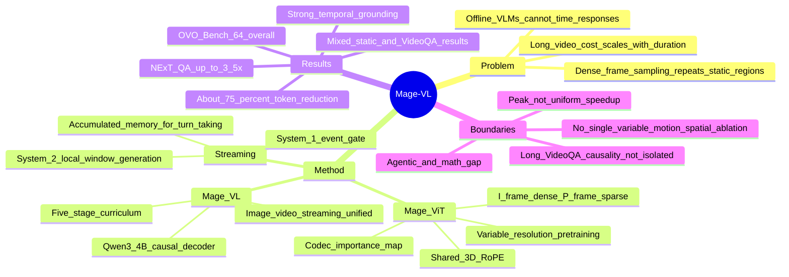

## Summary

Mage-VL 把 streaming VLM 的效率问题前移到视觉编码之前：Mage-ViT 根据 codec 的 motion vector 与 residual energy 只编码信息量高的 patches，再由轻量 event gate 决定何时调用 causal language decoder。64-frame 受控设置约减少 75% visual tokens；NExT-QA 上 tc8 达到 80.8 / 415s，对比 Qwen3-VL-4B 的 79.8 / 1460s，但静态、视频与空间 benchmark 并非全面领先。其关键边界是所谓 System 1 实质为 silent/speak gate，motion→spatial 与 dense captions→long VideoQA 的因果解释均缺少 single-variable ablation，3.5× 也只是特定 benchmark、特定硬件上的峰值 wall-clock speedup。

## Problem & Motivation

主流 VLM 通常用 uniform frame sampling 把视频转成稠密、离散的多图输入。连续视频中大量背景区域跨帧不变，这种接口却会重复编码静态 patches，使视觉计算和 token 数随时长快速增长；同时，离线处理完全部 frames 后才回答也不适合需要及时响应的 streaming interaction。

Mage-VL 的核心问题不是简单扩大 context window，而是：能否在进入昂贵 ViT 和 LLM 之前利用视频 codec 已计算出的 temporal predictability，持续保留变化区域、跳过冗余区域，并让同一个模型同时处理 image、offline video、用户发起的 QA 与主动 streaming response。

论文借用 dual-process cognition 描述该系统，但需要把这一叙事与实际机制分开：模型没有实现一个独立的快速感知 agent 和一个独立的慢速 planner；它实现的是高频 event gate 与低频 gated language generation 两条计算路径。

## Method

### 1. Codec-native Mage-ViT

Mage-ViT 先把输入划分为 16×16 pixel patches。对 HEVC/H.265 stream，它用 P-frame 的 motion-vector magnitude 与 residual energy 构造 patch importance map；I-frame patches 全部保留，P-frame 只按 importance 选择 top-k。对 neural codec DCVC-RT，则直接使用 probability model 给出的 local coding cost。

被选择的 patches 会重新打包成 canvas，但通过 shared 3D rotary positional encoding 保留其在未裁剪时空网格中的原始位置。ViT trunk 为 24-layer pre-norm Transformer，hidden dimension 1024、16 attention heads，并使用 Flash Attention 2。除 codec mode 外，模型还支持 chunk-wise uniform sampling 与 collage patchification。

### 2. Mage-ViT pre-training

Mage-ViT 不继承现成 image encoder，而是以 MetaCLIP features 聚类得到的 visual prototypes 为目标，执行 negative-sampling cluster discrimination。

训练分两阶段：

- Stage 1 使用 variable-resolution images，让 encoder 学会适应不同 spatial token budgets；
- Stage 2 联合 image 与 video，在 codec、chunk-wise、collage 三种输入模式间混合训练，激活 temporal sparsification。

论文报告 Mage-ViT 从零训练约使用 560M unlabeled images 与 100M unlabeled video frames。这个规模小于作者列举的部分 web-scale image-text encoder，但“更少数据即可替代 web-scale pre-training”仍是基于当前模型、目标函数和 benchmark 的经验结论，不是普遍 scaling law。

### 3. Unified Mage-VL

Mage-ViT features 先经过 two-layer MLP projector，再输入以 Qwen3-4B-Instruct-2507 初始化的 causal language decoder。Image 被表示为一个 spatial token block；video 则由按时间排列的 codec-token windows 组成，不需要单独的视频 decoder。

Mage-VL 的训练 corpus 约包含：

- 350M image-caption pairs；
- 54M image-instruction samples；
- 7.95M unique video-caption samples；
- 3.35M streaming samples。

7.95M video-caption samples 又按时长分层：4.2M 不超过 30 秒、2.7M 为 30–60 秒、0.7M 为 60–180 秒、350K 约为 10–15 分钟。长视频 subset 在 frame-sampled 与 codec-stream 阶段被重复使用，但在 unique total 中只计一次。

### 4. Progressive curriculum

五阶段 curriculum 依次建立：

1. image/short-video caption alignment；
2. image instruction following 与 short temporal grounding；
3. 更长 temporal horizon；
4. codec-native long-context adaptation；
5. proactive streaming alignment。

Stage 4 把 long-video captions 转成 codec windows，并保留 image、spatial、GUI 与 tracking data，避免只适应视频。论文称长 VideoQA 不需要专门 SFT：主模型没有使用 explicit long VideoQA SFT，而是依赖 short-video SFT 与 detailed captions；现有结果证明这个具体 recipe 可以工作，但没有单变量实验能够证明 detailed captions 单独构成充分原因。

### 5. System 1 / System 2 的真实边界

System 1 是 lightweight cognition/event gate。它读取 EPFE 维护的 accumulated streaming perception memory，并在每个候选时刻预测 `silent` 或 `speak`。

当 gate 打开时，所谓 System 2 并不是独立 planner，而是调用 frozen base VLM，以最近 N 个 codec-assembled segments 构成的 local sliding window 做 autoregressive generation。Stage 5 中 visual backbone、EPFE 和 language model 都保持冻结，只训练 cognition gate。因此，长程 streaming memory 服务于 turn-taking decision，文本生成仍主要依赖局部视觉窗口。

### 6. AI4AI 与 Zero-Vision 实验

Image recaptioning pipeline 用 frozen Qwen3-VL-32B 生成 captions，再由 GPT-5 rubric scorer 评价 completeness、redundancy、coherence 与 OCR fidelity，由 coding agent 提议 prompt 或 harness 修改，并保留 human approval gate。该闭环带来多项 downstream improvement，但依赖 proprietary model-assisted data production，完整复现成本较高。

Zero-Vision SFT + RL 是一组独立的 post-training 实验：它基于 LLaVA-OV-1.5 Quick Start data、pure-text reasoning SFT 与 OpenMMReasoner RL，不是 Tables 3–7 所评测的 Mage-VL checkpoint。它可以作为未来训练 recipe 的线索，不能直接归入主模型当前能力。

## Key Results

### Token 与 wall-clock efficiency

- 在 64-frame、每帧 16×16 tokens 的设定中，选择 `B=4096`，对应约 **75% visual-token reduction**。
- NExT-QA 上，Mage-VL tc8 为 **80.8 / 415s**，Qwen3-VL-4B 为 **79.8 / 1460s**，即约 **3.5× wall-clock speedup** 且分数略高。
- 计时使用单节点 **8×B200**。Qwen 的时间排除了估算 video-loading，而 Mage 报告 full measured wall-clock time。
- 速度优势并不均匀：TempCompass 上 Qwen 为 433s，快于 Mage tc16/tc32 的 510s/729s；VSI-Bench 上 Qwen 为 255s，也快于三个 Mage settings。LongVideoBench 的 tc16 计时 1308s、tc32 却为 345s，显示 wall-clock 数据存在明显非单调性，不能把峰值 speedup 外推为稳定倍率。

### Static image 与 spatial benchmarks

Table 3 不支持“静态任务全面优于 Qwen3-VL-4B”的表述。Mage 在 DocVQA **95.14 vs. 94.69**、InfoVQA **80.33 vs. 79.50**、MMStar **67.32 vs. 62.04** 上领先，但在 CC-OCR Doc **32.25 vs. 39.69**、DUDE **46.44 vs. 50.98**、TextVQA **77.28 vs. 80.55** 上落后。

Spatial block 的代表性优势包括：

- CV-Bench-3D：**94.75 vs. 92.30**
- EmbSpatial：**82.67 vs. 77.50**
- CrossPoint：**80.00 vs. 26.90**

但 Mage 在 ERQA **36.00 vs. 42.30**、MMSI-Bench **28.20 vs. 31.00**、SAT **67.33 vs. 69.30** 上仍落后。因此更准确的结论是：Mage 在若干 geometry、viewpoint 与 cross-view tasks 上有强增益，而不是 spatial benchmark 全胜。

### Video、temporal grounding 与 tracking

相对 Qwen3-VL-4B：

- VideoMME：**64.0 vs. 59.7**
- MLVU-dev：**68.7 vs. 61.5**
- LongVideoBench：**61.3 vs. 57.7**
- TimeLens-Charades：**50.7 vs. 43.1**
- TimeLens-ActivityNet：**45.4 vs. 28.4**
- TimeLens-QVHighlight：**57.4 vs. 34.9**
- VSI-Bench：**64.3 vs. 53.3**

负结果同样重要：Mage 在 MV-Bench 为 **65.1 vs. 66.7**，TempCompass 为 **62.3 vs. 72.7**，VideoMME with subtitles 为 **66.3 vs. 70.2**。收益更集中在 temporal localization、long-video 与 codec 稀疏表示有结构优势的任务，并非所有 VideoQA。

### Streaming response

SoccerNet-Caption 上，Mage gate 达到：

- TriggerAcc：**79.21**
- TimVal：**55.54**
- F1：**16.35**
- ROC-AUC：**83.14**
- PR-AUC：**9.30**

该 protocol 在 98 个 match halves 上执行 exact canvas-position、zero-tolerance matching。TriggerAcc 容易被大量 silent positions 抬高，因此 TimVal、F1 与 PR-AUC 更能暴露真正的 event-triggering 难度；F1 与 PR-AUC 的绝对值也说明 gate 远未解决稀疏事件检测。

OVO-Bench 上，Mage 的 Real-Time Visual Perception 为 **79.84**、Backward Tracing 为 **48.15**、overall 为 **64.00**，是表中 streaming architectures 的最高 overall，也略高于 offline Qwen3-VL-4B 的 63.00；但仍远低于 Human 92.77，且 Backward Tracing 明显弱于实时感知。

### Cross-codec robustness

把 inference selector 从训练时的 HEVC 替换为 DCVC-RT、且不做 codec-specific retraining 后，12 项平均分从 **58.0** 变为 **57.7**，平均 Canvas 从 **33.4** 降至 **30.8（92%）**。这支持 importance-map interface 具有一定 cross-codec robustness，但若干单项上升、若干下降，不应表述为逐任务无损迁移。

### 因果解释边界

论文把 static spatial gains 与 dynamic video training 联系起来，但明确承认 tightly coupled joint pre-training recipe 使 rigorous single-variable ablation 难以完成。因此现有证据是“同一个 model 同时出现 video 与 spatial gains”，不是“video training 已被证明导致 spatial improvement”。

同理，“dense video captions bypass long VideoQA SFT”可以确认的是：该 recipe 没有 explicit long VideoQA SFT 仍取得强结果；不能确认的是 detailed captions 是否单独充分，以及相同结论能否迁移到其他 backbone、data mixture 或 evaluation protocol。

Zero-Vision SFT + RL 的独立实验达到 overall **54.28 vs. 48.96**、赢得 **19/24** tasks，optimal RL steps 为 **2175 vs. 4415**。这属于 LLaVA-OV-1.5/OpenMMReasoner recipe，不是当前 Mage-VL checkpoint 的 RL ablation。

## Evidence Ledger

| Claim ID | Claim | Type | Source locator | Evidence excerpt | Status |
|:--|:--|:--|:--|:--|:--|
| C1 | 64-frame、16×16-token grid 下，`B=4096` 对应约 75% token reduction | number | §3.1，PDF p.6 | “B = 4096 tokens, corresponding to roughly 75% token reduction” | source-verified |
| C2 | NExT-QA 上 tc8 为 80.8/415s，Qwen 为 79.8/1460s；计时为单节点 8×B200，baseline 排除估算 loading | comparison | Table 5，§5.1/§5.5，PDF pp.19, 22 | “NextQA 80.8 415 ... 79.8 1460” | source-verified |
| C3 | Mage-ViT 从零训练约使用 560M images 与 100M video frames | number | Abstract；Introduction，PDF pp.1–3 | “approximately 560M unlabeled images and 100M unlabeled video frames” | source-verified |
| C4 | Mage-VL corpus 约含 350M image captions、54M image instructions、7.95M unique video captions、3.35M streaming samples | number | §4.2，PDF p.8 | “350M ... 54M ... 7.95M ... 3.35M” | source-verified |
| C5 | 7.95M video captions 的四档时长规模为 4.2M/2.7M/0.7M/350K，long subset 在 unique total 中只计一次 | benchmark-setting | §4.2.2，PDF p.10 | “counted only once in the unique-sample total” | source-verified |
| C6 | Static Table 3 中 Mage 与 Qwen 互有胜负，不支持全面领先 | comparison | Table 3；§5.3.1，PDF pp.17–19 | “the two models trade wins within small margins” | source-verified |
| C7 | Mage 在部分 spatial tasks 大幅领先，但 ERQA、MMSI-Bench、SAT 落后 | comparison | Table 3，PDF p.17 | “CrossPoint 80.00 vs. 26.90” | source-verified |
| C8 | Mage 在多项 long-video benchmark 领先，但在 MV-Bench、TempCompass、VideoMME w/ subtitles 落后 | comparison | Table 4；§5.3.2，PDF pp.18–19 | “MV-Bench 65.1 66.7; TempCompass 62.3 72.7” | source-verified |
| C9 | Mage 在三项 TimeLens 与 VSI-Bench 上领先 Qwen | comparison | Table 4，PDF p.18 | “50.7 43.1; 45.4 28.4; 57.4 34.9; 64.3 53.3” | source-verified |
| C10 | SoccerNet-Caption gate metrics 与 zero-tolerance、98-halves protocol | benchmark-setting | Table 6；§5.4，PDF p.20 | “79.21 55.54 16.35 83.14 9.30” | source-verified |
| C11 | OVO-Bench 上 Mage 为 79.84 Real-Time、48.15 Backward、64.00 overall | comparison | Table 7；§5.4，PDF p.21 | “79.84% ... 48.15% ... 64.00%” | source-verified |
| C12 | System 1 是 gate；System 2 是 gated frozen VLM 的 local-window generation path | causal-mechanism | §4.1；§4.3 Stage 5；Fig.3，PDF pp.7–8, 12–13 | “frozen base VLM directly using a local sliding window” | source-verified |
| C13 | motion→spatial 只有关联证据，缺少 single-variable ablation | causal-mechanism | §5.3.2，PDF p.20 | “rigorous single-variable ablations remain challenging” | source-verified |
| C14 | 主 recipe 未用 explicit long VideoQA SFT，但 dense captions 的充分因果性未被隔离 | benchmark-setting | §5.3.2，PDF pp.19–20 | “without any long VideoQA SFT” | source-verified |
| C15 | HEVC→DCVC-RT 无 retraining 时均分 58.0→57.7、Canvas 33.4→30.8 | comparison | Table 2；§5.2.3，PDF pp.15, 17–18 | “Avg 58.0 33.4 ... 57.7 30.8” | source-verified |
| C16 | Zero-Vision 结果来自独立 LLaVA-OV-1.5/OpenMMReasoner experiment，而非主 Mage-VL checkpoint | benchmark-setting | §6.2；Table 9，PDF pp.25–26 | “LLaVA-OV-1.5 Quick Start ... OpenMMReasoner RL” | source-verified |
| C17 | 论文公开 project/code/model links；arXiv paper license 为 CC BY 4.0 | license-code | PDF p.1；arXiv abstract page | “Code: https://github.com/microsoft/Mage” | source-verified |

## Strengths & Weaknesses

### Strengths

1. **压缩发生在昂贵视觉编码之前。** 很多 token reduction 方法先运行完整 ViT 再裁剪 LLM tokens；Mage-ViT 直接利用 codec metadata 跳过可预测 patches，更有机会获得真实端到端 wall-clock 收益。
2. **问题 formulation 与 streaming 输入结构一致。** Codec 已经在估计 temporal predictability，论文把这一现成信号用于 representation allocation，比额外训练一个独立 saliency model 更简洁。
3. **同一视觉接口覆盖多种时间尺度。** Image、offline video、long video 与 streaming 都通过统一 Mage-ViT/projector/decoder 路径处理，避免为 streaming 另建完整大模型。
4. **Cross-codec check 有价值。** HEVC 训练、DCVC-RT 零适配 inference 基本维持均分，说明模型消费的是较抽象的 coding-difficulty map，而非绑定特定 codec syntax。
5. **报告了负结果与 protocol caveats。** Table 3/4 保留了静态、VideoQA 的落后项；streaming evaluation 也同时给出容易被 class imbalance 误导的 TriggerAcc 与更严格的 F1/PR-AUC。
6. **System efficiency 与 data recipe 同时展开。** 除模型结构外，论文公开了 duration-stratified video curriculum、streaming-label conversion、caption optimization 与 Zero-Vision exploratory result，研究问题覆盖面较完整。

### Weaknesses

1. **“只差 visual front-end”的对比不是真正单变量实验。** Mage 与 Qwen 虽共享 4B language backbone，但 Mage 还使用自建 Mage-ViT、大规模 recaptioning corpus、空间/GUI/视频 mixture 与五阶段 curriculum。Table 3/4 的差异不能全部归因于 codec-native front-end。
2. **3.5× 是峰值，不是普遍 speedup。** 多个 benchmark 上增益更小，TempCompass 与 VSI-Bench 甚至由 Qwen 更快；Table 5 还有明显非单调 wall-clock 数字。缺少 latency breakdown、variance、batching sensitivity 与不同硬件复测。
3. **System 1/2 命名强于实际机制。** System 1 只决定 silent/speak，不做 task decomposition、planning 或独立快速语义推理；System 2 也只是 gated causal generation。这是有效系统设计，但“bio-inspired dual system”更多是 framing。
4. **关键 mechanism claims 缺少隔离。** Dynamic-video→spatial、dense-caption→long VideoQA、variable-resolution recipe 与 codec sparsity的相对贡献都被 tightly coupled training 混合在一起。
5. **数据与复现成本高。** Mage-ViT pre-training、350M recaptioned image corpus、Qwen3-VL-32B/GPT-5/Copilot 辅助 pipeline 和大量 proprietary compute 使完整 reproduction 很难；公开代码不等于公开全部训练资产。
6. **Static 与 video 并非全面领先。** TempCompass 落后 10.4 points，若干 document/OCR/spatial benchmarks 也输给 Qwen。标题中的 foundation-model breadth 应结合这些能力缺口理解。
7. **Streaming memory 只服务 gate。** Generation 依赖 recent local window，Backward Tracing 48.15 也反映出长程历史回溯仍弱；论文尚未解决真正的 persistent multimodal memory。
8. **作者承认 agentic 与 mathematics 能力不足。** 论文将其归因于 text-data shortage 与未做 RL post-training，但这一归因同样没有被主模型 ablation 隔离。

总体判断：rating=5。它的重要性主要来自一个清晰而可扩展的系统原则——在 vision encoder 之前按 temporal predictability 分配计算，并把高频 event detection 与低频 generation 解耦。需要抵抗的 overclaim 是把 benchmark 共现解释成因果、把 gate+decoder 包装成完整 dual-system cognition，以及把单个 NExT-QA 数字外推为普遍 3.5× 加速。

## Mind Map

## Notes

- **与 token reduction 的关系**：[[2606-RethinkingTokenReduction|MetaCompress]] 关注在视觉特征产生后学习 prompt-agnostic compression；Mage-VL 更早一步，利用 codec metadata 在 ViT 前决定哪些 patches 值得编码。两者对应 post-encoder information preservation 与 pre-encoder compute avoidance 两条不同路线。
- **与 streaming system 的关系**：[[2510-OpenEndedHierarchical|OpenHOUSE]] 同样把高频 temporal/event decision 与低频 VLM generation 解耦，但 OpenHOUSE 的轻量模块检测 hierarchical action boundaries，Mage-VL 的 gate 只预测 silent/speak；后者视觉 front-end 更统一，前者任务层级更明确。
- **对 VLM Survey 的增量**：最值得并入 survey 的不是“又一个 4B model”，而是 `codec-native pre-encoder sparsification + event-gated generation` 这一系统 pattern，以及 matched-token-budget 与 wall-clock evaluation 应同时报告的评价原则。
- **后续关键实验**：在相同 source-frame horizon、相同训练数据、相同 language backbone 与相同 end-to-end batching 下，只替换 dense/token-reduced visual front-end；同时分解 codec parsing、ViT、projector、prefill、decode latency，才能判断 3.5× 的可迁移性。
- **另一个关键实验**：冻结完整 Mage-VL recipe，只移除 dynamic video、spatial data 或 detailed captions，分别测试 static spatial 与 long VideoQA，解决当前最主要的 causal attribution 缺口。
- **验证边界**：本笔记的 `source-checked` 仅表示 17 条高风险 claims 已由独立 verifier 在 primary source 中定位，不表示实验被独立复现。
