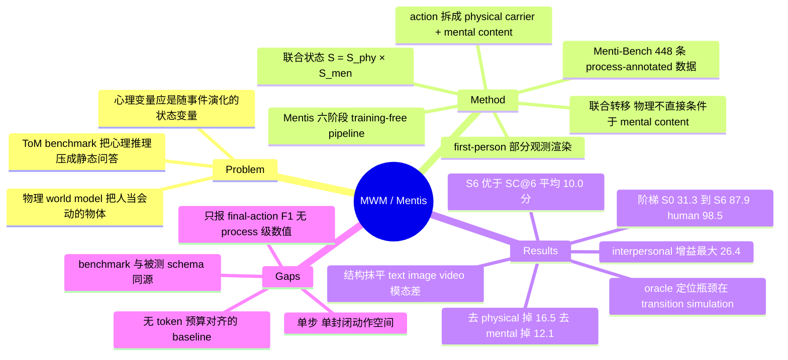

## Summary

论文提出 Mental World Modeling (MWM)，把 belief/goal/intention/emotion/norm 等 mental 变量升格为 world state 的一等成分，在 POMDP 骨架上定义"联合 physical-mental 状态 → target 专属 first-person observation → 物理载体与心理内容解耦的 action → 联合状态转移"这一循环。作者用 training-free 的 prompted pipeline Mentis 实例化该框架，并在自建的 448 条 process-annotated 数据集 Menti-Bench 上测了 8 个 LLM world model：full MWM 平均 final-action F1 87.9，显著高于 direct answer 的 63.3，oracle 干预把剩余的 7.8 分 human gap 主要定位到 transition simulation。

## Problem & Motivation

现有 world model 的三大家族——representation world models（Dreamer/JEPA 系）、video-generative world models（Sora/Genie 系）、3D interactive world models（Marble/HunyuanWorld 系）——共享同一个建模对象：世界的物理基底。它们回答"世界是什么样、物理场景会怎么演化"，而把场景里的人当成另一种会动的物体。

作者的论点是：对 human-centered intelligence 而言这不够。人的行为由外部环境与内部 mental-social 配置共同产生，同一个"看起来正确"的物理场景，只要 target 的 belief 不同，正确动作就不同（Figure 2 的经典设定：杯子在她没看见时被挪进柜子）。另一条线的工作——ToM benchmark（ToMi、SocialIQA、FANToM、ToMBench）——则把心理推理压成静态问答，推断出一个 mental state 标签就结束了，没有"心理变量作为状态随事件演化"这一层。

论文把这两条线的空缺定义成同一个问题：需要一个既维护物理状态又维护心理状态、且能对候选动作做 action-conditioned 联合转移的模拟器。与最接近的 Social World Models (S3AP, Zhou et al. 2025) 的差别，作者自述为：SWM 主要提供社会叙事的结构化表示，而 MWM 把 target observation 定义为第三人称联合状态的第一人称渲染，并显式模拟 branch 级别的物理-心理转移。

## Method

**框架（第 3 节）**。状态空间因子化为 S = S_phy × S_men。S_phy 记录 objects / characters / relations / environment；S_men 记录个体心理状态（identity、beliefs、attention、goals、intentions、emotions、dispositions、norms、constraints）、群体心理状态、社会关系与场景 atmosphere。三个耦合函数构成一个时间步：

1. **Observation generation** —— 由世界模型从全局状态渲染 target 的第一人称部分观测，条件是 target 的感知可达性变量与社会认知视角变量。心理观测不是全局心理状态的拷贝，而是 target 的自我状态加上受视角限制的 k 阶 ToM 推断，允许与真实心理状态不符。
2. **Action proposal** —— target 只能以 observation 为条件产生动作，这是框架能表达 false belief、无知、社会性偏差动作的形式化理由。动作写成 (physical carrier, mental content) 的耦合对，二者是同一动作的两个维度而非两个动作。
3. **State transition** —— 分阶段因子化：物理转移条件于物理状态、心理状态与物理载体，但不直接条件于 mental content（"安慰 Bob"的意图本身不移动空气）；心理转移则同时条件于两个动作分量。耦合体现在跨通道的共享条件，而非把一个子模块的输出喂给另一个。

论文给出的 Property 3.1 是一个可识别性陈述：只要存在两个物理分量相同、心理分量不同而真实动作分布不同的状态，physical-only 表示就不充分（反之对称）。

**Mentis（第 5 节）**。training-free 的六阶段 pipeline：StateParser 把场景解析成 JSON 化的联合状态 → ObservationGenerator 做信息过滤 → ActionParser 把每个选项拆成物理/心理分量 → WorldStateTransitor 并行模拟 6 个 branch 的后继状态 → Evaluator 在同一 context 中比较打分（mental consistency / physical plausibility / social appropriateness，外加一个 binary safety veto）→ 确定性决策模块选最高分并按固定 cascade 破平局。每一阶段都写出机器可校验的 artifact，这既是 inspectability 的来源，也是 oracle 替换与信息移除消融的实现基础。target pseudo-agent 不自主生成动作，只把评测样本给定的 6 个选项转成候选分支（作者明确说这是方法论选择，为了把"动作生成质量"与"状态转移质量"分开衡量）。

**Menti-Bench（第 6 节）**。448 条 situated decision 记录（320 text / 100 image / 28 sounding video），每条含场景、指定 target、极简问题、6 个自然语言候选动作，以及覆盖完整 MWM 过程的 gold 标注（当前联合状态、target observation、每个选项一个后继状态、最终动作），共 2,688 个标注后继状态。场景来自 ToM 与 situated social-reasoning 数据源的改写，按四个 scene category 与五个 domain 分层，78% 的场景含至少两个角色。

**评测阶梯（Table 3）**。S0 options-only floor → S1 direct answer → S2 CoT → S3 SC@6 → S4 free-text state → S5 structured state → S6 full MWM；A1/A2/A3 是对 S6 的信息移除与解耦消融；O1–O4 是 gold artifact 替换。所有 run 共享单一 operating point（medium reasoning effort + batched comparative-rank scoring），在一个冻结的 30 条切片上预先校准。

## Key Results

**必要性阶梯（Table 4，8 个 world model 平均，final-action F1 %）**

| S0 floor | S1 direct | S2 CoT | S3 SC@6 | S4 free-text | S5 structured | S6 full MWM | human |
|:--|:--|:--|:--|:--|:--|:--|:--|
| 31.3 | 63.3 | 74.6 | 77.9 | 80.3 | 82.6 | 87.9 | 98.5 |

- 单调性对 8 个模型逐列成立，S6 是每一列的最优配置。options-only floor 落在 29.7–33.2 的窄带内且与模型能力无关，说明选项集本身不可解。
- S6 比 SC@6 平均高 10.0 分；更强的证据是最弱模型的 S6（gpt-4.1, 84.9）超过最强模型的 S3（gpt-5.6-sol, 83.6）。
- 消融代价：移除 mental channel −12.1、移除 physical channel −16.5、解耦 transition −6.4，序关系 S6 > A3 > A1 > A2 对 8 个模型全部成立。
- S6−S1 增益随基座变弱而变大（gpt-5.6-sol 21.1 → gpt-4.1 28.0）。

**瓶颈定位（Table 5，gpt-5.6-sol）**。单 oracle 增益：gold transition +3.5（94.2）> gold state +2.8 > gold observation +1.7 > gold action +0.7。transition oracle 单独就回收了 7.8 分 human gap 的 45%；action decomposition 几乎不贡献误差。四个单增益之和 8.7 大于四者组合的 6.3，即 stage error 相关、上游错误会在下游被重复计数。四 oracle 全开达 97.0，作者据此把 7.8 分中的 6.3 分（81%）归给中间阶段预测、1.5 分（19%）归给 value evaluation / 决策规则 / 残余难度。

**场景与模态**。interpersonal 场景是 direct answering 最弱（66.5）而 full MWM 最强（92.9）的类别，增益 26.4 为最大；object/resource 增益 14.0 为最小；类别间 spread 从 S1 的 7.5 收窄到 S6 的 4.9。五个 domain 的增益集中在 19.1–22.8，作者读作"增益来自推理类型而非场景表面规律"。模态上 direct answering 有明显 media penalty（text 70.8 / image 67.0 / video 64.8），到 S5 就已抹平（87.6 / 87.2 / 87.3），S6 为 90.5 / 91.2 / 90.9。通道干预中所有 16 个 system×intervention 单元都掉分，且结构越多掉得越多：image 换 caption 使 S6 掉 6.4 而 S1 只掉 2.8；去 audio 使 S6 掉 6.1 而 S1 掉 2.7；只留 audio 使 S6 掉 18.8。

> Evidence boundary：第 7 节开篇即声明"All numbers are final-action F1"。论文在 6.2 节与 Appendix G 定义了完整的四层指标（artifact presence、branch schema coverage、judge 语义保真度含 mental fidelity、perspective-leakage rate、score alignment MAE、decision margin/tie rate、process-outcome divergence）与统计检验（McNemar exact、Wilson 区间），但全文 17 张表格与正文均未给出这些指标的任何数值，也未报告 p 值、置信区间或 token 成本。

## Evidence Ledger

| Claim ID | Claim | Type | Source locator | Evidence excerpt | Status |
|:--|:--|:--|:--|:--|:--|
| C1 | Menti-Bench 448 条（320/100/28），6 选项，2,688 个 gold 后继状态 | number | Sec 6.1；App F.1 "Gold coverage"；Table 13 | "The testbed comprises 448 records (320 text, 100 image, 28 sounding video) ... (2,688 annotated successor states in total)" | source-verified |
| C2 | 8 模型平均 S0=31.3 / S1=63.3 / S6=87.9；human=98.5 | number | Table 4 Avg 列与 caption | "the human reference under the identical protocol is 98.5" | source-verified |
| C3 | S6 对 8 个模型全部最优，阶梯逐级单调上升 | comparison | Sec 7.1；Table 4 全部 9 列 | "The average rises monotonically from 31.3 (S0) to 87.9 (S6), and the ordering holds for each of the models" | source-verified |
| C4 | S6 比 SC@6 平均高 10.0；S6@gpt-4.1 (84.9) > S3@gpt-5.6-sol (83.6) | number | Sec 7.1；Table 16 | "S6 with the weakest model (gpt-4.1, 84.9) exceeds S3 with the strongest model (gpt-5.6-sol, 83.6)" | source-verified |
| C5 | A1 −12.1 / A2 −16.5 / A3 −6.4，移除 physical 代价大于 mental | number | Sec 7.1；Table 4；Table 16 | "Removing the mental channel (A1) costs 12.1 points on average, removing the physical channel (A2) costs 16.5" | source-verified |
| C6 | O4 gold transition 增益最大 90.7→94.2，回收 45% human gap；O3 仅 +0.7 | number | Sec 7.2；Table 5 | "Gold transitions gain +3.5 ... The transition oracle alone recovers 45% of the 7.8 human gap" | source-verified |
| C7 | 四 oracle 全开 97.0；7.8 分中 6.3 (81%) 属中间阶段、1.5 (19%) 属评估与决策 | number | Sec 7.2；Table 5 | "6.3 points (81%) are attributable to prediction errors in the intermediate stages ... 1.5 points (19%) remain in value evaluation" | source-verified |
| C8 | 单 oracle 增益之和 8.7 > 组合增益 6.3，sub-additive | number | Sec 7.2 "Oracle gains are sub-additive" | "The four single gains sum to +8.7, but all four oracles together gain +6.3 ... Stage errors overlap" | source-verified |
| C9 | interpersonal 增益 26.4 最大、object/resource 14.0 最小；spread 7.5→4.9 | number | Sec 7.3；Table 6 | "largest gain (+26.4). Object/resource scenes show the smallest gain (+14.0) ... spread narrows from 7.5 points under S1 to 4.9 under S6" | source-verified |
| C10 | App M.2 称 interpersonal 价值为 object-centric 的"三倍"，与 Table 6 的 26.4 vs 14.0（约 1.9 倍）不一致 | number | App M.2 对照 Table 6 | "the value of the machinery is three times larger on interpersonal scenes than on object-centric ones" | source-verified |
| C11 | S1 模态差 70.8/67.0/64.8，S5 已抹平 87.6/87.2/87.3，S6 为 90.5/91.2/90.9 | number | Sec 7.4；Table 7 | "70.8 on text, 67.0 on image, 64.8 on video ... gone under S6 (90.5, 91.2, 90.9). The gap already closes at S5" | source-verified |
| C12 | image→caption S6 −6.4 vs S1 −2.8；去 audio S6 −6.1 vs S1 −2.7；仅 audio S6 −18.8 | number | Sec 7.4；Table 8 | "replacing images with captions costs S1 2.8 points and S6 6.4 ... keeping only audio costs S6 18.8" | source-verified |
| C13 | 第 7 节只报 final-action F1；6.2 节与 App G 定义的 process 级指标全文无数值 | benchmark-setting | Sec 7 开篇；全文 17 张表格检索 | "All numbers are final-action F1 (%) on the full Menti-Bench data" | source-verified |
| C14 | Mentis 为 training-free prompted pipeline；pseudo-agent 只转换给定选项；单步 transition | benchmark-setting | Sec 5.4；App B.3 | "it does not freely invent actions: it receives the option set supplied by the evaluation sample" | source-verified |
| C15 | 全部 run 共享单一 operating point，在冻结的 30 条切片（20/7/3）上预校准并排除 | benchmark-setting | Sec 6.3；App H | "All reported runs share a single global operating point, medium reasoning effort with batched comparative-rank scoring" | source-verified |
| C16 | App G.6 定义 McNemar exact 与 Wilson 区间，结果部分未报告任何 p 值或区间 | benchmark-setting | App G.6；全文关键词检索 | "accuracy differences alone are never reported as significance" | source-verified |
| C17 | 仅给 project homepage，正文无 GitHub 仓库链接；数据 research-only license；arXiv 页 CC BY-NC-ND 4.0 | license-code | 标题页；App F.4；abs 页 | "released for research evaluation under a research-only license, distributed through the project homepage" | source-verified |
| C18 | 场景改编自 ToM 与 social-reasoning 源后重写；gold 经再裁定为唯一可辩护最优；50 条视频只留 28 条 | benchmark-setting | Sec 6.1；App F.1；App F.4 | "Gold labels were re-adjudicated so that the gold action is the uniquely defensible best action" | source-verified |
| C19 | 作者 Hao Fei、Yiran Zhao；2026-07-29 提交；cs.CL；编号 affiliation 无机构全名 | number | abs 页；标题页作者块 | "Hao Fei1 Yiran Zhao2 ... Work done during internship at NUS." | source-verified |
| C20 | 78% 场景含至少两个角色；四个 scene category、五个 domain 分层 | number | Sec 6.1；Table 13；Table 14 | "78% of scenes involve at least two characters" | source-verified |

## Strengths & Weaknesses

**Strengths**

- **问题 formulation 是对的**。把 mental 变量从"事后 rationale"提升为"状态变量"，并要求它随 action 演化，这个转换比论文里任何一个数字都更有价值。它同时切中了两条线的空缺：physical world model 把人当物体、ToM benchmark 把心理推理当静态标签。
- **实验设计的方法论质量高于结论本身**。necessity ladder 的每一级只增加一个建模承诺（S2/S3 恰好把 CoT 与 self-consistency 这两个标准 test-time reasoning baseline 嵌进阶梯），配上 options-only floor、channel intervention、oracle cascade 三类审计，形成了一套"增益来自哪里"的可迁移模板。oracle 的 sub-additivity 分析（8.7 vs 6.3）尤其干净地量化了 pipeline 的跨阶段误差税——这套 diagnosis 手法可以直接搬到我们自己的 agent pipeline 评估上。
- **training-free 的取舍是自洽的**。既然要论证"结构本身有用"，就不能让 fitted parameter 混进解释；Mentis 的增益确实只能归给建模结构。inspectability 也不是口号：每阶段的 JSON artifact 是 oracle 替换与错误定位能成立的前提。
- **诚实度高**。作者自己写明数据集"不支持 leaderboard 式排名"、媒体子集的绝对 delta 只能当方向性读、benchmark 的 norm 判断带有文化局限、mental inference 是 hypothesis 而非 measurement。这在 framework 类论文里不常见。

**Weaknesses**

- **因果链的中间量一个都没测**。这是最要命的一条。论文的核心叙事是"显式建模 mental state → 预测人的决策更准"，但从头到尾只报 final-action F1。信念/意图推断本身准不准？observation 渲染有没有泄漏 target 不该知道的信息？论文在 6.2 节和 Appendix G 里把 mental fidelity、perspective-leakage rate、process-outcome divergence 的公式全写出来了，却一个数都没报。于是"process-complete testbed"这个卖点在实验部分并未兑现，而 Appendix M.1 恰恰承认"right for the wrong reason"是最该报的量。目前的证据只能支撑"这套结构化 prompting 流程涨点"，不能支撑"涨点是因为心理状态被正确建模了"。
- **消融不能分离"心理变量"与"上下文信息量"**。A1/A2 是纯信息移除：删掉半个状态表示，评估器可用的内容也随之减少。任何信息移除都会掉分，缺少一个"移除等量非心理内容"的对照。更值得注意的是 A2（−physical, −16.5）掉得比 A1（−mental, −12.1）多——按论文自己的度量，物理通道承担的权重更大，而标题与摘要的重心却在 mental 上。这个结果本身是有意思的（心理推理离开物理接地会退化），但它不支持"mental 是那个关键增量"的读法。
- **预算与 baseline 的公平性未被正面处理**。S6 每条样本要跑 state parse + observation + 6 次 action 分解 + 6 个 branch 的双通道 transition + 打分，量级上是 S1 的二十几倍调用、也远超 SC@6 的 6 次采样。论文对 compute 公平性的唯一论证是跨模型比较（弱模型 S6 > 强模型 S3），这只能说明"结构不能被换更强的基座替代"，不能说明"结构不能被等预算的其他 test-time scaling 替代"。Appendix J 明确说 token 会汇总进"cost columns"，但全文没有任何 cost 表——恰恰是作者自己写下的"绝不能把额外调用带来的增益误认为建模带来的增益"这条纪律，在结果部分没有落地。
- **benchmark 与被测系统同源**。Menti-Bench 的 gold 状态/观测/后继状态就是按 MWM 的 taxonomy 标注的，oracle 干预注入的也正是 Mentis 的 schema，gold 最终动作又由同一批作者裁定为"唯一可辩护的最优动作"。S6 因此天然享有 direct answering 拿不到的 schema 对齐红利。human reference 98.5 与其说是"任务几乎无歧义"，不如说是"裁定流程把歧义样本筛掉了"——而真正难的社会决策恰恰是有多个可辩护答案的那些，这类样本被系统性排除后，框架在最该发挥作用的区域反而没被测到。
- **统计与规模**。448 条、image 100、video 28；Appendix G.6 定义了 McNemar exact 与 Wilson 区间却一个都没用上，A3 的 6.4 分、per-slice 的十几分增益全部以裸 delta 呈现。risk/norm 这类切片只有约 51 条。
- **两处内部张力**。其一，Appendix M.2 说 interpersonal 的机制价值是 object-centric 的"三倍"，而 Table 6 给出的是 26.4 vs 14.0（约 1.9 倍），附录文字与表格对不上。其二，Appendix H 说 30 条校准切片"排除在所有报告结果之外"，但所有 headline 表格都报在完整的 448 条（320/100/28）上；同时 Appendix I 又说 S0 探针跑在 low reasoning effort 下，而 S0 是 Table 4 的一行——与 6.3 节"所有报告的 run 共享单一 operating point"直接冲突。这些不构成结论级错误，但说明 operating-point 纪律没有完全贯彻。
- **形式化偏薄**。MWM 本质是把 POMDP 的隐状态因子化成 physical × mental 再加一个透视渲染函数；Property 3.1 是一个近乎定义性的可识别性陈述（存在心理分量使动作分布不同时，纯物理表示不充分），不提供新的学习理论或算法。真正的贡献是概念框架 + 数据集 + prompting pipeline，把它读成"数学框架"会高估。
- **适用边界**。单步 transition、封闭的 6 选项动作空间、pseudo-agent 不生成动作、prompt 敏感性——这四条作者在 Appendix B.3 都承认了。所以目前的结论只在"给定候选动作、单步、多选"这个受控设定内成立，尚未触及开放策略生成与长时序社会互动，而后者正是框架宣称的目标场景。

**对领域的潜在影响**。世界模型这条线目前的默认对象是像素与几何，本文把"被建模的世界应该包含谁在想什么"这件事讲清楚了，这个 framing 大概率会被后续工作引用。但要让它从 position paper 变成技术路线，缺的正是本文没做的那一半：learned transition、心理变量的不确定性表示、以及 process-level 保真度的直接测量。作者自己在 Appendix M 也是这么排优先级的。

## Mind Map

## Notes

- **可直接借用的方法论**：necessity ladder（每级只加一个建模承诺）+ options-only floor + channel intervention + oracle cascade 这一组合，是"证明增益来自机制而非 prompting"的一套完整审计模板。我们评估自己的 agent pipeline 时可以照搬，尤其是 oracle sub-additivity 那一步——它能量化模块化 pipeline 的跨阶段误差税，这个数字通常没人报。
- **反面教材**：本文恰好示范了"定义了完整的 process 级指标却只报 outcome"这个失误。如果我们的工作也声称"中间表示是有效的"，那中间表示的质量必须有独立数值，否则 claim 停留在 outcome 层。
- 论文只给了 project homepage `https://mental-world.github.io`，正文未出现代码仓库链接，`code` 字段留空。数据集以 research-only license 分发，arXiv 页 license 为 CC BY-NC-ND 4.0。
- `institute` 留空：HTML 中作者上标 1/2 对应的 affiliation span 为空，机构全名未出现；全文关于机构的唯一线索是脚注 "Work done during internship at NUS."，不足以确定两位作者各自的编号机构，故未填写。
- 待跟进：与最接近的 Social World Models / S3AP (Zhou et al. 2025) 没有做实验对比，只做了概念区分。S5（structured state, no simulation）勉强算一个代理对照，S5→S6 的 5.3 分是"加上模拟"的边际价值，但那仍是作者自己的 schema。如果要评估这条线的真实增量，需要把 S3AP 作为 baseline 跑起来。
- 待跟进：论文的应用论证大量落在 embodied collaboration / 教育 / 照护，但实验全是 story-based 多选。把 MWM 的状态-观测-转移接口接到真实交互环境（GUI agent 的用户意图建模是一个直接的候选场景）是显而易见但尚未有人做的一步。
