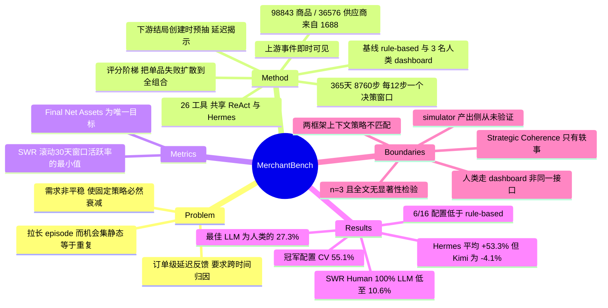

## Summary

MerchantBench 把 long-horizon agent 评测放进一个 365 天、按小时推进的卖家侧电商模拟：商品目录取自 1688 的 98,843 条真实商品记录与逐日需求轨迹，需求被转成个体订单并走完整生命周期，因此供应商异常即时可见、而退款/差评等下游结果要延迟数日才暴露，agent 通过 26 个工具在每 12 小时一个的决策窗口里持续经营一整年。8 个 LLM × 2 框架 × 3 次重复共 48 次 run 下，最好的配置（Qwen3.7-Max + Hermes，59.46k RMB 终局净资产）只有 3 名无经验人类均值（217.61k）的 27.3%，而 16 个 LLM 配置里有 6 个低于一个只做"下架滞销/异常品 + 按日报补位"的 rule-based 基线（24.48k）。真正可复用的产出是 SWR 这个指标（滚动 30 天窗口活跃率的**最小值**）和后面那个负面结果；把差距归因于 "Long-Term Coherence" 的核心论证则受制于三点：人类走的是专门的 dashboard 而非同一套 26 工具接口、n=3 且全文没有任何显著性检验、simulator 的**产出侧**从未与真实商家结果对照过。

## Problem & Motivation

论文的问题陈述比它的 benchmark 更值得注意，核心是一句话：**把 episode 拉长本身不构成对 long-term coherence 的测试**。如果可选商品和它们的需求是静态的，那么一个在第 10 天定下来就再不变的策略，在第 365 天依然是最优的——长时程只是重复，不是压力。作者据此提出两个现有环境没有同时具备的条件：

1. **mixed-latency feedback**。电商的反馈是由**个体订单生命周期**生成的：一次上架/调价立刻创造订单并占用现金，而履约失败与售后结果要在若干天后才可见。agent 必须把后到的证据关联回更早的决策，再判断当前经营策略该维持还是修正。
2. **移动的机会集**。带全年真实需求轨迹的大规模商品目录意味着新机会不断出现、既有选择持续贬值，选品因此是一个连续的组合再配置问题，而不是一次性决策。

作者明确对标 Vending-Bench（自动售货机）与 RetailBench（96 个固定商品的超市管理），认为二者都不同时满足这两条。这个 formulation 是可证伪的：它预测"固定策略在 MerchantBench 上必然衰减"，也解释了为什么论文把 SWR 这种**活跃度持续性**指标而非单纯终局分数摆到主表里。

## Method

**任务形式化。** 有限时域 POMDP。simulator 按小时推进 365 天，共 H_c = 8,760 步；需求、供应商状态、订单生命周期每步演化，agent 每 12 步拿到一个决策窗口（全程约 730 个）。隐状态含需求 profile、供应商状况、店铺挂牌与财务、在途订单与待发事件；观测核只暴露"商家可见"信息，需求 profile、风险参数、预采样的订单结局与未来事件时间全部隐藏。中间 reward 为 0，目标是终局净资产 = 现金 + 保证金 + 在途资金 + 应收。t = H_c 后停止产生新需求，但在途订单继续结算到终止步 T ≥ H_c。

**数据 grounding。** 来自 1688，覆盖 2025-06-01 至 2026-05-31 共 365 天，10 个一级类目；过滤掉缺标识/缺名称/类目越界/价格非正/需求史不完整的记录后，得到 98,843 个商品、36,576 个供应商，每个商品带 365 天的商品级订单历史，另附 365 份日度市场报告作为对齐日期的选品信号。总需求曲线保留了 618、双 11 首波与尾日的峰值以及春节的低谷。

**上游（即时可见）。** 每步按商品级概率采样三类 Upstream Supplier Event——Price Change、Product Delisting、Shipment Delay——分别改变采购价、暂停采购、延长发货时间；库存断货则由订单消耗快于补货内生产生。每次异常都带一个采样出的恢复时间以防环境永久漂移。agent 能通过目录/供应商查询看到价格、可得性、数量、发货时间的**已实现变化**，但看不到异常标志位、触发概率与恢复计划。

**下游（延迟可见）。** 商品日需求经小时到达强度 λ 转成个体订单，λ 由真实日需求 D、类目小时权重、店铺评分乘子 r、挂牌曝光因子 ℓ 与价格弹性项 (p/p_ref)^(−ε) 相乘得到，订单数服从 Poisson(λ)。每个订单在**创建时**就按商品风险画像预先抽定一个潜在结局（正常履约 / 取消 / 仅退款 / 退货退款 / 差评），结局及其实现时间在对应生命周期跳转发生前一直隐藏。采用 1688 的单件代发模式：下单即按当前供应商价采购并扣现金，经 Shipped → Delivered 变应收，再采样延迟后结算入账。七类结局中 Stockout / Late Shipment / Return and Refund / Bad Review 会吃罚款（RMB 5/3/8/5），除取消外的所有异常都会通过 outcome-specific 的体验分与证据权重拉低店铺评分。

**评分→需求的耦合（本环境难度的真正来源）。** 店铺评分由已结束订单按带先验（R0=4.0, α=20）和时间折扣（γ=2^(−1/30)）的加权平均算出，每完整日发布一次；连续评分经阈值 2.50 / 3.30 / 3.80 / 4.20 映射到五档需求乘子 0.10 / 0.35 / 0.80 / 1.00 / 1.20。也就是说**单个商品的售后失败会通过店铺评分把伤害扩散到整个商品组合**，且乘子阶梯很陡（跌破 3.80 需求直接打八折，跌破 3.30 只剩 35%）。曝光因子 ℓ 走"冷启动线性爬坡 + 指数衰减"，参数 ℓ0=0.2、T_r=14 天、κ=0.0092、ℓ_min=0.10。

**接口与配置。** 26 个商家工具，覆盖选品（日报、目录检索、商品详情、公开供应商档案）、上下架与调价、现金流与保证金/结算/罚款视图、供应商与订单状态监控；两个框架共享完全相同的工具集与观测协议。每次 run 起始 RMB 2,000 现金 + RMB 1,000 保证金 + 50 个挂牌位，保证金耗尽即终止经营。

**被评对象。** 8 个 LLM（GPT-5.6 Sol、Claude Opus 4.8、Qwen3.7-Max、Qwen3.7-Plus、GLM-5.2、DeepSeek-V4-Pro、DeepSeek-V4-Flash、Kimi K2.6）× 2 框架（ReAct / Hermes）× 3 次重复 = 48 run。ReAct 只有那 26 个工具；Hermes 在其上叠加内建的代码执行、planning、memory、skill management。**上下文管理两边不同**：ReAct 在历史达 160,000 token 时提示模型把要点写入持久记忆、随后截断到最近 30,000 token；Hermes 用自己默认的摘要流程。两边的 summarizer 都是被评模型自身。另有 rule-based 基线（每日检查，下架连续 7 天无销量或受供应商事件影响的商品，再用日报关键词补满挂牌位）和 3 名无电商经验的人类参与者，后者通过**专门的 human operations dashboard**在 5 个自然日内各完成一次 365 天 run。

**指标。** Business Performance：Final Net Assets / GMV / Net Profit Margin / Orders；Store Reliability：Total Fines / Avg. Store Rating / Order Anomaly Rate；Long-Horizon Activity：Avg. Active Listings / **Sustained Window Rate (SWR)** / Total Tool Calls。SWR = 在所有滚动 30 天窗口上取"含至少一次环境工具调用的决策窗口占比"的**最小值**。

## Key Results

**主表（Table 1，三次 run 均值；净资产与 GMV 单位为千 RMB）**

| 配置 | Net Assets | GMV | Margin | Orders | SWR | Tool Calls |
|:--|--:|--:|--:|--:|--:|--:|
| ReAct · GPT-5.6 Sol | 40.89 | 74.19 | 51.3 | 996 | 99.4 | 7,257 |
| ReAct · Claude Opus 4.8 | 31.89 | 69.10 | 44.4 | 1,214 | 45.0 | 1,139 |
| ReAct · GLM-5.2 | 25.73 | 60.90 | 37.3 | 2,158 | 53.3 | 2,045 |
| ReAct · Kimi K2.6 | 24.99 | 63.69 | 32.9 | 2,230 | 10.6 | 1,228 |
| ReAct · Qwen3.7-Plus | 20.74 | 40.85 | 45.6 | 1,056 | 52.2 | 1,221 |
| ReAct · Qwen3.7-Max | 20.66 | 39.73 | 44.5 | 925 | 11.1 | 815 |
| ReAct · DeepSeek-V4-Flash | 14.47 | 28.78 | 39.6 | 985 | 40.6 | 960 |
| ReAct · DeepSeek-V4-Pro | 6.56 | 8.40 | 41.9 | 450 | 30.6 | 660 |
| Hermes · Qwen3.7-Max | **59.46** | 116.76 | 46.9 | 1,929 | 22.2 | 1,366 |
| Hermes · GPT-5.6 Sol | 52.93 | 133.07 | 40.2 | 3,251 | 66.1 | 4,831 |
| Hermes · GLM-5.2 | 42.32 | 103.06 | 36.9 | 2,731 | 62.8 | 1,792 |
| Hermes · Claude Opus 4.8 | 35.56 | 83.23 | 39.9 | 1,808 | 31.7 | 1,138 |
| Hermes · Qwen3.7-Plus | 29.42 | 53.69 | 48.9 | 981 | 19.4 | 820 |
| Hermes · DeepSeek-V4-Flash | 24.69 | 64.52 | 37.6 | 1,989 | 62.2 | 1,259 |
| Hermes · Kimi K2.6 | 23.96 | 75.06 | 26.8 | 3,398 | 17.8 | 969 |
| Hermes · DeepSeek-V4-Pro | 16.71 | 31.95 | 43.4 | 1,062 | 33.3 | 942 |
| **Human**（n=3） | **217.61** | 608.06 | 35.3 | 9,442 | 100.0 | 8,311 |
| **Rule-based** | 24.48 | 53.37 | 40.3 | 1,605 | 100.0 | 3,236 |

**主结论与三个被论文低估的读法：**

- **人类差距（论文的 headline）**：59.46 / 217.61 = 27.3%。人类的优势**不在单位经济性而在规模**——人类利润率 35.3% 低于 16 个 LLM 配置中的 14 个，但 GMV 608.06k 是最强 LLM 的 4.6 倍、订单 9,442 单是 2.8 倍。人类工具调用 8,311 次也只比 ReAct GPT-5.6 Sol 的 7,257 次多 15%，所以差距不能简单归给"人干得更多"。
- **rule-based 才是最有信息量的一行**：24.48k 的启发式基线打败了 16 个 LLM 配置中的 6 个（ReAct 下的 Qwen3.7-Max 20.66 / Qwen3.7-Plus 20.74 / DeepSeek-V4-Pro 6.56 / DeepSeek-V4-Flash 14.47，Hermes 下的 DeepSeek-V4-Pro 16.71 / Kimi K2.6 23.96）。相对"离人类还有距离"，"多个 frontier 模型跑不过一条几十行的规则"是更硬的负面结果，而它被放在了表格末尾而非摘要里。
- **框架效应盖过模型效应**：八模型平均下 Hermes 比 ReAct 高 53.3% 净资产、71.5% GMV、71.2% 订单数；单模型增益从 Claude Opus 4.8 的 +11.5% 一直到 Qwen3.7-Max 的 +187.8%，Kimi K2.6 是唯一反例（−4.1%）。附录 I 给出了机制线索：GPT-5.6 Sol 在 24 次 Hermes run 里发起 15 次 `execute_code`（其中一次 run 就 13 次），首个决策窗口就用 `p = max(1.70c, c+6)` 批量定价并上架 50 个商品；而 GLM-5.2 / Qwen3.7-Plus / Kimi K2.6 从不碰代码工具，Claude Opus 4.8 改用 261 次 memory 调用维护带日期戳的"已验证/已否证"假设表。

**稳定性。** Qwen3.7-Max + Hermes 拿了最高均值，却是变异系数 55.1% 的配置；各框架内最稳的分别是 ReAct 的 GPT-5.6 Sol（CV 3.3%）与 Hermes 的 Claude Opus 4.8（CV 10.0%）。以 n=3、CV 55.1% 计，59.46 与 GPT-5.6 Sol 的 52.93 的区间大幅重叠——论文自己也承认"按模型跨框架取平均则 GPT-5.6 Sol 最高"，即同一张表能同时支持两个"第一名"。

**Operational Coherence（唯一被真正操作化的 coherence）。** Human 与 rule-based 的 SWR 都是 100%；LLM 在 ReAct 下 10.6%–99.4%、Hermes 下 17.8%–66.1%。Qwen3.7-Max 的季度有效窗口率从 68% 跌到 23%（ReAct）/ 从 62% 跌到 37%（Hermes），同时环境工具调用大幅减少。

**Strategic Coherence（只有轨迹叙事，没有指标）。** 论文把它拆成 Goal Consistency 与 Evidence-Calibrated Adaptation，各由一到两条具名轨迹支撑：

- *Control-Loop Narrowing*：ReAct Qwen3.7-Max 的 SWR 11.1% 伴随供应链检查从占剩余工具调用的 14% 升到 34%，自发选品/调价/替换/诊断基本消失。
- *Premature Abandonment*：一次 Hermes Kimi K2.6 的 run 里，agent 在第 104 天判定店铺无法挽回，此后在剩余 523 个决策窗口中的 355 个里未做任何环境动作。
- *适应失败*：人类的挂牌均价从前三个月的 RMB 43.4–53.1 涨到后三个月的 58.7–90.8（流动性变宽后主动上探价格带，实验失败再回落到低价高周转），而 GLM-5.2 / DeepSeek-V4-Flash / Kimi K2.6 的价格轨迹基本是平的。一次 Hermes Claude Opus 4.8 的 run 里，agent 误推"砍掉弱商品会把流量集中到剩下的商品"，货架从第 54 天的 47 个挂牌收缩到第 322 天的 3 个，而每个挂牌其实都有独立需求机会；一次 Hermes Qwen3.7-Max 的 run 里，agent 在第 282 天误记第 285 天为终点，提前 83 天停止补位，直到仿真时间越过假想终点才纠正。

**证据边界。** 论文对"这两类 coherence 失效造成了人类差距"的措辞是 hedged 的："Our trace evidence **suggests** that two forms of Long-Term Coherence failure ... **may contribute to** this performance gap."——本笔记按同样的强度转述，不升级为因果结论。

> [证据边界] 全文及附录**未报告任何显著性检验、置信区间或 p 值**。可得的变异信息只有：每配置的变异系数（3.3% / 10.0% / 55.1%）、Figure 4 的三次 run 净资产分布、Figure 18 的逐 run 变化、以及选品图里的标准差带。人类行 n=3（每人 1 次 run），且未报告人类侧的 CV 或标准差。

> [证据边界] 论文对 simulator 的 grounding 全部在**输入侧**（真实商品记录、真实 365 天需求轨迹、按平台履约信号校准的事件概率、与真实平台规则一致的罚款额），**产出侧从未被验证**——全文与附录中没有任何"模拟出的营收/订单量/利润 vs 真实商家结果"的对照，也没有 limitations 一节讨论这一点。

## Evidence Ledger

| Claim ID | Claim | Type | Source locator | Evidence excerpt | Status |
|:--|:--|:--|:--|:--|:--|
| C1 | 按小时推进 365 天 = 8,760 步，agent 每 12 步一个决策窗口 | benchmark-setting | §Task Formulation | "advances hourly over a 365 day control horizon, giving Hc=8,760 steps ... a decision window once every 12 steps" | source-verified |
| C2 | 目录 98,843 商品 / 36,576 供应商，源自 1688，覆盖 2025-06-01–2026-05-31，10 个一级类目 | number | §Real-World Data Grounding；App B | "contains 98,843 products from 36,576 suppliers"；"365 days from June 1, 2025 through May 31, 2026" | source-verified |
| C3 | 48 run = 8 LLM × 2 框架（ReAct / Hermes）× 3 次重复，每次 365 模拟日 | benchmark-setting | Abstract；§Agent Configurations | "eight LLMs under ReAct and Hermes with three runs for each pairing" | source-verified |
| C4 | 被评模型为 GPT-5.6 Sol、Claude Opus 4.8、Qwen3.7-Max/Plus、GLM-5.2、DeepSeek-V4-Pro/Flash、Kimi K2.6 | benchmark-setting | §Agent Configurations | "GPT-5.6 Sol, Claude Opus 4.8, Qwen3.7-Max and Qwen3.7-Plus, GLM-5.2, DeepSeek-V4-Pro and DeepSeek-V4-Flash, and Kimi K2.6" | source-verified |
| C5 | 最佳 LLM 配置为人类均值的 27.3%（Qwen3.7-Max+Hermes 59.46 vs Human 217.61，千 RMB） | number | Abstract；Table 1 | "attaining only 27.3% of the mean final net assets achieved by human participants" | source-verified |
| C6 | 人类基线 = 3 名**无电商经验**参与者，各 1 次 365 天 run，通过 **human operations dashboard** 在 5 个自然日内完成 | benchmark-setting | App J §Evaluation Protocol | "Three participants with no prior e-commerce operating experience each complete one run ... through the human operations dashboard over five calendar days" | source-verified |
| C7 | Table 1 Human 行：217.61 / 608.06 / 35.3 / 9,442 / 5,622 / 3.98 / 12.5 / 49.1 / 100.0 / 8,311 | number | Table 1 | 同左（逐格核对，ar5iv DOM 与 PDF 一致） | source-verified |
| C8 | Table 1 Rule-based 行：24.48 / 53.37 / 40.3 / 1,605 / 100.0 / 3,236 | number | Table 1 | 同左 | source-verified |
| C9 | 16 个 LLM 配置中恰有 6 个终局净资产低于 rule-based 的 24.48 | comparison | Table 1（跨行计数） | ReAct 20.66 / 20.74 / 6.56 / 14.47；Hermes 16.71 / 23.96 | source-verified |
| C10 | 人类利润率 35.3% 低于 16 个配置中的 14 个（仅 Kimi K2.6 的 32.9 / 26.8 更低） | comparison | Table 1 Profit Margin 列 | ReAct Kimi "32.9"；Hermes Kimi "26.8" | source-verified |
| C11 | Hermes 均值上比 ReAct 高 53.3% 净资产 / 71.5% GMV / 71.2% 订单；Kimi K2.6 是唯一反例（−4.1%），增益跨度 +11.5%(Claude) 到 +187.8%(Qwen3.7-Max) | number | §Framework Analysis | "53.3% higher final net assets, 71.5% higher GMV, and 71.2% more orders than ReAct" | source-verified |
| C12 | Qwen3.7-Max+Hermes 均值最高但 CV 55.1%；GPT-5.6 Sol(ReAct) CV 3.3%、Claude Opus 4.8(Hermes) CV 10.0% | number | §Performance Variability | "lowest coefficients of variation within their respective frameworks at 3.3% and 10.0%" | source-verified（3.3%/10.0% 是**各框架内**最低，非全局最低） |
| C13 | SWR：Human 100%；LLM 在 ReAct 下 10.6%–99.4%，Hermes 下 17.8%–66.1% | number | §Operational Coherence；Table 1 | "range from 10.6% to 99.4% under ReAct and from 17.8% to 66.1% under Hermes" | source-verified |
| C14 | SWR 定义 = 所有滚动 30 天窗口上"含 ≥1 次环境工具调用的决策窗口占比"的**最小值** | benchmark-setting | §Evaluation Metrics；App J | "the minimum share of scheduled decision windows containing at least one environment tool call across all rolling 30 day periods" | source-verified |
| C15 | Long-Term Coherence 定义及其 Operational / Strategic（后者含 Goal Consistency 与 Evidence-Calibrated Adaptation）二分 | causal-mechanism | Abstract；§Long-Term Coherence Analysis | "the capacity to preserve purposeful behavior across extended horizons while adapting decisions to accumulated evidence" | source-verified |
| C16 | 论文把"coherence 失效导致人类差距"表述为 hedged 推测而非既定因果 | causal-mechanism | §Long-Term Coherence Analysis | "trace evidence suggests ... may contribute to this performance gap" | source-verified |
| C17 | 论文报告了 simulator **产出侧**与真实商家结果的对照验证 | benchmark-setting | 全文 + App A/B/J 检索 | 仅有输入侧："product level probabilities calibrated from real platform fulfillment signals" | **unsupported**（verifier 全文+附录检索确认：不存在任何产出侧验证，亦无 limitations 讨论） |
| C18 | 需求/评分模型的常数为人工设定且论文未称其由数据拟合：ℓ0=0.2, T_r=14, κ=0.0092, ℓ_min=0.10；R0=4.0, α=20, γ=2^(−1/30)；阈值 2.50/3.30/3.80/4.20 → 乘子 0.10/0.35/0.80/1.00/1.20 | benchmark-setting | App J §Demand and Supplier / Rating Configuration | "uses ℓ0 = 0.2, Tr = 14 days, κ = 0.0092, and ℓmin = 0.10"；"Store ratings use R0 = 4.0, α = 20, and γ = 2^−1/30" | source-verified |
| C19 | 上游事件概率"由真实平台履约信号校准"，商品日需求来自真实 365 天订单历史 | benchmark-setting | §Upstream Supplier Simulation；§Order Level Simulation | "product level probabilities calibrated from real platform fulfillment signals"；"Di,d(t) is the linked daily demand from the real-world data" | source-verified |
| C20 | 代码开源于 https://github.com/KhanCold/merchantbench | license-code | Abstract 末句 | "Our code is available at https://github.com/KhanCold/merchantbench" | source-verified（verifier 另测 URL 返回 HTTP 200） |
| C21 | 一次 Hermes Kimi K2.6 run：第 104 天判定不可挽回，此后 523 个决策窗口中 355 个无环境动作 | number | §Goal Consistency | "made this judgment on Day 104 and then took no environment action in 355 of the remaining 523 decision windows" | source-verified |
| C22 | ReAct Qwen3.7-Max：SWR 11.1% 伴随供应链检查从 14% 升至 34% 的剩余工具调用 | number | §Goal Consistency | "an SWR of 11.1% coincides with supply chain checks rising from 14% to 34% of its remaining tool calls" | source-verified |
| C23 | 上下文管理两框架不同：ReAct 160,000 token 触发提示并截断到最近 30,000；Hermes 用默认摘要，两边 summarizer 均为被评模型自身 | benchmark-setting | App J §Context Management | "When a ReAct history reaches 160,000 tokens ... truncated to the most recent 30,000 tokens" | source-verified |
| C24 | 初始 RMB 2,000 现金 + RMB 1,000 保证金 + 50 挂牌位；保证金耗尽即终止 | benchmark-setting | §Agent Configurations；§Task Formulation | "RMB 2,000 in cash, a RMB 1,000 security deposit, and capacity for 50 active listings" | source-verified |
| C25 | 两框架共享同一套 26 工具，Hermes 额外叠加内建代码执行/planning/memory/skill 能力 | benchmark-setting | §Agent Interface；App K/L | "Hermes provides the same MerchantBench tools together with the built in tools" | source-verified |
| C26 | Hermes 24 次 run 中 17 次生成 RealShop skill，覆盖 8 个模型中的 7 个；Claude Opus 4.8 一次未生成；18 个 skill 中 17 个被后续使用 | number | App I §Skill Evolution | "a run created RealShop skill in 17 of 24 runs and for seven of the eight models" | source-verified |
| C27 | Claude Opus 4.8 一次 run 货架从第 54 天 47 个收缩到第 322 天 3 个；Qwen3.7-Max 一次 run 在第 282 天误记第 285 天为终点，提前 83 天停止补位 | number | §Evidence-Calibrated Adaptation | "shelf contracted from 47 active listings on Day 54 to three on Day 322" | source-verified |
| C28 | 作者单位为 Alibaba Group + 浙大 CAD&CG 国重 / 浙大软件学院 + 北大软微 + 复旦计算机与人工智能学院；通讯作者 Linbo Jin、Di Weng | metadata | PDF v2 首页脚注（ar5iv/HTML 渲染中缺失） | "1 Alibaba Group 2 State Key Lab of CAD&CG, Zhejiang University ..." | source-verified |
| C29 | v1 提交 2026-07-31，v2 2026-08-04；分类 cs.AI；abs 页无 Comments / journal-ref，未声明会议 | metadata | arXiv abs 页 Submission history | "[v1] Fri, 31 Jul 2026 ... [v2] Tue, 4 Aug 2026" | source-verified |
| C30 | 论文对 LLM-vs-Human 差距报告了显著性检验 / 置信区间 | number | 全文 + 附录检索 | 仅有 CV（3.3/10.0/55.1%）与 Fig. 4/18 的分布与标准差带 | **unsupported**（verifier 确认全文无任何假设检验、p 值或置信区间） |

## Strengths & Weaknesses

**Strengths**

- **问题 formulation 抓到了长时程评测被普遍忽略的那一维。** "把 episode 拉长而机会集不动，等于只是重复"这句话，实际上把当下多数 long-horizon benchmark 的构造方式否掉了一半。用真实全年需求轨迹（618、双 11、春节）保证任何固定策略必然衰减，这是让"长"变成"难"的正确做法，而不是把步数从 30 加到 300。
- **SWR 是本文最可复用的产出，而且指标设计本身有品味。** 取滚动 30 天窗口的**最小值**而非均值，意味着"前三个月猛干、后九个月躺平"无法被平均掉——这恰恰是终局分数会掩盖的失败模式。它便宜、可移植到任何持久环境，理应和终局分数一起成为长时程评测的标配。人类 100%、rule-based 100%、而 LLM 最低 10.6%，一个数字就把"agent 会自己停下来"这件事量化了。
- **mixed-latency 的设计是真实的机制压力，不是包装。** 订单结局在**创建时**就预先抽定但延迟揭示，配合"单品售后失败经店铺评分扩散到全组合"的耦合，构造出一个真正需要跨时间归因的信用分配问题。上游即时可见 / 下游延迟可见的不对称是环境的骨架，不是附加的噪声。
- **rule-based 基线被认真做了，而且结果不利于论文自己的叙事。** 一条"下架滞销与异常品 + 按日报补位"的规则打败 6/16 个 frontier 配置。作者没有藏这行。
- **报了三次重复与变异系数，并主动指出冠军配置最不稳。** 在 benchmark 论文普遍单次 run 的背景下，明说 Qwen3.7-Max+Hermes 均值第一但 CV 55.1%，是诚实的。
- **附录 I 的 Hermes 使用分析是全文信息密度最高的部分。** 谁用 `execute_code`、谁只用 memory、谁两样都不碰，直接把"框架增益为什么强依赖模型"落到了具体行为上，比 53.3% 这个平均数有用得多。

**Weaknesses**

- **headline 的人类对照把接口混进了能力里，这是最严重的设计缺陷。** agent 走 26 个工具的文本 API，历史到 160k token 就被截到 30k；人类走一个专门造的 dashboard，在 5 个自然日里操作，没有上下文压缩、没有工具调用序列化开销、且天然拥有跨天的完整外部记忆（笔记、屏幕、回看）。论文标题是 Long-Term Coherence，但这个对照无法把 coherence 与**信息带宽和记忆载体**分开。缺的控制实验很明确且不贵：让人类也走同一套 26 工具接口，或给 agent 一份 dashboard 等价的聚合视图。在做出这个控制之前，"27.3%" 度量的是"文本 API + 上下文截断下的 agent"对"图形界面下的人"，而不是两者的时间一致性。
- **n=3、无显著性检验、而 CV 高达 55.1%——leaderboard 本身不成立。** 以 Qwen3.7-Max+Hermes 的 59.46 与 CV 55.1% 计，其散布覆盖 GPT-5.6 Sol 的 52.93 绰绰有余；论文自己也说按模型跨框架平均则 GPT-5.6 Sol 第一。同一张表支持两个不同的"第一名"，说明排名不是这篇论文的贡献，而作者仍以 "the best LLM configuration" 的口径写进了摘要。人类侧更糟：n=3、每人 1 次、且**未报告任何人类侧变异**，而 217.61k 是分母。
- **simulator 的产出侧从未被验证，而难度恰恰由未验证的常数决定。** 输入是真的（真实商品、真实需求轨迹、按履约信号校准的事件概率、与平台一致的罚款），但**从动作到结果的映射**是一套手工参数化模型：Poisson 到达、每商品隐藏弹性 ε_i（来源全文未交代）、冷启动曝光曲线（ℓ0/T_r/κ/ℓ_min）、以及那个很陡的评分→需求乘子阶梯（跌破 3.80 打八折、跌破 3.30 只剩 35%）。没有任何证据表明真实商家执行同样策略会得到近似结果。这不是学术洁癖：**评分阶梯的陡峭程度直接决定了"售后失败会不会滚雪球"，也就直接决定了 agent 与人类的差距形状**。人类赢在"把评分守在悬崖上方"还是赢在"long-term coherence"，这个环境无法区分。论文也没有 limitations 一节承认这一点。
- **Strategic Coherence 这一半只有叙事，没有指标——而它是论文的概念主张所在。** Operational Coherence 有 SWR，可在 48 次 run 上算；Goal Consistency 与 Evidence-Calibrated Adaptation 则各由一到两条**看到结果之后挑出来的**具名轨迹支撑（第 104 天放弃、47→3 个挂牌、误记第 285 天）。这些轶事生动且大概率真实，但没有发生率，也无法证伪。这里有一个反复出现的结构问题：**把一个被操作化的度量（SWR）与一套事后分类学捆在一起发布，分类学会从度量那里借来可信度**。更稳的做法是先定义干预（例如周期性注入 re-planning 提示、或强制每月做一次组合复核），再按干预是否有效对 run 做事后聚类，让类别成为实验输出而非前提。
- **框架效应压过模型效应，却仍然报了模型 leaderboard。** 平均 +53.3%、单模型跨度 −4.1% 到 +187.8%，说明这里测的是 model × harness 而非 model。附录 I 已经把机制说清楚了（GPT-5.6 Sol 用代码工具批量定价上架，三个模型从不碰代码工具），那么 Hermes 列里相当一部分"模型差异"其实是"会不会用代码工具"的差异。这与 [[Topics/Harness-Component-Attribution]] 记录的模式完全一致：harness 论文报 bundle 级增益、把归因留给读者，只不过这次是 benchmark 论文在做同一件事。
- **两个框架的上下文管理策略不同，而论文的核心命题正是关于长时程退化。** ReAct 硬截断（160k→30k）、Hermes 用自家摘要，且两边 summarizer 都是被评模型自身。这意味着**弱模型会给自己写出越来越差的状态摘要，其表现与"agent 逐渐失去意图"在数据上完全同形**。要区分"activity decay 是 agent 的属性"还是"是自摘要退化的下游效应"，只需给所有模型配同一个固定的强 summarizer 再跑一遍——论文没做，因此 Operational Coherence 这个最扎实的结果也带着一个未排除的替代解释。
- **单标量目标 + 重尾结果分布。** 终局净资产把规模与单位利润压成一个数：一次 Kimi ReAct run 做到 3,004 单但每单净利仅 RMB 11.1，Qwen3.7-Max 的最佳 run 则是中等规模 + 高单位利润。在 n=3 下，这种双峰结构会让均值极不稳定，而排名正是建立在均值上的。

**潜在影响。** 这篇的价值大概率不在 leaderboard，而在两件事：SWR 这个指标，以及"6/16 个 frontier 配置跑不过一条几十行规则"这个负面结果。前者应该被搬进其他持久环境评测；后者值得被单独拎出来追问——在一个不设 deadline、状态持续、没人催的环境里，agent 的失败模式不是做错，而是**自己停下来**。这与有 wall-clock 预算的 benchmark 形成了干净的对照（见下）。

## Mind Map

## Notes

- **最该做而没做的两个实验（各一句）**：(1) 让 3 名人类走**同一套 26 工具文本接口**再跑一次——27.3% 里有多少是 coherence、多少是界面带宽，一次实验就能拆开；(2) 给所有模型配**同一个固定的强 summarizer** 重跑 Operational Coherence——activity decay 是 agent 属性还是自摘要退化的下游效应，同样一次实验就能拆开。第二个实验尤其关键，因为 SWR 是全文唯一被真正操作化的 coherence 构念。
- **与 [[2508-StuLife]] 的对照最有价值。** StuLife 也是"连续 stateful 轨迹 + 巨大人机差距"（GPT-5 StuGPA 17.90 vs human 85.24），但它做了 MerchantBench 缺的那个控制：**perfect-context 设定下同类任务成功率 98.18%**，从而把瓶颈干净地钉在记忆管理与主动性上、而非任务理解上。MerchantBench 没有任何等价的 oracle 条件，所以无法排除"模型根本不懂电商经营"这一竞争解释。这个 perfect-context 对照可以近乎原样移植过来（把隐藏的需求 profile / 风险画像喂给 agent，看它能不能逼近人类）。
- **与 [[2607-LongHorizonTerminalBench]] 构成失败模式的干净对照。** 那边 79% 的失败是 90 分钟 wall-clock 预算耗尽时 agent 仍在工作；这边失败是 agent 在没有任何 deadline 的环境里**自己停下来**（SWR 低至 10.6%，Kimi 在第 104 天宣布放弃）。同一批模型在两种预算结构下呈现相反的失败形状，说明"long-horizon 能力"至少要拆成"能持续多久不被打断"与"没人催时会不会自己维持意图"两个不同的量。这条观察值得进 survey。
- **与 [[2608-LongHorizonHarness]] 的关系值得追。** LH-Harness 用 Manage-Execute-Audit 把 task state 外置、executor 每轮 fresh context，正是针对 MerchantBench 观察到的 activity decay 与 goal drift；两篇都出自 Alibaba 体系，且 Hermes Agent 同时是 LH-Harness 的一个 AgentAdapter backend 与 MerchantBench 的两个受测框架之一。把 MerchantBench 当作 LH-Harness 的评测环境（730 个决策窗口、无 deadline、状态持久）是一个现成且有意义的组合实验。
- **归因缺口与 [[Topics/Harness-Component-Attribution]] 完全同构。** Hermes 相对 ReAct 的 +53.3% 同时变动了代码执行、planning、memory、skill management 与上下文管理策略五件事，没有任何组件级隔离；附录 I 还显示三个模型从不碰代码工具，意味着"框架增益"在不同模型上根本不是同一件事。这是该 Topic 记录的"bundle 级增益 + 归因留给读者"模式在 benchmark 侧的又一个实例，可以作为证据补进去。
- **统计效力问题正对 [[2607-AgentBenchmarkBudget]] 的靶心。** 那篇的核心结论是"跑了多少 task 本身不构成 pairwise decision 的依据"。MerchantBench 是 n=3、CV 最高 55.1%、零假设检验，其配置排名恰好是那篇论文所说的"不被证据支持的 pairwise conclusion"的教科书案例。反向看，[[2605-TeamBench]] 在同类设计里明确报了 p 值（团队均值 +0.5 分，p=0.20）并据此拒绝了自己的正面叙事——两篇对比能直接说明长时程 agent 评测的统计规范差距。
- **与 [[2606-AgentsLastExam]] 共享同一类 overclaim 结构**：都用"真实工作/经济价值"的框架给 benchmark 背书，而任务通过率与真实经济产出之间的联系靠**任务来源**而非因果证据支撑。MerchantBench 的版本是"输入数据是真的 ⇒ 结果是有意义的"，中间缺的正是产出侧验证。
- 未与库内工作重叠的空白：vault 目前没有 Vending-Bench / RetailBench 的笔记，而这两篇是 MerchantBench 的直接前作。若要把"持久经营型 long-horizon 评测"这条线写进 survey，这两篇需要补。
- **repo_candidate**: https://github.com/KhanCold/merchantbench —— 典型的环境/基建类工作，贡献主要在实现里（需求→订单的采样管线、评分阶梯、七类订单结局的状态机、26 个工具的可见性边界）。值得另起一轮 repo-digest 核实两件事：ε_i 弹性参数究竟怎么来的（全文未交代），以及评分→需求乘子阶梯在代码里是否与附录 J 一致。

## Implementation Analysis

> repo: https://github.com/KhanCold/merchantbench @ `6a3dd97`，分析日期 2026-08-06，静态分析未执行代码。以下均为**该 commit 版本的实现**，不等于论文结果由此复现——公开产物默认跑的是 1,000 商品的合成目录，论文用的真实目录与日报未随仓库发布。

**架构**：`env/` 是一个自包含的 Flask 应用（`env/README.md:L1-6`），agent 一律走 HTTP。四层分工：`core/` 是按小时推进的状态机（`demand.py` 需求→订单采样、`order_manager.py` 订单生命周期、`supplier_scheduler.py` 上游事件、`listing_rating.py`/`rating.py` 评分数学、`simulator.py` 主循环与自动采购），`tools/` 是 26 个工具的 schema 与 handler（`registry.py` 注册、`tools.py` 实现、`observation.py` 组装 system brief 与观测），`storage/` 是每 run 独立 SQLite + 逐步 delta 快照 + 稀疏 checkpoint，`web/` 是 dashboard、run worker 与 leaderboard 聚合。`agent/` 只放 HTTP SDK 与两个参考基线（rule-based、ReAct），Hermes 适配器在仓库外（`env/README.md:L47`）。全部行为由单一 scenario 文件 `env/scenarios/default.yaml` 驱动。

**论文 ↔ 代码对照**：

| 论文 claim | 代码位置 | 一致性 |
|:--|:--|:--|
| 评分阈值 2.50/3.30/3.80/4.20 → 需求乘子 0.10/0.35/0.80/1.00/1.20（C18） | `env/scenarios/default.yaml:L174-181`；消费点 `env/core/simulator.py:L911-928` | 一致，且完全可配置（scenario 键，非硬编码） |
| 评分 R0=4.0、α=20、γ=2^(−1/30)（C18） | `env/scenarios/default.yaml:L174-181`；`env/core/listing_rating.py:L40-51`（后验均值）、`L104-109`（半衰期→日衰减） | 一致 |
| 曝光因子 ℓ0=0.2, T_r=14, κ=0.0092, ℓ_min=0.10（C18） | `env/scenarios/default.yaml:L140-145`；实现 `env/core/demand.py:L43-61` | 一致（函数签名内另有一套 0.1/10/0.04/0.10 的 fallback 默认值，scenario 覆盖之） |
| 罚款 Stockout/Late/Refund/BadReview = RMB 5/3/8/5 | `env/scenarios/default.yaml:L149-156` | 一致 |
| λ = 日需求 × 品类小时权重 × 评分乘子 r × 曝光 ℓ × (p/p_ref)^(−ε)，订单数 ~ Poisson(λ) | `env/core/demand.py:L64-130`（log 空间同式）、`L162-178`（乘 rating_factor 后 `arrival_rng.poisson(q)`） | 一致 |
| 订单结局在创建时预先抽定、延后揭示 | `env/core/demand.py:L194-216`（`preset_anomaly` + `preset_anomaly_t` + `settlement_delay_steps` 三个独立 RNG 流一次性抽定）；揭示在 `env/core/order_manager.py:L225-298` | 一致 |
| 26 个商家工具 | `env/tools/registry.py`（`name=` 定义共 26 条，L82-L529） | 一致（计数含控制工具 `end_of_step`；默认 scenario 又把 `market_brief`/`hot_search_terms` 放进 `tool_denylist`，`env/scenarios/default.yaml:L193-196`，故实际可调用 24 个） |
| ReAct 历史达 160,000 token 触发、截断到最近 30,000（C23） | `agent/baselines/react_160k_compact_30k.py:L55-57`（常量）、`L483-522`（触发）、`L530-539`（截断） | 一致 |
| 8,760 步 / 每 12 步一个决策窗口 / 初始 2000+1000 / 50 挂牌位（C1, C24） | `env/scenarios/default.yaml:L2-8`、`L157`、`L191`；`env/web/runner.py:L1275` 把 horizon 传给基线 | 一致 |
| SWR = 所有滚动 30 天窗口上活跃窗口占比的**最小值**（C14） | `env/web/leaderboard.py:L1616-1638` 只算全程比值 `effective_windows/available_windows`；分桶函数只有自然周 `L381` 与自然月/30 天定长块 `L397-411` | **不一致（缺失）**：全仓库 grep `rolling`/`sustained` 无任何指标实现，开源产物里没有滚动窗口最小值这个计算 |
| rule-based 基线 = "每日检查，下架 7 天无销量或受供应商事件影响的商品，再用日报补满挂牌位" | `agent/baselines/auto_seed.py:L171-233`（主循环）、`L286-352`（风险处理）、`L354-371`（滞销）、`L604-620`（选品过滤） | **不一致（论文描述不全）**：代码还含三条论文未提的规则——① 供应商调价后把售价重设为当前成本的 2 倍（`L330-351`，`DEFAULT_MARKUP=2.00`）；② 选品硬过滤 price≤20、商品历史评分≥4.5、供应商店铺评分≥4.5、ship_hours≤48、库存≥20（`L40-46`, `L604-620`）；③ 现金跌破 500 全店清仓（`L188-196`） |
| 目录 98,843 商品 / 36,576 供应商（C2） | 公开 scenario 为 `data.source: synthetic`、`num_products: 1000`、`num_suppliers: 200`（`env/scenarios/default.yaml:L15-21`）；真实目录经 `data.private_real` 外挂（`env/data/private_real.py:L22-27`） | **待核**：真实目录未随仓库发布，无法核对规模。仓库自身文档亦互相矛盾——`env/README.md:L77` 称 artifact 目录为 98,843/36,576，而 `README.md:L83` 与 scenario 均为 1,000/200 |
| 上游事件概率"由真实平台履约信号校准"（C19） | 真实数据构建器把风险按**人工设定的分层配额**赋值：`env/data/build_private_real_db.py:L49-55`（good 5%/safe 25%/trap 15%/mediocre 45%/minefield 10%）、`L1909-1944`（各层四类风险率的硬编码均匀区间） | **待核**：源 CSV 不公开，无法判断这些区间是否由平台信号拟合而来；代码侧只见常量表与 `RISK_CALIBRATION_VERSION = "profit_density_v3"`（`L44`） |

**论文没写的实现细节**：

- **ε_i 不是采样也不是拟合，而是由成本/参考价之比反解出来的**（论文全文未交代 ε 来源，这是本轮最有信息量的发现）。真实数据路径：`ε = ref_price / max(ref_price − cost, 1e-9)`，再夹到 [1.10, 6.00]（`env/data/build_private_real_db.py:L1860-1863`、常量 `L42-43`、赋值处 `L1632`）。这是 Lerner 条件 (p−c)/p = 1/ε 的逆解——等于假定源数据里的 ref_price 就是该成本下的垄断最优价。又因 `ref_price = min(raw_ref_price, base_price × 2.0)`（`L1597-1598`，`REF_PRICE_CAP_RATIO = 2.0` 于 `L35`），比值上限为 2，故 **ε 的实际取值区间是 [2.0, 6.0]**：毛利越薄的商品被赋予越高的价格弹性。合成数据路径完全不同——按品类均值±jitter 抽样（`env/data/generation_profiles.py:L148-166`，品类均值 0.85–1.72 见 `env/scenarios/default.yaml:L64-110`），缺品类配置时退回 `supplier_ranges.elasticity: [0.5, 2.5]` 均匀采样（`env/scenarios/default.yaml:L137`）。两条路径的弹性量级差一倍以上，因此合成 smoke run 的价格动力学与论文所用真实目录并不可比。ε 本身对 agent 不可见：全仓库检索确认 `ref_price` 不出现在任何工具输出或观测字段中（仅内部用于需求与品类级 GMV 聚合，`env/tools/tools.py:L498-521`）。
- **目录被按"利润越高、隐藏风险越大"的规则重写过一遍。** 商品先按五个分层入池，其中 `trap` 层的定义就是"需求处于 70 分位以上且可见评分 ≥4.5"（`env/data/build_private_real_db.py:L1203-1219`）；随后 `_apply_final_profit_density_calibration` 按机会利润排名重抽全部四类订单风险率（`L1664-1696`）。映射表 `RISK_DENSITY_ANCHORS`（`L66-74`）把利润分位插值成风险组概率：最低分位 70% 落 low-risk，最高分位 70% 落 high-risk（`L1703-1729`；排名由 `_opportunity_ranks` 按毛利机会**降序**给出，`L1642-1661`）。各分层再乘一个偏置（`L75-81`，minefield 的 high 偏置 1.75）。也就是说"看起来最赚钱的商品大概率有最高的隐藏售后风险"是**被显式构造出来的**难度来源，而非数据自然性质。这条与论文的 mixed-latency 叙事相互增强，但论文未披露。附带效应：rule-based 基线的 ≥4.5 评分过滤（`agent/baselines/auto_seed.py:L43-44`）恰好选进 `trap` 层的定义域。
- **存在第五类罚款：资金不足（RMB 5）**，论文的罚款清单未列。订单到达时若 `balance < purchase_price`，订单直接判违约并罚款（`env/core/simulator.py:L784-801`，金额见 `env/scenarios/default.yaml:L156`）。因罚款先扣 balance、再扣保证金，而保证金归零即永久关店（`env/core/order_manager.py:L39-54`；`env/core/simulator.py:L221-237`），这构成一个明确的现金流死亡螺旋：一旦现金见底，此后每一笔到达的订单都在消耗保证金。这是"agent 停止经营"何以致命的机制解释。
- **评分机制对 agent 是公开的，不是要靠试错发现的隐藏规则。** system brief 逐条写明六类结局的体验分与证据权重、初始分 4.0、先验权重 20、30 天半衰期、全部分档区间与对应的需求乘子（`env/tools/observation.py:L515-544`），并写明全部罚款金额与"保证金归零即永久关店"（`L497-513`）。人类被试拿到的是同一份 brief 的中文渲染（`env/web/routes_dashboard.py` 的 `_human_platform_rules_payload` 直接调用 `compose_system_brief`）。隐藏的只是商品级参数（ε、四类风险率、market_curve）与预抽的订单结局。
- **订单结局其实有 8 个终态，"七类"未含 insufficient_balance。** `settled_normal` / `settled_bad_review` / `settled_refund` / `settled_only_refund` / `cancelled` / `stockout` / `insufficient_balance`，外加 `late` 这个可叠加的中间态（`env/core/order_manager.py:L6-20`、`L148-298`；`env/core/simulator.py:L755-823`）。其中 `cancel` 与 `insufficient_balance` 不进评分（`env/tools/observation.py:L532`）。延迟不是常数而是逐订单采样：cancel 在下单后 U[1, ship_hours] 小时内、refund/only_refund 在送达后 U[0, 168] 小时内、normal/bad_review 的结算延迟 U[0, 168] 小时，各走独立 RNG 流（`env/core/demand.py:L194-216`）。
- **上游事件用几何等待时间调度，不是逐步 Bernoulli 掷点**（等价但实现为事件队列）：`wait = floor(log(1−u)/log(1−p))`（`env/core/supplier_scheduler.py:L64-73`），恢复时长从 `recover_steps: [168, 672]` 采样（`env/scenarios/default.yaml:L132`；用处 `env/core/supplier_scheduler.py:L147-149`）。
- **ReAct 的"上下文管理"里没有摘要器，只有硬截断加一句提醒。** 若 `write_memory_doc` 可用，触发时仅追加一条提醒消息、下一轮再截断（`agent/baselines/react_160k_compact_30k.py:L512-522`, `L530-539`）；若不可用则当场截断（`L496-511`）。截断是保留尾部预算内的消息并丢弃开头的孤儿 tool 消息（`L103-120`），system prompt 另行传入不受影响。token 数是字符启发式估计（ASCII 1 权、非 ASCII 2 权，再除以 4，`L76-83`），仅在 API 未回报 prompt_tokens 时使用。
- **Total Tool Calls 含 `end_of_step` 控制调用，而活跃窗口判定不含**（`env/web/leaderboard.py:L1-12`, `L1641-1657`）。由于 rule-based 每个窗口至少发 `query_my_listings` + `query_supply_chain_anomalies` + `end_of_step`（`agent/baselines/auto_seed.py:L180-198, L235-240`），其 3,236 次调用量与 SWR 100% 都是循环结构的直接产物。

**复现路径**：Python 3.10+，依赖极轻（Flask / PyYAML / numpy / jieba / requests / openai / python-dotenv / docker，见四个 `requirements.txt`）；`cd env && python run.py --port 5050` 起模拟器，dashboard 与 JSON API 同端口，`scripts/run_batch.py` 跑重复实验，`eval/run_eval.py` 走双容器评测并以终局 net_assets 为唯一分数（`eval/scoring.py`）。无 GPU 需求，唯一外部成本是 LLM 基线的 OpenAI 兼容 API。**但论文主表不可复现**：真实商品目录（`env/data/private_real.py:L22-27`）与 365 份日度机会报告（`env/data/daily_reports.py:L1-8, L17`）都在 `env/data/private_data/` 下且未随仓库发布，默认 scenario 退回 1,000 商品的合成目录；`build_private_real_db.py` 提供了完整构建器但需要自备源 CSV。仓库另有 40 个测试文件（`tests/`），全部基于合成数据。

**Affordance 面**（环境类）：动作面 = 26 个工具的 HTTP schema，经 `/runs/<rid>/agents/<aid>/act` 提交，`max_turns_per_step: 30` 超出返回 429（`env/scenarios/default.yaml:L192`）。观测面 = `/observation` 的商家可见视图，隐藏 market_curve、ε、四类风险率与预抽结局。**没有 reset / fork / rollback 面**：`storage/replay.py` 与 `storage/snapshot.py` 只提供只读的历史帧重建（delta + 每 168 步一个 gzip checkpoint），用于 dashboard 回放，不能派生分支状态——即这个环境目前只支持在线评测，不支持 RL 式的状态复用。verifier 侧没有语义判定，唯一分数是 `balance + deposit_pool + in_transit + receivable` 的最后一个采样点（`eval/scoring.py`），因此评分精度问题不存在，但也意味着任何过程性能力都没有被打分。

**与人类对照相关的接口证据**（对应本笔记 Weaknesses 第一条）：human playground 与外部 agent **共用**同一个 `/tools/schema`、`/observation`、`/act` 端点（`env/web/routes_dashboard.py:L2245-2249`），所以"动作接口不同"这一说法在该版本代码里不成立。但人类多拿两样 agent 没有的东西：① 一个聚合 dashboard 数据端点 `/runs/<rid>/agents/<aid>/playground/dashboard-data`（`env/web/routes_dashboard.py:L1990-2030`, 配置注入见 `L2257-2259`），它是完整商家 dashboard 时序数据的投影，不经过 26 个工具；② 暂停/恢复按钮（`L2251-2252`；UI 侧 `env/web/templates/_human_playground_script.html:L2486, L2555`），而 worker 在暂停期间**冻结 hook 超时**（`env/web/run_worker.py:L272-289`），等于人类可以无限期停表思考。两个基线均未调用 pause/resume（对 `agent/` 全目录检索无命中）。因此该 commit 版本下，人机差距里混入的是**观测带宽与思考时间**，而不是动作接口。
