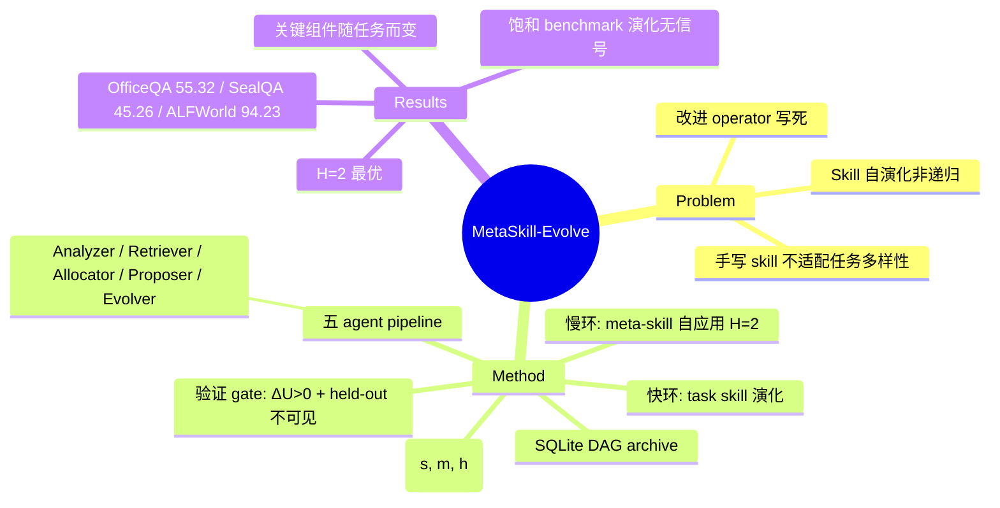

## Summary

MetaSkill-Evolve 把 LLM agent 的 skill 自演化做成**有界递归**：每个演化分支同时携带 task skill 和 branch-local meta-skill（参数化 Analyzer/Retriever/Allocator/Proposer/Evolver 五个改进 agent 的五份 Markdown skill 文件），task skill 在快环演化、meta-skill 每 H=2 步由**同一条五 agent pipeline 自应用**在慢环演化，无需新模型或新目标。在 OfficeQA / SealQA / ALFWorld 的 held-out test 上分别达 55.32% / 45.26% / 94.23%，一致高于冻结慢环的 Single-Level Evolution（48.94% / 37.21% / 92.31%）。

## Problem & Motivation

外部 skill（可复用的过程性知识文件）能显著扩展 LLM agent 的 long-horizon 能力，但手写固定 skill 难以适配任务多样性。EvoSkill、GEPA、SkillWeaver 等 self-improving 系统已能从执行轨迹改写自己的 skill 文件，但作者指出它们 "evolve only what the agent does, not how it evolves"——被优化的 artifact 在变，而执行优化的 operator（改进流程本身）是一次性写死的，因此是 self-improving 而非 recursively self-improving。本文要回答：能否把改进流程本身也作为 first-class object、用同一套 agentic pipeline 来演化，同时保持递归有界、不需要额外模型？

## Method

**分支状态**：每个分支 b = (s, m, h)——s 是 task skill（Markdown 格式的 LLM-agent 程序，规定 procedures/tools/heuristics）；m = (ψ, σ, α, π, ε) 是 meta-skill，五个分量各自是**与 task skill 格式完全相同的 Markdown skill 文件**，分别参数化改进 pipeline 的五个 agent；h 是迭代历史。全部 agent 由单一 frozen Gemma-4 31B 驱动，无 fine-tuning。

**五个改进 agent**：
- **Analyzer (ψ)**：把 failure 映射为 tag φ + 自由文本分析
- **Retriever (σ)**：按 φ 检索同分支与跨分支 inspiration（p_cross=0.2，L_same=3，L_cross=2）
- **Allocator (α)**：动态设定每步 child budget K ∈ [1, K_max=3]
- **Proposer (π)**：基于最差样例、分析与 inspiration 生成编辑 δ
- **Evolver (ε)**：把 δ 写盘并做 before/after hash 检查 + 与 proposal summary 的一致性校验（语法/一致性级检查，不含执行级重评估）

**快环（Algorithm 1，task-skill 演化）**：从 SQLite DAG 恢复分支快照 → 在 training partition 评估 s、取最差样例 → 跑五 agent pipeline 产 K 个 children → 每个 child 在 validation partition 评分 → 连同 metadata 入 DAG。不用固定 beam 而是持久化整个 DAG：可回访曾被降权的 lineage、支持跨分支检索、保留完整 provenance（承 DGM 的 archive 思想）。

**慢环（Algorithm 2，meta-skill 演化）**：每 H=2 个快环迭代触发一次。聚合最近 H 个 children 的 meta-productivity P̂ = (1/|H|)ΣΔU，把 tags/诊断/结果/P̂ 拼成合成 "meta-failure trace"，然后**把同一条五 agent pipeline 应用到 {ψ, σ, α, π, ε} 五个 meta-skill 文件上**。细节：每个 meta-child 一步内编辑全部五份文件以保持跨组件一致性（Proposer sequential、Evolver parallel）；child k+1 读的是 child k 写出的文件而非 parent 的（moving target 驱动增量精化）。

**递归的定义与边界**：作者称之为 "a bounded, one-level recursion that needs no new model or objective"——递归闭合在"改写 s 的 pipeline 同时精化 m"这一层；**五 agent pipeline 本身的 roles 与 wiring 固定不演化**，meta-update 触发的 horizon H 也固定。相对 Gödel machine（Schmidhuber 2006，形式证明每次自改有益）放弃了证明要求；与 STOP（改进 code-improvement scaffold）、Promptbreeder（prompt 与 mutation-prompt 共演化）、Darwin Gödel Machine 的区别被概括为："These systems recurse on code or prompts under one global policy. MetaSkill-Evolve instead recurses on skill files"——operator 是被 branch-local meta-skill 参数化的，规则可**跨分支分化**并在自己的时标上演化。

**选择与验证 gate**：frontier parent 按 v* = argmax[η₁U_v + η₂P̂_v + η₃N_v] 选取（η=(1.0, 0.5, 0.25)；U 为任务效用，P̂ 为 meta-productivity 估计，N=1/(1+被选次数) 为 visitation cooling）。child 只有在 validation 上 **ΔU > 0（严格优于 parent）**才能入 archive 成为 parent；中性/退化 child 留在 DAG 里仅供跨分支 inspiration。每个 benchmark 按 category 分层采样切成 train（挖 failure）/ validation（child 评分与选优）/ held-out test（loop 全程不可见）三个不相交 partition。

## Key Results

**主结果（Table 1，held-out test accuracy %）**：

| Method | OfficeQA | SealQA | ALFWorld |
|:--|:--|:--|:--|
| No-Skill | 31.78 | 29.17 | 92.31 |
| Static Skill | 36.09 | 29.41 | 90.38 |
| Single-Level Evolution（慢环冻结） | 48.94 | 37.21 | 92.31 |
| **MetaSkill-Evolve** | **55.32** | **45.26** | **94.23** |

两个 QA benchmark 上 No-Skill→Static→Single-Level→Ours 单调递增；ALFWorld 上 backbone 已近 ceiling，增益仅 +1.92。

**组件消融（Table 3）**：哪个组件最关键**随 benchmark 而变**——OfficeQA 上 Allocator α 最重要（禁用后 55.32→35.58，−19.7 pts）；SealQA 上 Proposer π 主导（45.26→36.84）；ALFWorld 的 +1.92 全部来自 cross-branch retrieval（去掉后回落到 92.31，与 Single-Level 持平）。禁用 meta-updates 即退化为 Single-Level（48.94 / 37.21 / 92.31）。

**Meta-update horizon sweep（Table 2）**：固定 meta-update 总数为 3、iteration 预算随 H 缩放，H=2 在 OfficeQA 上严格最优、SealQA 与 ALFWorld 上与 H=4 并列最优；间隔拉大性能下降，OfficeQA 最敏感（H=2→H=8 掉 9.1 点：48.94→39.84）。注意 Table 2 预算（3 次 meta-update、6 个 fast iterations）与 Table 1 主实验不同，两表数字不可混用。

**失败模式（Appendix G）**：近饱和 benchmark（ALFWorld）上 validation set 过小时几乎不含 failure，Analyzer 看不到 failing trajectory，"diagnosis→proposal→selection cycle 基本无信号可用"；validation 比例从 0.10 提到 0.25 在 ALFWorld 上带来 +2.0~+4.3 点（SealQA/OfficeQA 基本持平）。

**未报告**：token/调用成本未给出（默认预算为 5 个快环迭代 + 2 次 meta-update）；无 code 链接；无跨 backbone 验证；无 meta-evolution 失稳的负例分析。

## Evidence Ledger

| Claim ID | Claim | Type | Source locator | Evidence excerpt | Status |
|:--|:--|:--|:--|:--|:--|
| C1 | OfficeQA held-out：Ours 55.32 vs Single-Level 48.94 vs Static 36.09 vs No-Skill 31.78 | number | Table 1 | "MetaSkill-Evolve 55.32; Single-Level 48.94; Static skill 36.09; No-Skill 31.78" | source-verified |
| C2 | SealQA held-out：45.26 vs 37.21 vs 29.41 vs 29.17 | number | Table 1 | "SealQA: MetaSkill-Evolve 45.26; Single-Level 37.21" | source-verified |
| C3 | ALFWorld 94.23 vs 92.31，近 ceiling，+1.92 全来自 cross-branch retrieval | comparison | Table 1 / Table 3 | "removing only cross-branch retrieval (92.31) returns accuracy exactly to the Single-Level baseline" | source-verified |
| C4 | 五个 pipeline agent 均由单一 frozen Gemma-4 31B 驱动，无 fine-tuning | benchmark-setting | §4.1 | "A single frozen base model, Gemma-4 31B... no agent is fine-tuned" | source-verified |
| C5 | 递归 bounded one-level：pipeline roles/wiring 固定，只演化其产出的 skill 文件 | causal-mechanism | §5 / Related Work | "a bounded, one-level recursion"; "we evolve the skills it produces but not its roles or wiring" | source-verified |
| C6 | Meta-skill 每 H=2 步由同一 pipeline 自应用演化；meta-child 一步改五文件、child k+1 读 child k 的输出 | causal-mechanism | Algorithm 2 | "Each child edits all five meta-skill files in one step"; "Child k+1 reads the files as written by child k" | source-verified |
| C7 | 消融：OfficeQA 上 α 最关键（−19.7 pts），SealQA 上 π 主导（45.26→36.84） | number | Table 3 / §4.3 | "allocation policy α is the single most important component (55.32→35.58)" | source-verified |
| C8 | H=2 最优（SealQA/ALFWorld 与 H=4 并列）；OfficeQA H=2→H=8 掉 9.1 点 | number | Table 2 / §4.4 | "The tightest spacing H=2 is best on every benchmark"（SealQA/ALFWorld 为并列最优） | source-verified |
| C9 | 验证 gate：Evolver 仅 hash + proposal 一致性检查；child 须 validation ΔU>0 才可成 parent；held-out test 不可见 | benchmark-setting | Method / §4.1 | "enters the archive only when... ΔU_v>0"; "held-out test partition that the evolution loop never observes" | source-verified |
| C10 | frontier 选择 v*=argmax[η₁U+η₂P̂+η₃N]，η=(1.0,0.5,0.25)，K_max=3，p_cross=0.2 | number | Method Eq.4 / Appendix D | "v* = argmax [η₁U_v + η₂P̂_v + η₃N_v]" | source-verified |
| C11 | 与 STOP/Promptbreeder/DGM 区分：彼 recurse on code/prompts under one global policy，此 recurse on branch-local skill files | sota-novelty | Related Work | "These systems recurse on code or prompts under one global policy" | source-verified |
| C12 | 论文未提供 code 链接 | license-code | 全文 | 全文检索无 github/code release 匹配（否定性结论） | source-verified |
| C13 | Appendix G：饱和 benchmark + 小 validation → Analyzer 无 failure 信号；validation 0.10→0.25 在 ALFWorld +2.0~+4.3 点 | number | Appendix G | "The analyzer sees almost no failing trajectories"（增益仅 ALFWorld；SealQA/OfficeQA flat） | source-verified |

## Strengths & Weaknesses

**亮点**
- **把 "recursive self-improvement" 从口号落成可运行且有界的机制**：关键设计是 meta-skill 五分量与 task skill **格式同构**（都是 Markdown skill 文件），于是"同一 pipeline 应用于自身"不需要任何新模型、新目标或特殊 meta-optimizer——这是典型的 simple & generalizable 路线，也顺应了 SKILL.md 正在成为跨 harness 可移植 artifact 的趋势。
- **改进规则 branch-local 化**是对 STOP/Promptbreeder 单一全局策略的实质推进：不同 lineage 可以分化出不同的改进策略，且 P̂（meta-productivity）进入 frontier 选择，使"会改进的分支"被优先扩展。
- 评估纪律较好：held-out test 全程不可见、child 入库须 validation 严格提升、SQLite DAG 保全 provenance；消融揭示"关键组件随任务而变"（OfficeQA 靠 α、SealQA 靠 π），这比单一 headline 数字更有信息量。
- Appendix G 对失败模式（饱和 benchmark 下演化无信号）的分析诚实且可操作。

**局限**
- **"recursive" 名义强于实质**：只有一层递归，pipeline 结构（roles/wiring）与 H 均固定不演化——meta-meta 层不存在。作者自己承认这点，但标题的 "Recursive Self-Improvement" 容易被读成 Gödel machine 意义上的开放递归；实际更接近 "learned improvement operator + 一层 self-application"。
- **两时标的"慢环"其实很快**（H=2，每两步一次 meta-update），且 H sweep 显示越频繁越好——这更像高频 prompt 精化而非慢时标结构学习，削弱了 two-timescale 类比；也留下疑问：如果 H=1（每步都 meta-update）会更好还是失稳？文中未测。
- **实证面偏窄**：OfficeQA / SealQA 非社区标准 benchmark，ALFWorld 近饱和；单一 backbone（Gemma-4 31B）无跨模型验证；无 code；成本未报告（五 agent pipeline × K children × 两层演化的 LLM 调用开销不小）。
- **无 safety 维度**：ΔU>0 gate 只测任务效用。对照 [[2509-Misevolution]] 的发现（workflow/tool 演化路径的 misevolution 风险最高），让改进 operator 本身漂移恰是风险被放大的通道——meta-skill 可能演化出 reward-hacking 式的"提分但有害"策略，本文完全未评估。
- 所有消融单调有利、无 meta-evolution 失稳负例，需警惕选择性报告；ΔU>0 严格入库 gate 也可能把结果 bias 向单调曲线（被拒 child 不影响主线）。

## Mind Map

## Connections

- [[2505-DarwinGodelMachine]]：同属 "经验验证替代形式证明" 的 Gödel machine 后裔，且都用 archive/DAG 做开放式探索。关键差异：DGM 让 agent 改写**自己的 Python 代码库**（operator 与 artifact 同体），MetaSkill-Evolve 只演化 Markdown skill 文件、执行 pipeline 固定——递归更浅但更受控、成本更低。本文将 DGM 引为 LLM-era recursive improvement 实例并以 "branch-local operator vs one global policy" 与之区分。
- [[2507-SelfEvolvingAgentsSurvey]] / [[Topics/SelfEvolvingAgents-Survey]]：按 survey 的 What/When/How 框架，本文演化对象是 context/tool 层的 skill，但真正的增量在把 **How（改进流程本身）也纳入演化对象**——直接填上 survey 谱系里 "meta-level 演化" 这一格；适合作为 survey 递归自改进节的新数据点。
- [[2509-Misevolution]]：最重要的风险对照。Misevolution 显示 workflow 演化路径 ASR 54.4%→83.1%；本文让改进 operator 本身可变异且 gate 只看任务效用，正落在 misevolution 敞口上——两文对读可产生 "meta-level 演化需要 safety-aware gate" 的具体 gap。
- [[2504-SkillWeaver]]：被本文归入 "self-improving 但非递归" 的代表（skill 发现-打磨-蒸馏循环固定）。SkillWeaver 的 skill 是可执行 API，本文是 Markdown 程序——两种 skill 表示（可执行 vs 自然语言过程知识）在可验证性上的差异值得追问。
- [[2604-RecursiveMAS]]：递归的另一维度——RecursiveMAS 递归在 agent 组合结构上，本文递归在改进 operator 上；两者正交，可组合。

## Notes

- 值得追问：meta-skill 演化的信号 P̂ 只有 H=2 个样本，方差应当很大——为何 H=2 反而最好？可能答案不是"信号更准"而是"更新更频繁弥补了信号噪声"，即 meta-loop 实际在做高频小步随机搜索。若如此，"two-timescale" 的理论包装与机制现实有距离。
- "child k+1 reads the files as written by child k" 的 within-step 串行 moving target 设计没有消融——它是 feature 还是引入了顺序偏置（后生成的 child 天然占优）？
- 无 code + 非标准 benchmark（OfficeQA/SealQA 出处待查）使复现门槛高；若后续放码，可考虑 repo-digest。
