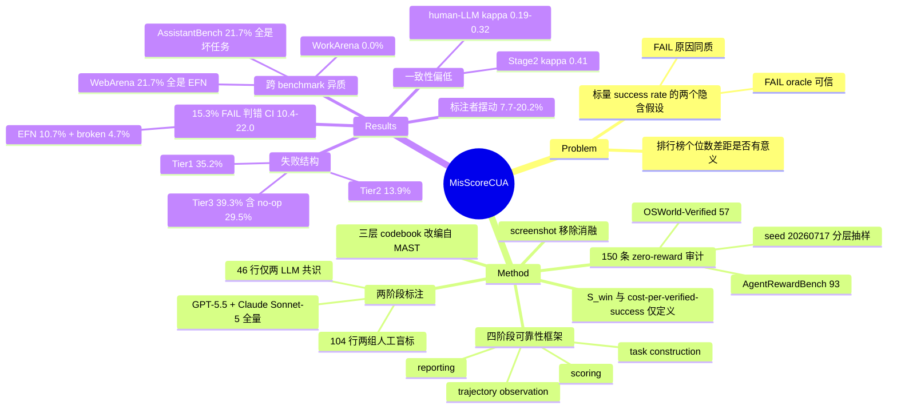

## Summary

对 5 个 CUA benchmark 的 150 条 zero-reward 轨迹做人工+LLM 审计，发现 15.3% 的 FAIL 判定是错的（10.7% 是 evaluator false negative，4.7% 是任务本身坏掉），并用三层诊断分类把剩下 122 条真失败拆开，指出 verification/feedback 类（39.3%，其中 feedback-blind no-op 单类 29.5%）与 planning 类（35.2%）远超 execution/grounding（13.9%）。论文的主张是标量成功率同时**高估了失败率**又**掩盖了失败结构**，因此提出四阶段（task construction / trajectory observation / scoring / reporting）的 benchmark 设计准则。

## Problem & Motivation

CUA benchmark 目前把 agent 能力压成一个标量 success rate，但这个标量建立在两个未经检验的假设上：判 FAIL 的 oracle 是可信的，且 FAIL 的原因是同质的。作者认为两个假设都不成立——规则式/程序式 checker 会因为 URL 变体、等价答案格式、动态站点漂移而误判成功轨迹；而即使判对了，一条 "0 分" 也不区分 agent 是不会规划、点不准、还是根本没看见自己的动作没生效。

动机上作者把问题落在"测量学"而非"模型能力"上：如果 15% 的 FAIL 是噪声，那么排行榜上个位数的差距就没有意义；如果失败集中在 verification 而非 grounding，那么把研究资源投在 GUI grounding 上就是投错方向。论文的落点是给 benchmark 建设者一份可执行的设计清单，而不是提出新 agent 或新方法。

## Method

**（1）四阶段可靠性框架**。把 benchmark 的测量链拆成 task construction（任务/环境是否可解、是否被污染）、trajectory observation（释出的证据是否足以复核判定）、scoring（oracle 本身是否可靠）、reporting（报告是否只给标量）。Table 3 对每阶段列出"最低控制项"与"进阶控制项"。

**（2）审计设置**。deterministic stratified sampling，seed 20260717。样本来自两个来源：OSWorld-Verified 57 条，AgentRewardBench 93 条（覆盖 WebArena / VisualWebArena / WorkArena / AssistantBench）。共采 158 条，扣掉 8 条用于 codebook 校准，剩 150 条进入统计。只采 **zero-reward（FAIL）** 轨迹，且要求轨迹带 step-level reasoning、actions、screenshots。

**（3）两阶段标注**。Stage 1 判 verdict（genuine failure / evaluator false negative / broken task / unclear）；Stage 2 给真失败打诊断标签。标注者为 GPT-5.5（Codex CLI v0.144.5）与 Claude Sonnet-5，两者对全部 150 条独立标注；人工复核覆盖**全部 74 条 LLM 分歧行** + 30 条 LLM 一致行的分层抽样 = 104 行，由两个人工组通过 screenshot-replay 界面盲标。剩余 46 行由两 LLM 共识直接采纳。

**（4）三层诊断 codebook**。由 MAST（Cemri et al. 2025）改编而来（Table 4 给出 provenance 映射）：Tier 1 planning（Spec violation / Planning loop / Hallucination）、Tier 2 execution & grounding（Grounding / Tool / State）、Tier 3 verification & feedback（Feedback-blind no-op / Premature termination / Missed verification），另设 Other 与 Ambiguous。

**（5）observability 消融**。把 screenshot 从证据包里抽掉后重跑两个 LLM 标注者，量化"判定对可见证据的依赖度"。

**（6）报告层指标**。定义 critical-window slack $S_{win}=(R-r+1)/R$（$R$ 为目标仍可操作的 observation–action 机会数，$r$ 为发出正确动作的那一次，miss 记 0），以及 cost-per-attempt 与 cost-per-verified-success。这两组量只被**定义**，论文未在任何 benchmark 上实测。

## Key Results

**判定可靠性**。150 条 FAIL 中 15.3% 判错（95% Wilson CI [10.4, 22.0]）：10.7% [6.7, 16.6] 是 evaluator false negative，4.7% [2.3, 9.3] 是 broken task，另有 3.3% [1.4, 7.6] 从释出证据无法判定。

分 benchmark（Table 2，列为 audited / genuine failure / EFN / broken / unclear / wrong%）：

| Benchmark | n | GF | EFN | Broken | Unclear | Wrong% |
|:--|--:|--:|--:|--:|--:|--:|
| OSWorld | 57 | 47 | 8 | 2 | 0 | 17.5 |
| WebArena | 23 | 18 | 5 | 0 | 0 | 21.7 |
| VisualWebArena | 23 | 18 | 3 | 0 | 2 | 13.0 |
| WorkArena | 24 | 23 | 0 | 0 | 1 | 0.0 |
| AssistantBench | 23 | 16 | 0 | 5 | 2 | 21.7 |
| **All** | **150** | **122** | **16** | **7** | **5** | **15.3** |

WorkArena 是唯一 0 误判的 benchmark；AssistantBench 的 21.7% 全部来自 broken task 而非 evaluator，两种失效模式来源完全不同。

**失败结构**（122 条真失败）：Tier 3 verification & feedback 48 条 39.3%（feedback-blind no-op 36 条 = 29.5%，单类最大；premature stop 8；missed verification 4）；Tier 1 planning 43 条 35.2%（spec violation 18 = 14.8%，planning loop 20 = 16.4%，hallucination 5）；Tier 2 execution & grounding 17 条 13.9%（grounding 9 / tool 6 / state 2）；Other 6 条 4.9%；Ambiguous 8 条 6.6%。

**标注一致性**。两 LLM 在 Stage 1 上 κ=0.71（raw 92.7%），Stage 2 诊断上仅 κ=0.41；104 行共同盲评集上两人工组 κ=0.59（raw 85.6%），human–LLM pairwise κ 只有 0.19–0.32（raw 76.0–81.7%），四标注者 Fleiss' κ=0.36。作者明确说明该集合刻意包含全部 LLM 分歧行，属 stress-set 统计而非总体一致性估计。

**标注者敏感性**。仅用单一标注者的标签重算 wrong-verdict 率，GPT-5.5 / Claude Sonnet-5 / human group 1 / human group 2 分别为 13.5% / 7.7% / 20.2% / 13.5%，mean 13.7%，sd 5.1 个百分点，range 7.7–20.2%。

**observability 消融**。移除 screenshot 后 Codex 翻转 12 条判定、Claude 翻转 13 条，两者检出的 EFN 分别从 14→8、10→6，Stage 1 一致性降到 κ=0.60。

## Evidence Ledger

| Claim ID | Claim | Type | Source locator | Evidence excerpt | Status |
|:--|:--|:--|:--|:--|:--|
| C1 | 150 条被审计 FAIL 中 15.3% 判定错误，95% Wilson CI [10.4, 22.0] | number | §4.3 Verdict reliability；Table 2 | "15.3% of audited FAIL verdicts are wrong (95% Wilson CI [10.4, 22.0])" | source-verified |
| C2 | 误判拆分为 10.7% evaluator false negative + 4.7% broken task，另 3.3% unclear | number | §4.3；Abstract | "10.7% [6.7, 16.6] are evaluator false negatives and 4.7% [2.3, 9.3] are broken tasks" | source-verified |
| C3 | 样本 = OSWorld-Verified 57 + AgentRewardBench 93，共 150 条 zero-reward 轨迹 | benchmark-setting | §4.1 Audit Setting；Table 2 | "From AgentRewardBench Lù et al. (2025), we formed unique (benchmark, task, agent, experiment) tuples" | source-verified |
| C4 | 抽样为 deterministic stratified，random seed 20260717；158 采样扣 8 条 codebook 校准 | benchmark-setting | §4.1 | "using a deterministic, stratified procedure (random seed 20260717)" | source-verified |
| C5 | 122 条真失败中 Tier 3 verification/feedback 占 39.3% | number | §4.3；Table 2 下半 | "Tier 3 verification and feedback failures account for 39.3%" | source-verified |
| C6 | feedback-blind no-op 单类占 29.5%，为最大单一类别 | number | §4.3 | "Feedback-blind no-op repetition alone accounts for 29.5%, the largest single category" | source-verified |
| C7 | Tier 1 planning 35.2%，Tier 2 execution/grounding 13.9% | number | §4.3；Table 2 | "Tier 1 planning failures account for 35.2%... Tier 2 execution and grounding..." | source-verified |
| C8 | WorkArena 24 条审计 0 条误判（wrong 0.0%） | number | Table 2 | Table 2 row WorkArena: 24 / 23 / 0 / 0 / 1 / 0.0 | source-verified |
| C9 | 两 LLM Stage 1 κ=0.71（raw 92.7%），Stage 2 κ=0.41 | number | §4.3 Annotation reliability | "κ=0.71, raw agreement 92.7% ... only moderately on Stage 2 diagnoses (κ=0.41)" | source-verified |
| C10 | 两人工组 κ=0.59（85.6%）；human–LLM pairwise κ 0.19–0.32；四标注者 Fleiss' κ=0.36 | number | §4.3 | "human groups reach κ=0.59 (85.6%); pairwise human–LLM κ ranges from 0.19 to 0.32... Fleiss' κ is 0.36" | source-verified |
| C11 | 单标注者 wrong-verdict 率 13.5/7.7/20.2/13.5%，mean 13.7%，sd 5.1pp | number | §4.3 | "the annotator-specific rates are 13.5%, 7.7%, 20.2%, and 13.5%, respectively: mean 13.7%... 5.1 percentage points" | source-verified |
| C12 | 移除 screenshot 后 Codex 翻转 12 条、Claude 翻转 13 条，EFN 检出 14→8 / 10→6，Stage 1 κ→0.60 | number | §4.3 | "removing screenshots flips 12 Codex verdicts and 13 Claude verdicts, reduces the evaluator false negatives... from 14 to 8 and from 10 to 6" | source-verified |
| C13 | AgentDiet 把 input token 最多减少 59.7% —— **这是论文对 Xiao et al. (2025) 的引用转述，不是本文实验结果** | number | §6；附录 C.2；原始出处 Xiao et al. 2025 (arXiv:2509.23586) | "AgentDiet cuts input tokens by up to 59.7% without sacrificing success Xiao et al. (2025)" | unsupported（作为本文发现）；作为引用转述属实 |
| C14 | 人工复核覆盖全部 74 条 LLM 分歧行 + 30 条一致行分层抽样 = 104 行，两组盲标；剩 46 行由两 LLM 共识决定 | benchmark-setting | §4.2 | "all 74 rows on which the LLMs disagree... and a seeded, benchmark-by-verdict stratified sample of 30 LLM-agreement rows" | source-verified |
| C15 | 三层 codebook 由 MAST（Cemri et al. 2025）改编，非全新提出 | sota-novelty | §4；Table 4 | "Provenance mapping from MAST Cemri et al. (2025) to the CUA audit codebook" | source-verified |
| C16 | critical-window slack $S_{win}=(R-r+1)/R$ 仅被定义，论文未在任何 benchmark 上实测 | causal-mechanism | §6 | "critical-window slack, S_win=(R-r+1)/R (zero on a miss), is hardware-independent" | source-verified |
| C17 | 论文未释出代码或审计标签数据；license 为 CC BY 4.0 | license-code | 首页 license 行；全文无 repo 链接 | "License: CC BY 4.0 arXiv:2607.28367v1 [cs.AI] 30 Jul 2026" | source-verified |

> C13 已按 verifier 结论降级：正文与 Key Results 中不得把 59.7% 写成本文结果。`verification_status: partial` 即由此而来（17 条高风险 claim 中 16 条 source-verified）。

## Strengths & Weaknesses

**值得拿走的三点。** 一是 15.3% 这个数量级本身有决策意义：CUA 排行榜上常见的 2–5pp 差距落在判定噪声里，"A 比 B 强 3 个点"在当前测量精度下不可信。二是 Table 2 的**跨 benchmark 异质性**比总均值更有信息量——WorkArena 0/24、WebArena 5/23 全是 evaluator 误判、AssistantBench 5/23 全是坏任务，说明"benchmark 不可靠"不是一个统一病，而是至少两种独立失效（checker 设计 vs 环境腐化），修法完全不同。WorkArena 的零误判对应它用结构化记录做程序化状态检查，这其实是全文最可操作的结论，但论文只在正文一带而过，没有单独展开。三是 §4.3 的标注者敏感性表格是难得的诚实：作者自己给出了 7.7%–20.2% 的标注者间摆动，等于承认摘要里那个 15.3% 的真实不确定度远宽于 Wilson CI（后者只含抽样误差）。

**最大的问题：手边就有 gold label，却没用。** 93/150 的轨迹取自 AgentRewardBench，而该工作已经为**这批轨迹**释出了 6 位专家标注的成功/失败 label（inter-annotator agreement 89.3%），并且已经报告了 rule-based evaluator 的 recall 只有 55.9%（见 [[2504-AgentRewardBench]]）。也就是说，本文的核心发现——规则式 oracle 会系统性地把成功判成失败——在同一批数据上已经被以约 14 倍的样本量、用专家标注量化过。我 grep 了 §4 全节，没有出现 "gold" / "ground truth" / "human label" / "existing labels" / "reuse" 中的任何一个；AgentRewardBench 全文只出现 4 次，附录 A.2 把它概括为 "revealing that heuristic evaluators in web tasks often have high false negative rates"。把新协议的 LLM+人工标签与已有的 6 专家共识对齐，是成本最低、也最能证明本文标注流程有效性的一次校准，而它没有做。**（此段为我的判断与推断，非论文自身 claim；证据是两篇论文的原文与上述 grep 结果。）**

**标注可靠性撑不住第二个主张。** Stage 2 诊断 κ 只有 0.41（moderate），而 Tier 3（39.3%）与 Tier 1（35.2%）只差 4.1pp——这个差距完全落在 κ=0.41 的噪声里。所以"verification/feedback 主导 planning"读不出来，能读出来的只是弱一档的"两者都远大于 execution/grounding（13.9%）"。摘要写成 "verification/feedback and planning failures dominate execution/grounding errors" 是准确的；但正文里把 Tier 3 当作"最大类"来引导设计建议，超出了一致性所能支撑的分辨率。

**46 行没有人看过。** 人工只复核了 104 行，其余 46 行由两 LLM 共识直接采纳。而论文自己测出 human–LLM κ 只有 0.19–0.32（slight-to-fair）。作者的辩护是"所有 LLM 分歧行都经人工复核"，但这恰好防不住真正的风险模式：两个 LLM **一致地**错。31% 的最终标签建立在一对与人类对齐度很差的标注者的共识上，且这部分不可审计。

**单向审计。** 只采 FAIL 轨迹，因此本文只能估计 false negative，给不出 false positive（reward hacking、走捷径拿分）的量级。而 AgentRewardBench 恰恰测到 judge precision 无一超过 70%，[[2607-ProtocolValidity]] 也在做同侧的事。"benchmark mis-score" 这个标题实际只覆盖了误差的一半，论文在 Limitations 里承认了。

**其余。** 综述部分自述为非 PRISMA 的迭代式筛选，所以 §3/附录 A 是叙述性综述而非系统综述；no-op 探针自述未验证；每 benchmark n 只有 23–57，分 benchmark 的百分比（如 WorkArena 0.0%）置信区间极宽，不宜当作"WorkArena 无误判"的结论。$S_{win}$ 定义得干净但零实测，属于 position 而非 contribution。最后，全文唯一的实证产物就是那 150 行标注，而这批标注**没有随论文释出**——对一篇主张"benchmark 应该释出完整证据以便复核"的论文来说，这是明显的自我不一致。

**定位。** 当 CUA benchmark 设计的 checklist 用是称职的，Table 2/Table 3 可以直接进 `CUA-Survey` 的 evaluation 节；当作新知识则增量有限，主要发现是既有结论在更小样本上的复述。rating 3。

## Mind Map

## Notes

- **与 [[2504-AgentRewardBench]] 的关系是本篇最需要记住的一条**：后者用 6 专家、1302 条轨迹建立了 CUA 评测的 ground truth 与 meta-evaluation 基线（rule-based recall 55.9%，judge precision 无一 >70%）；本篇在其子集上用 LLM+人工重做了一遍 FAIL 侧审计。写 `CUA-Survey` 的 evaluation 节时应以 AgentRewardBench 为主证据、本篇为**失败结构分解**的补充，而不是并列的两个独立发现。
- 可交叉引用 [[2606-OSWorld2]]：OSWorld-Verified 正是本文 57 条 OSWorld 样本的来源，而 OSWorld 2 走的是 checkpoint-based partial credit（108 任务 / 27.25 checkpoints）路线。本文说"标量掩盖失败结构"，OSWorld 2 是对同一诊断的**工程回应**；两者应放在一起读——但注意本文的 17.5% OSWorld 误判率是在 OSWorld-Verified 上测的，不能直接迁移到 OSWorld 2。
- Tier 3 的 feedback-blind no-op（29.5%）值得单拎出来做一次机制追问：agent 重复发同一个动作而屏幕毫无变化，这既可能是不看 observation，也可能是看了但没有"动作是否生效"的判据。论文的 no-op 探针自述未验证，这里有明确的空位——一个 cheap 的 state-delta 信号（前后 screenshot / DOM 是否变化）能否直接把这 29.5% 中的大部分变成可自动检测的失败？如果能，它同时是 evaluator 的改进项和 agent 的 self-correction 信号。
- 方法论上可迁移到本 vault 自身：本文"人工只复核 LLM 分歧行 + 一致行分层抽样"的做法，和我们 paper-digest 的 Finder≠Verifier 是同构的；而它暴露的坑（两 LLM 一致地错，且这部分不可审计）也同样适用于我们——独立 verifier 与 preparer 若共享同一模型族，`source-verified` 的独立性是打折的。
- 待办：`survey-refresh CUA-Survey`（本篇 + daily 轮的 MAGA 已双双 pending）。
