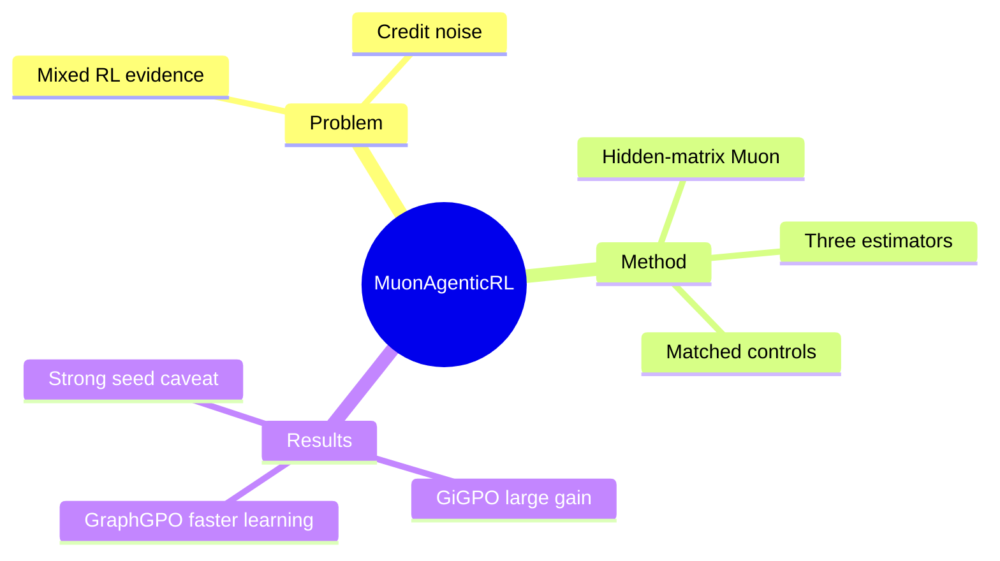

## Summary
论文在 ALFWorld 的 matched single-seed study 中发现 Muon 对 agentic RL 的收益取决于 advantage estimator 与 learning rate，而非能用“Muon 适合或不适合 RL”一概而论。

## Problem & Motivation
Muon 通过对 momentum matrix 做近似 spectral normalization，在大规模 pre-training 中可与 AdamW 竞争，但 post-training evidence 相互矛盾：一些工程报告看到小幅收益，另一些 RLVR 工作认为 spectral whitening 会放大低-SNR gradient tail。已有负面结果主要来自 single-turn、episode-level advantage 的任务，而 long-horizon agentic RL 的 credit structure 不同。论文因此追问：当 advantage estimator 提供 step-level 或 transition-level credit 时，Muon 的 weak-direction update 是否更可靠？

## Method
实验在 ALFWorld 六类 household task 上训练 Qwen2.5-0.5B-Instruct，使用 sparse terminal reward、最多 50 个 environment step，并比较 GRPO、GiGPO 与 GraphGPO。GRPO 使用 episode-level advantage；GiGPO 对 repeated anchor state 的 action 做 group contrast，并加入 step-level term；GraphGPO 把 rollout 汇成 state-transition graph，再按 successor 到 goal 的距离分配 transition credit。

在 optimizer 对比中，只把 attention 与 MLP 的 2D hidden weight matrix 交给 vanilla Muon；embedding、norm 和其他 non-matrix parameter 保持 baseline AdamW。每组 matched run 除 optimizer 外设置相同，训练 200 update，每 5 update 用 128 episode 验证。作者提出但未直接验证的机制 conjecture 是：Muon 会抹平 singular-value magnitude，因此只有当 weak direction 的 sign/SNR 足够可靠时才有益，更细粒度 credit 可能减少 trajectory-level confounder。

## Key Results
- GiGPO 下，Muon 将 final-window validation success 从 0.290 提升到 0.546，相对提高 88%；最终 checkpoint 为 0.633，而 matched AdamW 为 0.320。
- 在 learning rate 3e-5 时，GRPO 的 late-window success 从 0.161 提升到 0.268；但 full-trajectory AUC 增益较小，说明分离主要出现在训练后期。
- GraphGPO 的 Muon 在 1e-5 下达到 0.901 late-window success，normalized validation AUC 从 AdamW 的 0.399 提升到 0.556，并分别提前 30 与 60 个 update 达到 0.5、0.75 success。
- GiGPO 的 matched step-credit ablation 中，关闭 step term 时 AdamW/Muon 的 final-six success 为 0.141/0.361，开启后为 0.290/0.546；两种 optimizer 都受益，Muon advantage 也持续存在。
- 两个 high-rate AdamW control 在 update 后 validation success 全为 0，并出现 KL spike 与 action-format degradation；同 nominal regime 的 Muon 保留有效行为，因此收益不能简单归因于更大学习率。

## Strengths & Weaknesses
论文的价值在于把 optimizer 与 credit assignment 联合研究，并用 GRPO/GiGPO/GraphGPO、learning-rate control 和 step-credit factorial 避免单一曲线叙事。它也明确区分 late-window quality、normalized AUC 与 time-to-threshold，揭示接近 saturation 时最终分数会隐藏 learning efficiency。

证据仍是 exploratory：所有核心对比都是 single seed，只覆盖一个 0.5B model 与 ALFWorld；GRPO 只测一个 Muon rate，high-rate AdamW control 只在 GiGPO 上做。作者没有直接测 gradient SNR、effective rank 或 update spectrum，credit-quality 机制目前只是 correlation-supported conjecture。实现还用 FSDP NO_SHARD 让 Muon 看到完整 matrix，增加 per-device memory，扩展到大模型需要 distributed Muon。

## Mind Map

## Notes
这篇论文更像一条高价值 hypothesis：optimizer 的适用性不能脱离 advantage geometry 讨论。下一步关键实验不是继续加 benchmark 平均数，而是 multi-seed 地直接测不同 estimator 下 policy-gradient matrix 的 directional SNR、effective rank 与 Muon update alignment。
