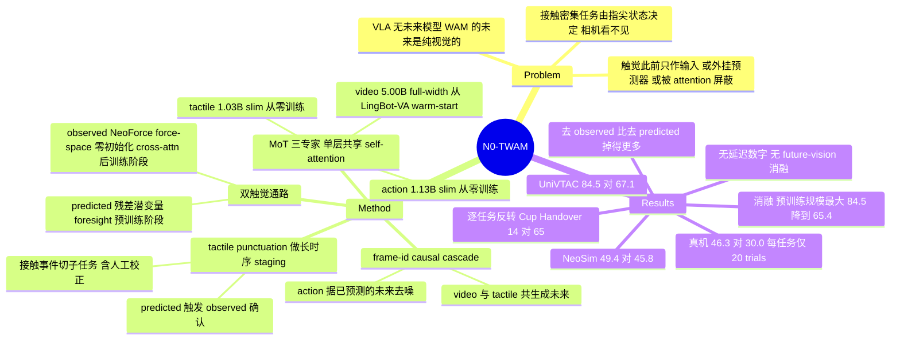

## Summary

N0-TWAM 把 touch 变成 world-action model 的原生生成模态：Mixture-of-Transformers 的 video / tactile / action 三个 expert 只共享一层 self-attention，由 frame-id causal mask 组成 predict-then-act cascade——先共同去噪出未来画面与未来接触，action expert 再据此生成动作 chunk，同时通过 NeoForce force-space encoder 读入当前观测到的触觉。在 UniVTAC 84.5%、NeoSim 49.4%、真机八任务 46.3% 上均为最优（对应最强 baseline 67.1 / 45.8 / 30.0）。但消融显示预训练规模才是 UniVTAC 上最大的单一因素（84.5→65.4），且反应式的 observed 通路比新颖的 predicted 通路贡献更大。

## Problem & Motivation

接触密集任务（拧螺丝、从一摞杯子里剥出一个、抓软物）的成败由指尖发生了什么决定，而不是场景全局布局——相机难以分辨，力/触觉传感器却直接报告。作者认为纯视觉回归策略缺两样东西：接触通道，以及"预判交互下一刻如何展开"的能力。

现有两条线各补一半。VLA 把 action head 接在预训练 VLM 上，继承语义先验但把视觉现在压成低维动作，没有对下一刻的显式建模；video world model 与 world-action model 把控制锚定在预测的未来上，可那个未来几乎总是纯视觉的。触觉进入这个图景有三条不完整的路径：tactile policy 只把 touch 当输入从不预测它；第二类用一个独立（常冻结）的 tactile predictor 外挂到策略上，预测发生在行动的网络之外；同期的 touch-aware world-action model 把触觉纳入模型却"保持距离"，用 gating 或 masking 保护视觉流。论文的定位是：缺一个在**同一目标、同一因果步**上把 touch 与 vision 一起预测、并让策略从这个联合预测的未来里读出动作的模型。

## Method

**MoT 三专家 + 单一共享 attention。** backbone 拆成 video / action / tactile 三个 per-modality expert，各自持有私有权重、AdaLN、FFN，每层只通过一次 masked self-attention 交互。关键的对立设计是"把容量隔离在权重里，而不是在 attention 里限制触觉"——因此 vision 与 touch 保持完全互注意。视觉专家从 LingBot-VA warm-start（Wan2.2-TI2V-5B 家族，约 5B），action / tactile 专家从零训练且是 slim 的（私有宽度 1024 vs 视觉专家 3072，共享 attention 统一在 3072）。总可训练参数 7.16B，对照的 all-full-width 设计约 15B（**该 15B 是表注说明的估计值，未实际训练**）。

**frame-id causal cascade。** Eq.(1) 的分解完全由一张 attention mask 实现，不改动 attention 算子本身：同一 chunk 内 noisy video 与 noisy tactile 互相 co-generate，noisy action 额外 attend 它们的 clean 副本，新 chunk attend 全部 clean 历史，任何 token 不 attend 未来 chunk。训练用 diffusion forcing（每个 temporal group 独立采噪声水平），clean 历史以概率轻微重加噪，使模型容忍测试时不完美的已提交历史。

**双触觉通路。** 触觉传感器是 vision-based（软胶被相机成像），因此 tactile 与 video 共用同一个冻结 causal video VAE 的潜空间——这正是共享 attention 有意义的前提。(1) *predicted* 通路：tactile expert 把未来触觉潜变量当生成目标，以**残差形式**预测（离开接触时触觉近乎常值，信息全在 contact onset 与 release 的变化上）。(2) *observed* 通路：一个冻结 estimator 把原始胶片图转成三轴表面力图 + contact mask，NeoForce encoder（DINOv2 初始化的 ViT-B，与动作损失一起微调）把它变成表示 token，经**零初始化** cross-attention 在 action head 之前注入——起点是精确的 no-op，因此嫁接到预训练模型上不扰动它。一句话：**latent space 里预测触觉，force space 里观测触觉**。

**分阶段训练。** 预训练只开 predicted 通路（observed 关闭），理由是给策略真实当前接触会让它依赖该信号、欠训 foresight；post-training 才打开 observed 通路。condition dropout 对触觉用"缺席"而非置零（dropped 样本根本不传 tactile 张量），从而统一了主动 dropout 与真正无触觉的 embodiment 数据，并让模型同时学到 vision-only 边缘策略作为传感器失效时的退化行为。

**tactile punctuation 做长时序 staging。** 长任务里 episode 级指令不告诉模型当前处于哪一阶段，而子任务天然被接触事件分隔。训练侧按 contact onset / release 把演示切成 sub-task clip；推理侧一个轻量 scheduler 维护子任务队列，**predicted 触觉提前一步触发推进、observed 接触事件确认后才提交切换**。触觉还能区分"抓到"和"空抓"（夹爪闭合但没有力上升）。

**动作表示。** 每臂 10 维（3D 位置 + 6D 旋转 + 1D 夹爪），双臂 20 维统一接口；回归 chunk-start 锚定的 delta 末端位姿，且用逐元素相减而非 SO(3) 上的相对旋转——因为静止时相对旋转是非零常量，误差会积累成持续的朝向偏移，而相减让静止态就是零向量。

## Key Results

| 套件 | N0-TWAM | 最强 baseline | 说明 |
|:--|:--|:--|:--|
| UniVTAC（8 任务，公开） | **84.5** | InternVLA-A1 67.1 | 领先约 17 点；纯视觉 WAM 反而落后 VLA（FastWAM 48.0、LingBot-VA 31.4、GigaWorld-Policy 16.5） |
| NeoSim（12 任务，自建） | **49.4** | π0.5 45.8 | 差距小得多；论文归因于仿真传感器不是 NeoForce 预训练的那个 |
| 真机（8 任务，6 个取自自建 NeoReal） | **46.3** | π0.5 30.0 | LingBot-VA 21.9、FastWAM 14.4 |

真机增益集中在相机分辨不了隐藏接触状态的任务：Bottle Standing 70 vs 20、Socket Plugging 70 vs 60、Fruit Collection 60 vs 50、Board Wiping 55 vs 40；而在由视觉引导放置决定的两个任务上 π0.5 持平或反超（Cup Stacking 45 vs 50、Bag Packing 15 vs 20）。仿真每任务 100 trials，真机每任务仅 20 trials，**论文自己指出单任务成功率的二项标准误最高约 ±11%**，因此只把逐任务差距当定性信号。

**消融（Fig 9 / Appendix A）：**

| 变体 | UniVTAC | NeoSim |
|:--|:--|:--|
| full | 84.5 | 49.4 |
| 20% 预训练数据 | 65.4 | 未跑 |
| w/o predicted tactile | 71.8 | 41.1 |
| w/o observed tactile | 70.5 | 29.6 |

三点值得注意。其一，**预训练规模是 UniVTAC 上最大的单一因素**（−19.1），大于任一触觉通路。其二，两个 benchmark 上去掉 *observed*（反应式）通路的损失都大于去掉 *predicted*（前瞻式）通路——而 predicted 才是本文的新颖之处。其三，逐任务存在方向反转：NeoSim 上 Cup Handover 全模型 14 而 w/o predicted 高达 65，Cup Stack 全模型 12 而 w/o observed 38；UniVTAC 上 Pull-out Key 全模型 79 而两个触觉消融变体都是 86。均值上"两条通路都 load-bearing"成立，但机制解释无法覆盖这些反转。

**泛化（Table 4，真机）：** N0-TWAM 平均 51.7 最高，但 unseen object 上 65 落后 π0.5 的 80；真正分开的是 visual perturbation——π0.5 与 LingBot-VA 掉到 25 / 30，N0-TWAM 守住 45。

**触觉真实性与 NeoForce 迁移（Table 6）：** 用更逼真的 gel-rendered 触觉图训练评测只轻微下降（UniVTAC 82.4 vs 84.5、NeoSim 单臂 58.5 vs 63.8、双臂 39.3 vs 42.3）；把 gel-rendered 触觉改用预训练 NeoForce 读取则回升到 88.1 / 64.8（双臂该格未报告）。

**规模与配置：** 预训练语料 NeoData 超 30,000 小时、六个 embodiment、450 个接触密集任务；预训练 30,000 步（约 2.2 epoch）、有效 batch 512、128 张 H800；NeoForce 在 20,000 条演示、30 个任务上预训练 100,000 步（8×A100）。

## Evidence Ledger

| Claim ID | Claim | Type | Source locator | Evidence excerpt | Status |
|:--|:--|:--|:--|:--|:--|
| C1 | UniVTAC 8 任务平均 84.5%，比最强 baseline InternVLA-A1 的 67.1% 高约 17 点 | number/comparison | Table 2, §4.3 | "84.5%), about 17 points above the strongest baseline of any kind (InternVLA-A1, 67.1%)" | source-verified |
| C2 | NeoSim 12 任务平均 49.4，最强 baseline 为 π0.5 的 45.8 | number/comparison | Table 3, §4.3 | "N0-TWAM (49.4 average) is the best method overall, ahead of the strongest baseline π0.5 (45.8)" | source-verified |
| C3 | 真机 8 任务 macro average：46.3 / 30.0 / 21.9 / 14.4 | number/comparison | Fig 7 caption, §4.3 | "Macro average (equal weight per task): N0-TWAM 46.3, π0.5 30.0, LingBot-VA 21.9, FastWAM 14.4" | source-verified |
| C4 | 仿真每任务 100 trials、真机每任务 20 trials；论文自述二项标准误最高约 ±11% | benchmark-setting | §4.2, §4.3 | "evaluated over 100 trials and each real-robot task over 20 trials ... binomial standard error of up to ~11%" | source-verified |
| C5 | 消融 UniVTAC 84.5→65.4 / 71.8 / 70.5；NeoSim 49.4→41.1 / 29.6 | number | §4.5, Fig 9 | "lowers success from 84.5 to 65.4 ... to 71.8 and ... to 70.5 ... from 49.4 down to 41.1 and 29.6" | source-verified |
| C6 | 消融只含三个变体，未做"去掉 future-vision 预测"的消融 | benchmark-setting | §4.5（全文检索 ablat / future-vision / w/o video） | "We ablate ... the scale of the pre-training data, the predicted tactile foresight target, and the observed tactile conditioning" | source-verified |
| C7 | 无"同时关闭两条 tactile 通路"的联合对照 | benchmark-setting | §4.5, Fig 9, Appendix A | (no matching text found; only single-pathway ablations reported) | source-verified |
| C8 | observed encoder 按域切换：真机用 NeoForce，仿真因传感器不匹配改用从零训练的轻量 encoder | causal-mechanism | §2.2.2, §4.1, §4.3 | "In simulation the tactile comes from a different sensor that NeoForce never saw, so we do not read it in force space" | source-verified |
| C9 | gel-rendered 触觉改用 NeoForce 读取：UniVTAC 82.4→88.1，NeoSim 单臂 58.5→64.8，双臂未报告 | number | Table 6, §4.6 | "raises success from 82.4% to 88.1% ... and from 58.5% to 64.8% on the four single-arm NeoSim tasks" | source-verified |
| C10 | 声称 real-time，但全文无任何延迟 / 控制频率 / 吞吐 / FLOPs 数字，也无同硬件效率对照 | number | §2.3.2 及全文附录（检索 latency / ms / Hz / FLOP / throughput） | "the inference latency can be hidden behind robot execution" —— 无任何数值 | source-verified |
| C11 | 总参数 7.16B（video 5.00B / action 1.13B / tactile 1.03B）；all-full-width ≈15B 且表注说明是估计值 | number | Table 1 | "7.16 B" total vs "≈15 B"; "all-full-width figures are estimates" | source-verified |
| C12 | NeoData >30,000 小时、六 embodiment、450 任务；预训练 30,000 步约 2.2 epoch、batch 512、128×H800 | number | §3.1, §4.1 | "over 30,000 hours, spanning six embodiments and 450 contact-rich tasks"; "30,000 steps, about 2.2 epochs ... 128 NVIDIA H800 GPUs" | source-verified |
| C13 | 子任务切分：触觉事件为主 + 夹爪开度兜底 + 最终人工校正；指令由 Gemini 3.5 Flash 生成并人工抽检 | causal-mechanism | §2.3.3, §3.2 | "a final human check corrects the remaining boundaries"; "We use Gemini 3.5 Flash to generate a short sub-task instruction ... with human spot checks" | source-verified |
| C14 | 未对 tactile punctuation / staging 机制本身做消融或对照 | benchmark-setting | §4.5, Fig 9, Appendix A/C | (no matching text found; no staging / no-staging control reported) | source-verified |
| C15 | Table 4：平均 51.7 最高，但 unseen object 65 落后 π0.5 的 80；visual perturbation 45 vs 25 / 30 | number/comparison | Table 4, §4.4 | "π0.5 and LingBot-VA fall to 25 and 30, but N0-TWAM holds at 45 ... highest on average (51.7)" | source-verified |
| C16 | Table 5 的 Absolute 行 93/58/87/92 与主表一致，即主结果在这四个对齐敏感任务上用 absolute EE；delta 平均 50.0 vs absolute 82.5 | benchmark-setting | Table 5 / Table 2 / Table 3, §4.6 | "Absolute 93 / 58 / 87 / 92, Avg. 82.5"; Delta "Avg. 50.0"; "adopt absolute on the task-specific settings where sub-centimeter placement dominates" | source-verified |
| C17 | 逐任务消融方向反转：Cup Handover 14→65（w/o predicted）、Cup Stack 12→38（w/o observed）、Pull-out Key 79→86（两变体） | number | Table 7 / Table 8, Appendix A | Cup Handover full 14, w/o predicted 65; Cup Stack full 12, w/o observed 38; Pull-out Key full 79, both variants 86 | source-verified |
| C18 | 给出 GitHub 与项目页；codebase 与 checkpoint 声明"将会"公开，非已公开 | license-code | 首页 metadata, Abstract | "[Code] https://github.com/neoteai/N0-TWAM"; "will be made publicly available" | source-verified |
| C19 | "first tactile world-action model trained at large scale" 带 "to our knowledge" 限定 | sota-novelty | Abstract, §1 | "To our knowledge, it is the first tactile world-action model trained at large scale" | source-verified |
| C20 | 预训练六 embodiment，但真机评测只在 PiPER 与 Flexiv 两个 embodiment、单一 InTac S1 传感器上 | benchmark-setting | §4.1, §4.2 | "six embodiments (ARX5, UR, Flexiv, Franka, PiPER and hand-collected UMI)"; "mounted on two embodiments: a dual-arm PiPER and a single-arm Flexiv" | source-verified |
| C21 | 未说明 baseline 是否在同一预训练语料 / 预算下重训；只说明 video expert 从 LingBot-VA warm-start | benchmark-setting | §4.2 Baselines, §4.1 | "The video expert ... warm-started from LingBot-VA" —— Baselines 节只列方法出处，无预训练预算陈述 | source-verified |
| C22 | 预训练只开 predicted 通路，observed 通路在 post-training 才打开 | causal-mechanism | §2.2.2 Staged training, §4.1 | "Pre-training uses only the predicted stream, with the observed pathway off ... Post-training then switches on the observed pathway" | source-verified |
| C23 | gel-rendered 相对 clean 略降：82.4 vs 84.5 / 58.5 vs 63.8 / 39.3 vs 42.3 | number | Table 6, §4.6 | "82.4% against 84.5% ... 58.5% against 63.8% (single-arm) and 39.3% against 42.3% (dual-arm)" | source-verified |
| C24 | 三个套件中只有 UniVTAC 是公开 benchmark；NeoSim 自建，真机 8 任务中 6 个取自自建 NeoReal | benchmark-setting | §4.2, §4.3 | "UniVTAC [15], a public tactile-manipulation simulation benchmark ... NeoSim [56], our in-house simulation suite ... six of which are drawn from NeoReal" | source-verified |
| C25 | NeoData / NeoSim / NeoReal / NeoForce 的出处 [56] 是公司网页报告而非 arXiv / 同行评议出版物；采集系统、传感器、curation、完整统计均推给该报告 | license-code | References（bib.bib56）, §3.1 | "N0-foundation: Towards the age of tactile intelligence. https://research.neoteai.com/n0-foundation/, 2026"; "We refer to the NeoData report [56] for the collection system, sensors, curation, and full statistics" | source-verified |

> `source-verified` 仅表示原文确实包含该 claim，不代表结果已被独立复现。C6 / C7 / C10 / C14 属于否定性 claim（"论文未做 X"），其依据是全文检索无匹配文本，而非作者的明确声明。

## Strengths & Weaknesses

**亮点。**

*信息消融的设计是干净的。* 去掉 predicted 通路时作者没有删 token，而是在加噪前把 predicted tactile latent 置零，保持 sequence layout、attention mask 与扩散损失逐 token 完全一致，只改变该通路携带的信息量。这比"删一个模块"的常见做法更能隔离变量，值得借鉴。

*报告是诚实的。* 主动写出 20 trials 下 ±11% 的二项标准误并声明只把逐任务差距当定性信号；主动承认 unseen object 上输给 π0.5；主动解释 NeoSim 上触觉优势更小的原因是传感器不匹配；Appendix A 给出完整逐任务消融——正是这张表暴露了下面要说的问题，作者没有藏。

*两个分析节自曝边界。* Table 5 承认 delta 参数化在对齐敏感任务上会累积漂移，Table 6 承认仿真的 clean 触觉图与真实胶片图外观完全不同并自己造了更逼真的渲染来测。这种"给自己找 break 条件"的写法比多刷一个 SOTA 更有信息量。

**局限。**

*Abstract 的核心卖点只被消融了一半。* "predicts both future vision and future contact" 是标题级主张，但消融只有三个变体（20% 预训练、去 predicted tactile、去 observed tactile），**从未单独去掉 future-vision 预测**，也没有"两条触觉通路同时关闭"的联合对照。因此"world-action 框架（先预测未来再读出动作）相对于直接回归动作"的增量收益，在本文内部没有 matched 对照——唯一的对照是别人的 vision-only WAM，而论文没有说明这些 baseline 是否在同一预训练语料与预算下重训过。这是全文最大的证据缺口。

*排序削弱了新颖性叙事。* 两个 benchmark 上，去掉 **observed**（反应式，本质是既有 tactile policy 的做法）都比去掉 **predicted**（前瞻式，本文的新颖之处）掉得更多：UniVTAC 70.5 vs 71.8，NeoSim 29.6 vs 41.1。加上"预训练规模才是 UniVTAC 上最大单一因素（−19.1）"，一个更保守的读法是：主要收益来自规模 + 把力信号接进动作头，而"把 touch 做成生成目标"这一步的边际贡献最小且未被稳健证实。

*聚合均值掩盖了强烈的逐任务异质性甚至反转。* UniVTAC 上 w/o predicted 的 71.8 几乎全由 Lift Bottle（58→16）与 Put Bottle in Shelf（87→22）两个任务拉低，而 Pull-out Key 反而从 79 升到 86；NeoSim 上 Cup Handover 全模型 14 而 w/o predicted 65（4.6 倍），Cup Stack 全模型 12 而 w/o observed 38。12 个 NeoSim 任务里有 2 个是"关掉任一条触觉通路都更好"。论文给出的机制解释（foresight 在接触提交前减少错误、observed 在接触开始后支持恢复）无法解释这些反转，而这恰恰是"触觉在什么条件下 break"最有价值的线索——作者没有追。

*效率主张完全没有数字。* §2.3.2 用三条论证说明 real-time 可行（KV cache 复用、动作分支用更短去噪表、异步流水把延迟藏进执行窗口），还提到可选的 FP8/NVFP4 部署，但**全文没有一个 ms、Hz、FLOPs 或吞吐量**，更没有与 baseline 的同硬件效率对照。Table 1 的 7.16B vs 约 15B 是参数量而非延迟，且 15B 是未训练的估计值——这也意味着 asymmetric 设计的**精度代价**同样未测：没有 all-full-width 变体的成功率作对照。

*NeoForce 的"统一 force-based 表示"在本文里缺跨传感器证据。* 真机只用 InTac S1（正是 NeoForce 的预训练传感器）；仿真因传感器不匹配直接放弃 force space，改用从零训练的轻量 encoder。唯一的跨域信号是 Table 6 中让 NeoForce 读一张**作者自己按真实胶片外观反向设计的渲染图**（82.4→88.1）——这更像是验证渲染逼真，而非验证表示跨传感器泛化。预训练号称覆盖六个 embodiment，但归一化细节、传感器种类与失败模式全部推给同期的 N0-Foundation 网页报告；作者自己把"更广的传感器覆盖"列为 future work，说明这条边界是已知的。

*任务分段引入了人工先验与人工标注。* 触觉事件为主信号，夹爪开度兜底，**最后还有一道人工校正边界**，子任务指令由 Gemini 3.5 Flash 生成并人工抽检。更关键的是这套 tactile punctuation 机制**本身没有任何消融**：两个长时序任务没有 no-staging 对照，所以"触觉标点有效"目前只是设计论证。而 Making Lemon Tea 仅 15%（虽已是最好，baseline 为 5/0/0）也说明长时序远未解决。

*主表包含 per-task 动作空间选择。* Lift Can / Lift Bottle / Put Bottle in Shelf / Grasp Chip 用的是 absolute 末端位姿而非全文主推的 delta（Table 5 的 Absolute 行 93/58/87/92 与主表逐一对应），这四个任务上 delta 平均只有 50.0、absolute 82.5。论文明说了这个选择且理由合理，但没有说明 baseline 是否也获得了同等的 per-task 调优机会。

*基准自证成分偏高。* 三个套件里只有 UniVTAC 是第三方公开 benchmark；NeoSim 自建，真机 8 个任务里 6 个取自自建的 NeoReal，而 NeoData / NeoSim / NeoReal / NeoForce 全部出自同一篇发布在公司网页上的 companion 报告。恰好在唯一的公开套件上，纯视觉 WAM baseline 表现极差（GigaWorld-Policy 16.5、LingBot-VA 31.4），甚至输给 VLA——这个异常低的水位没有被讨论，是复现时首先要盯的地方。

*泛化优势在噪声内。* Table 4 的 51.7 vs 50.0 只有 1.7 点，而每轴样本量与真机相同量级。真正有信息的是 visual perturbation 那一列（45 vs 25/30），它与"触觉提供视觉无关信号"的假设一致，但只有单任务（Fruit Collection）单轴的证据。

**对领域的意义。** 真正的贡献是 formulation：把 touch 放进*被预测的未来*而不是当输入或外挂，并第一次在这个规模上做（>30k 小时、450 任务、六 embodiment）。这个 framing 是干净的、可迁移的。但本文提供的证据更支持"规模 + 力信号入动作头"而非"预测触觉"是收益来源；要坐实标题级主张，最需要的三个实验分别是：去掉 future-vision 预测的消融、两条触觉通路同时关闭的联合对照、以及对 Table 7/8 中那些反转任务的失败分析。

## Mind Map

## Notes

- 关键的 open question 在 Appendix A 的 Table 7/8 里：**什么条件下触觉条件反而有害**。NeoSim 上 Cup Handover（全模型 14 / w/o predicted 65）与 Cup Stack（12 / 38）是两个明确的负向案例。一个可检验的假设是：当任务由视觉引导的自由空间对齐主导、接触只在末端瞬间发生时，触觉 token 会稀释动作专家的注意力预算——这与真机上 Cup Stacking / Bag Packing 输给 π0.5 的方向一致。论文没做这个分析。
- 同批姊妹工作 [[2607-N0VTLA|N0-VTLA]]（arXiv:2607.23782）来自同一 NeoteAI / Fudan TEAI 团队。**本文正文未提及 N0-VTLA**（正文中的 "VTLA" 指的是另一篇被引工作，UniVTAC 是 benchmark 名）。两者共享同一批基础设施（NeoData / NeoSim / NeoReal / NeoForce，均引自 N0-Foundation 网页报告），但走的是两条不同路线：VTLA 只把未来接触压成 10 个 latent token 去条件化 flow-matching action expert，本文则把 vision 与 tactile 一起作为生成目标、动作从被预测的未来读出。两篇的消融给出方向一致的信号——VTLA 没有 tactile-off 对照，本文有，而本文的对照显示反应式 observed 通路比前瞻式 predicted 通路贡献更大。
- 参考文献 [56] 是 vault 里典型的"引用身份不稳"来源：公司网页报告，无 arXiv id 无 venue，但承载了本文一半以上的数据与基准定义。若后续要在 survey 中引用 NeoData 的规模数字，需注明该数字的一手出处不可独立核查。
- 值得对照的 vault 笔记：[[2607-BadWAM|BadWAM]]（WAM 做对了梦却做错了动作——与本文"预测的未来在什么条件下不指导动作"是同一问题的两个方向）、[[2607-DSWAM]]、[[2607-FlowWAM]]、[[2607-STWAM]]（视觉分布偏移下的 WAM 鲁棒性，与本文 §4.4 的 visual perturbation 轴直接可比）。
- **repo_candidate**: https://github.com/neoteai/N0-TWAM —— 代码与 checkpoint 论文中声明"将会"公开，落库时需确认是否已可访问。
