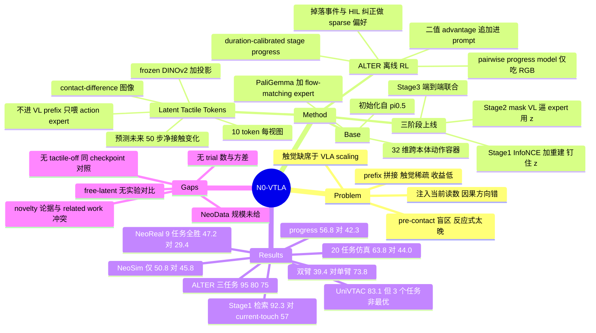

## Summary

N0-VTLA 把触觉从"多一路观测"改成"预测目标"：frozen DINOv2 编码 contact-difference 图像，一个轻量 predictor 把它连同 vision-language 上下文压成 10 个 latent tactile token 去估计未来 H=50 步 action chunk 内的净接触变化，直接条件化 flow-matching action expert，触觉全程不进 VL prefix。配合三阶段上线 recipe 与 ALTER（把 stage-relative progress 与轨迹事件比较转成二值 advantage 标签的离线 RL），它在 9 个 NeoReal 真机任务上成功率全胜（均值 47.2 对 [[2504-Pi05|π0.5]] 的 29.4），20 任务仿真套件上 63.8 对 44.0。但报告没有给出 NeoData 的任何规模数字、没有同 checkpoint 关掉触觉的对照数值、也没有真机 trial 数与方差。

## Problem & Motivation

VLA 已经让操作策略具备指令跟随与跨任务/跨本体迁移能力，但观测空间基本停留在相机、语言与本体状态，接触与滑移只能间接观察。论文认为已有的触觉扩展都停在 task-scale 采集（"at most tens of hours gathered for a handful of skills"），因此缺的是规模化的触觉预训练。

更关键的是**放置位置**的问题。已有系统只有两条路：把 tactile token 拼进 vision-language prefix，当成又一路相机——但触觉信号稀疏、大部分时间近乎空白，塞进为信息密集视图设计的 prefix 收益很小；或者把当前触觉读数注入 action pathway 指导去噪——但一帧触觉记录的是**已经执行的动作**造成的接触，对下一段动作**将要**制造的接触几乎没有信息，策略因此永远落后于自己造成的接触事件。作者要解决的是这个 pre-contact 盲区：grasp 闭合前毫米级的 pre-load、incipient slip 在物体真正移动前的捕捉，都是 anticipatory 行为，纯反应式信号到达时已经太晚。

## Method

**Base 架构**：PaliGemma vision-language backbone + flow-matching action expert，从公开的 π0.5 权重初始化。相机视图、指令与离散化的机器人状态构成 prefix，expert 在 H=50 步、32 维 canonical 容器上去噪出 action chunk。容器前 20 维按每臂 10 维（3 维位置 + 6 维 rot6d + 1 维夹爪）划两个 slot，余下 12 维恒零；单臂 episode 只填第一个 slot，因此单双臂数据在同一固定宽度目标下共存。动作以绝对末端位姿存盘，训练时改写为相对 chunk 首帧。

**Latent tactile pathway**（核心贡献）：

- *编码*：策略从不看原始触觉帧。每个视图减去 episode 起始的零接触 baseline 帧，差值图像过 frozen DINOv2 + 可训练线性投影，每张触觉图得 10 个 token（1 个 class token + 3×3 自适应池化的 9 个空间 token）。差分而非绝对 gel 图像去掉了静态 gel 外观与大部分安装痕迹；冻结编码器则让新传感器只需训练轻量投影即可 onboard。
- *predictor*：读当前触觉 token + contextualized VL prefix，蒸馏成一组 learned latent query，即 latent tactile token z。监督目标是把同一个触觉编码器作用在**未来 50 步的触觉变化**上得到的 z\*，损失为对称 InfoNCE 加一个粗粒度 future-tactile-difference 场的重建项。无触觉的 episode 用 learned null token 兜底，退化为纯 VL 控制而非报错。
- *放置*：z 投影到 action-expert 宽度后前置到 action suffix，形成独立的 conditioning block。当前接触 token **从不**进入 action expert，只能经 predictor 蒸馏后到达；prefix 也不回看 z；z 的位置在输出头前被切掉，不产生动作。

**三阶段上线 recipe**：Stage 1 冻结整个 base policy，只训 predictor / 触觉投影 / 重建头，把 z 钉在触觉上；Stage 2 冻结触觉感知栈，**把 VL prefix 在 action expert 的注意力里 mask 掉**，逼迫 action loss 只能通过 z 下降，从而让 expert 学会这个新接口；Stage 3 解冻除触觉编码器 backbone 外的一切，去掉 mask，只用 action objective 联合训练。作者的说法是这把一个困难的联合优化拆成课程：Stage 1 定义 z 是什么、Stage 2 定义 expert 怎么用 z、Stage 3 才 refine 一条已经工作的通路。另定义了一个 free-latent 简化变体（省掉 Stage 1 监督，只靠 action 梯度塑形 z），但**没有给出它的实验对比**。

**ALTER**（Advantage Labeling from Trajectory Events and Relative Progress）：在固定 deployment corpus 上做 advantage-conditioned 离线 RL，不需要额外环境交互。

- 干净示范提供 dense progress 监督：Gemini-3.5-Flash 从代表性示范生成一份共享 task template（L3 目标 / 有序 L2 stage / L1 step），人工审核一次后固定；触觉接触变化配合末端运动、夹爪状态与视觉 GEBD 线索定位候选切分点，VLM 只负责把**已切好的区间**映射到 template 条目，而不是从整段视频预测时间戳。stage 权重按示范中的平均时长标定，避免让一个短暂过渡与一段长操作占据相同的 progress 份额。
- 不完美轨迹提供 sparse 偏好：触觉检测到的掉落事件（掉落前 > 掉落后）与记录的 HIL 纠正区间（纠正末 > 纠正初）。
- 两类信号联合训练一个 pairwise progress model（回归项 + hinge 平方的 event 项），**输入只有多相机同步 RGB 与 task prompt**——触觉、运动学与事件信号只用来构造离线目标，不作为该模型输入。
- 冻结该模型后，对每条轨迹估计全局 phase 与一个 action-chunk 之后的 local change，在 duration-calibrated stage 内按 local change 排序，取前 ρ 分位标为 `Advantage: positive`，其余 `Advantage: negative`，作为文本追加到 task prompt。训练时以 0.3 概率丢掉该标签，部署时一律用 positive。

## Key Results

**真机 NeoReal（9 个接触密集任务，对比 ACT 与 π0.5，均内部复现于同一评测协议）**：N0-VTLA 在成功率上逐任务胜过最强 baseline，均值 47.2 对 π0.5 的 29.4；100 分制 progress score 在 8/9 任务与均值上领先，56.8 对 42.3；ACT 一个任务都没完成，progress 均值 10.2。最大差距在 Socket Plugging（85 对 60）与 Board Insertion（25，而 ACT 与 π0.5 都是 0）；Bottle Standing 30，两个真机 baseline 都是 0。长时程任务上 progress 比成功率更能区分系统：Cardboard Box Folding 只有 20 的成功率，但拿到 37.2 分 stage credit，π0.5 是 19 分。

**仿真（8 个 UniVTAC + 12 个 NeoSim = 20 任务）**：UniVTAC 上均值 83.1，最强外部 baseline InternVLA-A1 为 67.1，π0.5 为 41.4。但**并非逐任务最优**——Insert HDMI 只有 25 而 Xiaomi-Robotics-0 是 69，Put Bottle 60 而 StarVLA-α 是 88，Lift Bottle 99 而 π0.5 是 100，8 个任务里输掉 3 个。NeoSim 12 个任务对所有方法都更难：专用 baseline 掉到 8.6–23.4，N0-VTLA 50.8，π0.5 45.8，**仅差 5.0 点**。单双臂断层明显：4 个单臂任务均值 73.8，8 个双臂任务腰斩到 39.4，专用 baseline 在双臂上塌到个位数（InternVLA-A1 为 1.0）。20 任务总均值 63.8 对 π0.5 的 44.0。

**表征分析（Stage 1 结束时）**：378 个 held-out query、约 32 候选池内，预测 z 以 92.3 top-1 命中匹配的 future-tactile 目标（chance 3.2）；论文明确标注这是 within-pool 而非全语料检索。关键的是那个 control——只用当前触觉编码排序同一批候选只有 57，128 候选池下 control 掉到 40 而 predictor 保持 81，池子越难差距越大，说明 z 携带了超出其输入的未来接触信息。扰动探针：换掉触觉输入让 z 在 centered-cosine 距离上移动约 0.9，同时换掉 RGB 与 prompt 只移动约 0.2 以内；触觉/视觉-语言敏感度比在 Stage 1 末为 4.3，端到端联合训练后降到约 1.4——仍偏向触觉，但**降了三倍**。

**ALTER（Towel Folding / Bag Packing / Cardboard Box Folding 三个长时程真机任务）**：π0.5-SFT 40/20/5，N0-VTLA-SFT 50/35/20，π0.5+χ0 80/65/55，π0.5+ALTER 90/75/60，N0-VTLA+ALTER 95/80/75。吞吐（次成功/小时）对应 18/4/4、23/7/8、36/12/22、41/14/24、43/15/30。deployment corpus：Towel Folding 351 干净示范 / 286 自主 rollout / 180 HIL；Bag Packing 213/243/238；Cardboard Box Folding 550/587/397，HIL 里分别含 80/72/110 条从选定错误状态起始的 staged-recovery episode。

## Evidence Ledger

| Claim ID | Claim | Type | Source locator | Evidence excerpt | Status |
|:--|:--|:--|:--|:--|:--|
| C1 | 20 任务仿真套件上 63.8 对最强 baseline π0.5 的 44.0 | number/comparison | Abstract; §5.3 | "Averaged over all twenty tasks, N0-VTLA reaches 63.8% against 44.0% for π0.5, its strongest overall baseline." | source-verified |
| C2 | NeoReal 9 任务成功率逐任务胜出，均值 47.2 对 29.4；progress 8/9 领先，56.8 对 42.3；ACT 零成功、10.2 分 | number/comparison | §5.2, Figure 7 | "averaging 47.2% against 29.4% for π0.5 … eight of the nine tasks … 56.8 points against 42.3" | source-verified |
| C3 | Socket Plugging 85 对 60；Board Insertion 25 对 0/0；Bottle Standing 30 对 0/0；Cardboard Box Folding 37.2 分 @ 20 成功率对 19 分 | number | §5.2; §6 | "reaches 85% against 60% for π0.5"; "Board Insertion … reaches 25% … where ACT and π0.5 both fail outright at 0%" | source-verified |
| C4 | UniVTAC 均值 83.1 对 InternVLA-A1 的 67.1，但逐任务并非全胜（Insert HDMI 25 对 69；Put Bottle 60 对 88；Lift Bottle 99 对 100） | number/comparison | Table 1; §5.3 | Table 1 行 "N0-VTLA \| 99 \| 99 \| 88 \| 60 \| 95 \| 25 \| 99 \| 100 \| 83.1" | source-verified |
| C5 | NeoSim 50.8 对 π0.5 的 45.8；单臂 73.8 对双臂 39.4；个别任务 baseline 更优 | number/comparison | Table 2; §5.3 | "holds 50.8% against 45.8% for π0.5 … single-arm … 73.8%, but the eight dual-arm tasks halve it to 39.4%" | source-verified |
| C6 | 378 held-out query、约 32 候选池内 92.3 top-1（chance 3.2）；current-touch control 57；128 池下 81 对 40；明确为 within-pool 率 | number | §5.5; §1 | "Over 378 held-out queries … top-1 in 92.3% … These are within-pool rates, not full-corpus retrieval." | source-verified |
| C7 | 触觉扰动移动 z 约 0.9，RGB+prompt 不超过约 0.2；敏感度比 Stage 1 末 4.3，联合训练后约 1.4 | number | §5.5 | "Swapping the tactile input moves z by roughly 0.9 … ratio settles at 4.3 … measures about 1.4 after end-to-end joint training." | source-verified |
| C8 | ALTER 三任务：N0-VTLA+ALTER 95/80/75，π0.5+ALTER 90/75/60，π0.5+χ0 80/65/55，N0-VTLA-SFT 50/35/20，π0.5-SFT 40/20/5 | number | §5.4, Figure 9 | "with N0-VTLA, it reaches 95%, 80%, and 75%" | source-verified |
| C9 | novelty 断言带 "to our knowledge" 限定，理由是既有触觉扩展只有 task-scale 采集 | sota-novelty | Abstract; §1 | "To our knowledge, N0-VTLA is the first VTLA model pretrained on tactile data at scale" | source-verified |
| C10 | 本报告全文（含附录）未给出 NeoData 的规模数字，data card 的 Scale 字段转指 companion data report | benchmark-setting | Appendix A, Table 3 | Scale 字段全文："Composition and episode accounting in the companion data report [51]." | source-verified |
| C11 | 论文声称触觉贡献"结构上被隔离"，但未报告同 checkpoint 关闭触觉的任何数值，也未说明 π0.5 baseline 是否同样在 NeoData 上预训练 | causal-mechanism | §5.1; §5.2 | "With its tactile flag disabled, the model reduces to the base policy, so any measured difference … is attributable to the tactile pathway alone"; "both reproduced internally under one aligned evaluation protocol" | source-verified |
| C12 | 真机评测未报告 trial 数、seed、重复次数或方差，只说每任务有自己的 trial budget；NeoSim 每策略用 100 条示范训练 | benchmark-setting | §5.1; Appendix D/E | "On NeoReal, each task carries its own trial budget"; "each policy is trained on 100 demonstrations" | source-verified |
| C13 | free-latent 变体只在方法与 future work 中定义，全文无与三阶段监督版的实验对比 | benchmark-setting | §2.2, §4.2, §8 | Future work: "the free-latent and supervised variants defined here are two points in a broader design space" | source-verified |
| C14 | code 为 github.com/neoteai/N0-VTLA，站点 research.neoteai.com/n0-vtla/，HTML 版 license 为 CC BY-NC-SA 4.0 | license-code | title block / HTML header | "[Code] https://github.com/neoteai/N0-VTLA … [Website] https://research.neoteai.com/n0-vtla/" | source-verified |
| C15 | PaliGemma + flow-matching expert，初始化自公开 π0.5 权重；frozen encoder 为 DINOv2；H=50；32 维容器（前 20 = 每臂 10 维，余 12 恒零）；每张触觉图 10 token | number | §2.1, §2.2, §5, Table 3 | "H=50"; "the first 20 dimensions … remaining 12 are always zero"; "10 tokens, one class token and nine spatial tokens" | source-verified |
| C16 | deployment corpus：351/286/180、213/243/238、550/587/397，staged-recovery 子集 80/72/110 | number | Appendix F | "Towel Folding uses 351 clean demonstrations, 286 autonomous rollouts, and 180 HIL rollouts … 80, 72, and 110" | source-verified |
| C17 | N0-VTLA+ALTER 三任务吞吐 43/15/30 次成功执行每小时 | number | §5.4; Figure 12 | "at throughputs of 43, 15, and 30 successful executions per hour" | source-verified |
| C18 | Appendix B 明确省略硬件型号、设备数、显存占用与吞吐数字 | benchmark-setting | Appendix B | "omit hardware models, device counts, memory footprints, and throughput figures." | source-verified |
| C19 | ALTER 的 progress model 输入只有多相机同步 RGB 与 prompt；触觉/运动学/事件信号只构造离线目标 | causal-mechanism | §4.4 | "Tactile, kinematic, and event signals construct the offline targets but are not inputs to the progress model." | source-verified |
| C20 | stage 标注由 Gemini-3.5-Flash 生成 task template + 人工一次审核，VLM 只把预切分区间映射到 template 条目 | causal-mechanism | §4.4 | "Gemini-3.5-Flash generates a shared task template … the VLM maps each resulting interval to an entry in the task template" | source-verified |
| C21 | NeoReal 用 100 分 stage rubric，但每 checkpoint 的分值权重不在本文，转指 companion data report | benchmark-setting | §5.1, Appendix E | "The per-checkpoint point weights … are documented in the companion data report [51]." | source-verified |
| C22 | arXiv 作者栏仅两条团队署名，2026-07-26 提交，主分类 cs.RO；正文无逐作者机构行，只有团队名与按角色排列的 Contributors | benchmark-setting | abs page; title block; Contributors | abs: "Authors: NeoteAI Team, Fudan TEAI Team"; "[Submitted on 26 Jul 2026]"; "Robotics (cs.RO)" | source-verified |
| C23 | §3 说明 UniVTAC 仿真器（即供给 NeoSim 套件者）的 episode 经同一 pipeline 转换验证进入训练；全文未说明这些仿真训练 episode 是否与所评测的 UniVTAC/NeoSim 任务配置重叠，也未说明外部 baseline 是否有可比的仿真预训练 | benchmark-setting | §3 "Simulated data"; §5.3 | "Episodes from the UniVTAC visuo-tactile simulator [18], which supplies the NeoSim suite evaluated in Section 5.3, are converted into the canonical schema" | source-verified |
| C24 | 全文存在关于既有触觉预训练规模的内部张力：§1 称至多 tens of hours，§7 却称 FTP-1 已在 thousands of hours 触觉数据上预训练 | sota-novelty | §1; §7 | §1: "at most tens of hours gathered for a handful of skills"; §7: "a generalist tactile policy pretrained on thousands of hours of tactile data" | source-verified |

> Evidence boundary：NeoReal 的逐任务柱状图（Figure 7）在 arXiv HTML 中是位图，alt text 仅为 "Refer to caption"。上表 C2/C3 的数字全部来自 §5.2 与 §6 的正文陈述；**正文未点名的 NeoReal 逐任务数值无法从本 source 独立读出**。Figure 9/12 的柱值可从 HTML 内嵌图表标注读出，但其与图例的对应关系依赖 legend 顺序。
>
> C23 的额外边界：§3 的"经同一 pipeline 转换并验证"只支撑到数据转换层面；**这些转换后的仿真 episode 究竟进入 base pretraining 还是仅进入 §4.3/§5.1 的每任务 100-demo 适配，原文同样没说**。全文（含附录 A–F）检索 overlap / held-out / disjoint / unseen / split / contaminat* 与全部 pretrain* 出现位置后确认：训练-评测重叠与外部 baseline 预训练规程两处均为原文缺失，而非笔记推断。
>
> `source-verified` 仅表示原文确实包含该 claim，不代表结果已被独立复现。

## Strengths & Weaknesses

**设计判断值得记住**。"触觉该放在哪"这个问题被重述得很干净：既有工作要么把触觉当第 N 路相机塞进 prefix，要么把当前读数注入去噪路径；作者指出后者的根本问题是**因果方向错了**——一帧触觉记录的是已发生动作造成的接触，而决定下一个 chunk 的是这个 chunk 自己**即将**制造的接触，"no encoding of the present frame contains it"。把触觉改成 chunk horizon 上净接触变化的预测目标，是从 problem formulation 层面而非架构层面下的判断，这是 JEPA 式思路在 VLA 上一个位置很准的落点。§5.5 的 control 实验（用当前触觉编码排同一批候选只有 57，predictor 92.3；池子扩到 128 时 40 对 81）正面回答了"这只是自相关吗"的质疑，是全文最扎实的一段证据。

**Stage 2 的 mask 是好设计**。把 VL prefix 从 action expert 的注意力里屏蔽掉，让 action loss 只能经 z 下降，物理上堵死了"从场景和指令直接猜动作"的捷径。这比"加个 loss 权重希望模型用上新模态"要硬得多，值得迁移到别的新模态接入场景。

**"at scale" 这个词在本报告里没有落地**。全文（含附录 data card）没有 NeoData 的任何规模数字——小时数、episode 数、轨迹数一概转指 companion data report（C10）；Appendix B 又明确不给设备数与吞吐（C18）。于是标题里的 Scaling 与摘要里的 "first VTLA model pretrained on tactile data at scale" 在这份文档内部**不可证伪**。更麻烦的是 C24 揭示的内部张力：§1 用"既有工作至多 tens of hours"论证 novelty，§7 却写 FTP-1 是"pretrained on thousands of hours of tactile data"。两句话都在原文里，但 novelty 的论据与自己的 related work 描述对不上。这个 first 断言应当读作"在 language-conditioned VLA + 多平台真机语料这个特定组合下的 first"，而不是触觉预训练规模上的 first。

**触觉贡献没有被单独消融**。这是我认为最实质的方法学缺口。§5.1 写"关掉 tactile flag 模型就退化成 base policy，所以任何成功率差异都可归因于 tactile pathway"——但这是一句**架构论证**，不是实验：全文没有任何一行报告同一 N0-VTLA checkpoint 在关掉触觉时的成功率（C11）。表中的 π0.5 只说"内部复现"，从未说明它是否也吃了 NeoData 的多平台预训练。因此 47.2 对 29.4 这个 gap 里，触觉通路、NeoData 预训练、以及内部复现质量三者混在一起，无法拆开。同样地，C23 显示 UniVTAC 仿真器的 episode 经同一 pipeline 进入训练流程，而评测的 8 个 UniVTAC 任务正来自这个仿真器——论文既未说明训练用仿真 episode 与评测任务配置是否重叠，也未说明外部 baseline 是否有可比的仿真预训练。UniVTAC 上 83.1 对 41.4 这种量级的领先，在这个信息缺口下不能直接读成方法优势。

**真机数字缺少不确定性**。"each task carries its own trial budget"是全文关于 trial 数的唯一说法（C12），没有 seed、没有重复、没有误差棒。Board Insertion 的 25、Cardboard Box Folding 的 20、Bottle Standing 的 30 这些低成功率数字，在未知 trial 数下的置信区间宽得足以吞掉不少结论。作者显然意识到低成功率区分度不足，才引入 100 分 progress rubric——这个补充是对的，但 rubric 的逐 checkpoint 权重同样转指 companion report（C21），别人无法复算。

**ALTER 的结果指向一个论文没说的结论**。把 Figure 9 横着读：π0.5-SFT 40/20/5，加 ALTER 变成 90/75/60（+50/+55/+55 点）；而换成触觉 backbone 只从 40/20/5 到 50/35/20（+10/+15/+15 点）。也就是说在这三个长时程任务上，**离线 RL 是主导项，触觉预训练是二阶项**，而且 π0.5+ALTER（90/75/60）远超 N0-VTLA-SFT（50/35/20）。论文的第四条 finding 标题是"Stronger tactile pretraining remains advantageous under ALTER"，这个论断本身成立，但幅度在两个任务上被 ALTER 压掉了一半：SFT 阶段的 gap 是 10/15/15，ALTER 之后收窄到 5/5/15。一个诚实的表述应该是"触觉优势在离线 RL 后仍在，但显著变小"。顺带一提，Towel Folding / Bag Packing / Cardboard Box Folding 都是可形变物体任务——恰恰是触觉最该发挥作用的一类，gap 反而收窄，这个现象论文没有解释。

**双臂是真正的短板，也是最诚实的数据点**。NeoSim 单臂 73.8、双臂 39.4，几乎腰斩；而 NeoSim 整体只比 π0.5 高 5.0 点。20 任务 63.8 对 44.0 这个 headline 主要由 UniVTAC 那 8 个任务（83.1 对 41.4）撑起来，作者自己新出的 12 个 NeoSim 任务上优势要小一个量级。这不是坏事——它说明 NeoSim 是个更难、区分度更强的套件——但读者容易被 headline 数字带走。同样值得记的是逐任务不全胜：UniVTAC 8 个里输掉 3 个，Insert HDMI 上 25 对 Xiaomi-Robotics-0 的 69 差得很远，说明 latent tactile 并非对所有接触密集任务都有效。

**一个被低估的工程发现**。Appendix D 记录了一个只有真正部署过才知道的坑：必须执行完整的 50 步 chunk 再请求下一个，因为闭合夹爪的指令集中在 chunk 尾部，提前重规划会让机械臂停在目标位置却从未合爪。这类"执行调度而非模型"的失败模式在 action chunking 类工作里几乎从不被写出来。Appendix C 的 9 条数据工程红线（每条配"违反后的症状"）同样是这份报告里最容易被别人直接复用的部分。

**对领域的意义**。如果这条路线站得住，触觉接入 VLA 的默认做法可能从"加一路 token"迁移到"加一个预测头"——这个改动很轻（frozen DINOv2 + 一个 projection + 一个小 predictor），不需要专门的触觉编码器，也不需要解码完整的感知轨迹，迁移成本低。但要真正验证这一点，需要的恰恰是这份报告没给的东西：matched-pretraining 的 tactile-off 对照、free-latent 与三阶段监督的正面对比、以及 NeoData 的实际规模。在那之前，我会把 latent-tactile-as-prediction-target 当成一个**有说服力的假设加一段像样的表征证据**，而不是一个已经被闭环结果证成的结论。

## Mind Map

## Notes

- **与 [[2504-Pi05|π0.5]] 的关系**：N0-VTLA 的 base policy 直接从公开 π0.5 权重初始化，架构、tokenization、训练流程"inherited unchanged"，唯一新增的是 latent tactile pathway。所以这篇最干净的读法是"π0.5 + 一个预测式触觉旁路 + 一套离线 RL 后训练"。反过来说，它的所有增益也应当在这个前提下解读——π0.5 baseline 是否吃了同样的 NeoData 预训练，是决定这些数字含义的关键未知量。
- **值得追的对照工作**：related work 里点名的 HapticVLA 与本文构成最直接的对照——两者都"估计而非测量"触觉，但 HapticVLA 的目标是**当前**信号（部署时用推断的 tactile token 替代传感器），本文的目标是 chunk horizon 上的**未来净变化**。"预测当前"与"预测未来"哪个才是有效成分，是个可以独立设计实验回答的问题，而且比本文的主表更有信息量。另外 TTP（transfers a future-tactile expert to robot policies）与本文目标高度重合，值得单独 digest 做正面比较。
- **同批姊妹工作 [[2607-N0TWAM|N0-TWAM]]**（arXiv:2607.23783，同一 NeoteAI / Fudan TEAI 团队、同一批 NeoData/NeoSim/NeoReal 基础设施）走的是 world-action model 路线：vision 与 tactile 一起作为生成目标，动作从被预测的未来读出。两篇合起来读最有价值的一点是——TWAM 做了 VTLA 没做的 tactile-off 方向消融，而结果显示**反应式的 observed 通路比前瞻式 predicted 通路贡献更大**（UniVTAC 70.5 vs 71.8，NeoSim 29.6 vs 41.1）。这直接对 VTLA "latent tactile as prediction target" 的核心主张构成外部压力：同团队同数据下，"预测未来接触"的边际贡献排在"把当前力信号接进动作头"之后。
- **可迁移的方法元件**：Stage 2 的 prefix-mask 是一个通用的"新模态接入"技巧，不限于触觉——任何要把新初始化的旁路接进预训练策略、又担心被主通路旁路掉的场景都适用。ALTER 里"VLM 只做区间到 template 的映射、不做时间戳预测"这个分工也值得复用：把定位交给信号（触觉/运动学/GEBD），把语义交给 VLM，避开了 VLM 长视频时序定位不可靠的已知弱点。
- **待查**：companion data report（N0-Foundation，research.neoteai.com/n0-foundation/）里应当有 NeoData 的规模、传感器规格与 rubric 权重。本笔记中所有"未给出"的判断都限定在本篇 arXiv 报告范围内。若要在 survey 中引用"大规模触觉预训练"这类表述，必须先从 data report 取到实际数字，否则只能写"规模未在主报告中披露"。
- **repo_candidate**: https://github.com/neoteai/N0-VTLA —— 属于系统/基建类工作（多平台数据 pipeline、三阶段训练 recipe、serving 接口、9 条数据工程红线），贡献有相当部分在实现里，值得另起一轮 repo-digest 核实 tactile pathway 的实际实现与是否包含 tactile-off 开关。

## Implementation Analysis

> repo: https://github.com/neoteai/N0-VTLA @ `08c1f4a`，分析日期 2026-08-06，静态分析未执行代码

**架构**：仓库是 OpenPI（Apache-2.0）的 fork，触觉能力以子类方式旁挂在干净的 base 上——`scripts/train_n0vtla.py:21` 在导入训练入口前把 `PI0Pytorch` monkey-patch 成 `N0VTLAPolicy`，所以 base 训练脚本一行不改。触觉通路由三段串成：`tactile_encoder.py` 的 frozen DINOv2 差分编码器（每视图 10 token）→ `tactile_predictor.py` 的 cross-attention predictor（learned query 蒸馏出 z）→ `n0vtla_policy.py:470-492` 的 `_embed_suffix_with_z` 把 z 前置成 action suffix 的独立 conditioning block，输出时按 `suffix_out[:, -H:]` 切掉，z 不产生动作。整条路径由单一开关 `tactile_predictor_enabled` 门控且默认 `False`（`n0vtla_policy.py:63`），关闭时不构造任何额外子模块。**重要范围限定**：本仓库只发布 post-training 与 serving，不含预训练 pipeline，也不含论文的三阶段监督 recipe 与 ALTER。

**论文 ↔ 代码对照**：

| 论文 claim | 代码位置 | 一致性 |
|:--|:--|:--|
| 触觉编码 = frozen DINOv2 作用于 contact-difference 图像，每视图 10 token（1 CLS + 3×3 池化）（C15） | `n0vtla/models_pytorch/tactile_encoder.py:65-69`；`n0vtla/models_pytorch/n0vtla_policy.py:392` | 一致 |
| z 只前置进 action suffix、不进 VL prefix、输出头前被切掉 | `n0vtla/models_pytorch/n0vtla_policy.py:470-476` | 一致 |
| "关掉 tactile flag 模型即退化为 base policy"（C11 引用的架构论证） | `n0vtla/models_pytorch/n0vtla_policy.py:63`；`scripts/gate_c_check.py:2-10` | 一致，但仅是 **byte 等价的 CI 断言**（state_dict / strict load / `torch.equal` 的 loss 与采样动作），不是论文缺失的那个 tactile-off 性能消融 |
| 三阶段 recipe：Stage 1 InfoNCE + 重建把 z 钉在触觉上 | `n0vtla/models_pytorch/n0vtla_policy.py:2-4, 19-31`；`docs/POST_TRAINING.md:126-128`；`README.md:162-164` | 不一致：本仓库只实现无监督 v0（`loss = action_mse ONLY`），无 z\* 目标、无 predictor loss；已发布 config 一律 `predictor_loss_weight=0.0`（`n0vtla/training/config.py:840, 914, 965`）。README 明确把三阶段 recipe 留给论文 |
| Stage 2 把 VL prefix 在 action expert 注意力里 mask 掉 | `n0vtla/training/config.py:839, 913, 964`；`scripts/train_pytorch.py:584, 720-726` | 不一致：对应机制存在（`vl_dropout` + phase-A curriculum 强制置 1.0）但**在全部已发布 config 里关闭**（`vl_dropout_prob=0.0`），curriculum 靠环境变量 `VTLA_PHASE_A_STEPS` opt-in、默认 0 |
| ALTER（advantage-conditioned 离线 RL，C8/C19/C20） | 全仓库 grep 无 advantage / progress-model / GEBD 相关实现；`README.md:162-164` | 不一致：**完全未开源**，README 明说 RL pipeline 与实验结果只在论文里 |
| H=50 的 action chunk（C15） | `n0vtla/training/config.py:789, 832, 902`（=50） vs `n0vtla/training/config.py:956`（=16） | 不一致：released 的 `sim_dual_arm_tactile` 用 `action_horizon=16`，与论文统一的 H=50 不同 |
| 32 维 canonical 容器，每臂 10 维 slot，余 12 维恒零（C15） | `n0vtla/policies/canonical_schema.py:43-57` | 一致；但两个 released sim checkpoint 实际预测 **joint action**（每臂 7 关节 + 夹爪）而非该容器（`n0vtla/training/config.py:886-889`） |
| latent tactile token 数（本笔记 Summary 写 10） | `n0vtla/models_pytorch/n0vtla_policy.py:73`、`n0vtla/training/config.py:792, 836, 906, 960` 全为 `n_latent=5`；`README.md:53` 亦写 5 | 待核：论文原文可直接支撑的只有 encoder 每视图 10 token（C15 的 excerpt 指的是 encoder token），z 的数量缺论文侧原文证据，故不判定为不一致——但笔记 Summary 把两者混为一谈，应修正 |
| 触觉/VL 敏感度比 Stage 1 末 4.3（C7） | `docs/TACTILE_CAUSAL_PROBE.md:191-198` 报 joint-KV 探针 R≈3.9、tactile-KV "高数个量级" | 待核：数值同量级但 checkpoint 与口径是否对应无法从静态代码判定 |

**论文没写的实现细节**：

- **predictor 输入端 detach**：`_forward_predictor` 传的是 `vl_ctx.detach()`（`n0vtla/models_pytorch/n0vtla_policy.py:642`）。`docs/GOTCHAS.md:60-89` 给出理由——不 detach 时 action 梯度会经 predictor 回灌 PaliGemma backbone，导致 grad_norm 几何增长；配套还有 `VTLA_PREDICTOR_LR_SCALE=0.1`（`train.sh:57`）。论文只描述 z 的前向通路，这条反向约束是纯工程发现。
- **DINOv2 看到的是未归一化的原始差值图**：`_build_g` 送入 float 的 `tac_t - tac_0`（`n0vtla/models_pytorch/n0vtla_policy.py:392`），而 `_dinov2_preprocess` 的 ImageNet 归一化只对 uint8 分支生效、float 直通（`n0vtla/models_pytorch/tactile_encoder.py:114-130`，注释自陈 "intentional for v0"）。即 frozen backbone 工作在一个它没被训练过的输入分布上。
- **baseline 帧就是 episode 第 0 帧**：用 −100,000 帧的 delta_timestamps 偏移让 LeRobot 自行 clamp 到首帧（`n0vtla/training/config.py:39-42, 443`）。代码里没有任何"首帧确实无接触"的校验，论文"zero-contact baseline"的前提在实现中是假设而非检查。
- **predictor 的类默认架构会让 VL 直接参与 z**：`joint_kv` 下 `kv = cat([vl_ctx, g])`（`n0vtla/models_pytorch/tactile_predictor.py:106`），VL 是 z 的 value 源之一；已发布 config 一律改用 `tactile_kv`（`n0vtla/training/config.py:837, 907, 961`），把 VL 降级成 query 侧 conditioner。论文的"触觉隔离"叙事只在后者成立。
- **z_gate 在 released sim checkpoint 里不存在**：只有 `vtla_tactile_posttrain` 开 `z_gate_zero_init=True`（`n0vtla/training/config.py:838`）；sim 配置的注释警告若误开会创建一个 checkpoint 填不满的零初始化 gate，把整条触觉通路静默乘 0（`n0vtla/training/config.py:908-912`）。
- **`ema_decay=0.999` 是死字段**：5 个 config 都写了（`n0vtla/training/config.py:768, 818, 865, 943, 996`），但 PyTorch trainer 直接打印 "EMA is not supported for PyTorch training"（`scripts/train_pytorch.py:672`）。
- **仓库内部关于 prefix cache 的自相矛盾**：`train.sh:56` 默认 `VTLA_PREFIX_CACHE=1` 却从不导出 `VTLA_NO_CKPT`，而 `scripts/train_pytorch.py:471-476` 的注释称 `VTLA_NO_CKPT=1` 对 prefix cache 是 "REQUIRED"；另一侧 `gemma_pytorch.py:262-265` 的 cache 路径又自己包了 checkpoint。静态无法判定实际后果，但默认值与文档确实对不上。
- **stage-1 残留死代码**：`_last_tac_f`（future 触觉帧）在 `n0vtla/models_pytorch/n0vtla_policy.py:354` 被写入，全仓库无读取点；`forward()` 的 docstring（`n0vtla/models_pytorch/n0vtla_policy.py:596-598`）仍描述 `predictor_pretrain` 模式，实际只有 gate on/off 两条分支（L599-601）。这是"三阶段版本曾经存在但被剥离"的痕迹。
- **`docs/GOTCHAS.md` 的 7 条工程失败模式**（DDP 新模块跨 rank 初始化不同步、梯度回灌 backbone、零初始化 gate、非有限梯度污染 optimizer state、`LD_LIBRARY_PATH` 被覆盖导致静默 CPU 训练、多时间戳视频解码致 ~24× 变慢、等价性测试必须覆盖生产配置），比论文 Appendix C 的红线更具体，是这个仓库最可复用的部分。

**复现路径**：Python 3.11 + `requirements.txt` + `pip install -e . --no-deps`，然后必须把 `transformers_replace/` 覆盖进 site-packages 的 `transformers==4.53.2`（4 个改过的 HF 文件，加 adaRMS conditioning 等），并预缓存 `facebook/dinov2-base`——`train.sh:100` 在离线模式下硬校验该缓存。入口是 `bash train.sh` → `torchrun --nproc_per_node=8 scripts/train_n0vtla.py`（`train.sh:116-124`），默认 8 卡；`CHECK_ONLY=1` 可先跑 GPU 数 / checkpoint / dataset / norm-stats / DINOv2 预检（`train.sh:87-107`）。权重在 HuggingFace（`README.md:100-102`：`n0-vtla-base` 加两个 sim 任务 checkpoint），但 base 明说是 post-training 起点而非可部署策略（`README.md:112`）。**真正缺的是数据与预训练**：NeoData、大规模预训练 pipeline、三阶段 recipe、ALTER 全部未发布（`README.md:162-164`），因此该仓库可复现的是"在自有 visuo-tactile 数据上做任务级 post-training"，无法复现论文主表。仓库原创部分 CC BY-SA 4.0（`LICENSE`，与论文 HTML 页的 CC BY-NC-SA 4.0 是两个不同 artifact），权重另受 Gemma Terms 约束（`README.md:193-196`）。未发现明文凭证等卫生问题。
