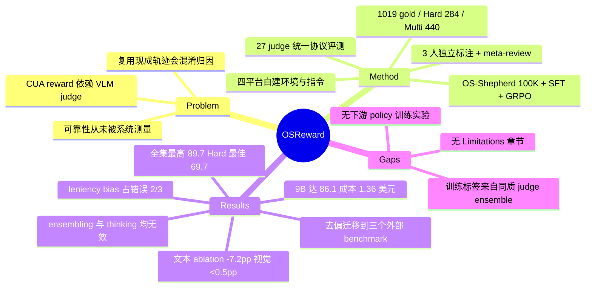

## Summary

用 1019 条自建、三人独立标注的跨平台 CUA trajectory 建成 OSReward，系统测量「VLM-as-judge 到底可不可靠」这个此前没人量化过的问题：27 个 judge 在全集最高只有 89.7%，在困难子集 OSReward-Hard 上最佳 69.7%、均值掉到 52%，且几乎所有 judge 共享同一个错误方向——把 agent 自称完成实则失败的 run 判成 success。作者进一步用 ablation 把这个 leniency bias 归因到「judge 读 agent 的文字自述多于读截图」，并据此训练开源 reward model OS-Shepherd（9B/35B），在同一协议下达到中档商用 judge 的精度而成本低 30–60×。

## Problem & Motivation

CUA 的 evaluation、数据筛选和 RL 训练都需要判定「这条 trajectory 是否完成了指令」。人手写的 per-task verifier 只覆盖少数被精心构造的任务，且对已收集完、环境已不存在的静态语料完全失效；人工标注跟不上规模。于是整个领域默认转向 VLM-as-judge，把它当 reward model 或 autorater 用——但这个默认从未被系统检验过。

判 CUA trajectory 与判文本或一般多模态回答不同：judge 要读一条长达上百步、状态/动作/推理交错的记录，并判断**环境是否真的到达了目标状态**，而不是 agent 是否声称到达。作者的 pilot 观察是：最好的 VLM judge 在 desktop 上与现有 benchmark 自带 verifier 的判定有约四分之一不一致。

已有工作（CUARewardBench、AgentRewardBench）也已注意到 model-based reward 的可靠性问题，但都局限在单一平台，且复用现成 benchmark 的指令与 trajectory——这会把 judge 的错误和 rollout 本身的质量缺陷、以及原 verifier 的噪声混在一起，导致失败不可归因。OSReward 的立论就建在这一点上：要测 judge，数据必须自己从环境层重建。

## Method

**数据基建（自建，不复用）。** 四个平台端到端自建：Web 用 Chromium worker pool 跑真实线上站点（外加若干自托管镜像站以支持需登录的任务）；Windows 装约 20 个日常应用（IDE、媒体编辑、3D、数据库工具），部分已登录账号，2K/4K 分辨率轮换；Ubuntu 装约 30 个应用 + 分类型的真实文件池，rollout 分 pure-GUI 与 GUI+CLI 两种 action space；Mobile 用 Android emulator，预置文件、使用记录、数据库，并注入 distractor content（噪声事件、诱饵消息、相似文件）。核心设计意图是「让 success 必须改变环境状态，而不是叙述完成」。

**指令与 rollout。** 标注者先亲手操作环境再写指令，草稿由**非作者的其他标注者**交叉筛查，剔除歧义/无法落地/无确定答案的条目；约 1500 条候选留下约 800 条。每条指令由 Claude / Gemini / Kimi / Qwen 四个 backbone 家族驱动的 agent 执行 1–3 次，能力差异自然产出真 success 与真 fail。自动 pre-filter 先剔除持续 anti-bot 拦截、网络故障、执行冻结等采集事故，保证 fail 反映 agent 失败而非环境失败。

**Gold 标注。** 每条过滤后的 trajectory 由 3 名标注者（CS 研究生）**独立**标注，标注平台强制逐步回放全轨迹并要求写下判定理由。一条硬性标准：agent 没有通过环境交互获得或验证的答案，即便碰巧正确也判 fail（judging prompt 里带同一条规则）。三人一致则定案；分歧升级 meta-review，由 2 名 senior reviewer 共同**审议**裁定（明确不是多数投票）。判 success 的再打 alignment / efficiency 两个细粒度分；判 fail 的按 reasoning-and-planning / action / perception / memory 四类失败打多标签。

**三个视图。** 全集 OSReward（1019 条，43% success / 57% fail）；OSReward-Hard（284 条，30/70 success/fail，主要取自标注者本身产生分歧的样本，且每条再经一轮 meta-review 复核）；OSReward-Multi（440 条 success 上的 alignment/efficiency 标签）。

**Judge 协议。** 27 个 reference judge 与作者自己的 2 个模型跑同一套：固定 prompt、最后 N=5 张截图 + 每步 thought/action 文本、greedy decoding、无 task-specific harness、无工具、无 step-level 监督。指标为 binary accuracy 拆成 success recall（sRec，低=过严）与 fail recall（fRec，低=过宽），BalAcc 取二者均值。

**OS-Shepherd。** 训练语料 OS-Shepherd-100K 不引入新的人工标注：321,631 条 judge instance（多个强 judge × 多种截图设置）经**高一致性筛选**——只保留强 judge 近乎无异议的 trajectory，丢掉中间模糊带——得到 96,621 条 SFT 样本；关键是每条样本保留 judge 的**推理过程**而非只有二元判定。第二阶段用 GRPO 在约 3.1K 条挖掘出的样本（以 false success 为主，通过「greedy 判错但重复采样能判对」筛出）上做一轮短 RL，直接针对 leniency。从 Qwen3.5-9B / 35B-A3B 起训，32×H200。

## Key Results

**1. 天花板比想象的低。** 全集上只有 frontier 接近可用线：Claude-Opus-4-8 89.7%、GPT-5.5 89.5%、Claude-Opus-4-6 89.5%，最弱的 Qwen3-VL-30B 只有 69.4%，全场跨度 20 个点。作者以「约 90% binary accuracy」为 reward 可支撑训练的经验门槛，即只有极少数模型勉强达标。

**2. OSReward-Hard 上集体坍塌。** 每个 judge 掉 20–43pp。最佳 judge 落到 69.7%——**恰好等于「恒判 fail」的常数判别器在 30/70 分布上的得分**；均值 judge 52%。作者自己点明此处 raw accuracy 是陷阱，须看 BalAcc/recall。坍塌是**结构化**的：Windows 最难判（42.4%）、mobile 最易（58.3%）；依赖读屏的 perception（41.6%）与 action（43.5%）失败远比 planning 失败（49.0%）难抓——而 planning 恰是数据里最多的失败类型（占 fail 轨迹 86%）。

**3. leniency bias 有硬数据。** 把每个错判分成 over-accept / over-reject 各三类（由强 VLM labeler 打标 + 人工复核）：「over-accept: task incomplete」占全部错误约三分之二，且是**每一个** judge 的首要错误模式，在其错误中占比不低于 48%；池化后 over-accept : over-reject ≈ 3:1，最强 judge 收窄到约 2:1。

**4. 机制归因由 ablation 支撑，不是猜测。** 去掉每步 thought+action 文本：平均掉 7.2pp，翻转 22.7% 的判定；只去 CoT 保留 action：掉 1.8pp、翻转 11.6%；而视觉侧的改动（last-3 帧、first+last-2、去掉红色点击 marker）accuracy 变化都在半点以内。即 judge 主要在读 agent 的自述，这正好解释了为什么「以成功宣言收尾的失败 run」是它的系统性盲区。

**5. 模型侧的旋钮救不了。** 加 thinking 的收益随 base 变强而单调缩小（最弱 judge +2.8pp → 最强 +0.4pp）；同一 judge 同一输入在 T=0.7 重采样已翻转 6–9% 判定（这是判决噪声的地板，视觉 ablation 的抖动落在这个地板之内或之下，文本 ablation 远在其外）；top-3 majority vote 只比最佳单 judge 高约 1pp 而成本数倍——因为 judge 彼此高度同质（top judge 间 pairwise Cohen's κ ≈ 0.71，同家族 0.731 vs 跨家族 0.709，家族先验几乎不起作用），在同一批难样本上集体犯错。但 oracle（任取池中一个正确判定）能到 99.2%，说明池子里几乎总有正确答案，缺的是「知道该信谁」。

**6. 细粒度打分更差。** OSReward-Multi 上最佳 judge 从二元的约 90% 掉到 60 分档（GPT-5.5 Multi macro-recall 63.5 / AUC 66.7）。AUC 一致高于 macro-recall，说明区分能力存在但阈值校准失败；alignment 轴最差，judge 倾向不管 run 如何都给最高分。

**7. 成本与可靠性正面冲突。** 判完整个 1019 条全集一次：Claude-Opus-4-8 \$86.04、GPT-5.5 \$45.44、Gemini-3-Flash \$2.02、OS-Shepherd-9B \$1.36。全集上「3pp 换 42× 降价」尚属划算，但在 Hard 上这个 trade-off 消失：最好的 sub-\$3 judge 只有 57.0%。

**8. OS-Shepherd。** 9B：全集 86.1%、Hard 60.2%（Hard fRec 57.6%），其未调 base Qwen3.5-9B 只有 76.7% / 39.4%（base 的 Hard fRec 仅 14.1%，即几乎全判 success）；35B-A3B：85.6% / 62.7%。四倍参数只买到 2.4pp 的 Hard BalAcc，全集无提升——迁移的是配方不是规模。SFT 完成主要的精度提升，RL 阶段几乎不改变总体判别力，只是把工作点从 lenient 角落搬到平衡对角线上（validation accuracy 约 70%→77%）。

**9. 去偏可迁移。** 在 AndroidWorld / WebArena / OSWorld 上以各 benchmark 自带 human-written verifier 为参照（作者明确说明这是「与该 verifier 的一致率」而非与真值的一致率，verifier 本身也有假阳假阴），OS-Shepherd 是 OSWorld 与 AndroidWorld 上最好的开源 judge，超过体量约 44× 的 Qwen3.5-397B-A17B。fail recall 上，OS-Shepherd-9B vs Qwen judges 中位数：OSWorld 0.46 vs 0.24、WebArena 0.85 vs 0.66、AndroidWorld 0.63 vs 0.25。另外，judge 与人写 verifier 的一致率是**平台驱动而非模型驱动**：mobile 上接近 90% 的替代门槛，web 差约 6pp，desktop 差得远。OSWorld 上 88% 的 judge 错误是假阳性，且超过 16 步后 accuracy 从 0.76 掉到 0.57、假阳率从 0.20 升到 0.37——最后五张截图确认不了长任务是否完成。

## Evidence Ledger

| Claim ID | Claim | Type | Source locator | Evidence excerpt | Status |
|:--|:--|:--|:--|:--|:--|
| C1 | 全集 1019 条 human-gold trajectory，43% success / 57% fail（440/579），覆盖 web/mobile/Ubuntu/Windows | number | §3.4 p.8; Fig.5; §B.2 p.34 | "The full OSReward set holds 1019 trajectories spanning all four platforms, roughly balanced between successes (43%) and failures (57%)" | source-verified |
| C2 | OSReward-Hard 284 条，success/fail = 30/70 | number | §3.4 p.8 | "A challenge subset of 284 trajectories concentrating genuinely hard cases … a 30/70 success/fail split" | source-verified |
| C3 | OSReward-Multi 在 440 条 success 上加 alignment（2 级）/ efficiency（3 级）标签 | benchmark-setting | §3.4 p.8; §B.4 p.36 | "Alignment enters the benchmark with two levels (0.5 and 1.0); efficiency has three (0, 0.5, and 1.0)" | source-verified |
| C4 | 每条过滤后 trajectory 由 3 人独立标注，分歧升级 2 名 senior reviewer 共同审议（非多数投票） | benchmark-setting | §3.3 p.7 | "two senior reviewers examine the trajectory together and issue the final judgment (deliberation, not a majority vote)" | source-verified |
| C5 | 1128 条进入标注；三人一致 75%；pairwise agreement 83.3%；calibrated Krippendorff α = 0.797；282 条升级 meta-review；109 条被丢弃 | number | §B.2 p.34 | "leaving 1128 trajectories for annotation … agree unanimously on 75% … pairwise agreement 83.3%; calibrated Krippendorff's α = 0.797" | source-verified |
| C6 | 27 个 reference judge + 2 个自研模型跑同一协议（last-5 帧 + 全文本历史、greedy、无 harness/工具/step 监督） | benchmark-setting | §4.1 p.9; §C.1 p.36 | "All 27 reference judges and our OS-Shepherd models run under the identical main setting … last five screenshots, full text history, greedy decoding" | source-verified |
| C7 | 全集最高 Claude-Opus-4-8 89.7%，GPT-5.5 89.5%，最低 Qwen3-VL-30B 69.4% | number | Table 1 p.10 | "Claude-Opus-4-8 closed 89.7 … GPT-5.5 closed 89.5 … Qwen3-VL-30B open weights 69.4" | source-verified |
| C8 | Hard 上每个 judge 掉 20–43pp；最佳 69.7%，与该 30/70 分布上「恒判 fail」同分；均值 judge 52% | number | §4.4 p.11 | "drops every judge by 20–43pp … lands at 69.7%, level with what a constant always-fail judge scores on this 30/70 split; the mean judge falls to 52%" | source-verified |
| C9 | over-accept incomplete 占全部错误约 2/3，是每个 judge 的首要错误模式（≥48% 其错误）；池化 over-accept:over-reject ≈ 3:1，最强 judge 约 2:1；错误分类由强 VLM labeler 打标 + 人工复核 | number | §4.3 p.9-10; Fig.7; §C.3 p.37 | "Over-accepting an incomplete task makes up two-thirds of all errors … at no less than 48% of its mistakes … outnumber over-rejects three to one" | source-verified |
| C10 | 去掉每步 thought+action 文本掉 7.2pp / 翻转 22.7% 判定；仅去 CoT 掉 1.8pp / 翻转 11.6%；视觉设置改动 <0.5pp | causal-mechanism | §5.1-5.2 p.13; Fig.9 p.14 | "Dropping the per-step thought and action text costs 7.2pp on average … flips 22.7% of verdicts … (1.8pp, 11.6% flipped)" | source-verified |
| C11 | T=0.7 重采样同一 judge 同一输入翻转 6–9% 判定；top-3 majority vote 仅比最佳单 judge 高约 1pp；top judge 间 Cohen's κ ≈ 0.71 | number | §5.3 p.14; §E.4 p.44 | "Re-running the same judge on the same input at T=0.7 already flips 6–9% of verdicts"; "pairwise Cohen's κ≈0.71 among top judges" | source-verified |
| C12 | OS-Shepherd 与 27 个 baseline judge 在完全相同的协议下评测，作者称分数直接可比 | benchmark-setting | §D p.39; §C.1 p.36 | "Both models judge under the identical main setting as the 27 reference judges, so their scores are directly comparable on OSReward" | source-verified |
| C13 | OS-Shepherd-9B 86.1 / 60.2（Hard fRec 57.6），base Qwen3.5-9B 76.7 / 39.4；35B-A3B 85.6 / 62.7 | number | Table 4 p.17; Table 1 p.10 | "Qwen3.5-9B (base) 76.7 … 39.4 … OS-Shepherd-9B 86.1 … 60.2 … 57.6 … OS-Shepherd-35B-A3B 85.6 … 62.7" | source-verified |
| C14 | 判全集一次 Opus-4-8 \$86.04 / GPT-5.5 \$45.44 / OS-Shepherd-9B \$1.36；「30–60×」出自假想 RL run（51,200 次调用）的 API 等价外推 \$4,000 / \$2,300 vs \$68 | number | Table 14 p.43; §6.3 p.18; 脚注1 p.15 | "200×16×16 = 51,200 judge calls: about \$4,000 with Claude-Opus-4-8 or \$2,300 with GPT-5.5 … against about \$68 with OS-Shepherd-9B" | source-verified |
| C15 | OS-Shepherd **未**与已有专用 CUA reward model（Web-Shepherd / GUI-Shepherd / OS-Themis / CUARewardBench）做分数级 head-to-head，仅在 Table 10 比对数据来源与发布物 | comparison | §C.1 p.36; Table 10 p.39 | "specialized CUA reward models … cannot be run under it head-to-head. Table 10 instead places them beside OSReward on data provenance and released artifacts" | source-verified |
| C16 | OS-Shepherd-100K 无新增人工标注：321,631 judge instance → 96,621 SFT + ~3.1K RL 样本；agreement filter 保留约 85% 被判 trajectory；Ubuntu+Windows 训练指令约 25%、web 约 10% 为合成 | number | §6.1 p.15-16; §D.1 p.39 | "96,621 samples drive SFT … roughly 3.1K samples drives the RL stage"; "the agreement filter keeps about 85% of the judged trajectories" | source-verified |
| C17 | 外部 benchmark 上是与各自 human-written verifier 的一致率（非真值）；OS-Shepherd 是 OSWorld/AndroidWorld 上最好开源 judge；9B vs Qwen 中位数 fail recall：OSWorld 0.46 vs 0.24、WebArena 0.85 vs 0.66、AndroidWorld 0.63 vs 0.25 | comparison | §7.1-7.2 p.18-19; Fig.11 右图 | "the figure measures agreement with each benchmark's verifier rather than ground truth" | source-verified（初稿把三个 benchmark 的柱值错位，已按 Fig.11 渲染页更正） |
| C18 | 论文**没有**「用该 reward model 训练 CUA policy 并测下游性能」的实验；training-scale 收益仅为成本外推 | comparison | 全文；§6.3 p.18 为唯一 training-scale 论据 | "a 30–60× reduction that compounds over the many runs a project needs" | source-verified |
| C19 | 污染检查：训练指令与 benchmark 指令做 embedding 相似度筛（cosine > 0.8），无重叠对；三个外部 benchmark 任务/轨迹未入训练 | benchmark-setting | §D.1 p.39; §7.2 p.19 | "the screen flags no overlapping instruction pair"; "None of these benchmarks' tasks or trajectories enter training" | source-verified |
| C20 | OSWorld 上 88% 的 judge 错误是假阳性；超过 16 步 accuracy 0.76→0.57、假阳率 0.20→0.37 | number | §E.5 p.44; Fig.18 p.45 | "88% of judge errors are false positives … past 16 steps, accuracy falls 0.76→0.57 and the false-positive rate rises 0.20→0.37" | source-verified |
| C21 | 论文无独立的 Limitations 章节 | benchmark-setting | 全文；附录目录 p.27 | "A Data-Collection Infrastructure … B OSReward Details … C Experimental Details … D OS-Shepherd … E Additional Results … F Case Studies" | source-verified |
| C22 | 43/57 的类别分布下，作者主张不受 class mix 影响的是 BalAcc（sRec 与 fRec 的均值），而非 raw binary accuracy；§4.4 明确称 Hard 上 raw accuracy 是「陷阱」 | number | §4.1 p.9; §4.4 p.11 | "balanced accuracy (BalAcc) is their mean, which the 43/57 class mix cannot inflate" | source-verified（初稿把该性质错记到 raw accuracy 上，已更正） |
| C23 | 作者机构含 HKU / NJU / NUS / USTC / XJTU / Oxford / Fudan；提交日 2026-07-30；项目页 os-copilot.github.io/OSReward-Home | license-code | p.1 题头；arXiv 戳 | "arXiv:2607.28609v1 [cs.AI] 30 Jul 2026" | source-verified |

## Strengths & Weaknesses

**方法论上最值得学的一点是「为了测 judge 而重建数据」这个判断。** 复用现成 benchmark 的 trajectory 是最省事的做法，但作者明确指出那会把三种噪声混在一起：rollout 本身的质量缺陷、原 verifier 的假阳假阴、以及本就无确定答案的歧义指令。他们付出约 800 人工小时重建，换来的是「failure 可归因到 judge」这个前提。这个 problem formulation 的取舍比论文里任何一个数字都更有价值。

**结论的证据链是闭合的，不是靠叙述串起来的。** 「judge 偏宽松」（错误分类，2/3 占比、每个模型 ≥48%）→「因为它读文本多于读屏」（ablation：去文本 −7.2pp/翻转 22.7%，去视觉 <0.5pp）→「所以最危险的是 false success」→「所以 RL 阶段专打 false success」→「所以工作点从 lenient 角落移到对角线」（Fig.14）→「所以在三个没训过的 benchmark 上 fail recall 显著高于同族模型」。每一环都有独立测量，而不是用同一个数字讲两遍。第 5 条（模型侧旋钮救不了）尤其有信息量：**judge 之间 κ≈0.71 且家族先验几乎不起作用**，意味着「多模型投票提升可靠性」这一常见做法在 CUA reward 上基本无效——这是一条对下游实践直接可用的负面结论。

**「自建 benchmark + 自家方法夺冠」的循环论证风险在这篇里基本被避开了，但没有完全消除。** 支持面：OS-Shepherd 与 27 个 baseline 跑完全相同的协议（C12）；训练语料与 benchmark 指令做了 embedding 级污染筛查（C19）；且 OS-Shepherd **并没有夺冠**——全集 86.1% 排在中游，落后 Opus-4-8 的 89.7% 约 3.6pp，作者的主张是「性价比」而非「最强」。真正的独立证据是第 9 条：三个外部 benchmark 完全没参与训练，去偏依然迁移。风险面：训练标签来自「多个强 judge 高一致性」的 ensemble，而这些强 judge 正是 benchmark 里被证明**共享同一个 leniency 方向**的模型（κ≈0.71）。作者用「只保留近乎无异议的样本、丢掉中间模糊带」来规避，但被一致接受的 false success 恰恰是最难被这种筛选捕获的一类——它们看起来就像 success。RL 阶段靠「重复采样能判对」挖掘 false success，本质上仍受限于 SFT 模型已具备的潜在能力，不能凭空创造标注者才有的判据。所以 OS-Shepherd 的上限被它的标注 ensemble 的上限锁住，这在论文里没有被讨论。

**最大的缺口：没有任何下游实验（C18）。** 全篇没有把 OS-Shepherd 真的接进 RL 或 rejection sampling、去训练一个 CUA policy 并测策略性能。「30–60× 降本」（C14）是一次假想 RL run 的 API 等价成本外推，不是实测的训练收益。这留下一个关键未答问题：**judge 的 60% Hard accuracy 到底会给策略训练带来多大伤害？** 论文自己给的数据其实提示这个问题很尖锐——T=0.7 重采样就翻转 6–9% 的标签（C11），而 reward labeling 恰恰是逐条消费标签的场景，聚合稳定性在这里帮不上忙。reward hacking 的风险也完全没测：一个已知系统性偏宽松的 judge 被拿去做 RL reward，策略最可能学会的就是「把成功宣言写得更可信」。

**另外两点需要在引用时留意。** 其一，第 7 节的外部泛化实验参照的是各 benchmark 自带的 human-written verifier，而不是真值——作者自己也说这些 verifier 有假阳假阴，所以 judge 的真实精度「可能比图上的一致率更高」；这意味着该节只能支撑「相对去偏迁移了」，不能支撑「绝对精度达到了 X」。其二，Hard 集上「最佳 judge 69.7% 恰好等于恒判 fail 的常数判别器」这个对比虽然修辞上很有冲击力，但 Hard 集的 30/70 分布是作者刻意选出来放大 leniency 的，这个巧合更多反映构造意图而非 judge 的绝对无能——用 BalAcc 看（Opus-4-8 69.7 vs 常数判别器 50.0）差距仍在。作者本人在 §4.4 就点明了这一点，引用时不应只搬那句 punchline。

**没有 Limitations 章节（C21）。** 对一篇以「诚实测量」为立论核心的论文，这个缺席本身有点讽刺。

**对领域的影响判断。** 这大概率会成为 CUA reward 方向的默认 benchmark：它同时解决了三件事——可比的评测协议、可复现的数据来源、以及一个开源可自托管的 baseline reward model。但真正的价值不在排行榜，而在两条负面结论：**ensembling 无效**（judge 同质）、**视觉输入几乎不影响判决**（judge 在读文本）。后者尤其值得警惕，因为它意味着当前所有「VLM-as-judge for GUI」的可靠性，很大程度上建立在 agent 自述的诚实性上——而这恰恰是 RL 优化压力最先会破坏的东西。

## Mind Map

## Notes

- **与既有 reward benchmark 的关系**：[[Papers/2510-CUARewardBench]] 是 OSReward 的直接前身（Table 10 里被列为 desktop-only、复用 OSWorld 轨迹、无训练语料与模型发布）；[[Papers/2504-AgentRewardBench]] 是 web-only 的对应物。OSReward 的增量正是这两者被点名的三个短板：跨平台、fresh trajectory、以及配套的开放语料 + 模型。值得注意的是 CUARewardBench 提出的 Unanimous Prompt Ensemble（全体一致才判、否则弃权）与 OSReward 的 agreement filter 是同一思路的两种用法——前者用于**推理时提精度**，后者用于**建语料时选样本**；而 OSReward §5.3 恰好给出了前者为何收益有限的解释（judge 同质，κ≈0.71）。这是一个跨论文的 pattern，比单篇结论更有价值。
- **待验证的疑问**：judge 的 fail recall 与下游 policy 训练效果之间的函数关系是什么？OSReward 给了 judge 侧的完整测量但没给策略侧的任何一点。假如 60% Hard accuracy 的 judge 已经足够支撑 RL，那「90% 门槛」这个业界经验值本身就需要重估；反之如果不够，那 OS-Shepherd 的实用性主张就还悬着。这是一个明确的、可做的实验空白。
- **可复用的方法论**：「用 disagreement 定义 hard set」（取标注者自己产生分歧的样本，再经 senior 复核，并纠正其中 18 条本就标错的标签）是一个干净的困难样本构造法，不依赖模型表现来定义难度，避免了「对当前模型难 = 对下一代也难」的循环。
- **repo_candidate**: https://os-copilot.github.io/OSReward-Home/ （benchmark + 100K 语料 + 9B/35B checkpoint 全开放，属于基建类工作，值得另起一轮 repo-digest 看采集与标注平台的实现）
