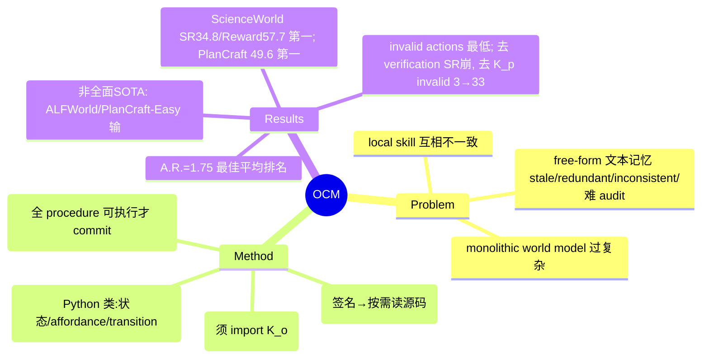

## Summary
OCM 把 LLM agent 的经验记忆从 free-form 文本改造成一份可执行的 object-centric 环境模型——object knowledge（Python 类，编码实体的状态/affordance/约束/关系/transition 机制）与 procedure knowledge（Python 文件，记录可复用交互模式，且必须 import 并使用 object model）两套连通代码库；每个 episode 后反思更新，并强制所有 procedure 对更新后的 object model 可执行才提交，使记忆可审计、可维护。在三个文本交互 benchmark 上取得最佳平均排名（A.R. 1.75）并降低无效动作。

## Problem & Motivation
LLM agent 能靠积累经验改进，但 free-form 文本记忆随交互增长越来越难维护、校验与复用：新写入的知识可能与旧知识 redundant / mutually inconsistent，记忆会 stale，大规模文本集合难以 validate 或 audit。已有 symbolic 路线各有偏差：一类学 executable skill / local procedure，像"散落的说明书"，各自假设的工具与部件可能彼此不一致；另一类建 monolithic programmatic world model，试图建模所有 transition，过度复杂且假设简化动态。OCM 的定位是用结构化、可执行、object-grounded 的模型同时解决"可复用"和"可审计"。

## Method
- **两套连通代码库**（§3.1）：
  - `K_o`（object knowledge）：一个 Python module，定义 object class 与 helper function，编码环境实体的 observable states、affordances、constraints、relations、transition mechanisms。
  - `K_p`（procedure knowledge）：一组 Python 文件，每个文件记录一个 focused 交互模式或经验规则。**核心约束**：procedure 不允许作为孤立的 trajectory 摘要存在，必须 import 并使用 `K_o` 中的类/函数，从而把过程性经验 grounding 到共享 object 模型上。
- **online 三阶段更新循环**：
  1. Reflection（§3.2）：把一条 trajectory 转成 learning plan，标出要更新的 object / procedure 项以及需要 inspect 的源码。
  2. Update（§3.3）：依据 plan、trajectory、结果与被 inspect 的源码生成具体 Python 代码增量 `(ΔC_o, ΔC_p)`。
  3. Verify（§3.3）：对更新后的 object model 执行**全部** procedure（`Verify = ⋀_p Exec(p | K̃_o)`），全部通过才 commit。注意：verification 只保证 executable consistency（能跑通、互相不冲突），不证明学到的机制语义完备或正确。
- **Progressive Knowledge Disclosure**（§3.4）：决策时 Level 0 只放 object class 签名 + procedure 索引；仅在需要时用内部 `Inspect[...]` 请求读取具体源码（Level 1），以压缩 context 开销。

## Key Results
- **设置**（§4.1）：backbone 为 GPT-4.1-mini，online 评测，agent 每 episode 后可更新记忆，但无 offline 训练数据、无 benchmark 专用 demonstration。三个**文本交互** benchmark：ScienceWorld（149 tasks，step limit 100）、ALFWorld（134 OOD tasks，step limit 50）、PlanCraft（117 test-small，step limit 30）。7 个 baseline：ReAct、Reflexion（interactive）；ExpeL、AWM（memory-augmented）；ASI、WorldCoder、Wall-E（symbolic / world-model）。
- **主结果**（Table 1，§4.2）：OCM 平均排名 A.R.=1.75 全场最佳（Reflexion 2.95 次之，Wall-E 6.55 最差）。ScienceWorld 上 SR=34.8、Reward=57.7 均为第一；PlanCraft Overall SR=49.6 第一。
- **并非全面 SOTA**（Table 1）：ALFWorld SR 上 ExpeL 60.1 > OCM 41.7；PlanCraft-Easy 上 Reflexion 67.5 > OCM 62.5。OCM 的卖点是"最佳平均排名 + 更少无效动作"，而非逐 benchmark 通杀。
- **动作合法性**（Figure 3，§4.4）：OCM 在 ScienceWorld 与 PlanCraft 上 mean invalid-action count 均为最低，说明学到的知识不仅提升完成率也提升动作可行性。
- **Ablation**（Table 2，§4.5，PlanCraft）：去掉 verification，SR 掉最多（49.6→39.3）；去掉 procedure knowledge `K_p`，invalid actions 从 3 暴涨到 33（SR 45.3）；去掉 object knowledge `K_o`，SR 44.4、invalid 6。三个组件都有贡献，verification 对 SR 最关键，procedure knowledge 对动作合法性最关键。

## Evidence Ledger

| Claim ID | Claim | Type | Source locator | Evidence excerpt | Status |
|:--|:--|:--|:--|:--|:--|
| C1 | OCM 平均排名 A.R.=1.75 最佳（Reflexion 2.95 次之，Wall-E 6.55 最差） | number/comparison | Table 1 (§4.2) | "OCM ... 1.75"; A.R. 列，最低为最佳，次佳 Reflexion 2.95，最差 Wall-E 6.55 | source-verified |
| C2 | ScienceWorld 上 OCM SR=34.8 且 Reward=57.7 均第一 | number/comparison | Table 1 | "OCM \| 34.8 \| 57.7"（SR 次高 AWM 33.6；Reward 次高 Expel 52.3） | source-verified |
| C3 | PlanCraft Overall SR OCM=49.6 第一 | number/comparison | Table 1 | "OCM ... 49.6" Overall（次高 Reflexion 47.0） | source-verified |
| C4 | 非全面 SOTA：ALFWorld SR ExpeL 60.1>OCM 41.7；PlanCraft-Easy Reflexion 67.5>OCM 62.5 | comparison | Table 1 | "Expel ... 60.1" vs "OCM ... 41.7"；"Reflexion ... 67.5" vs "OCM ... 62.5" | source-verified |
| C5 | OCM 在 ScienceWorld 与 PlanCraft 上 mean invalid actions 均最低 | comparison | Figure 3 / §4.4 | "OCM has the lowest mean invalid-action count on both ScienceWorld and PlanCraft" | source-verified |
| C6 | Ablation：去 verification SR 掉最多 49.6→39.3；去 K_p invalid 3→33 | number/causal | Table 2 (§4.5) | "OCM \| 49.6 ... 3"; "w/o K_p \| 45.3 ... 33"; "w/o verification \| 39.3" | source-verified |
| C7 | backbone GPT-4.1-mini，online，无 offline 训练数据/benchmark 专用 demo | benchmark-setting | §4.1 | "receive no offline training data ... We use GPT-4.1-mini as the backbone LLM" | source-verified |
| C8 | 三 benchmark 均为文本交互环境（SciWorld 149/100、ALFWorld 134/50、PlanCraft 117/30），非 GUI/computer-use | benchmark-setting | §4.1 + Appendix A.1 表 | "ScienceWorld ... 149 \| 100 ... ALFWorld OOD 134 \| 50 ... PlanCraft 117 \| 30"; "text-based interactive environments" | source-verified |
| C9 | procedure 必须 import/使用 K_o 的类/函数；每 episode 后所有 procedure 须对更新 object model 可执行才 commit | causal-mechanism | §3.1 / §3.3 | "must import and use classes or functions from K_o"; update 仅在 candidate code 对当前 object model 可执行时 commit | source-verified |

## Strengths & Weaknesses
**亮点**：把 memory 从"文本 + LLM 自查"换成"可执行代码 + import 约束 + 每轮真实 re-execution 验证"，是一个简洁且可 scale 的 auditability 机制——一致性由 Python 解释器实际执行来保证，而非 LLM self-reflection，这比多数 self-reflection memory 系统更硬。论文诚实：明确 verification 只保证 executable consistency 而非语义正确，也不掩盖 OCM 并非逐 benchmark SOTA。ablation 干净，去 verification（SR 崩）与去 `K_p`（invalid 暴涨）的失败模式与方法设计对应清晰。

**局限/边界**：
- 只在 text-based、且 object type / action interface / transition 相对稳定的环境验证（作者自述）；对视觉/GUI 观测、动态或开放世界、object schema 漂移的情形均未验证。
- verification 的根本弱点：一个语义错误但恰好可执行的 mechanism 仍会被 commit，可能系统性误导后续决策——"能跑通"≠"对"。
- 额外开销：episode 后的 reflection/update/verify 与交互中的源码 inspection 都增加 LLM 调用；效果强依赖 backbone 抽象经验、写 coherent 代码的能力。
- 实验规模有限：单 backbone（GPT-4.1-mini）、每 benchmark 100–150 量级任务；抓取内容中未见多 seed / 方差报告，A.R. 领先幅度的稳健性无法从正文判断。

**对领域影响**：为"agent memory as structured, verifiable state"提供了一个具体、可执行的实现样本。对本 notebook 关注的 GUI agent context/memory 有迁移启发（用可执行结构 + 执行验证替代自然语言记忆），但要落到 computer-use 需先跨越视觉观测与不稳定 schema 这两道关。

## Mind Map

## Notes
- **与"动作须可追溯到 belief source 并留下可验证状态变化"命题的关系**：OCM 正面支持该命题的记忆侧——procedure（动作模式）被强制 grounding 到结构化 belief source（object model），且每轮用真实执行验证记忆内部一致，动作因此可追溯到一份可验证的结构化状态；但它只处理 memory 内部一致性，不触及观测层，对"hybrid observation 放大 stale evidence"没有实验（纯文本单一观测环境）。
- 值得追问：verification 只做 "runnable" 检查，如何区分"可执行但语义错"的 procedure？是否可以引入基于 rollout 的语义一致性检查（用 object model 预测 vs 环境真值）来加固，而不止步于能否 import/执行？
- 与本 vault 内 world-model / agent-memory 线（如 2506-ObjectCentricPrompt、2604-AgentWorld）可交叉对照：OCM 的差异点是"memory = 可执行代码 + 每轮执行验证"这一约束。
