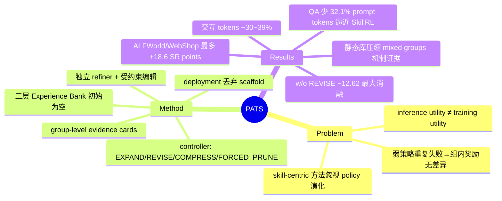

## Summary

PATS 把 skill/guidance 从"要优化的持久资产"重构为**策略条件化的一次性 training scaffold**：把每个 GRPO rollout group 压缩成 evidence card，由 competence-conditioned controller 在 EXPAND / REVISE / COMPRESS / FORCED_PRUNE 四种模式间调度受约束的 scaffold 编辑，deployment 时 scaffold 整体丢弃。在 ALFWorld/WebShop 上（无 scaffold 评测）比同规模 GRPO 最多高 18.6 SR points，交互 token 减少 30–39%；在七个 search-augmented QA benchmark 上以少 32.1% 的 prompt tokens 逼近保留 skill 库的 SkillRL。核心论点：外部指导的 inference 价值与 training 价值不同——RL 需要的是能产生组内差异（mixed-outcome groups）的 attempts，而非最大化即时成功率的完整指令。

## Problem & Motivation

Long-horizon LLM agent RL 中，弱策略反复以相似方式失败，rollout 组内奖励无差异（全失败或全成功），group-relative advantage 退化为零，policy optimization 拿不到有效学习信号。现有 skill-centric 方法（SKILL0、SkillRL 等）通过优化、过滤或内化可复用 skill 来改善探索，但它们以 skill 本身为中心，不是为不断演化的 policy 设计的自适应训练期支持。作者指出关键不对称："Inference favors instructions that maximize immediate success; RL needs attempts whose differences reveal useful updates"——过完整的指令会压塌学习所需的 behavioral variation，支持不足则组内一致失败。因此支持强度应随 policy competence 动态调节，且不应成为部署时的依赖。

## Method

**整体框架**：policy 用标准 GRPO + 环境奖励优化（reward 与 optimizer 完全不动，scaffold 只改后续 rollout 的 context）；deployment objective 显式条件在空 context（J_deploy = E[r(ξ)], ξ~π_θ(·|q,∅)），refiner、evidence builder、controller、Experience Bank 全部在部署时移除。

- **三层 scaffold（Experience Bank，初始为空）**：general entries（跨任务原则）/ task-type entries（任务类型专属流程）/ mistake entries（复发性失败+纠正动作）；每条 = actionable rule + 自然语言 applicability condition。容量硬预算（1.5B run：≤30 entries / 2,000 tokens；检索预算 top-4 task + top-3 general + top-3 mistake）。
- **Group-level evidence cards**：以 GRPO group（同任务 n 条并行轨迹）为基本证据单元——分成功/失败子集，抽取确定性 aggregate features 与代表性 traces（只含 observation / executable action / environment feedback，**排除 policy 推理文本**），按 task type 聚合后供 scaffold review。
- **Competence-conditioned controller**：task-type 成功率 EMA（系数 0.1）+ scaffold pressure p_k = max(entry 数/N_max, token 数/L_max)。模式选择（Eq. 14）：EXPAND（s̄<ρ_r，弱策略给具体支持）→ REVISE（ρ_r≤s̄<ρ_c，随残余失败调整）→ COMPRESS（s̄≥ρ_c，删冗余降依赖）→ FORCED_PRUNE（p≥1，硬容量裁剪）。ALFWorld 1.5B 用 ρ_r=0.30 / ρ_c=0.85；QA 用 0.2 / 0.4。
- **Constrained semantic revision**：由独立的 Qwen2.5-7B summarizer 服务（非 policy 本身）作 refiner，输出限定为 propose-skill / propose-mistake / update-skill / delete-skill 四种 JSON 操作；新 entry 需 ≥2 张 evidence cards 支持；按模式限定编辑预算，经 schema/重复/方向/容量校验后原子提交，非法提案记为 no-op。本轮编辑下一轮 rollout 才可见（snapshot 一致性）。
- **训练流程**：先做 scaffold-interface SFT（沿用公开 SkillRL ALFWorld 数据配置，3 epochs/81 steps，目的是让 policy 稳定理解 scaffold schema），再跑 150 步 GRPO（8 rollouts/task，KL 系数 0.01，γ=0.95，lr 1e-6，三个 seed）。

## Key Results

**ALFWorld / WebShop（Table 1，三 seed，PATS 评测时不带 scaffold）**：

| 设置 | GRPO SR | PATS SR | Δ | 交互 tokens（GRPO→PATS） |
|:--|:--|:--|:--|:--|
| ALFWorld 1.5B | 67.86±3.50 | **80.71±1.54** | +12.9 | 14,723 → 10,245（−30.4%） |
| ALFWorld 7B | 71.67±2.99 | **89.29±1.01** | +17.6 | 17,060 → 10,455（−38.7%） |
| WebShop 1.5B | 52.80±1.66 | **56.33±7.06** | +3.5 | 13,451 → 9,184（−31.7%） |
| WebShop 7B | 57.60±10.33 | **76.20±3.12** | +18.6 | 12,587 → 8,721（−30.7%） |

对照点：SkillRL 在 1.5B 去掉 skill 后崩到 47.38（严重依赖外部 skill）；7B 上保留 skill 的 SkillRL† ALFWorld SR 91.43±2.10 略高于 scaffold-free PATS（89.29），但要付近 3×（2.86×）交互 tokens（29,933 vs 10,455）。

**Search-augmented QA（七个 benchmark：NQ、HotpotQA 为 in-domain；TriviaQA、PopQA、2WikiMultiHopQA、MuSiQue、Bamboogle 为 out-of-domain；共 51,713 评测样本；backbone Qwen2.5-7B-Instruct）**：PATS avg 45.2 / 740 prompt tokens，vs SkillRL†（保留 skill 库）46.0 / 1,090.1 tokens——**少 32.1% prompt tokens**；vs SKILL0 41.7 / 688 tokens——+3.5 平均分、多 7.6% tokens。这是作者明确摆出的 performance–context trade-off，不是全面超越。

**消融（Table 3，1.5B ALFWorld，全部无 scaffold 评测）**：w/o training scaffold −7.14；frozen after step 50 −3.57；trajectory-wise evidence −6.66；EXPAND only −7.85；**w/o REVISE −12.62（最大 controller 消融降幅）**；SkillRL-style warm start −10.47；**w/o interface initialization −32.85**。

**机制证据（Sec 4.3 + Appendix B.4 replay）**：固定 55-entry 静态 skill 库能提升即时 SR、action entropy 和 state coverage，但对 GRPO 的效果随 competence 反转——step 20 把 mixed-outcome groups 从 0.62 提到 0.78，step 30 却把它从 0.78 压到 0.72（收窄学习信号）。个案：静态指导 7/8 成功走 7 步路径（σ_r=0.331），policy-derived 支持 4/8 成功但含 42 步探索轨迹（σ_r=0.500，二元奖励最大方差）。

**Stage-0 skill-removal diagnostic（Sec 4.1）**：band-conditioned RL 50 步后 supported/unsupported NLL gap 从 0.1170 降到 0.0723（相对 −38.3%）；unsupported 成功率 22.97%±6.39% vs 等预算 no-band RL 的 17.66%±7.94%；重新加回 band 得 34.38%±7.35%。作者明确标注该集只覆盖两个 gamefiles，"not proof that every skill is internalized"。

**成本**：一次 audited 1.5B ALFWorld run 用 8×H20 约 22.4 小时（≈180 GPU-hours，含 refiner 服务；831 次 refiner 请求、801 次成功）。代码链接文中未提供。

## Evidence Ledger

| Claim ID | Claim | Type | Source locator | Evidence excerpt | Status |
|:--|:--|:--|:--|:--|:--|
| C1 | 对同规模 GRPO 最多 +18.6 SR points（WebShop 7B）；ALFWorld +12.9/+17.6、WebShop +3.5/+18.6（1.5B/7B） | number | Abstract; Sec 1; Fig. 5 caption | "12.9/17.6 ALFWorld SR points and 3.5/18.6 WebShop SR points" | source-verified |
| C2 | PATS 无 scaffold 评测 SR：ALFWorld 80.71±1.54 / 89.29±1.01，WebShop 56.33±7.06 / 76.20±3.12（三 seed） | number | Table 1 + caption | "SR values are three-seed means ± standard deviation" | source-verified |
| C3 | 部署交互 token 较 GRPO 减少 30.4%/38.7%（ALFWorld）、31.7%/30.7%（WebShop） | number | Sec 4.2; Fig. 5 caption | "reduces deployment interaction tokens by 30.4/38.7% on ALFWorld and 31.7/30.7% on WebShop" | source-verified |
| C4 | 七个 QA benchmark = NQ、HotpotQA（in-domain）+ TriviaQA、PopQA、2WikiMultiHopQA、MuSiQue、Bamboogle；51,713 样本；Qwen2.5-7B-Instruct | benchmark-setting | Appendix B.6 | "Evaluation covers 51,713 examples: NQ (3,610) and HotpotQA (7,405) are in-domain" | source-verified |
| C5 | QA avg 45.2 / 740 tokens，比 SkillRL†（46.0 / 1,090.1）少 32.1% prompt tokens；比 SKILL0 高 3.5 分、多 7.6% tokens | number/comparison | Table 2 + Sec 4.2 | "improves over SKILL0 by 3.5 average points with 7.6% more prompt tokens" | source-verified |
| C6 | Evidence card 以 GRPO group 为单元：分成功/失败子集，代表性 traces 排除 policy 推理文本，按 task type 聚合 | causal-mechanism | Sec 3.3, Eqs. 8–10 | "basic evidence unit of Pats is therefore a GRPO group" | source-verified |
| C7 | Controller 按成功率 EMA 阈值（ρ_r<ρ_c）与 scaffold pressure 选 EXPAND/REVISE/COMPRESS/FORCED_PRUNE；部署时 policy 条件在空 context | causal-mechanism | Sec 3.3 Eqs. 12–14; Sec 3.1 Eq. 2 | "FORCED_PRUNE, p_k≥1; COMPRESS…REVISE…EXPAND…where 0<ρ_r<ρ_c<1" | source-verified |
| C8 | 消融：w/o REVISE −12.62（最大 controller 降幅）；w/o training scaffold −7.14；w/o interface initialization −32.85 等 | number | Table 3（1.5B ALFWorld） | "removing semantic revision causes the largest controller drop" | source-verified |
| C9 | 静态 55-entry 库提升即时 SR 但后期压缩 mixed groups（0.62→0.78 再 0.78→0.72）；7/8 七步路径 σ_r=0.331 vs 4/8 42 步轨迹 σ_r=0.500 | causal-mechanism | Sec 4.3 正文 + Appendix B.4 | "raises mixed-outcome groups from 0.62 to 0.78 … reducing mixed groups from 0.78 to 0.72" | source-verified |
| C10 | Stage-0：NLL gap 0.1170→0.0723（−38.3%）；unsupported 成功 22.97±6.39 vs 17.66±7.94；加回 band 34.38±7.35；仅两个 gamefiles | number | Sec 4.1 + Fig. 4 caption | "gap falls from 0.1170 to 0.0723 after 50 steps, a 38.3% relative reduction" | source-verified |
| C11 | Refiner 是独立 Qwen2.5-7B summarizer 服务，仅四种编辑操作，新 entry 需 ≥2 cards；audited run ≈180 GPU-hours、831/801 refiner 请求 | benchmark-setting | Sec 3.3 + Appendix B.1/B.2 | "independent qwen2.5-7b-summary service … 831 refiner requests, 801 successful" | source-verified |
| C12 | 7B 上 SkillRL† ALFWorld SR 91.43±2.10 > PATS 89.29±1.01，但 tokens 29,933 vs 10,455（2.86×） | comparison | Table 1（7B block） | "SkillRL† … 91.43±2.10 … 29,933; Pats … 89.29±1.01 … 10,455" | source-verified |

## Strengths & Weaknesses

**Strengths**

- **Problem formulation 是真贡献**：把 "inference utility ≠ training utility" 落到可操作的量上——GRPO 的有效性取决于 mixed-outcome groups 与非退化 group-relative advantage——并用 replay 分析给出直接机制证据（静态 skill 库在高 competence 时把 mixed groups 从 0.78 压到 0.72），而不是只讲故事。Appendix C 还给了 mixed-reward group 概率在中等成功率处最大的形式化观察。
- **部署零残留**：与保留 skill 库的 SkillRL† 相比没有永久 context 税（QA 740 vs 1,090 tokens；ALFWorld 7B 10,455 vs 29,933），这对成本敏感的 agent 部署是实打实的优势。比较纪律也好：† / ‡ 标注清楚哪些方法带外部支持、哪些数字未本地复现。
- **诚实的边界声明**：Stage-0 diagnostic 明确"两个 gamefiles、不证明普遍 skill 内化"；QA 一节明确承认是 performance–context trade-off 而非超越；Case A 反例主动防止"强 skill 必然损害探索"的过度概括。

**Weaknesses / 边界**

- **收益构成需要拆开看（已知）**：w/o interface initialization 掉 32.85 points，而 w/o training scaffold 只掉 7.14——在线 scaffold 机制的净贡献远小于 headline 的 +12.9~18.6。（推测）主表对 GRPO 的 end-to-end 差距可能包含 scaffold-interface SFT 的初始化红利；GRPO baseline 是否共享该 SFT 文中未明确说明。
- **WebShop 1.5B 证据弱（已知）**：+3.5 在 ±7.06 的 seed 方差下不可靠；且带 scaffold 的 Pats†（59.47）高于 scaffold-free Pats（56.33），说明 scaffold 移除在该设置有真实代价。
- **对外部 refiner 的依赖未消融（不知道）**：机制依赖一个独立 Qwen2.5-7B summarizer 服务的编辑质量，refiner 换更弱/更强模型的敏感性、以及 controller 阈值跨环境不一致（ALFWorld 0.30/0.85 vs QA 0.2/0.4）的调参代价，文中未见分析。
- **适用范围（已知）**：全部证据来自文本环境（ALFWorld、WebShop、search QA）+ 二元/标量环境奖励；对视觉 GUI 环境、非 verifiable reward 场景是否成立未知。代码未开源，机构信息未披露。

## Mind Map

## Notes

- 与 [[2607-GRPONullWebAgent]] 构成同一机制的两面：那篇证明组内**全成功**（SFT 已饱和）时 GRPO 无真实提升且大学习率致崩坏；PATS 攻击对偶端——组内**全失败**时无学习信号，用训练期 context 干预把任务拉回 mixed-outcome 区间。两篇共同指向 "GRPO 有效性 = mixed-outcome group 的存在性" 这一跨论文 pattern。
- PATS 与 problem-side curriculum（改任务分布）的区别在于它做的是 **context-side curriculum**（改条件化输入），作者在 Fig. 2 中明确区分了持久积累、单调撤除、problem-side curricula 三种替代观。可关注后续是否有工作把二者统一。
- 开放问题：scaffold-conditioned SFT 初始化贡献了多少 headline 提升？若给 GRPO baseline 同样的 SFT 起点，差距还剩多少？这是复现时第一个该跑的对照。
