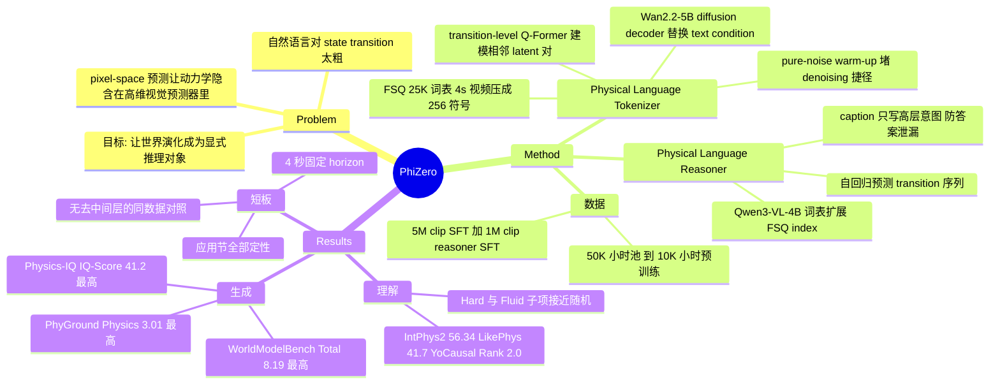

## Summary

PhiZero 把 world model 的预测目标从像素换成一套自监督学到的离散 physical language（FSQ 码，25K 词表，4 秒视频压成 256 个符号），先由 VLM reasoner 自回归推出未来的 state-transition 序列，再由 diffusion decoder 渲染成视频。以 5B 级 decoder + 4B 级 reasoner，在 6 个第三方 physical benchmark 上的综合指标超过 14B 级 pixel-space baseline，并支持 action-conditioned 仿真与跨形态运动迁移。但全文没有"同数据同算力、去掉中间表示直接渲染"的对照实验，中间层的必要性尚未被证伪。

## Problem & Motivation

主流 video world model 直接在 pixel space 做未来帧预测，世界动力学隐含在高维视觉预测器里，导致视觉保真度高但物理结果经常不自洽。作者的出发点是人类不靠记住视觉结果，而是把视觉经验抽象成关于世界如何演化的可迁移知识，并用语言这一符号空间做显式推理。

但自然语言对物理世界的 state transition 太粗——"球撞到鸭子"无法刻画碰撞后的位移量、形变、连锁反应。论文因此提出：能否学一种比自然语言更细粒度的 physical-world transition 表示，让世界演化本身成为一个显式的推理目标而不是像素回归目标。论文脚注主动澄清，这里的 "physical" 指物理世界，不是物理定律的符号系统。

## Method

整体是 reason-then-render 两段式，把 `p(V, z | I₀, c)` 分解为 physical-language reasoning `p_θ(z | I₀, c)` 与 future-video rendering `p_ψ(V | I₀, z)`。

**Physical Language Tokenizer（表示学习）**

- 时空 encoder 沿用 Wan2.2 VAE 架构与权重，把视频编成 latent 序列。
- 不取全局表示，而是对**每一对相邻 latent state** `(x_i, x_{i+1})` 用共享的 transition-level Q-Former（32 个 learnable query）抽 transition 特征。这是一个局部时间 inductive bias：单次压缩的复杂度降低，同时保留全序列的时间顺序。
- 用 FSQ 离散化，量化级数配置为 (8,5,5,5,5,5)，词表 8×5⁵ = 25K 个符号，无需单独学码本。33 帧（4 秒）视频 → 9 个 latent state → 8 个相邻区间 × 32 = **256 个符号**。
- Decoder 用预训练 Wan2.2-5B video diffusion（LoRA rank 32），保持原架构不动，**只把 text condition 替换成 physical-language context**，另外把干净的首帧作为静态外观来源。监督信号就是 flow-matching 视频重建，没有任何 action / 物理标注。首帧供给外观这一设计，是为了逼迫离散 bottleneck 只编码 state change 而非冗余外观。
- **Pure-noise warm-up**：预训练 decoder 会走捷径——靠部分带噪的目标信息和自身 denoising prior 重建，从而忽略新引入的 physical-language condition。warm-up 阶段把所有 future-frame latent 初始化为纯噪声，堵死这条捷径，之后再恢复标准 flow-matching noise schedule。
- 课程训练：分辨率 256×448 下把 clip 从 1s → 2s → 4s 逐步拉长，再把重建分辨率提到 512×896 做 SFT，最后冻结 tokenizer 只精调 decoder（额外加 FSQ entropy 正则与 REPA loss）。

**Physical Language Reasoner（推理）**

- 从 Qwen3-VL-4B 初始化，把词表扩展为**每个 FSQ index 一个原子符号**，给定首帧 + 文本 action intent 自回归预测长度 256 的 physical-language 序列，交叉熵训练，target 由冻结的 tokenizer 离线生成。
- 关键的数据泄漏防护：训练用的 caption 由 VLM 生成，prompt 明确要求只概括高层的起始动作或交互意图，**避免叙述细粒度的中间运动、状态变化与次级物理效应**——否则文本条件会直接泄露答案。

**数据与算力**

50K 小时真实视频池 → 过滤到 10K 小时做 tokenizer 预训练（In-house 3329h、HOIGen-1M 2200h、OpenVid-1M 2051h 等）；二次严格过滤（美学、运动幅度、VLM 判定的 state-transition 可观测性）+ 1K 小时仿真视频 → **5M 个 4 秒 clip** 用于 tokenizer SFT 与 reasoner 续训；再经 rich-motion / physical filter → **1M clip**（800K 筛选 + 200K simulator 生成）用于 reasoner SFT。全部训练阶段用 128 张 A100。

## Key Results

**生成（三个第三方 benchmark）**

| Benchmark | 指标 | PhiZero | 最强对手 |
|:--|:--|:--|:--|
| Physics-IQ Verified | IQ-Score↑ | **41.2** | Cosmos3-Super 39.5, Grok-Video 34.8, Wan2.2-14B 32.2, Wan2.2-5B 21.2 |
| Physics-IQ Verified | S-IoU↑ / ST-IoU↑ | **58.2 / 36.8** | 均为全表最高 |
| Physics-IQ Verified | WS-IoU↑ | 27.6 | 落后 Grok-Video 35.7、Hunyuan 29.7、Wan2.2-14B 28.5 |
| PhyGround | Physics↑ / Overall↑ | **3.01 / 2.97** | Wan2.2-14B 2.90 / 2.95 |
| PhyGround | General Quality↑ | 2.93 | 落后 Veo3.1 3.01、Wan2.2-14B 3.00 |
| WorldModelBench | Physics / CommonSense / Total↑ | **4.88 / 1.71 / 8.19** | Runway 4.27 / 1.65 / 8.08 |

（WorldModelBench 的 Total 是官方对该 benchmark 全部指标求和，4.88 + 1.71 只占其中一部分，表中未展示其余分项。）

**理解（三个第三方 benchmark，统一走作者自建的 likelihood 比较协议）**

| Benchmark | 指标 | PhiZero | 备注 |
|:--|:--|:--|:--|
| IntPhys2 | Overall↑ | **56.34** | 全表最高（Gemini-2.5 Flash 55.63） |
| IntPhys2 | Easy / Hard↑ | 60.98 / 52.38 | Hard 落后 V-JEPA 57.42、Gemini-2.5 Flash 54.46、GPT-4o 54.17；pairwise 随机基线为 50 |
| LikePhys | Avg. Error↓ / Rigid↓ | **41.7 / 29.14** | 均为全表最低 |
| LikePhys | Fluid↓ | 53.15 | 全表倒数第三，仅优于 Wan2.1-1.3B 57.10、AnimateDiff-SDXL 53.33 |
| YoCausal | CCI↑ / Agg. Rank↓ | **6.20 / 2.0** | 均为全表最优 |
| YoCausal | RSI↑ | 55.54 | 落后 LTX-Video-2B 58.86、LTX-Video-13B 56.48 |

**Tokenizer 重建（Table 7，500 段 4 秒真实视频 @512×896）**：256 token / PSNR 28.9 / SSIM 0.903 / LPIPS 0.087，优于 Video-LaVIT（270 token, 23.6）与 VideoFlexTok k=64（576 token, 26.5），但远低于 Wan2.2 VAE（44,800 token, PSNR 37.7）。这说明 256 个离散符号确实携带了足够重建 4 秒动态的信息量，同时也量化了压缩的视觉代价。

**Ablation**

- Reasoner（Physics-IQ IQ-Score）：Wan2.2-5B 21.2 → +Prompt Enhancement 26.6 → w/o Simulation Data 37.7 → w/o Two-stage Training 39.2 → Full **41.2**。
- Tokenizer（仅重建指标）：w/o Diffusion Dec 26.6、w/o Trans. Q-Former 28.2、w/o Pure-noise Warm-up 27.9 vs Full 28.9 PSNR。

**表示分析**：把 transition 特征聚合到 clip 级，PCA 降到 20 维再 UMAP 投到 3D，nuScenes 的左转/右转/直行/静止形成连续流形+独立簇，AGI-Bot RealRobot 的四类 gripper 动作形成分离簇（Fig 6）。把同一段 physical-language 序列解码到编辑过的首帧上，倾倒、黏性铺展、液体流动等 transition 被保留（Fig 5）。

**应用（全部仅定性）**：轨迹条件驾驶世界模型（nuScenes）、动作条件机器人世界模型（AGI-Bot RealRobot）、滑窗交互式 rollout、human→Unitree G1 / human hand→Sharpa dexterous hand 的跨形态迁移、LIBERO sim-to-real。Sec 4.5 与 Appendix C 无任何数值或 baseline 对比。

## Evidence Ledger

| Claim ID | Claim | Type | Source locator | Evidence excerpt | Status |
|:--|:--|:--|:--|:--|:--|
| C1 | physical language 是 FSQ 学出的离散码（级数 (8,5,5,5,5,5)，25K 词表），非自然语言、无人工词表 | causal-mechanism | Sec 4.1, p.6 | "We configure FSQ with scalar quantization levels (8, 5, 5, 5, 5, 5), yielding a vocabulary of 25K discrete symbols" | source-verified |
| C2 | "physical" 指物理世界而非物理定律的符号系统（作者主动澄清） | causal-mechanism | Footnote *, p.2 | "Here, physical refers broadly to physical world, rather than to a symbolic system of physical laws." | source-verified |
| C3 | 33 帧视频 → 9 个 latent state，每相邻对 32 个 query，序列长 256 | number | Sec 4.1, p.6 | "A 33-frame video is encoded into nine temporal latent states... produces a physical-language sequence of length 256" | source-verified |
| C4 | tokenizer 监督信号是 flow-matching 视频重建，无 action/物理标注 | causal-mechanism | Sec 3.2 Eq.4, p.4 | "the decoder reconstructs the target video using the standard flow-matching objective" | source-verified（decoder-only 精调阶段另加 FSQ entropy 与 REPA loss，见 App A.1） |
| C5 | 数据规模 50K 小时池 → 10K 小时预训练 / 5M clip SFT / 1M clip reasoner SFT；128 张 A100 | number | Fig 3, App A.1/A.2, pp.5,12 | "All training stages use 128 NVIDIA A100 GPUs" | source-verified |
| C6 | Reasoner 从 Qwen3-VL-4B 初始化，词表按 FSQ index 扩展，文本条件为 VLM 生成 caption | benchmark-setting | Sec 4.1 + Sec 3.3, pp.5-6 | "we initialize the model from the pretrained Qwen3-VL-4B and extend its vocabulary with one atomic symbol for each FSQ index" | source-verified |
| C7 | Physics-IQ Verified：IQ-Score 41.2 全表最高，S-IoU 58.2 / ST-IoU 36.8 亦最高 | number | Table 1, p.7 | "PHIZERO (Ours) 58.2 36.8 27.6 41.2" | source-verified |
| C8 | 同表 WS-IoU 27.6 低于 Grok-Video 35.7 / Hunyuan 29.7 / Wan2.2-14B 28.5 | comparison | Table 1, p.7 | "Grok-Video (xAI, 2026) 52.7 21.4 35.7 34.8" | source-verified |
| C9 | PhyGround：Physics 3.01 / Overall 2.97 最优，但 General Quality 2.93 低于 Veo3.1 3.01、Wan2.2-14B 3.00 | comparison | Table 2, p.7 | "PHIZERO (Ours) 2.93 3.01 2.97" | source-verified |
| C10 | WorldModelBench：Physics 4.88 / CommonSense 1.71 / Total 8.19 全表最优 | number | Table 3, p.7 | "PHIZERO (Ours) 4.88 1.71 8.19" | source-verified |
| C11 | IntPhys2：Overall 56.34 最高，但 Hard 52.38 低于 V-JEPA 57.42 / Gemini-2.5 Flash 54.46 / GPT-4o 54.17 | comparison | Table 4, p.7 | "PHIZERO (Ours) 60.98 60.50 52.38 56.34" | source-verified |
| C12 | LikePhys：Avg. Error 41.7 / Rigid 29.14 最优，但 Fluid 53.15 为全表倒数第三 | comparison | Table 5, p.7 | "PHIZERO (Ours) 29.14 53.15 37.50 41.7" | source-verified |
| C13 | YoCausal：CCI 6.20 / Agg. Rank 2.0 最优，但 RSI 55.54 低于 LTX-Video-2B 58.86 | comparison | Table 6, p.7 | "PHIZERO (Ours) 55.54 6.20 2.0" | source-verified |
| C14 | Tokenizer 重建：256 token PSNR 28.9，优于同量级 tokenizer，远低于 Wan2.2 VAE（44,800 token, 37.7） | number | Table 7, p.8 | "Ours 256 28.9 0.903 0.087" | source-verified |
| C15 | **全文（含附录）无"控制数据与算力、去掉 physical-language 中间层直接渲染"的 ablation**；Table 9 中唯一非中间层参照是现成 Wan2.2-5B（21.2）与其 prompt enhancement 版（26.6） | causal-mechanism | Sec 4.3 + Tables 8-9 + 全文检索 | "Wan2.2-5B (Baseline) 21.2 + Prompt Enhancement 26.6 Ours w/o Simulation Data 37.7" | source-verified（"两条 Wan2.2-5B 参照未在 PhiZero 语料上训练"系由其为现成模型推得，论文未显式陈述） |
| C16 | Reasoner ablation 全部数值（IQ-Score）：21.2 / 26.6 / 37.7 / 39.2 / 41.2 | number | Table 9, p.9 | "Ours w/o Simulation Data 37.7 Ours w/o Two-stage Training 39.2 Ours (Full) 41.2" | source-verified |
| C17 | Tokenizer ablation 只报重建指标（PSNR/SSIM/LPIPS），不测下游生成 | benchmark-setting | Table 8, p.8 | "w/o Diffusion Dec 26.6 w/o Trans. Q-Former 28.2 w/o Pure-noise Warm-up 27.9 Full 28.9" | source-verified |
| C18 | 六个 benchmark 均为第三方、走官方协议与 evaluator，physical consistency 指标非作者自定义 | benchmark-setting | App B.1/B.2, pp.14-15 | "we follow the official evaluation protocols and released evaluators" | source-verified |
| C19 | 三个理解 benchmark 用作者自建的 physical-language likelihood 比较协议；IntPhys2 的 caption 由作者用 VLM 现生成 | benchmark-setting | Sec 4.2 + App B.2 Eq.7, pp.7,15 | "IntPhys2 does not provide instance-level text descriptions. We therefore use a VLM to generate one scene-level caption" | source-verified |
| C20 | Sec 4.5 全部应用（交互 rollout、动作条件驾驶/机器人、跨形态与 sim-to-real 迁移）仅有定性图，无任何数值或 baseline | benchmark-setting | Sec 4.5 + Figs 7-8 + App C | Sec 4.5 与 App C 中无表格、无数值结果，全部经 Fig 7/Fig 8 引用 | source-verified |
| C21 | "zero-shot" 迁移仍需对每个 source domain 微调 tokenizer，并用 GPT-Image 2.0 编辑首帧 | causal-mechanism | App C.2, p.16 | "we briefly fine-tune the Physical Language Tokenizer on videos from each source domain" | source-verified（论文自身的限定语是 "does not require paired videos"/"without target-specific training"） |
| C22 | 驾驶/机器人世界模型需在 nuScenes / AGI-Bot RealRobot 上同时微调 tokenizer 与 reasoner，动作序列化为数字文本 | causal-mechanism | App C.1, pp.15-16 | "these values are arranged in a fixed order and serialized into numerical text, and is used as the action condition" | source-verified |
| C23 | 生成 horizon 固定 4 秒，长时程靠"末帧作下一窗口首帧"的滑窗自回归 | causal-mechanism | App C.1, p.16 | "the final frame of the generated segment is subsequently used as the first-frame condition for the next window" | source-verified |
| C24 | 作者自陈局限：physical language 是经验表示、不对应可解释物理量；覆盖受限于视觉可观测的 transition；模型与语料规模偏小 | causal-mechanism | App E, p.18 | "such as tactile interactions and microscopic particle dynamics, may therefore be more difficult to model" | source-verified |
| C25 | SFT 语料含仿真物理数据集：Phyco 126K、ComPhy 60K、Cosmos3 51K、CLEVRER 20K、Physion++ 10K、Physion 9K、Physics101 1K clip | number | Table 11, p.13 | "Phyco Simulation 126K ComPhy Simulation 60K Cosmos3 Simulation 51K CLEVRER Simulation 20K" | source-verified |
| C26 | 无 GitHub 代码仓库；论文只给 project page，且未声明将开源代码或权重 | license-code | p.1 + 全文/附录/参考文献检索 | 仅出现 "https://Phi-Zero.github.io/"，全文无 code repository URL，也无开源承诺 | source-verified |
| C27 | 上述仿真语料与 LikePhys / IntPhys2 的合成物理场景分布相近，可能抬高理解 benchmark 表现 | causal-mechanism | — | 论文未讨论训练语料与理解 benchmark 的分布关系 | unsupported（本条为笔记作者推测，非论文陈述；数据集本身不重叠） |

## Strengths & Weaknesses

**Strengths**

中间表示是学出来的而不是设计出来的，这是本文最有价值的地方。FSQ 的词表由标量量化级数的 Cartesian product 直接定义，不需要单独训练码本；整套表示只靠视频重建自监督获得，不依赖 simulator 导出的光流、刚体仿真约束或预定义物理变量。这与 related work 里三条主流"加物理"路线（仿真器约束、外部先验对齐、显式物理知识注入）形成清晰对照，可扩展性明显更好。

参数效率的证据比较硬。decoder 是 Wan2.2-5B + LoRA rank 32，reasoner 是 Qwen3-VL-4B，却在 Physics-IQ Verified 上以 41.2 越过 Cosmos3-Super 39.5 和 Wan2.2-14B 32.2。同底座对照（Wan2.2-5B 21.2）差 20 分，即便这 20 分的归因存疑（见下），"小模型 + 结构化中间表示"能追上大一档的 pixel-space 模型这一现象本身值得记录。

评测选择上作者是克制的。六个 benchmark 全部第三方、全部走官方 evaluator，physical consistency 的度量不是自己造的——在这个极容易自定义指标的方向上，这一点是加分项。Table 7 的重建实验又给出了信息量下界：256 个符号能把 4 秒视频重建到 PSNR 28.9，说明 bottleneck 确实携带了 transition 信息，不是一个装饰性 condition。pure-noise warm-up 这个设计直接针对"decoder 走 denoising 捷径、忽略新引入 condition"的失效模式，是很诚实的工程细节；Fig 5 的外观替换解码与 Fig 6 的 UMAP 聚类，则从两个独立角度旁证了 transition 与 appearance 确有解耦。

**Weaknesses**

最关键的问题是**中间表示的必要性没有被证伪**。Table 9 里唯一的非 physical-language 参照是现成的 Wan2.2-5B（21.2）和它加 prompt enhancement 的版本（26.6），而 PhiZero 的 decoder 在 10K 小时 + 5M clip 的 curated 语料上做过 LoRA 微调、reasoner 又额外训了 5M + 1M clip。于是 21.2 → 41.2 这 20 分里，中间表示、额外数据与训练、仿真数据三者完全混在一起。作者自己剥离的只有仿真数据（w/o Simulation Data 37.7，值 3.5 分）。真正需要的对照——用同样的 5M clip 直接微调 Wan2.2-5B 做 image+text→video——论文没有做。Table 8 的 tokenizer ablation 也补不上这一环：它只测重建 PSNR，且测的是 diffusion decoder / transition-level Q-Former / warm-up 三个设计选择，不是离散 bottleneck 本身是否必要。"给 world model 加一层语言中间表示"这类工作最常见的漏洞，PhiZero 没有避开。

优势也不是全面的，而且掉队的分项有解释力，值得单独看。Physics-IQ Verified 上 S-IoU（变化位置）和 ST-IoU（时序）都第一，唯独 WS-IoU（变化的时间频率）27.6 落后一大截——这与 8 个 transition 区间 × 32 符号的粗时间粒度是一致的。LikePhys 上刚体误差 29.14 全表最低，流体误差 53.15 却接近 50% 随机：离散 transition token 更容易编码物体级的刚性位移，难以编码连续介质场。IntPhys2 的 Hard 子集 52.38（随机 50%），Overall 第一主要靠 Medium 撑起来。PhyGround 的 General Quality 2.93 低于 Veo3.1 和 Wan2.2-14B，与 Table 7 里 PSNR 28.9 vs VAE 37.7 相互印证——过一遍 256 符号的瓶颈是有视觉代价的。综合起来，"physical language 优于 pixel prediction" 不是无条件结论：它在刚体、物体级交互上成立，在连续介质和长尾困难样例上不成立。

摘要与 Fig 1 主打的三项应用——交互式 rollout、动作条件驾驶/机器人仿真、zero-shot motion transfer——在 Sec 4.5 和整个 Appendix C 里**没有一个数字、没有一条 baseline**。这恰恰是"physical language 是通用接口"这一 claim 最需要量化支撑的地方（nuScenes 上的轨迹跟随误差、RealRobot 上的 gripper 位姿一致性都是现成可测的）。按证据强度算，这部分只能记为 demo。同时 "zero-shot" 的口径需要收紧：每个 source domain 都要先对 tokenizer 做 brief fine-tune，首帧还要用 GPT-Image 2.0 编辑，zero-shot 指的是"不用配对的 human-robot 数据"，不是"不做任何适配"；driving / robotics 世界模型更是要 tokenizer 与 reasoner 双双在目标域上微调，所谓通用接口实际是"每域一套适配后的接口"。

理解 benchmark 的可比性也有隐忧。作者自建的协议是把配对视频都编成 physical language、比 reasoner 的 log-likelihood，本质是判别式 likelihood ranking；同表的 GPT-4o、Gemini 却是生成式 QA。两者放一起排名，论文没有讨论可比性。IntPhys2 因为没有 instance-level 文本，caption 还是作者自己用 VLM 生成的（作者做了合理防护：VLM 只看四段视频的首帧、不见后续帧与标签，四条视频共用同一 caption），但协议自由度终究比另外两个 benchmark 大。另外训练语料含 Physion / Physion++ / CLEVRER / ComPhy / Phyco 等合成物理 clip，与 LikePhys、IntPhys2 的合成物理场景在分布上不算远——数据集本身不重叠，这一条属于推测而非论文陈述，但是应当追问的方向。

结构性限制是 4 秒固定 horizon 加"末帧当下一窗口首帧"的滑窗自回归。世界状态里凡是不能从一张图恢复的东西——速度、已完成的进度、被遮挡的物体——在每个窗口边界都会丢失。作者把长时程列进 future work，但对一个自称 world model 的系统，这是结构问题而非工程细节。最后，作者自陈 physical language 只是经验表示、符号不对应可解释物理量、覆盖受限于视觉可观测的 transition——这个自陈是诚实的（footnote 也主动澄清了 "physical" 的含义），但也说明这套表示离"可推理的物理"仍有距离：它是一种学出来的 transition 码，不是一种语言。

**影响判断**：若后续有人补上缺失的对照实验且中间表示站得住，这条路线（离散 transition 空间上做自回归推理 + 生成式渲染）对数据效率和可控性都有实际价值，尤其是 human video → robot 的迁移方向。就目前证据而言，只能支持"这套 pipeline 好用"，不能支持"因为有了 physical language 所以好用"。

## Mind Map

## Notes

**与 vault 已有笔记的关系**

- 与 latent action 一脉的区别在于目标域而非机制：[[2402-Genie]]、[[2410-LAPA]]、[[2512-Motus]]、[[2606-LARA]] 学的是与控制绑定的 latent action（服务于具体 embodiment 与任务），PhiZero 学的是开放域物理世界演化本身的 transition 码，并且把它当作显式的**预测目标**而不只是策略的输入。论文 Appendix D.1 自己也把这条界线划得很清楚。技术骨架其实高度同源：inverse-dynamics 式的相邻状态压缩 + forward predictor。
- 与 [[2501-Cosmos]] 的路线分歧最直接：Cosmos 系是 pixel-space 的 world foundation model，靠 scale 拿物理一致性；PhiZero 在 Physics-IQ Verified 上以 41.2 对 Cosmos3-Super 39.5、Cosmos3-Nano 29.1。但 Cosmos3 的仿真数据（51K clip）反过来出现在 PhiZero 的训练语料里。
- [[2506-VJEPA2]] 是另一条"不在像素空间预测"的路线（表征空间的 masked prediction），在 IntPhys2 Hard 子集上 57.42 反超 PhiZero 的 52.38。这是个有信息量的对比：JEPA 式连续表征在困难判别样例上仍有优势，离散化不是免费的。
- [[2607-FlowWAM]] 用 optical flow 做统一动作表示，与 PhiZero 属于同一类"找一个比像素更结构化、比 action label 更通用的中间量"的尝试，但 flow 是人工选定的物理量，PhiZero 的码是学出来的。两者对比可以直接检验"中间量该手工指定还是端到端学"这个问题。

**待追问**

1. 最该补的实验：固定 5M clip 语料与 LoRA 预算，直接微调 Wan2.2-5B 做 image+text→video，看 Physics-IQ IQ-Score 落在 21.2 与 41.2 之间的什么位置。这一个数字就能决定 physical language 是核心贡献还是数据 pipeline 的副产品。
2. 256 这个序列长度是怎么定的？论文没有对码长/词表大小做 scaling 分析。若 512 或 1024 符号能显著改善 WS-IoU 与 Fluid 误差，说明当前短板是压缩率而非表示形式；若不能，说明是离散化本身的限制。
3. 理解 benchmark 上的 likelihood 协议能否反过来当训练信号——把 reasoner 的 physical-language likelihood 用作 pixel-space world model 的 reward 或 verifier，可能比直接拿它做生成更有杠杆。
4. 跨形态迁移那条线（human video → G1 / dexterous hand）如果能量化（比如迁移后视频与真机执行的关节轨迹一致性），对解决 real-robot 数据稀缺是实打实的价值；目前只有定性图，这是最值得盯的后续。
5. 论文只给了 project page（https://Phi-Zero.github.io/），全文未提代码仓库、也未承诺开源，复现门槛（128×A100、50K 小时视频池）很高。

**元数据备注**：作者署名中 Yuqi Wang、Ruopeng Gao、Xu Chen 三人带 § 标记，论文注明为 Independent Researcher，因此 CASIA 并非全部七位作者的统一机构；Yuqi Wang 同时标为 Project Leader。
