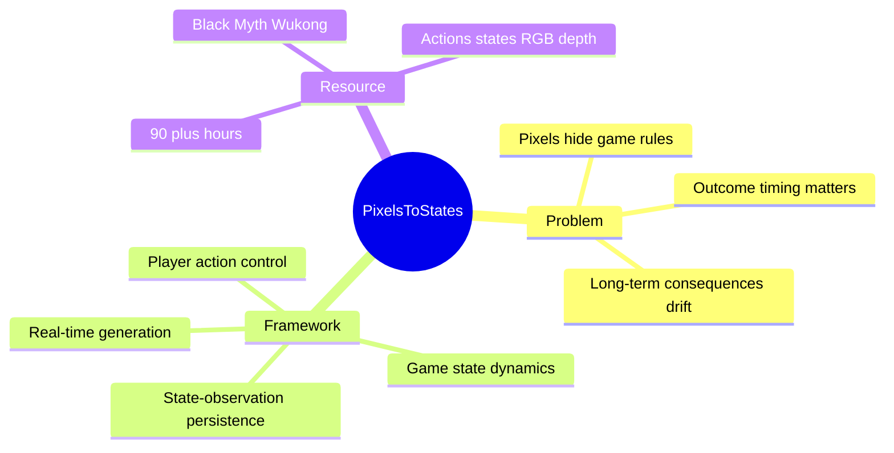

## Summary
这篇 survey 用传统 game engine 的 action–state–observation loop 重构 interactive world model 版图，指出真正缺口不在生成画面本身，而在显式 state、规则驱动 transition、持久后果与正确的 outcome timing。作者还构建 Black Myth: Wukong 数据引擎，收集 90+ 小时 frame-aligned action、engine state、RGB/depth 与结构化语义标注。

## Problem & Motivation
action-conditioned video model 已能生成可探索场景并逐渐达到 interactive frame rate，因此常被称为“next-generation game engine”。但真实 game engine 并不是按输入直接画下一帧：它先根据 health、stamina、cooldown、pose、animation phase 等 state 与规则决定攻击命中、伤害或 phase transition，再渲染 observation。若模型只学 pixel correlation，同一按键在不同 state 下的不同后果、离开视野后的不可逆变化、以及规则规定的结果延迟都难以可靠维持。

## Method
论文不是提出单一生成模型，而是用 action–state–observation loop 沿四个维度分类并评估现有方法：

1. **Player action control**：从 precise camera trajectory，到原生 keyboard/mouse motor signal，再到 language semantic event。几何控制精确但只覆盖导航；motor signal 自然却 underdetermine intent；semantic event 表意强但 grounding granularity 会增加 conditioning cost。
2. **Game state dynamics**：比较 state entangled in pixels、recurrent learned latent、explicit symbolic/text description。pixel 方法易规模化但规则不可验证；latent 紧凑却不透明；explicit state 可读可查，但依赖稀缺 state annotation，且如何闭环驱动生成仍未解决。
3. **State-observation persistence**：区分保存过去 observation 的 memory 与持续估计当前 state 的 dynamic memory。静态 recall 对变化世界可能恢复过期场景，dynamic update 又要求每一步都高效、可靠地判断状态变化。
4. **Real-time interactive generation**：区分 generation latency 与 conditioning latency，并进一步指出 consequence latency 不应一概缩短——攻击动作的命中应在规则定义的时刻出现，而不是输入后立即显现。

配套 data engine 在 game tick 导出 JSON action/state，用 ReShade + OBS 同步 RGB/depth 与系统时间，再生成 slot caption 和 Qwen3-VL-235B-A22B-Instruct semantic caption。

## Key Results
本文以 taxonomy 与 dataset/resource 为主，没有训练新 world model 的 benchmark result。数据引擎在 Black Myth: Wukong boss encounter 上收集 90+ 小时、30 FPS gameplay，frame-aligned ground truth 包含原始 keyboard/mouse、camera/player/boss pose、animation、active skill、health/stamina/attack/defense/equipment，以及 RGB 与 depth。

处理流程按 timestamp 做逐帧对齐，丢弃 frame drop、stutter 或 cross-stream inconsistent sample；数值化 engine record 被转成 fixed-window slot caption，并结合采样 frame 生成描述 action 与 state transition 的 semantic caption。survey 的综合结论是：自然控制、可探索画面与近实时生成已有明显进展，而 accumulated-condition outcome、out-of-view consequence persistence、rule-defined timing 仍普遍缺失，且这些困难都指向被隐式化的 game state。

## Strengths & Weaknesses
**亮点**：action–state–observation loop 比按模型家族罗列论文更接近“交互世界必须满足什么”，尤其把 consequence latency 与普通生成延迟分开，是很有价值的 problem formulation。数据直接从 Unreal Engine tick 导出 ground-truth state，并同时保留 raw control 与语义 caption，为 explicit-state world model 提供了少见监督。

**局限**：survey 缺少统一 quantitative matrix，部分方法的比较仍是定性判断；90+ 小时数据只来自一款 AAA action RPG 的 boss encounter，游戏规则、角色与视觉 domain 高度集中。engine-exported state 在真实世界不可直接获得，因而这套 explicit-state 路径对 embodied environment 的迁移需要 state estimator。semantic caption 由大 VLM 自动生成，也可能把 engine-grounded precision 稀释为语言 hallucination。最关键的“explicit state 如何实际驱动 video generation”仍被留作未来工作，而不是在本文中验证。

## Mind Map

## Notes
对 general interactive world model，更合适的模块化目标可能是：state estimator、rule-aware transition model、renderer 与 timing controller，而不是让单个 video generator 隐式承担全部功能。该框架也可用于审视 robotic world model 是否只是“可控视频”而非可执行环境。
