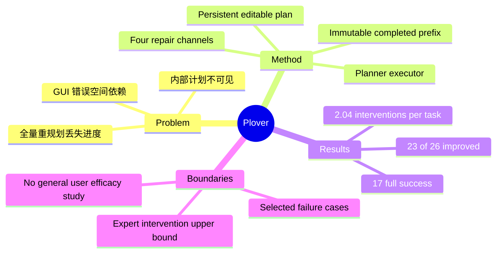

## Summary

Plover 把 GUI agent 的 task plan 外化为持续可见、可编辑和可追溯的协作对象，让用户通过 plan edit、自然语言、屏幕标注或 system-driven replanning 对执行进行局部修复。它使 26 个 autonomous non-success cases 中的 23 个得到改善、其中 17 个完全成功，但该实验由第一作者提供专家干预，只建立 plan-centric recoverability 的上界而非普通用户表现。

## Problem & Motivation

现有 vision-based GUI agents 虽能直接从 screenshot 执行 mouse/keyboard action，却通常把 planning 和 replanning 保存在内部状态中。执行偏离时，用户只能重新发 prompt 或从头运行，难以判断哪些步骤已完成、错误发生在哪里、哪些进度应保留。由于 GUI 错误常与具体空间位置和当前状态绑定，纯文本纠正也可能产生新的歧义。Plover 因而把研究问题从“agent 能否完全自治”改写为“人和 agent 能否围绕共享计划高效恢复”。

## Method

- **Planner–executor architecture**：planner 生成持久化计划，executor 将每个 deterministic UI instruction grounding 到当前 screenshot 后执行；用户始终能查看计划与活动 provenance。
- **Editable plan state**：计划表示为 \(P_t=(C_t,U_t)\)，其中 completed prefix \(C_t\) 是不可改写的执行历史，pending suffix \(U_t\) 可以编辑。修复只更新未执行后缀，从结构上避免整段计划被静默重写或已完成工作被重复执行。
- **Four repair channels**：用户可直接 edit/reorder plan，以 1–2 句 Natural Language Guidance 澄清意图，或在 screenshot 上做 Multimodal Annotation；系统则在检测到停滞和重复动作时触发带理由的 Intelligent Replanning（IR）。
- **Empirical workflow**：六人 formative study 只用于形成交互设计；正式分析包含 OSWorld-Verified failure-case repair，以及五个场景的自主 exploration/replay stability study。后者每个场景运行 100 次探索、筛选 5 条多样轨迹，共回放 25 条轨迹。

## Key Results

- 作者从曾被报告为 Claude Sonnet 4.5 native computer-use 失败的 OSWorld-Verified 任务中选取 38 个，先以 Plover autonomous mode 重跑；其中 26 个 non-success（10 partial、16 failure）进入 mixed-initiative repair。
- 在专家干预下，**23/26** 个任务改善：17 个变为 full success、6 个变为 partial success，仅 3 个仍失败，平均每任务 **2.04** 次干预；原先 10 个 partial success 全部变为 full success。
- recovery improvement rate 在 Browser 和 Writer 为 100%，Calc 为 86%，Multi-App 为 80%。Execution Drift 占 12/26（46%），其中三分之一是 compound failure；累积错误解释了 3 个未恢复案例中的 2 个。
- replay stability 呈现明显环境差异：Firefox workflows 的 SSIM 约为 0.98，而 LibreOffice 为 0.61–0.69。计划的 Actionability 很高（0.97），但 Coverage（0.62）、Order alignment（0.41）和 Redundancy（0.33）显示“局部步骤可执行”并不等于“全局计划与真实轨迹一致”。

## Strengths & Weaknesses

**Strengths.** Plover 将可控性的最小单位从单次 action 或一次性 prompt 提升为 persistent plan artifact，并用不可改写的 completed prefix 保留进度和 provenance；这比失败后整体重规划更适合长时程、多应用任务。论文不仅报告修复成功数，还分析 failure type、intervention channel 与 environment stability，从而指出 execution drift 和 compound error 是当前 mixed-initiative GUI automation 的关键分界。

**Weaknesses.** 主修复实验只覆盖从既有失败集合筛出的 26 个 non-success cases，并由第一作者作为 expert 观察界面后提供定向干预；没有随机对照、普通用户或与其他协作界面的同条件比较。因此 23/26 只能视为作者明确声明的 **recoverability upper bound**，不能外推为典型用户成功率、干预成本或 Plover 相对 autonomous agent 的总体增益。六人 formative study 用于设计形成而非 efficacy evaluation；稳定性实验中的 SSIM 和 plan alignment 也只是 end-state/trajectory proxy，不等价于任务成功。外化计划还可能给短任务带来额外操作负担，并产生 automation bias 或对表面可读计划的过度信任。

## Mind Map

## Notes

- 这篇论文最值得延伸的问题不是再增加一种 intervention modality，而是学习“何时打断、向谁交权、请求哪种最小信息”的 intervention policy；评价应联合 success、human time、cognitive load、unnecessary interruption 和 trust calibration。
- 下一步需要 preregistered user study：将 plan-centric repair 与 prompt-only、restart、autonomous replanning 置于相同 agent/backbone 和任务分布下，区分结构可恢复性、专家可恢复性与真实用户可恢复性。
