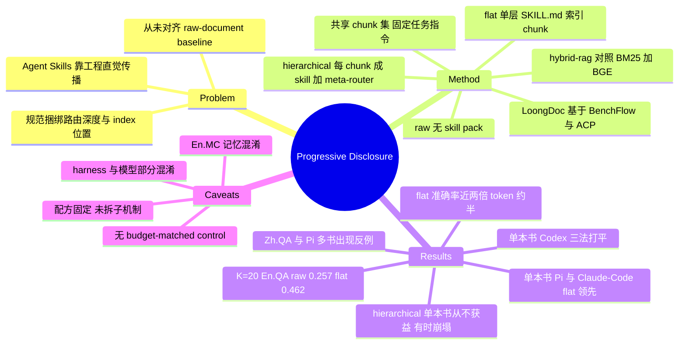

## Summary

首个把 Agent Skills 的 progressive disclosure 当作单一变量做受控测量的研究：在 InfiniteBench 上把书本 QA 改造成文件系统 agent 环境（LoongDoc），固定 chunk 集与任务指令，只改变 agent 触达段落的路由方式（raw / flat / hierarchical），跨 3 个 harness × 3 个模型比较。结论是 progressive disclosure 的收益完全条件于 harness 的原生导航能力——单本书上强 harness（Codex）三种方式在误差内打平，弱 harness（Pi、Claude-Code）则有可观提升；语料扩到 20 本书时 raw 崩塌而 flat 顶住。第二层路由（hierarchical）在单本书上从不带来收益、有时直接毁掉准确率。

## Problem & Motivation

长文档 QA 传统上二选一：整篇塞进 context window，或外挂 retriever。Agentic AI 提供第三条路——把文档路径交给 agent，让它自己决定读什么。Agent Skills 标准把这条路机制化：以 SKILL.md 为根打包目录，只有 description 常驻 context，body 与 bundled files 按需加载，即 progressive disclosure。

问题在于这套 pattern 的采用完全建立在工程直觉上。Claude Code 弃用 retrieval index 改为让 agent 现场搜索代码库，其工程师的依据是使用体验而非受控对比；"把整本书打包成 skill" 的 book-to-skill 配方在博客与 GitHub 上广泛流传，也从未在标准 benchmark 上被测过。已有的 skill 度量工作（SkillsBench、138K SKILL.md 审计）测的是 "有 skill vs 无 skill" 在异构 agentic 任务上的提升，没人把它对齐到 raw-document baseline，也没人拆开 skill pack 内部的设计轴。

作者指出实践文献从不区分的两个设计选择：**disclosure 递归多深**，以及**per-chunk index 物理上放在哪**（常驻 description vs 激活后才付费的 body）。这两个轴被 Agent Skills 规范捆在一起，本文把它们拆开。

## Method

**三种触达同一本书的方式**（共享同一套 chunk 集，只有"接线"不同）：

- **raw**：沙箱文件系统里只放原书，不给 skill pack，agent 的导航策略不受约束（可以整篇读、可以先 grep）。这是没有人为它准备结构时 agent 的退化行为，也是度量 disclosure 增量的参照点。
- **flat**：单个 SKILL.md。description 常驻 context 且描述整本书（discovery）；body 是一张把每个 chunk 按路径 + 描述索引起来的表（activation）；agent 据表读 `references/` 下的 chunk 文件（execution）。per-chunk 描述在 body 里，只有书被激活后才付 context。
- **hierarchical**：每个 chunk 自己成为一个 skill（description 是该 chunk 的描述，body 就是 chunk 内容），顶上加一个 meta-router。meta-router 与**所有** child description 全部常驻 context。读一个 chunk 比 flat 少一跳，代价是常驻上下文税。

**book-to-skill pipeline**（每本书跑一次，产物对两种 disclosure 是固定输入而非变量）：按章节标题切分，无标题时退化为约 4000 词的段落边界定长切分；对每个 chunk 用 LLM 生成 "一到两句摘要 + 命名实体列表" 的两段式描述，再用 chunk 描述汇总出 book-level 描述。所有生成调用 temperature 0 + 固定 seed，每本书留 manifest 记录模型、seed 与 prompt hash。book-level prompt 明确禁止说出或推断书名作者，且只读章节摘要不读原文，防止 agent 认出经典小说走捷径。

**LoongDoc 环境**：基于 BenchFlow，把 InfiniteBench 每道题变成一个 BenchFlow task——只读挂载 `/environment`（book.txt + questions/），agent 把答案写到 `/logs/artifacts/questions/<QID>/answer.txt`，verifier 直接按官方 `compute_scores.py` 打分（MC 正则抽选项字母，开放题用 InfiniteBench normalized match + token-level F1）。中间不插入任何 answer-extraction 模型。任何实现 Agent Client Protocol（ACP）的 harness 都能驱动，且完整记录 trajectory（工具调用、打开的文件、每步 token）。library scale 只是把书写成 `/environment/books/<label>/book.txt` 并加一个 `corpus-index.md`，agent 看到的接口不变。

**对照基线 hybrid-rag**：BM25 稀疏索引 + BGE-M3 稠密索引 → RRF 融合 → BGE cross-encoder 重排 → top-k chunk 进答案 prompt。agent 完全看不到全书。

## Key Results

**单本书（Table 1，mean ± std over 3 seeds）——收益是 harness 的函数，不是方法的函数**

| Harness / Model | Method | En.MC | En.QA | Zh.QA |
|:--|:--|:--|:--|:--|
| Codex / gpt-5.4-mini | raw | 0.8943 | 0.7412 | 0.8652 |
| | flat | 0.8977 | 0.7516 | 0.8390 |
| | hierarchical | 0.8874 | 0.7377 | 0.8525 |
| Pi / gpt-5.4-mini | raw | 0.8851 | 0.7161 | 0.6856 |
| | flat | **0.9126** | 0.7259 | 0.7007 |
| | hierarchical | 0.6398 | 0.5120 | 0.6510 |
| | hybrid-rag | 0.7628 | 0.6214 | 0.7020 |
| Pi / qwen3.6-27b | raw | 0.7865 | 0.6813 | 0.7563 |
| | flat | 0.8023 | 0.6913 | 0.7479 |
| | hierarchical | 0.6460 | 0.5933 | 0.3890 |
| | hybrid-rag | 0.7470 | 0.5439 | 0.5856 |
| Claude-Code / claude-haiku-4.5 | raw | 0.7448 (±0.1166) | 0.6892 | 0.8142 |
| | flat | 0.8667 | 0.7173 | 0.8330 |
| | hierarchical | 0.8687 | 0.7255 | 0.8295 |

- **Codex 上 disclosure 归零**：三种方式在三个子集上全部误差内打平（最大差 En.QA 0.7412→0.7516）。trajectory 显示 bare Codex 在 raw 下不线性读书，而是用问题里的实体名 grep 原文、只读命中段落——它现场重建了 skill pack 预先烤好的 locate-then-read 能力。作者由此判定：对这类 agent，预切的 skill 买到的是 retrieval path 的可控性，不是准确率。
- **弱导航 harness 上 disclosure 有效**：Pi 与 Claude-Code 上 flat 在每个 cell 都持平或超过 raw（唯一例外 qwen3.6-27b 的 Zh.QA，两者在一个标准差内）。Claude-Code En.MC 的 0.7448 → 0.8667 提升越过了 raw 本身很高的方差（±0.1166）。
- **收益不是 retrieval 的马甲**：hybrid-rag 在 qwen3.6-27b 上三个子集全面落后 raw 与 flat（开放 QA 差距最大，0.5439 vs raw 0.6813），gpt-5.4-mini 上 En.MC 也落后 flat。
- **深度不划算，且会伤**：hierarchical 无一 cell 优于 flat。Pi/gpt-5.4-mini 上 En.MC 从 0.9126 崩到 0.6398；Pi/qwen3.6-27b 上 Zh.QA 从 0.7479 崩到 0.3890。作者的机制解释是常驻的 child description 在 router 决定读哪个 chunk 之前就把它的 context 撑满了。

**语料扩展（Table 2，Codex/gpt-5.4-mini 与 Claude-Code/claude-haiku-4.5，mean ± SE across bundles and seeds）——图景翻转**

| Harness | Task | Method | K=5 | K=10 | K=20 |
|:--|:--|:--|:--|:--|:--|
| Codex | En.MC | raw / flat / hier | 0.818 / 0.752 / 0.777 | 0.767 / 0.790 / 0.791 | 0.720 / 0.760 / 0.746 |
| Codex | En.QA | raw / flat / hier | 0.657 / 0.708 / 0.667 | 0.577 / 0.582 / 0.606 | **0.257 / 0.462 / 0.267** |
| Codex | Zh.QA | raw / flat / hier | 0.698 / 0.738 / 0.771 | 0.214 / 0.178 / 0.137 | 0.043 / 0.095 / 0.097 |
| Claude-Code | En.MC | raw / flat / hier | 0.745 / 0.781 / 0.777 | 0.653 / 0.636 / 0.655 | 0.459 / 0.482 / 0.521 |
| Claude-Code | En.QA | raw / flat / hier | 0.582 / 0.642 / 0.589 | 0.413 / 0.480 / 0.453 | 0.301 / 0.354 / 0.302 |
| Claude-Code | Zh.QA | raw / flat / hier | 0.730 / 0.696 / 0.687 | 0.550 / 0.576 / 0.533 | 0.499 / 0.401 / 0.389 |

- **规模压垮 bare agent**：单本书上跟 skill pack 打平的 Codex，En.QA 从 K=5 的 0.657 掉到 K=20 的 0.257（腰斩有余），Zh.QA 塌到 0.043。
- **flat 接管**：K=20 时 flat 在三个子集全面领先；En.QA 的 0.462 vs 0.257 越过一个标准误，En.MC 差距是 borderline，Zh.QA 在此样本量下只是方向性。Claude-Code 上 flat 在三个 K 全部领先 raw（K=10 的 0.480 vs 0.413 越过两个标准误），即换 harness 换模型仍复现。
- **rescue 依赖路由深度，不是 disclosure 本身**：K=20 En.QA 上 hierarchical（0.267）塌回 raw（0.257），flat（0.462）是它们的 1.7 倍以上。机制上一致：hierarchical 常驻所有 chunk 描述，二十本书直接把常驻预算撑爆，重造了 disclosure 本该缓解的 context 压力。
- **cost 同向**：K=20 En.QA 上 raw 花 68.3M tokens/question（uncached 上界约 $52）换最差准确率；flat 用约一半 tokens（32.5M，约 $25）拿到近两倍准确率。Pareto 前沿的顶点从 K=5 的 Codex raw 移到 K≥10 的 Codex flat。

**负结果与反例**（Pi harness 多书，Table 3，n=30 for En.QA/Zh.QA）：Zh.QA 上 flat 在每个 K 都低于 raw，K=20 塌到 0.137（raw 0.287，hierarchical 0.330）；En.QA 上 hierarchical 在 K=10 反超（0.310 vs flat 0.221）。作者据此承认 depth 是 scale- 与 task-specific 效应而非一致成本。此外 Codex En.MC 在 K=5 上 flat（0.752）低于 raw（0.818），即小语料时路由 overhead 是净损失。

## Evidence Ledger

| Claim ID | Claim | Type | Source locator | Evidence excerpt | Status |
|:--|:--|:--|:--|:--|:--|
| C1 | 3 harness（Codex/Pi/Claude-Code）× 3 模型（gpt-5.4-mini/qwen3.6-27b/claude-haiku-4.5），InfiniteBench En.MC/En.QA/Zh.QA，外加 hybrid-rag baseline | benchmark-setting | Appendix B.1 + Table 1 | "Three agent harnesses (Codex, Pi, and Claude-Code) drive three models: gpt-5.4-mini, qwen3.6-27b, and claude-haiku-4.5." | source-verified |
| C2 | Codex/gpt-5.4-mini 单本书三方法误差内打平（En.MC .8943/.8977/.8874；En.QA .7412/.7516/.7377；Zh.QA .8652/.8390/.8525） | number | Table 1, Codex block; §5.1 Px2 | "on gpt-5.4-mini the three approaches tie within error on all three subsets, so the skill pack that wins under Pi adds nothing here" | source-verified |
| C3 | Pi/gpt-5.4-mini 上 flat En.MC 0.9126 > raw 0.8851，hierarchical 崩到 0.6398 | number | Table 1, Pi block; §5.1 Px4 | "collapsing En.MC from 0.9126 under flat to 0.6398 on gpt-5.4-mini" | source-verified |
| C4 | Claude-Code/claude-haiku-4.5 上 flat En.MC 0.8667 > raw 0.7448，raw 标准差 0.1166 | number | Table 1, Claude-Code block | "raw 0.7448±0.1166 ... flat 0.8667±0.0170" | source-verified |
| C5 | Codex 零增益的机制解释来自 trajectory：bare agent 用问题实体 grep 原文、只读命中段落 | causal-mechanism | §5.1 Px2 | "under raw the bare Codex agent does not read the book linearly but builds its own retrieval, grepping the raw text for the entities named in each question" | source-verified |
| C6 | Codex 多书 En.QA K=20：raw 0.257 / flat 0.462 / hierarchical 0.267，flat-raw 差距越过一个标准误 | number | Table 2; §5.2 Px2 | "The En.QA K=20 gap clears one standard error (0.462 vs. 0.257)" | source-verified |
| C7 | Codex 多书 Zh.QA raw 在 K=20 塌到 0.043 | number | Table 2, Codex Zh.QA raw K=20 | "0.043±0.022" | source-verified |
| C8 | Claude-Code 多书 En.QA flat 三个 K 全面领先 raw（.642/.480/.354 vs .582/.413/.301），K=10 越过两个标准误 | comparison | Table 2; §5.2 Px4 | "flat leads raw across all three K, with the K=10 gap clearing two standard errors" | source-verified |
| C9 | K=20 En.QA 成本：raw 68.3M tokens/question（uncached 上界约 $52）vs flat 32.5M（约 $25）；该成本为无 prompt caching 的上界 | number | Appendix C.2 + C.4 | "raw reads the most tokens (68.3M/question, an uncached upper bound of $52) ... flat ... (32.5M, $25)" | source-verified |
| C10 | 任务指令在 raw/flat/hierarchical 间固定，两种 pack 共享同一 chunk 集，只有文件系统 artifact 变化 | benchmark-setting | §3.3 + Appendix A.1 | "Holding the instruction fixed across raw, flat, and hierarchical leaves the file system beside the text as the only variable" | source-verified |
| C11 | 单本书 cell 为 3 seed 的 mean±std；多书 cell 为 bundles×seeds 的 mean±SE，Pi 的 En.QA/Zh.QA 为 n=30 | benchmark-setting | Table 1/2/3 captions | "mean accuracy ± standard error across bundles and seeds (n=30 for En.QA and Zh.QA)" | source-verified |
| C12 | hybrid-rag 在 qwen3.6-27b 上三子集全面落后 raw 与 flat（.7470/.5439/.5856） | comparison | Table 1, Pi qwen3.6-27b; §5.1 Px3 | "On qwen3.6-27b it trails both raw and flat across all three subsets, with the open-QA gap the widest" | source-verified |
| C13 | hybrid-rag 只在 Pi harness 的两个模型块出现，未跑 Codex 与 Claude-Code | benchmark-setting | Table 1 row structure; Appendix B.1 Px1 | "We collect hybrid-rag on both qwen3.6-27b and gpt-5.4-mini across all three subsets as a second-model check." | source-verified |
| C14 | Pi 多书 Zh.QA 上 flat 每个 K 都低于 raw，K=20 塌到 0.137（raw 0.287，hierarchical 0.330） | number | Table 3; Appendix C.1 | "On Zh.QA, flat drags below raw at every K and collapses to 0.137 at K=20, while hierarchical holds the best cell there at 0.330" | source-verified |
| C15 | Codex 多书 En.MC K=5 上 flat 0.752 低于 raw 0.818；skill pack 只在大语料时接管前沿 | number | Table 2; §5.2 Figure 4 讨论 | "shifts from Codex raw at K=5 to Codex flat at K≥10, so the skill pack takes over the frontier only once the corpus is large" | source-verified |
| C16 | chunking 与 description 配方固定为单一 book-to-skill 流程，未做 chunk 粒度 / 描述模型的 ablation（作者列为 limitation） | benchmark-setting | Limitations, "Fixed recipe" | "We hold the chunking and description recipe fixed at one widely adopted book-to-skill procedure, so a different chunk granularity or description-writing model might shift the balance" | source-verified |
| C17 | LoongDoc 基于 BenchFlow，通过 ACP 驱动任意 harness，把 InfiniteBench 变成沙箱文件系统任务 + 确定性 verifier | benchmark-setting | §4 + Appendix A.1 | "Built on BenchFlow ... LoongDoc runs any harness that implements the Agent Client Protocol (ACP) against a sandboxed task and records what it does." | source-verified |
| C18 | qwen3.6-27b 用 vLLM 在 2×RTX 8000 上以 TP=2、131,072 token 窗口本地服务；agent 包锁定 pi-coding-agent 0.66.1 / pi-acp 0.0.25 | benchmark-setting | Appendix B "Compute environment" | "we serve it with vLLM on two NVIDIA RTX 8000 GPUs ... (--tensor-parallel-size 2) and a 131,072-token context window ... pi-coding-agent 0.66.1 and pi-acp 0.0.25" | source-verified |
| C19 | 多书 En.MC 上三种配置在两个 grid 的每个 K 都在一个标准误内（Codex K=20：.720/.760/.746） | number | Appendix C.3 + Table 2 | "On En.MC the three configurations stay within a standard error at every K under both the Codex and Claude-Code grids" | source-verified |
| C20 | Pi/qwen3.6-27b 单本书 flat En.MC 0.8023 > raw 0.7865；hierarchical 把 Zh.QA 从 0.7479 拉到 0.3890 | number | Table 1, Pi qwen3.6-27b; §5.1 Px4 | "falling below flat across all three subsets on qwen3.6-27b, steepest on Zh.QA (0.7479 to 0.3890)" | source-verified |
| C21 | 论文未做 token/compute-matched control：三种方式的 token 与工具调用预算不被拉平，成本是事后按真实用量在 cost-accuracy 平面上报告的 uncached 上界 | benchmark-setting | §3.3 + Appendix C.4（预算固定只出现在 hybrid-rag 内部，A.3） | "The per-question cost ... is an uncached upper bound: it sums real per-call token usage with no prompt caching." | source-verified |
| C22 | En.MC 存在 pre-training 混淆：MC 用书是模型很可能记住的英文经典小说；K=20 时 raw agent 用寥寥几次工具调用就答对 | causal-mechanism | Limitations, "Pre-training confound on En.MC" | "the multiple-choice books are canonical English novels the models have likely memorized ... even at K=20 the raw agent answers En.MC correctly in a handful of tool calls" | source-verified |

> C21 是一条关于"论文中不存在某控制"的否定性 claim，verifier 在通读全文后确认了其正面部分（成本为事后 uncached 上界）；否定部分的强度受限于"全文已读"这一前提。

## Strengths & Weaknesses

**Strengths**

*把捆在一起的设计轴真正拆开了*。这篇的核心价值不在 accuracy 数字，而在 factorization：Agent Skills 规范同时规定了"递归深度"和"per-chunk index 放在常驻 description 还是激活后的 body"，实践文献从不区分，本文用共享 chunk 集 + 固定任务指令 + 同一确定性 verifier 把两者隔离成 flat vs hierarchical 的单一对比。这是 component attribution 应有的做法。

*交互效应被当成主结果，而不是被平均掉*。绝大多数 harness 论文报告的是跨设置的平均提升，本文直接把 "在 Codex 上收益为零、在 Pi 上收益显著" 当成论文的中心发现，并用 trajectory 给出机制解释（bare Codex 自己 grep 实体重建了 locate-then-read）。这把一个 "方法有效性" 问题正确地重述成了 "方法与 harness 能力的交互" 问题。

*负结果保留完整*。hierarchical 在 Pi 上把 En.MC 打到 0.6398、flat 在 Pi 多书 Zh.QA 上一路低于 raw、Codex En.MC K=5 上 flat 反而更差——这些反例都留在正文和附录里，没有被"平均后仍然更好"掩盖。Limitations 一节自曝 En.MC 的记忆混淆，并用两条 trajectory 证据（K=20 时几次工具调用就答对、单本书时 agent 认出被改名的经典作品）自我攻击，态度诚实。

**Weaknesses**

*没有 budget-matched control，这是最大的方法论缺口*。三种方式的 token 与工具调用预算不被拉平（C21）。因此 "flat 更准" 与 "flat 花得更少" 是两条被同时观察到的事实，而非一个受控结论：无法排除给 raw 同等或更多预算（例如强制 grep-first 提示、或允许更多轮次）就能补上大部分差距。作者在 C.4 里承认成本是 uncached 上界，还指出 caching 会更利于 disclosure——这说明成本轴本身是可被实现细节大幅移动的，不适合承载因果论断。

*harness 质量与模型选择部分混淆*。Codex 只跑 gpt-5.4-mini，Claude-Code 只跑 claude-haiku-4.5，只有 Pi 跑了两个模型。所以 "Codex 是 strong navigator" 与 "gpt-5.4-mini 更强" 在单本书主表里无法完全分离——唯一的部分解耦来自 Pi 也跑 gpt-5.4-mini（同模型不同 harness：raw En.MC 0.8943 vs 0.8851 接近，但 hierarchical 0.8874 vs 0.6398 差异巨大），这条对照很有价值但只覆盖一个模型。hybrid-rag 更是只在 Pi 下测（C13），所以 "disclosure 打败经典 retrieval" 这个结论是在弱 harness 上得到的，没有在 Codex 上验证。

*progressive disclosure 只被拆成"路由深度 + index 位置"两个轴，未拆到子机制*。chunking 粒度、描述生成模型、描述内容格式（摘要 vs 实体列表）全部固定（C16）。所以论文说的 "disclosure" 实际上等价于 "按章节切 + LLM 写描述 + 描述门控加载" 这一整包，无法回答 "增益来自 chunk 边界质量还是来自描述的实体列表" 这类问题。考虑到作者自己引用的 Zhang et al. (2026) 138K SKILL.md 审计结论是"路由元数据是承重墙"，这个不拆是遗憾。

*外部效度窄*。语料只在 K∈{1,5,10,20} 四点上采样、只在 InfiniteBench 一个 benchmark family 内、只有叙事性小说；作者自己承认无法说明效应是否迁移到代码或技术手册。En.MC 因记忆混淆基本不可用，真正干净的信号只剩 En.QA（Zh.QA 上结论直接反向，作者归因于 base model 而非 skill pack，但这个归因本身没有被独立检验）。样本量受 InfiniteBench 限制，多处比较停在一个标准误内。

**对领域的意义**：对 harness component attribution 这个问题，这篇提供了一个可复用的实验骨架——固定其余组件、把单一组件的接线方式作为唯一变量、并用 trajectory 解释而非仅报告分数。它给出的经验规律（context management 的收益与 agent 原生导航能力互补，因此在强 harness 上归零、在语料超出原生导航能力时变得决定性）如果在其他组件（externalized state、fresh-context execution、independent verification）上也成立，那么 "harness 组件的收益是条件性的、且条件是 baseline 能力" 就是比任何单个组件的平均提升更重要的结论。

## Mind Map

## Notes

- 对 survey 的直接用途：这是少数把 "context management" 单独隔离出来、并明确报告**交互效应**而非平均效应的工作。它的 factorization 手法（共享底层 artifact，只改接线）可以直接借用到 externalized state / fresh-context execution / independent verification 的归因设计上。
- 最值得追问的一点：作者把 Codex 的零增益解释为 "bare agent 自己重建了 locate-then-read"。如果这个解释成立，那么 progressive disclosure 的真正作用变量不是 "context 有没有被管理"，而是 "agent 能否自己产生一个有效的 retrieval 策略"。这意味着正确的自变量应该是 agent 的检索能力而非 harness 组件的存在与否——但论文没有把这个变量直接操纵（例如在同一 harness 内屏蔽 grep 工具），只能通过跨 harness 观察间接推断。
- 与 vault 中已有笔记的呼应待查：[[2607-HarnessHandbook]]（harness 可编辑性）、[[2607-ContextFailsFirst]]（context 是首个失效点）、[[2510-ContextFolding]]（长时程 context 压缩）都在相邻问题上，值得做一次横向比较，看它们对 "context 管理的收益是否条件于 baseline 能力" 是否给出一致或矛盾的证据。
- 论文未给出代码仓库链接；LoongDoc 建在 BenchFlow 上，若后续开源可作为 repo-digest 候选。
