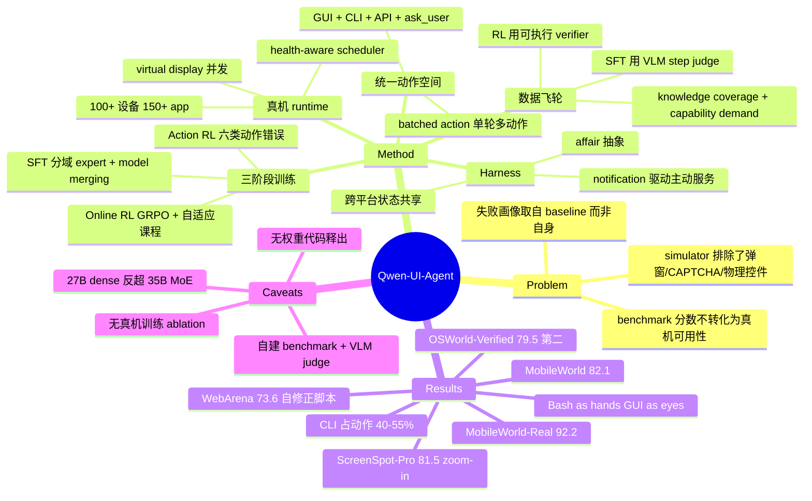

## Summary

Qwen-UI-Agent 是一个覆盖 mobile / computer-use / browser / DeepSearch 的 foundation GUI agent，其主张是 GUI agent 的瓶颈已经从模型转移到环境：论文用 100+ 台真机、150+ app 的 real-device runtime、GUI+CLI 混合动作空间、agent 驱动的数据飞轮和 10,000 并发环境的 online RL 来兑现这一判断。在自建的 MobileWorld-Real 上达到 92.2%、MobileWorld 82.1%、OSWorld-Verified 79.5%、WebArena 73.6%、ScreenSpot-Pro 81.5%（zoom-in）。真正的贡献在基础设施与行为分析，而非算法——论文没有做任何隔离"真机训练"因果贡献的 ablation。

## Problem & Motivation

论文的出发点是一句可检验的判断：GUI agent 在 simulated benchmark 上的提升，没有等比例转化为真实设备上的可用性。作者据此提出六个 transition（simulated → real-device、单域 → 跨平台、GUI-only → GUI+CLI+batched、短程 → 长程、人力驱动 → AutoResearch 式、被动响应 → 主动服务），并把它们全部落成系统组件而非只是叙事。

支撑这一判断的证据是 §4.1 的失败分析：他们逐条 review 了 baseline Qwen 3.7 Plus 在真机上的全部失败轨迹，得到两类归因——execution capability limitations（40.3%：探索失败 19.5%、无效动作循环 14.3%、执行状态丢失 6.5%）与 real-world scenario challenges（52.0%：UI 语义误读 24.7%、弹窗干扰 18.2%、物理控件操控 9.1%）。后者恰恰是 simulator 为了保证可复现性而系统性排除掉的：广告、paywall、CAPTCHA、空白页、需要闭环增量调节的滚轮与滑块。作者的推论是——处理"动作没有产生预期状态转移"这件事本身是一项需要学习的技能，而 simulator 因为交互结果高度可预测，几乎不提供学习它的机会。

值得注意的是：这份失败画像拆的是竞品的轨迹，不是 Qwen-UI-Agent 自己的。

## Method

系统由四部分组成：环境基础设施、数据飞轮、训练框架、harness 层。

**1. 统一动作空间（GUI + CLI + API）。** GUI 动作取 mobile/web/desktop 所需动作的并集（click、double_click、long_press、type、open、drag、system_button、wait），另加 `cli_command`（直接 bash 执行）、`api_call`（结构化外部服务调用）、`ask_user`（缺失信息补全与敏感操作确认）、`terminate`。观测是多通道的 $o_t = (o_t^{GUI}, o_t^{CLI}, o_t^{API})$。关键设计是**一个决策步可以输出一个有序动作序列**（batched action），序列内动作连续执行、CLI 输出聚合成单次观测——当多个操作不需要中间环境反馈时，这直接压掉了 observation-reasoning-execution 循环次数。CLI 侧的工程细节值得注意：非零退出与超时作为 error observation 返回而非中止 episode，让模型能在同一轨迹内诊断和恢复；执行过的命令写入 shell history，使检查终端状态的 verifier 也认 CLI 解法。

**2. 真机 mobile runtime。** 100+ 台物理设备、150+ app。核心系统问题是"给每个任务分配一台可用的机器"：health-aware scheduler 持续追踪设备/应用/账号/网络/显示的健康度，租借资源并在失败时改路；不健康目标进动态黑名单，人工修复+复验后才恢复。用 virtual display 机制让单台手机并发承载多个 app session，据称把集群总 rollout 吞吐提升约 20×。真机的一个特有难题是**区分模型失败与环境失败**，他们用 VLM judge 审查完整轨迹三分类（success / model failure / environment failure），确认的环境故障回流给 scheduler。

**3. Agent 驱动的数据飞轮。** 两阶段：domain capability bootstrapping（用强基座模型分析各域所需知识与能力 → 生成初始任务池与环境上下文 → 多轮 rejection sampling 聚成 SFT 语料）+ iterative refinement loop（评测 → 自动失败诊断 → 弱点驱动的任务合成 → 轨迹收集 → step-level judge + traj-level verifier → 迭代训练）。任务合成沿两个正交维度组织：knowledge coverage（agent 需要知道什么：应用功能、界面惯例、工作流）与 capability demand（agent 需要怎么推理和行动：长程状态追踪、约束遵循、错误恢复）。

一个有实操价值的取舍：**SFT 用 VLM step-level judge，online RL 用可执行 verifier**。理由是构造并验证可执行 verifier 成本高且不随基座变强而变便宜，而 model-based judge 的准确率会随模型发展一起提升。judge 从轨迹中抽三类监督信号——最长连续正确步、每个 reflection/exploration 阶段的**首**步（只留首步以捕获"决定重新考虑"这一决策而不过度保留噪声分支）、从错误状态回到正确路径的 recovery 段。作者称 step-level 过滤的 SFT 效果与用可执行 verifier 筛完整轨迹相当或更好。

**4. 三阶段训练。**
- *SFT*：分域训练 expert（各自主域数据 + 受控比例的跨域混合）后做 model merging 合成单一 checkpoint。为保住通用能力，采用 **in-distribution 数据**——从起始模型自身采样、只保留验证正确的样本混入 GUI 轨迹；作者明确发现"起始模型已能解出的样本"比"它做不出的难样本"更有效，因为后者把训练推向能力获取并引入竞争性优化信号。长轨迹用 sliding-window（窗口 n=5、步进 4、留 1 步重叠，重叠步 loss 被 mask）降低重复 context 处理。
- *Action RL*：针对六类反复出现的动作错误（易混元素 grounding、排序/排名、数量与多目标完整性、过早声明完成、重复动作循环、长尾动作选择失败）定向构造语料，结构化 reward $r_t = F_t(w_{type}C_t + w_{arg}C_tQ_t - \lambda_{sens}S_t - \lambda_{rep}L_t)$ 覆盖格式合法性、动作类型正确性、参数质量、敏感动作与重复惩罚。训练中观察到 token entropy 下降与推理链变短，用 entropy 正则 + 推理长度上下界防坍缩。
- *Online RL*：GRPO 变体，binary outcome reward + group-relative advantage。配 **model-adaptive curriculum**：把任务难度当作当前 policy 的动态属性，中等成功率任务进 active pool 拿满 rollout 预算，暂时不可解的进 monitoring pool 拿小预算，一旦开始产出成功 rollout 就升入 active；已掌握任务也保留小预算监控、性能回落则重新激活。task-verifier 对由 coding agent 自动合成（环境状态注入 → LLM 生成多难度任务 → 独立 LLM judge 过滤可行性 → coding agent 起沙箱建 code-based verifier 并用多模型 rollout 交叉验证），共约 10,000 对。

**5. Harness 层。** 两个能力：(a) *proactive service*——以 mobile notification 为信号源（相比持续屏幕/音视频监控，通知访问轻量且有 per-app 权限治理），核心抽象是 **affair**：event 记录某时刻发生了什么，affair 表示跨事件/应用/天数仍在演进的事项，task 指定下一步该做什么；pipeline 为 event perception → affair state & memory → affair-level reasoning & task formation → 受控执行 → 个性化演化（profile memory 学"用户在乎什么"，feedback memory 学"何时以及如何介入"）。(b) *cross-platform execution*——OpenClaw 式 planner + 设备寻址动作 + 共享执行状态，Qwen-UI-Agent 作为 GUI subagent 被调用；Android 侧用 display manager 把不同 app 的子任务分到独立虚拟屏并发执行，且不阻塞用户自己使用手机。

## Key Results

**Mobile.** MobileWorld GUI-only 子集（117 任务、50 步预算）82.1%，超 Seed 2.1 Pro 8.9pp、GPT-5.6 Sol 12.0pp、Opus 4.8 14.6pp；放宽到 100 步升至 85.5%。真机 MobileWorld-Real 92.2%（Seed 2.1 Pro 88.7%、Gemini 3.1 Pro 86.2%），AndroidDaily 97.5%。专用 GUI 模型差距极大——GUI-Owl-1.5-32B 在 MobileWorld 上仅 43.9%、真机上 32.4%。

**Computer-use.** OSWorld-Verified 79.5%，第二名，落后 Claude Opus 4.8（83.4%）。OSWorld-v2 partial 40.0% / binary 13.9% / 135.8 步，binary 略超 GPT-5.5（13.0%）但 partial 落后 9.5pp，且大幅落后 Opus 4.8（54.8% / 20.6% / 103.0 步）。

**Browser & DeepSearch.** WebArena 73.6%（作者修正官方参考答案与评测脚本后），高于 Opus 4.8 71.9%，距 human 78.2% 尚差 4.6pp。BrowseComp 64.1% / BrowseComp-ZH 75.0%——中文侧第二，英文侧远落后 GPT-5.5（90.1%）。

**Grounding.** ScreenSpot-Pro 76.6%（no-zoom）/ 81.5%（zoom-in），ScreenSpot-V2 97.5%，MMBench-GUI L2 92.6%，OSWorld-G-Refined 78.5%，UI-Vision 70.0%。

**混合执行的实测画像（本文最有信息量的部分）。** OSWorld-Verified / v2 上 CLI 占全部动作的 40.7% / 55.1%，出现在 92.0% / 98.2% 的任务中；batched 动作占 39.6% / 41.6%，平均每批 3.1 个 primitive；批次构成上 GUI-only 占 75.8% / 64.7%，混合 GUI+CLI 批次从 11.0% 升到 20.3%。经验规律是：CLI 承担"搜索空间压缩器"（把散落的视觉候选拼成一张 contact sheet 供一次性判读）、结构化操作执行通道、以及编辑后的 postcondition 校验；GUI 承担界面既是控制面又是反馈源的场景（原生控件、视觉导航、连续空间操控、放大取证）。

**RL 的行为效应。** Action RL 在五个错误模式测试集上一致提升（易混元素 grounding +6.3pp、排序 +3.8pp、多目标完整性 +4.4pp、过早完成 +5.2pp、重复循环 +9.5pp），整体 SR +7% 以上，推理 token 减少 21.3% 而交互步数增加 8.4%——即更少冗余推理、更多落地为环境动作。长尾动作（ask_user、long_press 等，占 19.9%）reward 原本比高频动作低 16.8pp，把训练数据中长尾比例提到约 40% 后 reward 提升 6.4pp。Online RL 则涌现三种行为：从"假定成功"转向"验证后完成"（含验证动作的轨迹比例 +14.7%，false-stop rate -11.2%）；**"Bash as hands, GUI as eyes"** 的跨模态协作（先 Bash 执行状态变更、再只读 GUI 检查效果，这类 execution-verification 转移从 40.2% 升到 52.4%，且训练中并无显式的模态协调目标）；长程约束保持（OSWorld +8.6pp、BrowseComp-ZH +7.5pp）。

**最耐人寻味的 case。** 让 agent 玩浏览器恐龙游戏拿到 100 分且禁用 DevTools/CDP。逐步发指令注定失败（截图与推理期间障碍物还在移动），模型转而用 CLI 写一个只读渲染截图、只发标准键盘事件的本地控制器，并反复迭代：先发现无状态定长点按不够、引入显式动作状态改为按住直到障碍通过；再发现游戏切换昼夜模式导致"障碍=暗像素"假设失效，改用背景相对分割 + 障碍几何区分地面仙人掌与飞鸟。最终存活 60 秒、执行 50 次跳跃、得分 156。

## Evidence Ledger

| Claim ID | Claim | Type | Source locator | Evidence excerpt | Status |
|:--|:--|:--|:--|:--|:--|
| C1 | MobileWorld-Real 92.2%，次优 Seed 2.1 Pro 88.7% | number | p.23 Table 3 / §3.3.1 | "achieves 92.2% on MobileWorld-Real, surpassing all baselines, including the top closed-source models Seed 2.1 Pro at 88.7%" | source-verified |
| C2 | MobileWorld GUI-only（117 任务）50 步 82.1%，100 步 85.5% | number | p.22 Table 2 / §3.3.1 | "under the standard 50-step evaluation budget, Qwen-UI-Agent-27B achieves a success rate of 82.1%" | source-verified |
| C3 | OSWorld-Verified 79.5%，第二，落后 Opus 4.8 的 83.4% | comparison | p.25 Table 4 / §3.3.2 | "79.5% on OSWorld-Verified, ranking second among all compared models and trailing only Claude Opus 4.8" | source-verified |
| C4 | OSWorld-v2 40.0% partial / 13.9% binary / 135.8 步；Opus 4.8 为 54.8 / 20.6 / 103.0 | number | p.25 Table 5 | "Claude Opus 4.8 54.8 20.6 103.0 Batched … Qwen-UI-Agent 40.0 13.9 135.8 Batched" | source-verified |
| C5 | WebArena 73.6%，但作者自行修正了官方参考答案与评测脚本，带 * 的 baseline 为作者自跑 | benchmark-setting | §3.3.3 / p.27 Table 6 caption | "we therefore manually verified the reference answers and corrected the affected scripts"; "Baseline results marked with ∗ are obtained from our own evaluation" | source-verified |
| C6 | BrowseComp 64.1% / BC-ZH 75.0%；BrowseComp 上 GPT-5.5 为 90.1%，显著更高 | comparison | p.27 Table 7 / §3.3.3 | "obtains 64.1% on BrowseComp and 75.0% on BrowseComp-ZH"; Table 7: "GPT-5.5 … 90.1" | source-verified |
| C7 | Grounding：SS-Pro 76.6/81.5、SS-V2 97.5、MMBench-GUI L2 92.6、OSW-G-R 78.5、UI-Vision 70.0 | number | p.29 Table 8 / §3.3.4 | "reaching 76.6% on ScreenSpot-Pro without zoom-in, 97.5% on ScreenSpot-V2, 92.6% on MMBench-GUI L2, 78.5% … 70.0%" | source-verified |
| C8 | CLI 占动作 40.7%/55.1%，batched 占 39.6%/41.6%，平均批大小 3.1 | number | §3.3.2 / p.35 Table 11 | "CLI actions constitute 40.7% and 55.1% of all actions … batched form are 39.6% and 41.6%" | source-verified |
| C9 | 真机 runtime 100+ 设备、150+ app；virtual screen 使总 rollout 吞吐约 20× | number | §2.2.2 / §2.4.3 | "increases aggregate rollout throughput by approximately 20× compared with running the same cluster without virtual screens" | source-verified |
| C10 | MobileWorld-Real 为作者自建（409 任务/104 app/7 域），由 5 个 VLM judge 多数投票的 AutoJudge 评分，env_error 不入分母，与人工标注一致率 92.8%（666 条） | benchmark-setting | §3.2 / §3.1 / Appendix A.1 Table 14 | "Five independent VLM judges … majority vote"; "618 agreements among 666 conclusive cases 92.8%" | source-verified |
| C11 | Online RL 支持 >100 turn 轨迹、约 10,000 并发环境，自动合成约 10,000 组 task-verifier | number | Abstract / §2.4.3 | "pipeline produces approximately 10,000 validated task–verifier pairs for Online RL" | source-verified |
| C12 | Action RL：整体 SR +7% 以上，推理 token −21.3%，平均交互步数 +8.4% | number | §4.3 | "improving the overall task SR by more than 7%, action RL reduces the number of reasoning tokens by 21.3% while increasing … steps by 8.4%" | source-verified |
| C13 | Online RL：含验证动作轨迹 +14.7%，false-stop rate −11.2%，execution-verification 转移 40.2%→52.4% | number | §4.4 | "verification action increases by 14.7%, accompanied by an 11.2% decrease in the false-stop rate" | source-verified |
| C14 | Table 10 的失败模式分布统计的是 baseline Qwen 3.7 Plus 的失败轨迹，不是 Qwen-UI-Agent 自己的 | benchmark-setting | p.33 Table 10 caption / §4.1 | "Failure-pattern distribution over all failed Qwen 3.7 Plus trajectories on real devices" | source-verified |
| C15 | 报告未宣布模型权重或代码仓库释出（全文含参考文献均无 model 的 GitHub/HF 链接） | license-code | 全文检索 / §7 | "We plan to open-source the environment synthesis methodology in future work"（仅承诺环境合成方法，无权重/代码） | source-verified |
| C16 | Conclusion 写 OSWorld-v2 为 40.2%，Abstract 与 Table 5 为 40.0%，文内自相矛盾 | number | §6 vs Abstract / p.25 Table 5 | Conclusion: "79.5% on OSWorld-Verified, and 40.2% on OSWorld-v2" | source-verified |
| C17 | Table 9 全部为作者自测且替换了官方评测组件（Tau2-Bench 与 Claw-Eval 用 GPT-5.5 当 judge，QwenClawBench 用 GPT-5.2 替代 Opus 4.5 judge） | benchmark-setting | p.30 Table 9 evaluation note | "All results in this table are independently reproduced in our evaluation environment"; "replace the default Claude Opus 4.5 judge with GPT-5.2" | source-verified |
| C18 | 27B dense 显著强于 35B-A3B MoE（MobileWorld 82.1 vs 65.0；MobileWorld-Real 92.2 vs 87.4） | comparison | p.22 Table 2 / p.23 Table 3 | Table 2: "Qwen-UI-Agent 27B 82.1 / 35B-A3B 65.0" | source-verified |
| C19 | Introduction 先写 "six key transitions" 后写 "developed around these five transitions" | number | §1, p.3 | "we identify six key transitions"; "developed around these five transitions" | source-verified |
| C20 | 全文没有隔离"真机训练数据"因果贡献的受控 ablation（唯二的 before/after 对比是 Action RL 的 Table 12 与 §4.4 的 online RL） | causal-mechanism | 全文检索 | 仅有 "Performance on five error-pattern-specific test sets before and after action RL training" | source-verified |
| C21 | 35B-A3B 规模的 CUA 与 DeepSearch 训练在发布时仍在进行，相应结果未纳入 | benchmark-setting | §7 Limitations | "CUA and DeepSearch training at the 35B-A3B scale was still in progress when this technical report was released" | source-verified |
| C22 | 作者承认全自动化 GUI 能力开发不可行，pipeline 是 agent-driven 而非 fully autonomous，仍需大量人工监督 | causal-mechanism | §7 Limitations | "current foundation models cannot yet manage the entire process reliably" | source-verified |
| C23 | 声称在 OSWorld-v2 上比 MiniMax M3 与 Qwen 3.7 Plus 分别少用 58.4% 与 21.7% 的步数 | comparison | §1 Introduction | "while requiring 58.4% and 21.7% fewer steps per task" | source-verified |
| C24 | 日期 2026-07-29；Hanzhang Zhou / Panrong Tong / Xu Zhang 为 project co-leader；机构 Alibaba Token Hub, Alibaba Group | number | p.1 / §8 | "arXiv:submit/7884825 [cs.AI] 29 Jul 2026"; "Alibaba Token Hub, Alibaba Group" | source-verified |

> 说明：`source-verified` 仅表示原文确实包含该信息，不表示结果已被独立复现。全部核查由独立 verifier agent 在 primary source 上完成。

## Strengths & Weaknesses

**真正的贡献在基础设施与行为分析，不在算法。** 论文里没有一个新的学习算法——GRPO 是现成的，model merging 是现成的，sliding window 是工程优化。有价值的是三件事：(1) 一个能把 100+ 台真机当作可调度资源池的运行时，附带把"模型失败"和"环境失败"分开的治理闭环；(2) GUI+CLI+batched 的统一动作空间被实测证明会被模型自发大量使用（CLI 占动作 40-55%、出现在 92-98% 的任务里），而不是停留在设计文档上；(3) §4 的行为分析。这三件事里，(2) 和 (3) 是最可迁移的。

**"Bash as hands, GUI as eyes" 是本文最有价值的观察。** 在没有任何显式模态协调目标的情况下，online RL 让 policy 自发形成"用 Bash 高效改变状态、用只读 GUI 检查效果"的分工（该模式占比 40.2%→52.4%）。这条经验值得进一步追问：它是否说明 GUI agent 的可靠性瓶颈不在执行而在**验证**——SFT policy 的典型失败恰恰是"执行完就宣告成功"，而 RL 学到的核心增量是"回头看一眼"。恐龙游戏那个 case 则指向一个更根本的问题：当 agent 能写代码时，"每步截图-推理-动作"这个循环本身是不是正确的抽象。那里模型实际上是用 CLI 把自己的策略编译成了一个不需要每步 model inference 的本地控制器——这已经不是"GUI agent 更强了"，而是 agent 在绕开 GUI agent 这个 paradigm 的固有延迟。

**最大的方法论问题：核心 claim 没有被 ablate。** 论文的中心论点是"真机训练消除 sim-to-real gap"，但全文没有任何"同一模型加/不加真机数据"的受控对比（C20 已核实）。现有证据只是"我们用了真机训练 + 我们在真机上分数高"，这是相关性不是因果。更微妙的是 §4.1：那份细致的失败画像拆的是 **Qwen 3.7 Plus** 的轨迹（C14），不是 Qwen-UI-Agent 自己的。论文因此从未展示自己在真机上的 7.8% 失败长什么样——而对一篇以"真机可靠性"立论的工作，这恰恰是最该给的证据。

**三个主力数字都建在作者可控的评测条件上。** MobileWorld-Real 是自建 benchmark + 自建 AutoJudge 评分 + env_error 排除出分母；WebArena 是作者自行修正了官方参考答案和评测脚本、且 baseline 数字由作者自跑；Table 9 的通用/agentic 结果全部自测且替换了官方 judge 与 user simulator。单独看每一项都有合理理由（真机确实无法用确定性 verifier；WebArena 的标注错误是公认问题），但叠在一起意味着最亮眼的几个领先都不可被第三方直接复算。尤其 MobileWorld-Real 上对 Seed 2.1 Pro 的 **3.5pp 领先小于 AutoJudge 自身 7.2pp 的不一致率**——作者自己在 Limitations 里也承认"其残余误差可能给真机结果带来轻微不确定性"，这个措辞偏轻了。

**Abstract 的定位话术需要打折。** "achieves competitive or superior performance against frontier models, including Opus 4.8, Gemini 3.1 Pro, and GPT-5.6 Sol" 在 mobile 与 grounding 上成立，在 computer-use 和 DeepSearch 上不成立：OSWorld-Verified 79.5 vs Opus 83.4，OSWorld-v2 partial 40.0 vs Opus 54.8 / GPT-5.5 49.5，BrowseComp 64.1 vs GPT-5.5 90.1。"competitive or superior" 里 "competitive" 承担了很重的工作。同理，"少用 58.4% / 21.7% 步数"的效率论断只对 **Single** 动作模式的 baseline 成立——同为 Batched 的 Opus 4.8 只需 103.0 步，比 Qwen-UI-Agent 的 135.8 更少，这个对比论文没做。

**一个未被解释的反常。** 27B dense 在几乎所有指标上大幅超过 35B-A3B MoE，MobileWorld 上差 17.1pp（82.1 vs 65.0）。论文只把 35B-A3B 作为"激活 3B 参数、部署效率更高"的选项带过，没有讨论为什么同一 pipeline 下 MoE 变体退化这么多。考虑到 GUI agent 的实际部署压力主要在端侧，这个 gap 比它得到的篇幅重要得多。

**诚实之处值得记一笔。** Limitations 明确承认：全自动化 GUI 能力开发行不通，pipeline 是 agent-driven 而非 fully autonomous，仍需大量人工监督（C22）；35B-A3B 的 CUA/DeepSearch 训练没跑完（C21）；高保真合成环境已建但未纳入本次训练。这比很多技术报告的"limitation 节写成 future work 广告"要好。

**其他。** 无权重与代码释出（C15），所有结论目前不可复现。文内一致性瑕疵若干：six vs five transitions（C19）、Conclusion 的 40.2% vs Table 5 的 40.0%（C16）、Table 1 的 `ask_user` 在 Limitations 里写成 `call_user`。这些不影响结论但反映赶工痕迹（arXiv 提交时间戳为 2026-07-29）。

## Mind Map

## Notes

- **与 vault 的连接**：MobileWorld 环境见 [[2512-MobileWorld]]（本文 mobile sandbox 的基座，且被重建在 redroid 上以摆脱 KVM 嵌套限制）；OSWorld-v2 见 [[2606-OSWorld2]]；同期 GUI foundation model 对照见 [[2500-UiVenusTechnicalReport]]、[[2509-UITARS2]]、[[2607-EvoCUA15]]、[[2607-HyMobileAgent]]、[[2607-SCALECUA]]；真机闭环训练的另一条线见 [[2606-XiaomiGUI0]]。
- **待验证的开放问题**：如果"真机训练"的收益主要来自"见过弹窗/CAPTCHA/滑块"这类分布覆盖，那么高保真合成环境（作者自己在 Limitations 里提到已建但未用）理论上可以低成本复制大部分收益。本文恰好没有回答这个问题——而它决定了 100+ 台真机的基础设施投入是必需品还是过渡方案。
- **值得追的一条线**：online RL 涌现的"执行-验证"分工，本质上是 policy 自己学会了给自己加 verifier。这与"外挂 verifier / critic"的路线形成对照——如果验证行为可以被 outcome reward 直接诱导出来，那么显式 verifier 模块的价值边界在哪？
- **方法论提醒**：本文是"自建 benchmark + model-based judge + 自修正官方评测脚本"三件套同时出现的典型样本。引用其数字时应当连同评测条件一起引用，不要单独摘取 92.2% / 73.6% 这类数值当作可比 SOTA。
