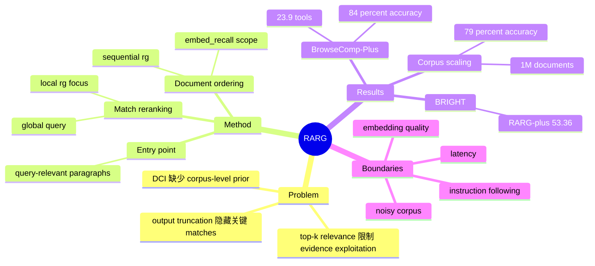

## Summary

RARG 将 relevance 从一次性的 top-k content selector 改写为 Direct Corpus Interaction 的 execution prior：document score 决定 `rg` 扫描顺序，query-relevant paragraphs 提供初始 entry point，match-level score 决定有限 observation budget 内可见的 excerpts。作者报告，在 100-query、100K-document BrowseComp-Plus 上，GPT-5.4-mini 的 RARG++ 达到 84% accuracy / 23.9 tools，对比 RISE 的 78% / 28.7 与 DCI 的 78% / 99.1；扩展至 1M documents 后仍为 79%，而 BRIGHT 上更偏 breadth-first 的 RARG+ 以 53.36 nDCG@10 最优。收益仍依赖 embedding quality 与 backbone instruction following，`-j1` 和 match reranking 带来额外 latency，长噪声文档也会削弱 local matching。

## Problem & Motivation

传统 retrieval agent 用 relevance 排序并截取 top-k documents 或 snippets，但 document-level relevance 只能指出证据可能在哪里，不能保证模型看见决定性 span，更不能自行完成跨文档的 localization、composition 与 verification。

Direct Corpus Interaction（DCI）让 agent 通过 `grep`、局部读取和 shell operations 直接探索原始 corpus，保留了细粒度证据操作能力；问题是普通 `grep` 对 corpus 中的位置一视同仁。相关文档可能被较晚扫描，输出截断还可能让真正有信息量的 match 无法进入 observation，随着 corpus 增大便出现大量无效探索。

论文据此提出一个更窄、也更清晰的问题：不让 relevance 取代 corpus interaction，而是让它直接控制 interaction 的执行顺序和可见结果，从而改善 search convergence。

## Method

### 1. DCI-based agent

RARG 建立在 DCI-Agent-Lite 上，agent 主要使用两个工具：

- `Bash(command)`：主要执行 `rg` 等 corpus search；
- `Read(doc_path, offset, limit)`：读取命中位置附近的局部上下文。

系统采用 Level-3 context compaction，并限制对整个大型 corpus 执行 `ls` / `find`，避免无边界目录遍历。

### 2. Document-level relevance：RARG

Agent 首先调用 `embed_recall(scope_query)`。Embedding retriever 不向 LLM 返回 top-k 文档正文，而是把最多 10,000 个按 relevance 排序的 document paths 写入临时 scope file，仅返回 scope mapping。

后续搜索采用类似：

`cat scope.txt | xargs -d '\n' rg ...`

由于多线程 `rg` 会破坏 path ordering，harness 自动注入 `-j1`，让文档按照 retrieval ranking 顺序扫描。这样，retrieval score 成为 `rg` traversal 的 execution prior，而不是直接证据通道。

### 3. Entry-point initialization：RARG+

只给 scope mapping 时，agent 仍可能缺少第一条可扩展的线索。RARG+ 将 scope 中 top-X documents 切分成 400–1000-character paragraphs，以 scope query 重新评分，并附加 top-10 paragraphs 作为初始 entry point。这些内容帮助 agent 形成第一组精确搜索词，但不会被当作最终答案。

### 4. Match-level relevance：RARG++

Document ranking 可能掩盖低排名文档中的关键局部 span。RARG++ 因此扩大 `rg` candidate pool，再用结合 global scope query 与 local `rg` keywords/patterns 的 constructed query 重排 matches。

实验中最多重排 `M=500` 个 matches，并按任务保留 `m=30/60` 个结果。论文也测试让 LLM 显式生成 `rerank_query` 的 generative variant；它减少了 tool calls，却显著降低 accuracy，作者将其解释为对既有 Bash/`rg` behavior 的 train–evaluation perturbation。

## Key Results

### BrowseComp-Plus：100K documents

- GPT-5.4-mini：RARG++ 为 **84% accuracy / 23.9 tools**；RISE 为 **78% / 28.7**，DCI 为 **78% / 99.1**。
- GPT-5.4-nano：RARG++ 为 **79% / 36.1**；DCI 为 **71% / 126.5**，RISE 为 **68% / 28.7**。这说明 nano 上 accuracy 仍提升，但 RARG++ 并未在 tool count 上优于 RISE。
- GPT-5.4：RARG++ 为 **91% / 25.43**，RISE 为 **82% / 34.30**，accuracy 高 9 points。
- GPT-5.4-mini 的 coarse-to-fine progression 为：RARG → RARG+ → RARG++ accuracy **80 → 81 → 84**，tools **29.8 → 29.6 → 23.9**。
- Generative RARG++ 达到 **75% / 17.8 tools**：收敛更快，但 accuracy 比默认 RARG++ 低 9 points。

### Corpus scaling：1M documents

加入 900K 个长 FineWeb-Edu documents 后，GPT-5.4-mini 的 RARG++ 为 **79% accuracy / 24.7 tools**，RISE-BM25 为 **69% / 32.1**。不过 RARG++ 相比自身 100K setting 的 84% 仍有下降，表明 relevance guidance 不能完全消除长噪声文档造成的 incidental lexical matches。

### BRIGHT

在 biology、earth science、economics、robotics 四个 subsets 上：

- RARG+：**53.36 avg nDCG@10**
- NeMo Agent：**52.89**
- RARG：**51.75**
- RARG++：**50.55**
- DCI：**48.43**

RARG++ 在 QA 中受益于快速、聚焦的 convergence，但 BRIGHT 奖励广泛 recall；match-level reranking 过早收窄 observation，反而不如只增加 entry-point initialization 的 RARG+。论文也明确提醒，不同 agent interface 的 tool counts 不能作为直接可比的成本。

### Behavior analysis 与 case study

GPT-5.4-mini 的 top-10K scope recall 达 **95–97%**，说明 document retriever 能在大 scope 内保留大部分 gold documents；但 1M corpus 上 RG coverage 明显下降，瓶颈转移到 local lexical matching。

单个 BrowseComp-Plus case 中，RARG、RARG+、RARG++ 均答对，tool calls 依次为 **33 / 18 / 10**；初始化把首次出现 answer-bearing CV 的时点从 T7 提前到 T2。作者将该案例限定为 qualitative illustration，而非方法优越性的独立证据。

## Evidence Ledger

| Claim ID | Claim | Type | Source locator | Evidence excerpt | Status |
|:--|:--|:--|:--|:--|:--|
| C1 | `embed_recall` 把 ranked document paths 写入最多包含 10,000 paths 的 scope file，只向 LLM 返回 mapping | benchmark-setting | §3.2 | “10,000 paths” | source-verified |
| C2 | Harness 注入 `-j1`，使 scoped `rg` 按 path order 顺序扫描 | causal-mechanism | §3.2 | “-j1” | source-verified |
| C3 | RARG+ 从 400–1000-character paragraphs 中选 top-10 作为 entry point | causal-mechanism | §3.3 | “top-10” | source-verified |
| C4 | RARG++ 用 global scope query 与 local `rg` focus 构造 rerank query，设置 `M=500`、`m=30/60` | benchmark-setting | §3.4；§4.1 | “M=500; m=30/60” | source-verified |
| C5 | Generative RARG++ 为 75 accuracy / 17.8 tools，默认 RARG++ 为 84 / 23.9 | comparison | Table 1 | “75; 17.8; 84; 23.9” | source-verified |
| C6 | GPT-5.4-mini BC+：RARG++ 84 / 23.9，RISE 78 / 28.7，DCI 78 / 99.1 | comparison | Table 1 | “84; 23.9; 78; 28.7; 78; 99.1” | source-verified |
| C7 | GPT-5.4-nano BC+：RARG++ 79 / 36.1，DCI 71 / 126.5，RISE 68 / 28.7 | comparison | Table 1 | “79; 36.1; 71; 126.5; 68; 28.7” | source-verified |
| C8 | GPT-5.4 BC+：RARG++ 91 / 25.43，RISE 82 / 34.30 | comparison | Table 1；§4.2 | “91; 25.43; 82; 34.30” | source-verified |
| C9 | 1M BC+：RARG++ 79 / 24.7，RISE-BM25 69 / 32.1 | comparison | Table 2 | “79; 24.7; 69; 32.1” | source-verified |
| C10 | BRIGHT 上 RARG+ 53.36，高于 NeMo 52.89、RARG 51.75、RARG++ 50.55、DCI 48.43 | comparison | Table 3 | “53.36; 52.89; 51.75; 50.55; 48.43” | source-verified |
| C11 | BRIGHT 中不同 interface 的 tool counts 不是可直接比较的 costs | benchmark-setting | §4.4 | “not comparable” | source-verified |
| C12 | Mini 上 RARG → RARG+ → RARG++ accuracy 80 → 81 → 84，tools 29.8 → 29.6 → 23.9 | comparison | Table 1；§4.2 | “80→81→84; 29.8→29.6→23.9” | source-verified |
| C13 | GPT-5.4-mini 的 top-10K scope recall 为 95–97% | number | §4.5；Figure 4 | “95–97%” | source-verified |
| C14 | 1M corpus 的 RG coverage 显著下降，作者归因于长文档带来的 incidental matches | causal-mechanism | §4.5；Figure 4 | “incidental matches” | source-verified |
| C15 | 单个 case 中 tools 为 33 / 18 / 10，首次关键 CV 从 T7 提前至 T2；案例仅作 qualitative illustration | benchmark-setting | §4.6；Appendix B | “33; 18; 10; T7; T2; qualitative” | source-verified |
| C16 | 论文公开了 RARG code repository | license-code | Abstract 后 code link | “github.com/LeqsNaN/RARG” | source-verified |
| C17 | arXiv HTML 标示许可证为 CC BY 4.0 | license-code | HTML header | “CC BY 4.0” | source-verified |
| C18 | BC+ 主评测采用 100-query sample，并用 GPT-5.1 LLM-as-judge prompt 计算 accuracy | benchmark-setting | §4.1；Table 1 caption | “100-query; GPT-5.1” | source-verified |
| C19 | RARG 用 Python 实现，并在 Linux 单张 H20 GPU 上测试 | benchmark-setting | §4.1 | “Python; Linux; H20” | source-verified |
| C20 | 不同 relevance granularity 对 embedding model 要求不同；NV 的 short-match ranking 较弱 | causal-mechanism | Limitations | “short matches” | source-verified |
| C21 | `-j1` 与 match reranking 增加 search latency | causal-mechanism | Limitations | “latency” | source-verified |
| C22 | 方法对 backbone 的 instruction following 敏感 | causal-mechanism | Limitations | “instruction-following” | source-verified |
| C23 | Long noisy documents 的 corpus interference 只能被 match reranking 部分缓解 | causal-mechanism | Limitations | “partially” | source-verified |
| C24 | 当前评测未覆盖 open-web、其他 backbone families 与更多 domains | benchmark-setting | Limitations | “open-web” | source-verified |

## Strengths & Weaknesses

### Strengths

1. **Problem formulation 清楚且方法简洁。** 论文没有把更强 retriever 当作最终答案，而是区分“选择 corpus”与“指导 interaction”，把 relevance 放进执行顺序与 observation selection。这是一个可迁移的 interface-level insight。
2. **Coarse-to-fine decomposition 可诊断。** Document ordering、entry-point initialization、match reranking 分别对应“先搜哪里”“从哪里开始”“哪些局部结果可见”，三层贡献能通过 variant 与 behavior analysis 分开观察。
3. **同时报告 accuracy 与 interaction cost。** BC+ 上不仅提高 accuracy，也显著减少相对 DCI 的 tool calls；1M corpus 实验进一步暴露方法在 distractor 增长下的边界。
4. **保留负性结果。** Generative rerank query 更快但更不准，RARG++ 在 BRIGHT 也不如 RARG+。这些结果说明最细粒度 relevance 并非普遍最优，任务的 depth-first / breadth-first 结构会改变最佳设计。
5. **Mechanism evidence 比单张 leaderboard 更充分。** Scope recall、RG coverage、rank-distribution 与 trajectory case study共同解释 relevance guidance 如何改变 evidence discovery。

### Weaknesses

1. **评测范围仍窄。** BC+ 主表只有 100-query sample，且 accuracy 来自 GPT-5.1 LLM-as-judge；这使结论对 sampling 与 judging choices 的敏感性仍需更大样本和 human audit 检查。
2. **Tool count 不是完整系统成本。** `-j1` 放弃并行扫描，match reranking 又增加 embedding inference；论文承认 latency trade-off，因此 accuracy–tools Pareto 不能直接等同于 accuracy–wall-clock 或 accuracy–dollar Pareto。
3. **最佳 relevance granularity 依赖任务。** RARG++ 适合快速收敛的 QA，却在强调 broad recall 的 BRIGHT 上落后 RARG+。系统尚不能自动判断何时应从聚焦切换为扩展候选。
4. **组件与 backbone coupling 明显。** BRIGHT 需用 NV 做 document ranking、Q3E 做 short-match reranking；GPT-5.4-nano 对 multi-stage protocol 的遵循也较差，说明收益依赖 embedding 与 agent harness 的匹配。
5. **尚无 open-web 验证。** 当前 corpus 固定、文件化且可直接执行 `rg`；真实网络中的 freshness、动态页面、权限、重复内容和 source trust 会改变 relevance signal 与 interaction cost。

总体评价：这是一个“重要问题 + 简洁方法”的强工作。它没有把提升归因于更复杂的 agent planning，而是重新定义 relevance 在 search loop 中的控制位置；但其 generality 仍需在 open-web、不同 agent backbone 和 wall-clock matched evaluation 中验证。

## Mind Map

## Notes

- **Taxonomy**：本文研究 fixed-corpus information seeking、evidence localization 与 agentic retrieval，没有 GUI observation、browser action 或外部网页 state transition，因此应标记为 `deep-research`，不应标记为 `web-agent`、`gui-agent` 或 `computer-use`。
- **与 RISE / DCI 的位置关系**：RISE 先构造 bounded interaction space，DCI 直接对原 corpus 交互；RARG 的关键折中是保留 DCI 的细粒度操作，同时让 retrieval ranking 进入 traversal 与 match visibility。
- **对 survey 的增量**：它为 Deep Research survey 补上一条独立于 delegation 和 context management 的主线——`relevance as execution control`。这条线把瓶颈从“召回哪些 documents”推进到“agent 以何种顺序消费 corpus、哪些局部证据能进入 observation”。
- **研究问题**：能否根据 query decomposition、scope uncertainty、match diversity 与剩余 budget，动态选择 RARG、RARG+ 或 RARG++，而不是在任务级预设固定 granularity？
- **验证边界**：本笔记的 `source-checked` 仅表示 24 条高风险 claims 已由独立 verifier 在 primary source 中定位，不表示实验被独立复现。
