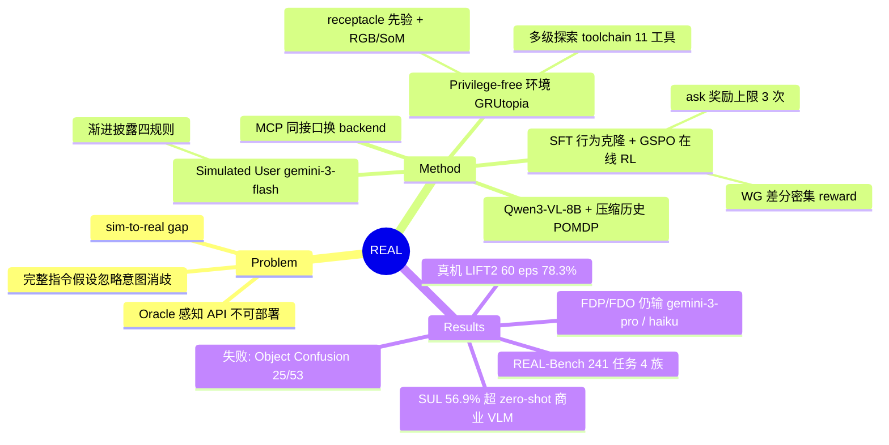

## Summary
REAL 提出一个"去 oracle 感知 + 模拟用户交互"的 sim-to-real 一致具身 agent 框架：高层策略（Qwen3-VL-8B）只通过可真机实现的 toolchain（导航/扫描/开放词表检测/pick-place/ask）与环境交互，经 SFT + GSPO 在线 RL 训练后，在自建 REAL-Bench 交互任务上达 56.9%（超所有 zero-shot 商业 VLM），并借助 MCP 统一工具接口 zero-shot 迁移到 Ark LIFT2 双臂移动机器人，60 个真机 episode 端到端成功率 78.3%。

## Problem & Motivation
现有具身 agent 环境/benchmark 与真实部署脱节，体现在两个维度：

1. **特权感知依赖**：多数环境给 agent 提供全局 object list、oracle find/teleport 工具（如 VisualAgentBench、EmbodiedBench、VoTa-Bench），这些接口在物理机器人上不可实现，训练出的策略部署即失效。少数 non-privileged 工作（PARTNR、EMMOE）虽限制为 RGB 输入，但探索和规划主要停留在文本层面，遇到视觉相似 distractor 时无法精确消歧。
2. **完整指令假设**：benchmark 普遍假设用户给出无歧义指令、开环执行；而真实用户信息不完整，初始目标模糊，需要 agent 结合探索所见主动澄清意图。已有 simulated user 工作（ADAPT、FARMER 等）局限于文本偏好问答，没有和物理 mobile manipulation 联合优化。

REAL 的定位：训练一个"可部署的视觉-交互高层策略"，通过 RGB 探索 + 用户对话获取缺失任务状态，再调度物理技能。作者明确声明不解决 TAMP 和低层运动控制的不确定性。

## Method

### 环境设计（基于 GRUtopia / Isaac Sim）
- **Privilege-free 建模**：任务初始化时 agent 只拿到 receptacle（家具）的 ID+语义类别列表——作者论证这个先验可由机器人预先扫描的 3D occupancy map + 语义分割获得，物理上"可得"；除此之外无 object list、无 3D pose、无 simulator state。
- **多级探索 toolchain**（策略侧共 11 个工具，全部有真机对应实现）：`nav_to`（跨 receptacle 导航）→ `walk_around`（绕 receptacle 多视角扫描，规避遮挡）→ `show_object_by_category`（开放词表检测，返回 Set-of-Mark 标注图）→ `gaze_at`（接近并居中目标）；操作原语 `pick/place/open/close` 以视觉 ID 为参数；`ask` 向用户提问。检测到的物体经 2D mask 反投影到 3D 构建临时 exploration map，作为空间记忆。
- **Simulated User**：由 gemini-3-flash 驱动，注入 task-specific profile（目标状态 + 模糊初始指令），遵循四条行为规则——goal-driven、information barrier（不直接泄露目标位置）、dynamic clarification（只有 agent 报告看到某物体后才可指名它）、no raw IDs。环境每步生成 auxiliary textual observation（agent 当前视野内物体的语义 caption 列表）同步给 user，构成"渐进披露"闭环。
- **MCP 统一接口**：所有工具调用经 MCP server 路由。仿真中由确定性 handler 修改 Isaac Sim 状态（pick/place 实为 teleport 式状态改写）；真机上 backend 换成 ConceptGraph + RealSense D455/Odin1 SLAM 导航栈（A* + DWA + PID）、Grounded-SAM-2 感知、fine-tuned π0.5 VLA 执行操作原语。工具名/签名/返回格式完全不变，高层策略无需重训。

### Agent 训练（Qwen3-VL-8B-Instruct）
- **POMDP + 压缩历史**：为避免 context 爆炸和 temporal hallucination，观测拆为环境分量（当前 RGB/SoM + 执行反馈）和历史分量——VLM 每步自摘要生成 σ_t，由确定性脚本维护单调增长的 Σ_t（只记录工具返回确认成功的动作），prompt 长度 O(1)（滑窗 K=3 轮 + 1200 字符截断）。
- **数据引擎**：7 个 GRScenes 场景（6 训练 + 1 held-out 评测）、3204 个 MesaTask 资产/810 类别；LLM 生成 (source, destination, object) 三元组任务，经静态几何 + 物理仿真两级过滤保证可复现；rule-based planner 执行 oracle 轨迹；gemini-3-pro 做 social annotation（注入 ask 对话、改写模糊指令）和逐步 reasoning/历史状态标注（oracle 元数据仅离线标注可见，不进策略观测）。
- **两阶段训练**：(1) SFT behavior cloning 对齐工具接口（冻结 vision encoder）；(2) 在线 RL 用 GSPO（弃 GRPO，因 step-wise importance ratio 在长轨迹下方差爆炸）。Reward 基于 World Graph 状态差分密集塑形：匹配目标改变 +1.5、完成 +2.0、放错 receptacle −2.0、有效 pick +0.3、持物 +0.5、错拾后恢复 +1.0、**有效 ask +1.0（上限 3 次防依赖）**、每步 −0.03 时间惩罚。

### REAL-Bench
241 个任务，全部位于 held-out 场景 S7，四族：FDP（家具 distractor pick-place，72）、FODP（家具+物体双层开放词表 distractor，56）、FDO（articulated 开/关，48）、SUL（Simulator-User-Loop 模糊指令交互，65）。

## Key Results

**仿真（Table 1，成功率 %）**：

| Model | FDP | FODP | FDO | SUL |
|:--|--:|--:|--:|--:|
| gemini-3-pro-preview (zero-shot, 也是 SFT teacher) | **81.9** | 39.3 | 50.0 | 53.8 |
| gpt-5 | 68.1 | 30.4 | 47.9 | 52.3 |
| claude-haiku-4-5 | 45.8 | 16.1 | **52.1** | 47.7 |
| Qwen3-VL-8B-Instruct (zero-shot) | 0.0 | 0.0 | 0.0 | 1.5 |
| Ours 8B SFT-only (2 epoch) | 65.3 | 28.6 | 43.8 | 50.8 |
| Ours 8B SFT+RL | 58.3 | **33.9** | 41.7 | **56.9** |

- **接口对齐是前提**：zero-shot Qwen3-VL-8B 几乎全零，1 epoch SFT 即达 FDP 45.8%。
- **BC 过拟合与 RL 修复**：SFT 第 2 epoch 使 FDP 升到 65.3% 但 FODP 从 30.4%→28.6%（过拟合专家轨迹、丧失开放词表鲁棒性）；从 1-epoch checkpoint 起步的 GSPO 把 FODP 拉回 33.9%、SUL 提升到 56.9%（唯一超过全部 zero-shot 商业模型的 split）。
- **FDO 是视觉瓶颈**：articulation 任务 41.7%，低于 claude-haiku-4-5 zero-shot 的 52.1%；作者归因于冻结 vision encoder 导致视觉 grounding 受基座上限约束。
- **失败归因**（100 episodes 人工标注，53 失败）：Object Confusion 25、Key Action Missing 17、Lost Memory 9、Other 2。

**真机（Ark LIFT2 双臂移动机器人，60 episodes）**：FDO 80.0%、FODP 100.0%、SUL 55.0%，总体 **78.3%** 端到端成功率、零不可恢复崩溃；600 次 VLA 原语执行 85.3% 可执行；平均每 episode ask 0.72 次、VLM 推理总延迟 68.4s。真机展示了因果规划案例（先开微波炉门再去取面包）。

**作者自述局限**：任务空间仅限 cross-receptacle rearrangement（无时序子任务、无空间关系目标如"放在盘子左边"）；simulated user 行为包络有界（不会中途改目标、不表达隐式意图）；receptacle 是整体建模，无 part-level（如具体某层隔板）。

## Strengths & Weaknesses

**Strengths**
- **问题选得准**：把 "oracle 感知 API 不可部署" 和 "指令完整性假设" 两个被主流 benchmark 系统性回避的 deployment gap 作为一等公民，方向正确且论证清楚（每个工具都给出 sim 与 real 两套实现对照，Appendix C 诚意十足）。
- **MCP 同接口换 backend 的 sim-to-real 设计**是全文最干净的贡献：高层策略对 backend 无感知，零改动迁移，60 episodes 78.3% + 零崩溃是有说服力的部署证据。
- 训练分析有信息量：SFT 第 2 epoch 在 FODP 上的倒退（30.4→28.6）+ RL 修复，是对 "BC 过拟合 vs RL 泛化" 的一次干净观察；failure taxonomy 手工标注 100 episodes，诚实指出剩余瓶颈。
- 冻结 vision encoder 导致 FDO 瓶颈的自我诊断坦率。

**Weaknesses**
- **Headline claim 范围收窄**：“outperforms leading commercial closed-source VLMs” 严格只在 SUL split 成立（56.9 vs 53.8）；FDP 上被 teacher gemini-3-pro 甩开 23.6 点（58.3 vs 81.9），FDO 上输给 claude-haiku-4-5 zero-shot。8B 本地模型有部署价值，但表述有选择性。
- **Gemini 全家桶闭环风险**：SFT 标注用 gemini-3-pro，simulated user 训练与 SUL 评测都用 gemini-3-flash——agent 的 SUL 优势可能部分来自对这个特定 user 对话模式的适配，而非通用交互能力；真机 SUL（真人 GUI）掉到 55.0% 与此一致。
- **泛化证据薄**：241 个评测任务全部来自单一 held-out 场景 S7；"zero-shot transfer to unseen household scenarios" 实际是 1 个仿真场景 + 1 个真实房间。
- **真机与仿真难度不对齐**：真机 FODP 100%（≈20/20）vs 仿真 FODP 33.9%，说明真机任务实例远比 benchmark 简单，78.3% 的 headline 数字建立在更容易的分布上；真机无 FDP split。
- **"社交行为涌现" 有水分**：reward 显式给有效 ask +1.0，"learns when to pause and query" 更像 reward engineering 的直接结果而非涌现。
- 仿真中 pick/place 是 teleport 式状态改写，高层策略实际学的是工具编排而非 manipulation 本身；这是合理的分层选择，但意味着框架的 manipulation 上限完全取决于外挂的 π0.5。

**影响**：为 "VLM 高层 agent + VLA 低层执行 + 统一工具接口" 的部署范式提供了一个完整、可复现（开源）的参照系；REAL-Bench 的 privilege-free 设定值得后续 embodied benchmark 跟进，但需要多场景扩展才能成为可信的评测标准。

## Mind Map

## Notes
- 低层操作用 fine-tuned [[2504-Pi05]] 执行，属于 "VLM planner + VLA executor" 分层范式的又一实例；对比 [[2406-OpenVLA]] 一类端到端路线，REAL 把不确定性全部推给高层的探索与对话。
- GSPO 替代 GRPO 的理由（长轨迹 step-wise ratio 方差爆炸）与 agentic-RL 方向上多轮工具调用训练的普遍痛点一致，可与库内 agentic-RL 笔记交叉验证。
- 值得跟踪：REAL-Bench 是否会扩展到多场景；simulated user 换成非 Gemini 模型后 SUL 数字是否稳住（检验 user-overfitting 假设）。
