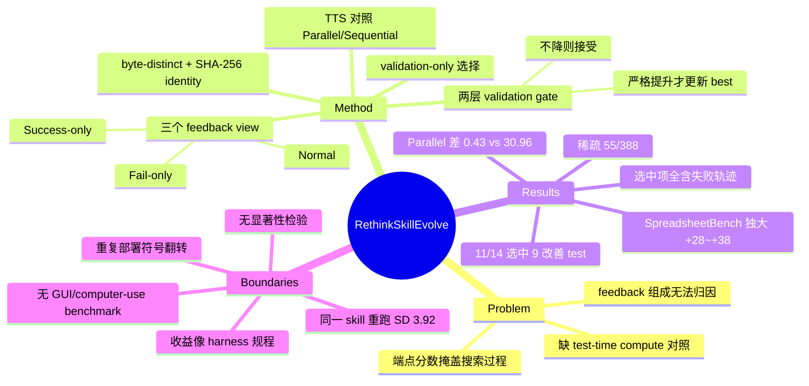

## Summary

在 executor/optimizer 配置、revision 流程、validation 规则与 10 轮预算全部固定、只变 optimizer 可见轨迹（Normal / Fail-only / Success-only）的受控设定下，对 3 个模型 × 5 个 benchmark 的 42 次演化运行做 artifact 级审计，结论是 persistent skill self-evolution 更像**稀疏的、被 validation 过滤的搜索**而非逐轮稳步改进——388 个 candidate 只有 55 个建立 byte-distinct validation best，14 个 setting 中 11 个选中 evolved skill、其中 9 个在 released test 上有提升。配套的 test-time-scaling 对照给出第二条结论：oracle Parallel Sampling 在 SearchQA 上只差 evolved skill 0.43 点，在 SpreadsheetBench 上却落后 30.96 点，即"多花推理算力"能替代答案形式类收益、替代不了多步流程类收益。

## Problem & Motivation

self-evolving skill 系统的卖点是把执行反馈变成持久的 skill 更新，从而在不改模型权重的前提下改进 agent，且这种更新跨任务实例复用（区别于单实例的额外推理）。作者指出已有工作各自绑定自己的 revision 与 selection 流程做 before-after 对比，留下三个未决问题：

1. **端点分数掩盖了搜索过程**。被接受的修订、被拒的 candidate、rollback、停止决策全部不可见，因此看不出"第几轮之后继续演化还值不值得"。
2. **feedback 组成的作用无法归因**。success-gated（如 SkillsVote）、diagnosis-oriented（如 SkillRevise/SkillForge）、mixed-trajectory（如 SkillOpt/Trace2Skill）三类系统各测各的原生策略，没人在同一套更新与验证流程下横切"只看成功 / 只看失败 / 都看"。
3. **没有和 test-time compute 对照**。同样的收益能否直接用 per-instance 的额外推理买到，此前无人验证。

叠加 run-to-run 波动与 verifier 选择的影响，"分数变了"并不等于"skill 真的变了"。论文把这三点转成一个 matched-control 的测量问题。

## Method

**演化循环与两层 validation gate**。第 $r$ 轮用当前 skill $s_r^{(c)}$ 执行该轮任务，benchmark verifier 标注成功/失败，按 feedback condition $c$ 构造证据视图，同一模型充当 revision operator $O$ 提出 candidate $\hat{s}_{r+1}^{(c)}$，再在完整 validation split 上打分。Gate 分两层：candidate 的 validation **不下降**即成为下一轮 skill（持平也接受）；只有**严格提升**才更新 best checkpoint。跨轮只有 incumbent skill 传递，历史轨迹与被拒 candidate 都不携带。

**artifact identity 纪律（本文与既有工作最实质的差别）**。skill artifact 用 SHA-256 标识；一次 "new best" 必须**同时**满足严格 validation 提升**和**与 incoming skill 字节不同。byte-identical 重跑带来的分数波动被判为执行噪声，不更新 best round。这条规则把"分数动了"和"skill 真的动了"分开——正是它让 388→55 这个稀疏性数字有意义。

**三个 feedback view**。Normal（成功+失败轨迹）、Fail-only（仅失败）、Success-only（仅成功）。同一 setting 内 parent skill、optimizer prompt、样本 schema、task panel、edit cap、validation 规则全部相同，optimizer prompt 只在"可见目录声明"上不同；所有符合条件的记录不做平衡或重采样直接暴露。每条记录含任务输入、executor 最终输出、成功标签与分数，可得时附执行轨迹，失败记录保留 verifier 诊断（含 expected–observed 不匹配）。

**预算与停止**。每轮执行 40 条训练轨迹（LiveMath 用其 36 条全量训练集）；非空 feedback view 触发一次 optimizer 调用，至多 4 条 minimal、task-general 编辑；随后全量 validation。停止条件：满 10 轮、连续 5 轮 regression/no-op、或 feedback pool 为空。

**选择与评测分离**。每个 model–benchmark setting 只按 validation（hard score 优先，并列时用配置的 auxiliary soft score）在三个 view 的 best skill 与 parent 之间选一个，test 与诊断结果完全不参与选择。选定后 freeze，再跑 released test、同任务 robustness（R1 改表层/输入表示、R2 加无关上下文与干扰、R3 改输出或接口契约）与 official-task transfer（T1 同源新任务、T2 同子类新源、T3 带子类/难度/分布偏移的新源），每个 probe 取 3 次部署均值，R/T 为各可用 tier 的等权宏平均。

**TTS 对照（仅 GPT-5.5，5 个 benchmark）**。两个控制组都从冻结 parent skill 出发，共享 executor、工具接口、test pool、verifier 与调用预算：Parallel Sampling 在 $K$ 次尝试上报 oracle any-success，Sequential Refinement 只以任务与前一次回答为条件、报最后一次回答。论文明确写明 Parallel oracle 假设完美的事后挑选，是**上界**而非可部署的 pass@1 估计。

**benchmark 面板**：SearchQA（检索网页片段上的短答 QA，SkillOpt-Lite 固定子集 400/200/1400）、OfficeQA（带 search/read 工具的美国财政部公报接地 QA，246 题全量 49/49/148）、SpreadsheetBench（Verified-400，80/39/281，按 workbook test case 全通过判对）、LiveMath（近期数学论文上的多选推理，36/35/106）、DocVQA（文档页图像 QA，107/53/374，ANLS≥0.999 判对）。ALFWorld 仅在附录作为补充分析。

## Key Results

**1. 演化是稀疏的，且"改过"远多于"改好"。** 42 次主实验共 388 个 candidate，只有 55 个建立 byte-distinct validation best。跨模型 SearchQA 分析把这个落差暴露得更彻底：8 个模型共 210 个 candidate，**191 个改变了 incoming skill，但只有 29 个**建立 byte-distinct validation best。DocVQA 在 23 个 candidate 上从未超过 96.2 的 parent。

**2. 所有被选中的 evolved skill 都来自含失败轨迹的 view。** 14 个 setting 中 11 个选中 evolved skill（Normal 9、Fail-only 2、Success-only 0），3 个保留 parent（Gemini–OfficeQA、DeepSeek–OfficeQA、GPT-5.5–DocVQA）。但按"产出过 byte-distinct validation 改进"计数，排序反转：Fail-only 11/14、Normal 10/14、Success-only 6/14；Normal 与 Fail-only 的相对优劣作者自己说 varies across settings。Success-only 唯一的成功案例在附录的 8 模型 SearchQA 里（Opus r=7、Qwen3.5-Plus r=3），机制解释是成功轨迹只有在反复支持同一条 task-wide specification 时才有用；反例是 DeepSeek–LiveMath 从 8 条成功轨迹外推出"strongest/equivalence"启发式并改掉输出契约，validation 从 40.0 崩到 11.4。

| Feedback view | Runs | Candidates | New bests | Yield | Runs improved | Selected |
|:--|--:|--:|--:|--:|:--|--:|
| Normal | 14 | 132 | 23 | 17.4% | 10/14 | 9 |
| Fail-only | 14 | 135 | 21 | 15.6% | 11/14 | 2 |
| Success-only | 14 | 121 | 11 | 9.1% | 6/14 | 0 |

**3. 收益高度集中在一类任务。** 9 个 test 提升的 setting 增益区间 +0.5 ~ +37.7 点，其中 SpreadsheetBench 三模型分别 +35.6 / +37.7 / +28.8，是唯一"test + robustness + transfer 三项对三个模型全正"的 benchmark。SearchQA 三模型只有 +2.3 / −0.4 / +0.9。11 个选中项中 9 个改善 robustness、9 个改善 transfer，但同时改善两者的只有 7 个。

**4. 演化会净负，而且 validation 挡不住。** GPT-5.5–LiveMath 选中 Fail-only r=3：validation +5.7、robustness +8.3，但 released test −6.6、transfer −16.7。Gemini–SearchQA 选中 Normal r=1，test −0.4。validation-selected 与 test-best 的 selection gap 最大 7.5 点（DeepSeek–LiveMath）。以 14 个 setting 为分母，"演化→部署后 test 更好"是 9/14；要求同时改善 robustness 与 transfer 则是 7/14。

**5. 轮次收益前重后轻，但晚轮不能砍。** 55 个 byte-distinct best 中 38 个落在 round 1–4；round 4 之后的 221 个 candidate 只产出剩余 17 个。可 11 个最终被选中的 skill 里有 6 个首次出现在 round 6–9——四轮预算能抓住大多数 new-best 事件，却会错过大多数最终选择。轨迹形态也不是单调爬升：GPT-5.5–SearchQA Normal 在 r=1 达到 81.0，随后 7 个 candidate 都没超过它，r=9 才靠一条"返回属性值而非类别名词"的单句修正到 82.0。

**6. 能不能用推理算力替代？分任务。**

| GPT-5.5（最大预算） | Parent | Evolved（one-call） | Parallel（oracle） | Sequential | Evolved − Parallel |
|:--|--:|--:|--:|--:|--:|
| SearchQA（dynamic panel, n=1400） | 75.64 | 77.93 | 77.50 | 75.79 | **0.43** |
| SpreadsheetBench（n=281, K=4） | 50.53 | 85.77 | 54.80 | 45.20 | **30.96** |

OfficeQA 是第二个"采样可替代"案例（最大预算 Parallel 与 evolved 同为 69.59）。LiveMath 上 Parallel 到 68.87、evolved 只有 42.45、parent 49.06——采样收益与 validation-to-test 反转叠在一起。Sequential Refinement 在 SearchQA/OfficeQA 贴着 parent、在 SpreadsheetBench 反而下滑，说明"以上一次回答为条件"本身不构成纠错反馈。

**关键：算力并不对等，且 Parallel 一侧被大幅让利。** evolved 是 one-call；SearchQA 控制组 $K_{\max}=6$、$C_{\mathrm{all}}=6{,}324$ 次计分尝试（n=1400），SpreadsheetBench $K_{\max}=4$、$C_{\mathrm{all}}=1{,}124$（n=281），且 Parallel 用的是 oracle any-success（论文自述为上界，无法部署）。在这样倾斜的对比下 Parallel 仍然只在 SearchQA 打平、在 SpreadsheetBench 差 30.96 点。另一侧的账：被选中的 SearchQA Normal 演化运行本身消耗 $B_{\mathrm{evo}}=2{,}750$ 次目标模型调用，摊销成本 $1 + 2750/n$ 次/部署。

**7. 作者自己给出的稳定性反证（最重要的边界）。**

- Gemini–OfficeQA Success-only 对**字节相同**的同一 skill 评估 8 次，hard score 从 71.43% 到 83.67%，均值 76.28%、**标准差 3.92 点**。
- GPT-5.5 三次重复部署（固定 panel）与单次 released test **符号相反**：SearchQA Normal 的 test Δ=+2.3，三次重复为 −2.0 / −3.0 / 0.0，均值 **−1.7**；LiveMath Fail-only 的 test Δ=−6.6，三次重复为 +6.0 / +7.0 / +5.0，均值 **+6.0**。SpreadsheetBench 稳定（+28/+32/+30，均值 +30.0）。
- 换 verifier：在 outcome-blind 的 100 题面板上，两个 verifier 在 1000 条判定里分歧 48 条（4.8%），SearchQA 的测得增益从 $V_0$ 下的 **−3.0** 变成 $V_1$ 下的 **0.0**；SpreadsheetBench / DocVQA / LiveMath 不变，OfficeQA 变 1.0 点。

## Evidence Ledger

| Claim ID | Claim | Type | Source locator | Evidence excerpt | Status |
|:--|:--|:--|:--|:--|:--|
| C1 | 主实验 5 benchmarks × 3 models = 14 supported settings、42 feedback runs；DeepSeek–DocVQA 因 endpoint 不接受原生页面图像被排除 | benchmark-setting | Sec. Experimental Setup | "We exclude DeepSeek–DocVQA because its endpoint does not accept the benchmark's native page images" | source-verified |
| C2 | 每 setting 固定 executor/optimizer 配置、revision 流程、validation 规则与 10 轮预算，只变 optimizer 可见的轨迹 | benchmark-setting | Abstract; Sec. Experimental Setup | "we hold the executor and optimizer configuration, revision procedure, validation rule, and round budget fixed" | source-verified |
| C3 | 每轮 40 条训练轨迹（LiveMath 36），一次 optimizer 调用、至多 4 条 minimal task-general 编辑，随后全量 validation | benchmark-setting | Sec. Experimental Setup; Table A2 | "Each round executes 40 training trajectories (36 for LiveMath)… at most four minimal, task-general edits" | source-verified |
| C4 | 388 个 candidate 中只有 55 个建立 byte-distinct validation best | number | Abstract; Sec. Main Results; Table A9 | "only 55 of 388 candidates establish byte-distinct validation bests" | source-verified |
| C5 | "new best" 要求严格 validation 提升 **且** 与 incoming skill 字节不同；byte-identical 重跑算执行噪声 | causal-mechanism | Sec. Framework Overview; Table A3 | "a new best requires both a strict validation improvement and a byte-distinct candidate" | source-verified |
| C6 | 11/14 setting 选中 evolved skill，其中 9 个提升 released test | number | Abstract; Sec. Main Results | "Validation-based selection chooses an evolved skill in 11 of 14 settings, nine of which improve released-test performance" | source-verified |
| C7 | 两个未提升的选中项：GPT-5.5–LiveMath（test −6.6）、Gemini–SearchQA（test −0.4） | number | Table 2; Table A16 | LiveMath GPT-5.5 Fail-only "42.5 (-6.6)"；SearchQA Gemini Normal "76.6 (-0.4)" | source-verified |
| C8 | GPT-5.5–LiveMath 选中项 test −6.6、transfer −16.7、robustness +8.3 | number | Table 2; Table A15 | "GPT-5.5 instead gains 8.3 points in robustness while losing 6.6 on test and 16.7 on transfer" | source-verified |
| C9 | 保留 parent 的三个 setting：Gemini–OfficeQA、DeepSeek–OfficeQA、GPT-5.5–DocVQA | number | Sec. Main Results | "the parent is retained in three settings: Gemini–OfficeQA, DeepSeek–OfficeQA, and GPT-5.5–DocVQA" | source-verified |
| C10 | 11 个选中项全部来自含失败轨迹的 view：Normal 9、Fail-only 2、Success-only 0 | number | Abstract; Table 3 | "Normal accounts for nine selections and Fail-only for two" | source-verified |
| C11 | 按"产出 byte-distinct validation 改进"计数 Fail-only 11/14 > Normal 10/14 > Success-only 6/14 | number | Sec. Effects of Feedback Composition; Table 3 | "Fail-only produces a byte-distinct validation improvement in 11 of 14 settings, compared with 10 for Normal and six for Success-only" | source-verified |
| C12 | SearchQA TTS：parent 75.64 / evolved 77.93 / Parallel 77.50 / Sequential 75.79，Parallel 落后 0.43 | number | Sec. Self-Evolution versus Test-Time Scaling; Table A25 | "the frozen parent execution scores 75.64, the evolved skill 77.93, Parallel 77.50, and Sequential 75.79" | source-verified |
| C13 | SpreadsheetBench TTS：parent 50.53 / evolved 85.77 / Parallel 54.80 / Sequential 45.20，gap 30.96 | number | Sec. Self-Evolution versus Test-Time Scaling; Table A27 | "the corresponding scores are 50.53, 85.77, 54.80, and 45.20, leaving a 30.96-point gap" | source-verified |
| C14 | 论文自述 Parallel oracle any-success 假设完美事后挑选，是上界而非可部署的 pass@1 估计 | causal-mechanism | Appendix E, Test-Time Scaling Calculation | "Parallel oracle any-success assumes perfect post-hoc selection and is therefore an upper bound" | source-verified |
| C15 | TTS 对照与 evolved 的调用量不对等：evolved one-call；SearchQA $K_{\max}$=6、$C_{\mathrm{all}}$=6,324（n=1400），SpreadsheetBench $K_{\max}$=4、$C_{\mathrm{all}}$=1,124（n=281） | comparison | Appendix E, Table A26 | "$C_{all}$ counts all score-bearing attempts, including the reused baseline"；SearchQA 行 n=1,400、K=6、C_all=6,324 | source-verified |
| C16 | 被选中的 SearchQA Normal 演化运行本身消耗 $B_{\mathrm{evo}}$=2,750 次目标模型调用 | number | Appendix E, Test-Time Scaling Calculation; Figure A2 | "$B_{evo}=2,750$ counts target-model calls in the selected SearchQA Normal evolution run" | source-verified |
| C17 | 5 个主 benchmark 无一为 GUI/computer-use 类；全文未出现 GUI/screenshot/WebArena/OSWorld | benchmark-setting | Table A1；全文检索 | 面板为 SearchQA / OfficeQA / SpreadsheetBench / LiveMath / DocVQA | source-verified |
| C18 | SpreadsheetBench 在本文中经 Python/openpyxl 脚本操作 workbook 文件而非表格 GUI；ALFWorld 为文本环境且仅在附录 | benchmark-setting | Table A1; Appendix D listings | "Primary libraries: openpyxl (structure-preserving read/write)"；ALFWorld "in a text environment" | source-verified |
| C19 | **Gemini 3.1 Pro**–SpreadsheetBench 选中 skill（Normal, r=7）含 sandbox 专属 workaround：import openpyxl 前把 /tmp 从 sys.path 过滤掉；该 workaround 在 r=2 引入时本身就建立了一次 validation new best（69.2 → 74.4） | causal-mechanism | Appendix D, Listing 3；Table A23 (r=2) | "you must filter '/tmp' out of sys.path at the very beginning of your script, before importing openpyxl"；"Add the sandbox-safe import-path workaround before loading openpyxl" | source-verified |
| C20 | 全文未报告任何显著性检验（无 p 值/置信区间/bootstrap） | number | 全文检索 | 仅 Appendix B 出现一处 standard deviation | source-verified |
| C21 | Gemini–OfficeQA Success-only 对字节相同的 skill 评估 8 次：71.43%–83.67%，均值 76.28%，SD 3.92 点 | number | Appendix B, Identity-aware validation results | "hard scores ranging from 71.43% to 83.67% (mean 76.28%, standard deviation 3.92 points)" | source-verified |
| C22 | 三次重复部署与单次 test 符号相反：SearchQA test +2.3 / 重复均值 −1.7；LiveMath test −6.6 / 重复均值 +6.0；SpreadsheetBench 重复均值 +30.0 | number | Appendix C, Table A13 | SearchQA Normal 行 Test Δ +2.3，Repeat Δ 为 −2.0 / −3.0 / 0.0，Mean Δ −1.7 | source-verified |
| C23 | Verifier 替换：1000 条判定分歧 48 条（4.8%）；SearchQA 增益由 $V_0$ 的 −3.0 变为 $V_1$ 的 0.0 | number | Appendix E, Output-Locked Verifier Sensitivity; Table A28 | "The verifiers disagree on 48/1,000 verdicts (4.8%)… changes from −3.0 to 0.0 for SearchQA" | source-verified |
| C24 | 55 个 new best 中 38 个在 round 1–4；round 4 后 221 个 candidate 只出 17 个；但 11 个选中项中 6 个首现于 round 6–9 | number | Sec. Effects of Additional Evolution Rounds; Table A10 | "Thirty-eight of the 55 byte-distinct validation bests occur in rounds 1–4" | source-verified |
| C25 | 8 模型 SearchQA：210 个 candidate 中 191 个改变 incoming skill，只有 29 个建立 byte-distinct validation best | number | Sec. Cross-Model Evidence on SearchQA; Table A12 | "191 of 210 candidates change the incoming skill, but only 29 establish byte-distinct validation bests" | source-verified |
| C26 | GPT-5.5–SpreadsheetBench transfer 在最难 tier 塌缩：T2 +53.3、T3 仅 +2.9（Fail-only） | number | Appendix C, Table A14/A15 | "the transfer gain narrowing to +2.9 on T3" | source-verified |
| C27 | 代码发布于 github.com/HKUST-KnowComp/rethinkskill | license-code | Abstract | "The implementation is available at https://github.com/HKUST-KnowComp/rethinkskill" | source-verified |
| C28 | SearchQA 评测池为固定的 SkillOpt-Lite 子集（400/200/1400） | benchmark-setting | Table A1 | "fixed SkillOpt-Lite subset (400/200/1,400)" | source-verified |
| C29 | 作者自述局限：未在 SkillsBench / SkillLearnBench 等专门 skill benchmark 上评测 | benchmark-setting | Sec. Limitations | "we do not evaluate on dedicated skill benchmarks such as SkillsBench and SkillLearnBench" | source-verified |
| C30 | 作者与机构：HKUST / 哈工大 / 哈工大（深圳）/ 上海交大；2026-07-31 提交 | number | 标题区脚注；arXiv abs 页 | "1The Hong Kong University of Science and Technology 2Harbin Institute of Technology…"；"[Submitted on 31 Jul 2026]" | source-verified |

> 独立核验记录：30 条 claim 中 29 条直接 source-verified。C19 的初稿表述把 `/tmp` sandbox workaround 误归给 GPT-5.5，独立 verifier 判为 `contradicted`；经复核 Listing 3 的 caption（"Gemini-3.1-Pro–SpreadsheetBench, Normal, round 7"）确认归属为 Gemini 3.1 Pro，上表与正文已按此纠正。GPT-5.5–SpreadsheetBench 的选中 skill 是 Fail-only r=6，论文未展示其完整文本。`source-verified` 仅表示原文确实包含该信息，不代表结果已被独立复现。

## Strengths & Weaknesses

### 亮点

**测量纪律本身是主要贡献。** byte-distinct + SHA-256 artifact identity 这条规则把"分数动了"与"skill 真的动了"切开，直接产出本文最有力的两个数字：388→55、以及 8 模型 SearchQA 的 210→191→29。后者说明 revision 几乎每轮都在发生，retained progress 却极稀疏——这是端点分数永远看不到的。

**选择协议干净且自曝短板。** validation-only 选择、test 完全不参与；还主动报告 selection gap（validation 选中 vs test-best，最大 7.5 点）、三次重复部署、verifier 替换三组会削弱自己结论的诊断。GPT-5.5–LiveMath 的净负案例、SearchQA 增益在重复部署中翻符号，都写在正文而非藏在附录脚注里。TTS 一侧也主动声明 Parallel oracle 是上界。这种 self-adversarial 的写法在这个方向里罕见。

**TTS 对照问对了问题。** "既然可以在推理时多花算力，为什么要演化"是 self-evolution 最该被问的对照，而此前几乎没人做。0.43 vs 30.96 这个分裂给出了一个可操作的判据：收益若来自答案形式约定，采样即可替代；收益若来自一条完整的多步执行流程，采样替代不了。

### 局限

**效应量与噪声同量级，且论文没有做任何显著性检验（全文无 p 值、置信区间、bootstrap）。** 论文仅有的两处离散度证据都在拆自己的台。其一，Gemini–OfficeQA Success-only 对**字节相同**的 skill 在 49 题 validation split 上跑 8 次，SD 3.92 点、极差 12.24 点。其二更要命，因为它用的是**同一口径的配对面板**：Table A13 在固定的 100 题面板上做三次重复部署，SearchQA 的 released-test +2.3 变成三次 −2.0 / −3.0 / 0.0（均值 −1.7），LiveMath 的 −6.6 变成 +6.0 / +7.0 / +5.0（均值 +6.0）——两个方向的符号都翻了；作为纯噪声基线，DocVQA 的 parent-vs-parent 独立执行给出 −2.0 / −2.0 / +2.0。也就是说在这套评测里，**±3 点以内的差异不可判**。而 SearchQA 三模型（+2.3 / −0.4 / +0.9）、Gemini–DocVQA（+0.5）报告的正是这个量级。真正稳超噪声的只有 SpreadsheetBench（+28~+38，三次重复稳定在 +28 / +32 / +30）和 LiveMath / OfficeQA 的两位数项。**因此"9 of 11 improve released test"这一 headline 里有 3 个（GPT-5.5–SearchQA +2.3、DeepSeek–SearchQA +0.9、Gemini–DocVQA +0.5）落在不可判区**；这条判据同样反向适用——被算作"未提升"的 Gemini–SearchQA（−0.4）也不可判。换言之 11 个选中项里方向明确的只有 6 个（3 个 SpreadsheetBench + Gemini / DeepSeek 的 LiveMath + GPT-5.5–OfficeQA）；第 7 个 GPT-5.5–LiveMath 量级够大，但符号被自家的重复实验推翻（test −6.6 / 重复均值 +6.0）。论文没有对结论强度做这层分级。（注：SD 3.92 来自 49 题 split，不能直接搬到 1400 题的 SearchQA test 上；上面的 ±3 判据取自同为 100 题配对面板的 Table A13。）

**每个 view 只跑一次。** 42 runs = 14 settings × 3 views，演化轨迹本身无重复。于是 view 排序的计数差（Fail-only 11 vs Normal 10）在单次运行噪声面前没有判别力；只有 Success-only（6/14、yield 9.1%、0 次被选中）与另两者的落差足够大。作者对 Normal/Fail-only 的措辞是克制的（"the relative ranking varies across settings"），但 Table 3 的计数在被二次引用时很容易被读成排序结论。

**分母口径需要盯住。** "9/11 improve test" 的分母是 validation 已筛过一遍之后的 11 个 setting。以 14 个 setting 为端到端分母，"演化→部署后 test 更好"是 9/14；要求同时改善 robustness 与 transfer 是 7/14。survey 里引用时应当用后者。

**最大的收益更像 harness 调试知识，而非任务能力。** SpreadsheetBench 三模型 +28.8~+37.7 是全文唯一无争议的大幅提升，但看 Table A17 的 change card，retained guidance 是"用 openpyxl、dual loading 验证、write–reopen–check、marker-aware 行删除"这类**环境/API 使用规程**。最直接的证据在 Listing 3：Gemini 3.1 Pro 选中的 skill（Normal, r=7）里写着一条 sandbox 专属 workaround——在 `import openpyxl` 前把 `/tmp` 从 `sys.path` 过滤掉，以规避该评测环境特有的 `RuntimeError`；而按 Table A23，这条 workaround 在 r=2 被引入时**本身就建立了一次 validation new best**（69.2 → 74.4，+5.2 点）。也就是说 55 个"byte-distinct validation best"里，至少有一个的内容是修一个 sandbox 导入路径的坑。这解释了两件事：为什么 Parallel Sampling 补不回来（从 parent skill 采样再多次也撞不到这条 workaround），以及为什么它在 T3（分布偏移）只剩 +2.9（Fail-only）/+3.5（Normal）而 T2 有 +52~+53。**推测（论文未验证）：换一套 harness/sandbox，这部分收益大概率不复现。**（GPT-5.5 的 SpreadsheetBench 选中项是 Fail-only r=6，论文只给了 change card、未展示全文，因此它是否也含此类 workaround 不可判。）

配合附录 D 的 cross-model convergence——三个模型独立演化出的 9 个 artifact 按 benchmark 聚类为"SearchQA 答案归一化 / SpreadsheetBench 可执行的 workbook 后置条件 / LiveMath 定理级选项审计"——可以得到一个比作者自己的结论更锋利的读法：**在这套测量下，skill evolution 学到的是输出契约与环境使用规程，没有证据表明它学到了新的推理或规划能力。**这与作者把收益归因于"multi-step workflow"的说法并不矛盾，但落点更低。

**probe 面板小到不能承重。** LiveMath 的 T2 只有 4 题、T3 只有 2 题（−33.3 点即由此而来），SearchQA T3 只有 9 题。论文自己说这些面板"identify probe-level effects"，但 Table A15 把它们等权宏平均进 R/T 汇总列，再进入"9 个改善 robustness、9 个改善 transfer"的计数——精度不匹配被平均掉了。

**覆盖面绑定在 SkillOpt 家族。** SearchQA 用的是 SkillOpt-Lite 子集，sandbox 报错串是 `SKILLOPT_GENERATED_CODE_FILE_SCOPE_BLOCK`，整套 harness 建在 SkillOpt 之上。好处是与 [[Papers/2605-SkillOpt]] 可比；代价是它测的只有"≤4 条 minimal edits + validation gate"这一种 revision 算子。skill library 的分裂/检索/组合、多 skill 协同、以及 optimizer 与 executor 不同模型的设定都不在覆盖内。作者自述的局限（未在 SkillsBench/SkillLearnBench 上评测）相比之下反而次要。

**对 CUA 的迁移性是开放问题。** 五个主 benchmark 无一涉及 UI observation 或 GUI action，全文 0 次出现 GUI/screenshot/WebArena/OSWorld；SpreadsheetBench 走的是 Python 脚本而非表格 GUI，ALFWorld 是纯文本环境且只在附录。因此不能直接把结论搬到 computer-use。但机制解释是可迁移的假设：GUI/computer-use 恰恰是"收益来自完整多步流程规程"最典型的场景（动作不可回滚、失败代价非对称、oracle any-success 在真实部署里根本不可用），所以这里的 30.96 点 gap 更可能是 CUA 上的下界而非上界——这是**推测**，需要在 GUI 环境里复制该协议才能判定。

### 对领域的影响

这是目前最干净的"self-evolution 是否净正"的证据。它的答案不是"无效"，而是**条件性有效 + 多数 setting 的效应量与噪声同量级 + 收益类型高度受限**。更实用的产出是一份评测协议清单：byte-distinct artifact identity、validation-only selection 并报告 selection gap、重复部署、verifier 替换、以及 test-time-compute 对照——这六项应当成为后续 self-evolution 论文的标配。同时它也给 survey 提供了一条明确的论断边界：把 headline 增益当作"agent 变强了"之前，先问这个增益在同一 artifact 的重跑噪声之上吗、它是不是只是 harness 使用规程。

## Mind Map

## Notes

**与 vault 的接点**

- [[Papers/2605-SkillOpt]]：本文的 harness 与 SearchQA 数据子集都来自 SkillOpt。SkillOpt 报告 6 个 benchmark 平均 +23.5 点；本文在同一家族的 revision 算子下、加上 artifact identity 纪律与重复部署诊断后，给出的图景要保守得多。两者放一起是"同一方法在不同测量纪律下的两个读数"，适合进 survey 的 evidence-strength 讨论。
- [[Papers/2608-AgentStream]]：同样是受控析因、同样无显著性检验、同样出现"单元格 seed 间标准差常大于效应量"。两篇独立工作在两套完全不同的 benchmark 上撞到同一个测量问题，这本身是比任何单篇结论都强的信号。
- [[Papers/2607-HarnessBank]]：其配对 2σ crediting 与 62%–76% 幻觉进展率给出的正是本文缺的那件东西——把判别规则写进评测协议。把 HarnessBank 的 crediting 规则套到本文的 42 次运行上，能直接算出 11 个选中项里有几个站得住。
- [[Topics/SelfEvolvingAgents-Survey]] §10.2 负性结果三条线（self-improvement reversal / rise-and-collapse / recursive collapse）刻画的是"演化到后期会退化"；本文是第四条独立线：**演化在多数 setting 上从一开始就没有超出噪声**。这条比前三条更基础，应单列。
- [[Papers/2607-MetaSkillEvolve]]、[[Papers/2608-ContinualSkillBench]]、[[Papers/2606-SkillMemoryBudget]]：分别是递归改进流程、持续演化 benchmark、预算约束下的 skill/memory 收益；与本文构成"演化的收益—成本—持续性"三面。

**待办 / 疑问**

1. 未读：arXiv:2607.12227 "Rethinking the Evaluation of Harness Evolution for Agents"（本文在 TTS 节引用的 harness-evolution 对照工作）。两篇同期、同题式，值得一并消化后对照。
2. 想做的复制实验：把本文协议搬到 GUI/computer-use 环境（OSWorld 的表格/文件任务最接近 SpreadsheetBench），看 Parallel-vs-evolved 的 gap 是否同样打开。若打开，"自演化只在多步流程任务上不可替代"就从单点观察升级为跨模态规律。
3. 成本 break-even：$B_{\mathrm{evo}}=2{,}750$ calls 意味着部署量 $n<2750$ 时，演化的摊销成本高于直接给每个实例多采样一次。survey 讨论"值不值得演化"时应该把这条算进去，而不只比分数。
4. 口径问题：三次重复部署与单次 released test 在两个 setting 上符号相反，是否说明"单次 released test"根本不该作为该领域的 headline 口径？若是，本文自己的 Table 2 也需要按重复均值重排。

repo_candidate: https://github.com/HKUST-KnowComp/rethinkskill
