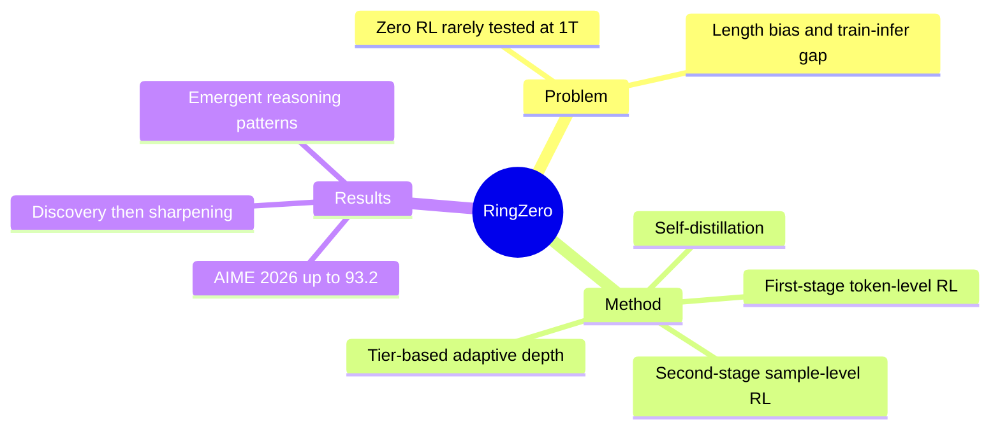

## Summary
Ring-Zero 将 zero RL 扩到 1T-parameter base model，并用三阶段 RL 加中间 self-distillation 控制训练稳定性、CoT 冗长与推理深度。结果支持“大模型 scale 提高 sample efficiency 与性能上限”，但其第三阶段 adaptive tiers 存在负迁移，且所谓 emergent cognitive behaviors 主要来自生成轨迹观察而非严格因果验证。

## Problem & Motivation
RL with verifiable rewards（RLVR）可以不依赖人工 CoT demonstration，从 base model 中激发 reasoning，但现有 zero RL 实验多在较小模型上，1T scale 的训练动力学与能力边界仍未知。naive scaling 还会放大三个问题：token-level objective 偏好更长输出，CoT readability 下降；Megatron training engine 与 SGLang inference engine 的数值差异可能被 importance ratio 放大至训练崩溃；固定 response budget 无法按题目难度分配 test-time compute。

## Method
Ring-2.5-1T-Zero 使用四阶段 pipeline：

1. **First-stage RL**：从 base model 直接开始，用 clipped importance-ratio policy gradient、GRPO-style advantage、KL regularization 与 token-level loss 放大低概率 reasoning token；ratio numerator 采用 training-engine logits 以显式校正 train–infer gap。
2. **Self-distillation**：每题从多条正确 rollout 中选最短轨迹，再让模型删除残余冗余，用清洗后的 CoT 对原 base model 做 SFT，从而压缩 reasoning 并重置累计数值偏差。
3. **Second-stage RL**：改用 sample-level normalization，使 gradient magnitude 不随输出长度增长，并移除 KL penalty，追求持续提升而不恢复 length bias。
4. **Third-stage RL**：把题目分为 Low/Medium/High tier，用不同 system prompt 与 4K/16K/高预算窗口训练 adaptive reasoning depth。

系统层仅在敏感位置使用 FP32（attention softmax 与 LM head），其余保持 BF16，并针对 hybrid attention 优化 context parallelism。论文还用 comprehensibility、reproducibility（弱模型蒸馏收益）和 efficiency（正确答案平均 token 数）补充 final-answer accuracy。

## Key Results
- 在七个数学 benchmark 的 64-run pass@1 中，First-stage 1T model 已在 AIME 2026 达到 84.2%；Self-Distillation 提至 88.1%，Second-stage RL 为 92.5%，加 Yarn=2 为 93.2%。
- Second-stage RL + Yarn=2 在 AIME 2024/2025/2026 分别达到 94.1/92.3/93.2%，HMMT Feb/Nov 2025、Feb 2026 为 90.6/90.8/81.0%，IMOAnswerBench 为 75.5%。
- Third-stage 模式提供显式 compute trade-off：Low 平均约 2,353 token、Medium 约 8,085、High 约 20,817；但 High mode 的峰值略低于第二阶段，作者归因于超长高质量数据不足和多长度 joint training 的 negative transfer。
- 训练轨迹呈现先“discovery”扩展可解边界、再“sharpening”提高既有边界内正确率的阶段；模型还出现 structured formatting、self-verification、parallel reasoning、anthropomorphism 与 context anxiety 等行为。

## Strengths & Weaknesses
**亮点**：把 zero RL 的长度激励视作阶段性工具而非永久 objective，是一个清楚且可复用的设计：早期用 token-level loss 鼓励探索，中间压缩，后期用 sample-level loss 去除长度偏置。train–infer ratio correction 与局部 FP32 也直接针对 1T 规模下的数值故障，而不是堆叠复杂 heuristic。对 CoT 同时衡量可读性、可蒸馏性和 token efficiency，比只看最终正确率更完整。

**局限**：论文没有公开 code 链接，1T training recipe 的可复现门槛极高。主要任务都是数学推理，结论不能直接外推到 tool-use 或 long-horizon agent RL；后期 correctness 依赖 Qwen3-Next-80B-A3B-Instruct 充当 judge，可能引入模型偏好。self-distillation 使用模型生成并筛选的 CoT，因此“完全无人工标注”成立，但不等于没有 imitation-style supervision。更重要的是，emergent behavior 的列举多为 qualitative trace，尚未证明它们由 scale 单独导致、也未证明 anthropomorphic/context-anxiety 表达对求解有正面因果作用。

## Mind Map

## Notes
最值得迁移到 agentic-RL 的不是“1T 更强”这一结论，而是 phase-specific objective：探索阶段允许长轨迹，稳定阶段显式压缩，再用按任务难度路由的预算控制成本。需要在 tool-use 环境中验证这种 phase schedule 是否仍有效。
