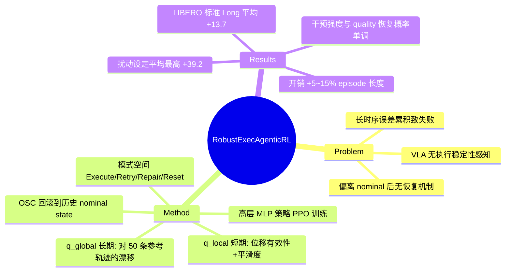

## Summary

在冻结的 VLA/diffusion 低层策略之上，用 PPO 训练一个轻量高层 MLP 策略，依据两个运行时执行质量指标在 {Execute, Retry, Repair, Reset} 四种执行模式中选择，通过回滚到历史 nominal state 来恢复退化的执行，LIBERO 上标准设定平均最高 +13.7、扰动设定最高 +39.2（LIBERO-Long 跨模型平均）。

## Problem & Motivation

机器人操作是长时序、误差累积的过程：一次卡滞、碰撞或扰动就可能让执行偏离 nominal 轨迹并导致任务失败。现有 VLA（OpenVLA、π₀ 等）泛化能力强，但**没有显式机制去评估执行是否还在正常轨道上，也没有偏离后的恢复手段**——策略只会继续往前生成动作，无法"意识到"自己已经失效。作者的观察是：失败往往不是"不会做"，而是"做的过程中坏掉了且回不来"，因此把 robustness 问题从"学更好的低层动作"重新表述为"学何时以及如何干预执行过程"。

## Method

整体是一个 **frozen 低层策略 + 高层 agentic 决策层** 的分层架构，创新点在监控指标和高层决策的动作空间设计。

**1. 两个运行时执行质量指标（均为 EMA 平滑）**

- **q_local（短期稳定性）**：由两项组成——Motion Effectiveness `E = ‖p_t − p_{t−W+1}‖ / (1/W Σ‖â_k‖ + ε)`（实际末端位移 / 指令动作幅值，检测卡滞），和 Motion Smoothness `S = 1/(1 + σ_v²/μ_v² + ε)`（瞬时速度变异系数的倒数，惩罚抖动），经 sigmoid 归一后 EMA 聚合。
- **q_global（长时序漂移）**：每任务采集 N=50 条成功参考轨迹，把执行窗口编码为特征 `z_t = [μ_s, μ_â, m, ā]`，按归一化进度 t/T 分 B=10 个 bin 做时间对齐，与对应 bin 内 k=5 近邻的平均欧氏距离 d_t 换算为 `exp(−α·d_t)` 再 EMA。作者展示成功执行的 quality 曲线高且稳、失败执行退化更快。
- 聚合分 `q_agg = λ·q_local + (1−λ)·q_global`。

**2. 高层 agentic 策略**

- Actor/Critic 均为轻量 MLP（不是 LLM/VLM）；输入为 L=20 步执行历史（本体感知 + 低层动作 + quality 分数），critic 训练时用 simulator 特权状态，actor 不用。每 K=5 个低层步做一次决策。
- 离散动作空间 **A = {Execute, Retry, Repair, Reset}**：
  - *Execute*：不干预，继续低层策略；
  - *Retry*：OSC 控制器回滚到最近 M=15 步内 quality 最高的历史状态；
  - *Repair*：更强回滚，退到最近 N=30 步内 quality 最高的**无接触**状态（夹爪张开；接触检测用 MuJoCo 力阈值 τ=5N）；
  - *Reset*：终止 episode 从头再来（测试时 Reset 的 episode 记为失败）。
- 恢复机制的定位是"不生成新动作，只把机器人送回之前到过的 nominal state，让低层策略重新生效"。
- **PPO 训练**：reward = 任务成功 +1 / 失败 −1，每步 −0.02 时间惩罚，Retry/Repair/Reset 分别 −0.1/−0.3/−0.5 的干预代价；每任务最多 1M 高层决策步。

## Key Results

LIBERO 四个 suite（Spatial/Object/Goal/Long），基座为 LIBERO 微调的 OpenVLA、π₀、π₀.₅ 和 Diffusion Policy，对比原始策略 vs +本方法。扰动设定：随机时刻把低层动作替换为 U(−δ,δ) 噪声（δ=3.0）连续 5 步。

**标准设定（base → +ours，成功率 %）**

| 基座 | Spatial | Object | Goal | Long |
|:--|:--|:--|:--|:--|
| OpenVLA | 77.8→90.2 | 70.8→88.7 | 74.0→92.4 | 54.0→74.5 |
| π₀ | 96.4→97.2 | 97.0→97.4 | 96.8→96.2 | 81.0→90.6 |
| π₀.₅ | 97.4→96.6 | 97.4→98.2 | 98.0→97.4 | 92.4→95.2 |
| Diffusion Policy | 78.3→86.4 | 90.2→92.5 | 68.3→77.6 | 50.5→72.4 |

**扰动设定（base → +ours）**

| 基座 | Spatial | Object | Goal | Long |
|:--|:--|:--|:--|:--|
| OpenVLA | 47.2→83.0 | 43.6→76.2 | 47.0→81.4 | 33.4→67.6 |
| π₀ | 58.0→85.5 | 60.0→86.0 | 58.0→85.0 | 33.8→79.5 |
| π₀.₅ | 80.0→90.4 | 64.0→92.8 | 67.2→88.8 | 40.2→87.2 |
| Diffusion Policy | 45.0→74.0 | 48.2→70.5 | 45.0→75.0 | 30.5→60.5 |

摘要中的 "up to 13.7% / 39.2%" 对应 LIBERO-Long 上四个基座的平均增益（标准 +13.7，扰动 +39.2）。

**分析实验**：(1) 决策分布随退化严重度单调偏移——轻度退化选 Retry、碰撞/受阻选 Repair、不可恢复选 Reset；(2) 决策后 quality 变化（Table III）：Reset 后 P(Δq_global>0)=0.95 > Repair 0.73 > Retry 0.61 > Execute 0.18，说明干预强度与 quality 恢复概率一致；(3) 开销（Table IV）：每 episode 额外 0.9~2.1 次恢复、episode 长度 +5%~15%，基座越脆弱开销越大。

## Strengths & Weaknesses

**Strengths**

- **问题表述干净**：把 robustness 从"改低层策略"解耦为"高层执行模式调度"，冻结 VLA、只训一个 MLP，模块化且即插即用于四种异构基座（OpenVLA/π₀/π₀.₅/DP 全部有效），这是全文最值钱的设计。
- 扰动设定下增益巨大（π₀.₅ Long 40.2→87.2），且 Table III 的"干预强度 ↔ quality 恢复概率"分析给方法机制提供了少见的因果侧证据。
- 诚实处：测试时 Reset 计为失败；明确承认对严重退化和 OOD 场景恢复能力有限。

**Weaknesses**

- **无任何 recovery/监控类 baseline**：只对比裸基座。最关键的 ablation 缺失——用他们自己的 q_agg 加一个阈值规则（quality 低于阈值就 Retry）能拿到多少增益？4 个离散动作 + 手工指标的设定下，RL 相对规则的必要性完全未证明。
- **扰动设定是为方法量身定做的**：动作注入均匀噪声 5 步，正是"回滚到历史状态"最容易修复的扰动类型；物体滑落、抓取失败、场景被外力改变等真实失效模式一个都没测。回滚只恢复机器人不恢复世界状态——如果退化过程中打翻了物体，Retry/Repair 无能为力，文中未讨论。
- **纯仿真且依赖 simulator 特权信息**：接触检测用 MuJoCo 力阈值、critic 用特权状态、每任务 1M 交互步 + 50 条成功参考轨迹，"highly amenable to sim-to-real" 是无证据的 claim。
- **任务特定性与 VLA 泛化性矛盾**：q_global 的参考轨迹和 PPO 训练都是 per-task/per-suite 的，给"泛化型"VLA 套上了一个不泛化的 robustness 层。
- OpenVLA 标准设定 baseline（77.8/70.8/74.0/54.0）明显低于官方微调结果（约 84.7/88.4/79.2/53.7，Object 差 17+ 点），复现偏低会放大标准设定下的表观增益；π₀/π₀.₅ 上标准设定增益接近于零甚至为负（Goal 96.8→96.2、Spatial 97.4→96.6），说明对强基座标准设定下方法基本无用，价值集中在扰动恢复。

**影响判断（推测）**：作为"execution monitoring + learned intervention"的 recipe 有参考价值，proprioception-only 的 quality 指标比调 VLM 做 failure reasoning 便宜得多；但要成为实用方案必须补上规则 baseline 对比和真机/真实失效模式验证。

## Mind Map

## Notes

- "Agentic" 一词名不副实：高层策略是 MLP，无语言、无推理、无工具调用，本质是经典 hierarchical RL 的 options/meta-controller，蹭了 agentic RL 的热词。
- 值得借鉴的是两个 quality 指标本身——proprioception-only、无需视觉/VLM 的 runtime 执行监控信号，可以移植到其他 VLA 失效检测工作里当廉价 detector。
- 开放问题：如果把 q_agg 阈值规则做 baseline，RL 的增量还剩多少？以及 rollback 在不可逆环境（液体、易碎物、物体位移）中如何定义 nominal state？
