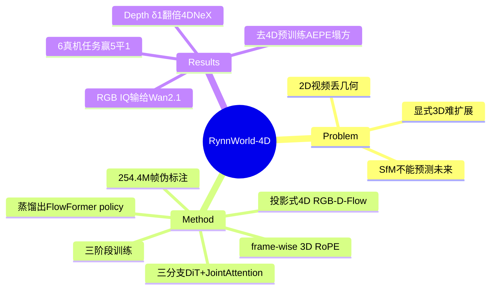

## Summary
把生成式 world model 从 2D 视频升级到 "投影式 4D"（同步预测 RGB + Depth + Optical Flow），用三分支 DiT 联合建模场景几何演化，再蒸馏出一个 inverse-dynamics policy 做双臂灵巧操作，在 6 个真机任务上多数超过 π₀/π₀.₅。

## Problem & Motivation
机器人操作需要预测 3D 环境在交互下如何演化，但现有 world model 各有短板：
- **2D 视频模型**（Wan、Cosmos 等）丢失空间关系，无法支持 6-DoF pose 估计，时序上会出现 scale 抖动、非物理形变。
- **显式 3D 方法**（NeRF / 3DGS）需要多视角输入、场景特定、缺乏生成式可扩展性。
- **Dynamic SfM** 能重建点云但无法预测未来状态。

作者主张：把生成式 world modeling 从 2D 视频推进到"几何一体化的 4D 场景演化"，是具身智能的必要一步。核心赌注是——**Depth 把像素反投影到 3D，Depth + Optical Flow 又能在 pinhole 相机模型下反解出 3D scene flow**，于是无需体素/显式 3D 表示就能拿到 per-point 的 3D 运动线索。

## Method

### "4D" 的定义
不是真正的 volumetric 4D，而是 **projective 4D = 同步的 RGB-D-Flow (RGB-DF)**。三个 2D 模态叠加，靠相机模型隐式承载几何与运动，回避了显式 3D 表示的扩展性问题。

### 架构 RynnWorld-4D
基座是 **Wan 2.2-TI2V-5B**（30 层 DiT，hidden 3072），扩成三分支：
- RGB / Depth / Flow 三条独立分支，各有独立 self-attention 和 FFN。
- **Joint Cross-Modal Attention (JA)** 每 3 层插一次（layer 0,3,...,27 共 10 个）：每个分支出一个 query，三模态共享 key/value，参数从 18d² 压到 12d²/block。
- **frame-wise 3D RoPE** 强制同一时间帧内的空间对齐；带 tanh 的 learnable gate 防止训练初期梯度死锁。

### 数据 Rynn4DDataset 1.0
**254.4M 帧**，混合 human-centric（Epic-Kitchens、EgoVid）+ robotic（RoboMIND、RDT-1B、Galaxea、AgiBot 等）。全部为**伪标注**：Qwen3-VL 打 caption、DPFlow 出稠密光流（25 FPS）、Depth Anything 3 出单目深度（clip 到 [0,5]m，8-bit 灰度）。

### 三阶段训练
1. **Modality Adaptation**：三分支独立训（LR 2e-5）。
2. **Frozen-Backbone Joint Attention**：冻结 backbone，只训 JA + per-modality embedding（Branch Dropout p=0.2）。
3. **Full-Parameter Joint SFT**：全解冻。
Loss 为三模态共享同一 Gaussian 噪声样本的 flow matching。

### RynnWorld-4D-Policy
冻结 world model，取 block 15 的三分支中间隐状态拼成 9216 维特征 → **Flow Former**（帧内空间 cross-attn + 时序 self-attn + learnable queries）→ flow-matching policy，N=4 步 ODE，预测 K=10 的 action chunk，实测约 **9 Hz** 控制频率（RTX 5090）。

## Key Results

### World Model（50 条 held-out 视频）
- **几何是强项**：Depth δ₁<1.25 达 0.610，近乎翻倍 4DNeX 的 0.327；AbsRel 0.310 vs 4DNeX 0.423；独家给出 optical flow（AEPE 0.170）。
- **RGB 反而不占优**：SSIM 0.754 / LPIPS 0.269 好于 TesserAct，但 **imaging quality 0.635 低于纯 2D 的 Wan-2.1 (0.684)**——即"4D 更好"在纯 RGB 观感这一维并不成立。

### 真机操作（TIANJI M6 + WUJI Hand，6 任务，各 35 trial）
6 个任务里赢 5 个、平 1 个（对手 DP / π₀ / π₀.₅）：
- Hand-over 28.57%（π₀ = 0%，π₀.₅ = 0%）——绝对值仍低，但把一个 baseline 全崩的任务做到了近 30%。
- Lid Placement 65.71%（DP 57.14%，π₀ 34.29%）、Bowl Stacking 65.71%（其余 <58%）。
- Dual Picking 94.29%（平 π₀.₅），Block Pushing 97.14%（略输 π₀.₅ 的 100%）。

### Ablation（信息量最大）
- **去掉跨模态融合**（独立分支）：δ₁ 0.610→0.245，AEPE 0.170→0.247——JA 是命脉。
- **去掉 4D 预训练**：AEPE 0.170→0.729（塌方）。
- **去掉 JA 里的 RoPE**：δ₁ 0.610→0.450。
- **Policy 模态消融**：RGB-only 77.14% → +Depth 91.43% → 全模态 94.29%（Dual Picking），证明 depth/flow 对下游 action 确有增益。

## Strengths & Weaknesses

**亮点**
- Projective 4D 的 formulation 干净：不碰体素/显式 3D，纯靠 RGB-D-Flow + 相机模型隐式拿几何，可扩展性远好于 NeRF/3DGS 路线。ablation 显示 depth/flow 对下游 policy 确有可测增益，不是花架子。
- JA 每 3 层共享 KV 的设计把跨模态融合成本压到 12d²，是有节制的工程。

**硬伤 / 存疑**
- **"4D 表征本身好" ≠ "world model 更好"**：RGB imaging quality 输给纯 2D 的 Wan-2.1，说明加了 depth/flow 并没提升观感生成，几何优势主要来自它显式监督了 depth 分支——某种意义上是"多标注了两个头"而非表征范式的胜利。
- **全链路建立在伪标注上**：depth（Depth Anything 3）和 flow（DPFlow）都是模型伪标，world model 的几何"ground truth"本身有偏，δ₁/AEPE 这些指标是在和伪标对齐，不等于真实几何精度。
- **9 Hz + 890ms 前向**：diffusion 去噪主导 89.5% 延迟，作者自认是高频控制瓶颈；egocentric-only、无多视角/多机协作也是明说的边界。
- 真机只有 6 个任务、单一硬件平台，Hand-over 上 π₀/π₀.₅ 双双 0% 略显极端，baseline 是否调优到位存疑。

**领域影响**：把 world model 的"预测未来"和 policy 的"生成动作"用同一套 4D 隐状态串起来，方向是对的；但当前更像"几何增强的视频预训练 + 特征蒸馏 policy"，离真正闭环的 4D 想象式规划还有距离。

## Mind Map

## Notes
- 值得追问：如果只把 depth/flow 当作辅助监督头加到 2D world model 上（而非独立三分支 + JA），能拿到多少几何增益？JA 相对"多头监督"的净收益需要更干净的对照。
- 与 2602-RynnBrain、2607-RynnWorldTeleop 同属 Alibaba DAMO 的 Rynn 系列，可连线看 DAMO 在 embodied world model + teleop 数据 + policy 上的整体布局。
- projective 4D vs TesserAct（RGB-D 视频）/4DNeX（4D 生成）的路线差异，可作为 world-model domain map 的一个分叉点。
