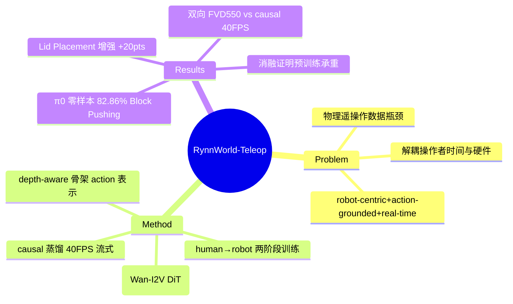

## Summary
用 action-conditioned world model 替代真实机器人来采数据："数字遥操作"——操作者的 hand-pose 流驱动一个实时（40+ FPS）视频生成模型合成机器人 egocentric 视频，用合成数据训练的 policy 可零样本迁移到真机，并作为增强数据提升双臂操作成功率。

## Problem & Motivation
机器人学习受数据规模瓶颈：物理遥操作把每条 demo 绑死在一台真机 + 固定工作区，吞吐量上限 = 操作者工时 × 硬件可用性。作者主张把"操作者时间"和"物理基础设施"解耦——**用生成式机器人替代真实机器人**。现有方案都不满足需求：human-to-robot 视频翻译类方法只做被动视觉映射、缺 action grounding；action-conditioned egocentric 模型仍是 human-centric 而非 robot-centric；且普遍不具备实时交互性。系统需同时满足三条：**robot-centric、action-grounded、real-time**。

## Method
系统由四块组成：

**A) Depth-Aware Action Representation**：从 21-joint hand tracking 得到手部姿态，用 depth-modulated 的颜色和线径渲染骨架视频（解决 2D 投影歧义），再经 VAE 编码为与视频 latent 时空对齐的 control latent $c \in \mathbb{R}^{C \times T \times H \times W}$。

**B) Action-Conditioned Video Generation**：基座是 Wan-I2V video DiT。关键设计是 **distribution-aligned patch embedding fusion**——先把 control latent 归一化到视频 latent 的分布（$\tilde{c} = \frac{c-\mu_c}{\sigma_c}\sigma_z + \mu_z$），再以零初始化、小系数 α≈0.1 的方式相加 $x = \text{PatchEmbed}^z(z_t) + \alpha\cdot\text{PatchEmbed}^c(\tilde{c})$，避免直接 concatenation 破坏预训练分布导致的不稳定。训练用 flow-matching (CFM) 目标。

**C) Progressive Cross-Domain Training**：Stage 1 在 human egocentric 数据 VITRA(25帧,1.23M slices)+EgoDex(81帧,0.91M slices) 上预训练学 hand-object 交互动态；Stage 2 在 1,800 条真机 MoCap 遥操作 demo（Dual Picking 500 / Block Pushing 500 / Bimanual Lifting 500 / Lid Placement 300，统一切成 81 帧）上做 robotic domain adaptation。机器人平台 TIANJI M6 + WUJI 灵巧手（共 54 DoF）。64×H100，训 2000 步。

**D) Streaming Autoregressive Distillation**：把双向 teacher 蒸馏成 causal student 以实现流式实时生成。两阶段：先 causal flow-matching warm-up（MSE），再 DMD（4-step sampling + 跨 chunk 的 KV cache 梯度回传）。student 用 fixed-size KV cache + causal temporal mask（timestep t 只 attend $\{1,...,t\}$），并把 reference image embedding 作为持久 sink token。

## Key Results
**World model 质量 (Table 4)**：双向 SFT 版 PSNR 26.78 / SSIM 0.887 / LPIPS 0.119 / FVD 550，但只有 2.8 FPS；**causal 实时版仅 22.25 / 0.830 / 0.207 / FVD 1226，但跑到 40.0 FPS**（单 H100，~25ms/帧：DiT 去噪 72%、VAE 解码 23%、骨架编码 5%）。对比 action-conditioned baseline：InterDyn FVD 655 / 2.9 FPS，Mask2IV LPIPS 0.219 / 0.9 FPS；对比 base video 模型 CogVideoX-1.5 FVD 2790、Wan-2.2-TI2V-5B(SFT) FVD 1223。

**真机 policy (Table 3，每任务 35 trials)**：
- Zero-shot Sim2Real：π₀ 只用 300 条 RynnWorld 合成数据 → 68.57 / 82.86 / 77.14 / 28.57（四任务）。
- 数据增强：π₀.₅ 从 300 Real 的 94.29/100/94.29/**42.86** → +300 RynnWorld 后 97.14/97.14/100/**62.86**；Lid Placement +20pts。
- π₀ 从 0Real+300Rynn → 300Real+300Rynn：94.29/100/97.14/54.29，加真机数据仍有明显提升。

**分布对齐 (Figure 5)**：用 I3D + t-SNE 对 1000 真实 vs 1000 生成帧可视化，声称分布高度重合。

## Strengths & Weaknesses
**亮点**：
- "数字遥操作"框架 genuinely 有意思——把 world model 当 data engine，闭环里操作者实时看到"机器人"反馈。40+ FPS 的 action-conditioned world model 是实打实的工程成就（对比同类 2–10 Hz），能匹配 30 Hz 相机频率。
- 两个 ablation 有说服力：(1) additive vs concatenation fusion，FVD 585 vs 1191，证明分布对齐融合是必要的；(2) human egocentric 预训练是承重结构——去掉后 FVD 585→2598、LPIPS 0.151→0.453，且出现 object permanence 崩塌（apple/effector 直接消失）。蒸馏消融也干净：去掉 causal warm-up 只剩 DMD，PSNR 崩到 14.26。

**硬伤 / 局限**：
- **"替代真实机器人"被 oversell**：Stage 2 仍需 1,800 条真机 MoCap 遥操作数据，且作者自己承认跨 embodiment 需 per-platform fine-tuning——这不是"替代机器人"，而是在窄任务分布内的**数据放大器**，先有真机数据才能生成。
- **headline 数字来自两个不同模型**：最亮眼的质量（FVD 550）是 2.8 FPS 的双向版，最亮眼的速度（40 FPS）是质量差很多的 causal 版（FVD 1226，比 SFT 差 2.2×）。操作者实际用的是后者，"高质量 + 实时"是拼出来的。
- **n=35 下多数提升在噪声内**：每 trial = 2.86%。Dual Picking 94.29→97.14 就是 1 条 trial，Block Pushing 100→97.14 反而差 1 条。唯一稳健信号是 Lid Placement 增强 (+7 trials, 42.86→62.86)——恰好是绝对成功率最低（~63%）的精细任务，说明合成数据在 policy 数据饥饿处帮助最大，但精细任务本身仍未解决。
- 单一 embodiment（TIANJI M6）、4 个任务、每任务 35 trials，评测规模偏小；作者也承认 fine-grained liquid / 高度可形变物体的物理仿真会崩。

**领域影响**：属于"world-model-as-data-engine"这条线的一个扎实工程节点，值得追踪，但"digital teleoperation 取代真机采数"的普适性还远未证明。

## Mind Map

## Notes
- 与 [[Papers/2602-RynnBrain]] 同为 DAMO Academy / Alibaba Group 的 Rynn embodied 系列（共享作者 Kehan Li / Xin Li / Siteng Huang / Deli Zhao）。前者是 embodied brain（理解+planning），本篇是 data engine（生成机器人视频），可视为同一 stack 的上下游。
- 值得追问：world model 生成的数据分布"高度重合"（t-SNE）却在 policy 端只带来窄任务的边际提升——分布对齐指标是否 overclaim？真机 policy 才是唯一硬指标。
- 与 vault 内 action-conditioned world model / video prediction 线的其他笔记（[[Papers/2604-GenerativeWorldRenderer]] 等）对比：本篇的差异点是 real-time 交互 + robot-centric action grounding，而非纯离线 rollout 质量。
