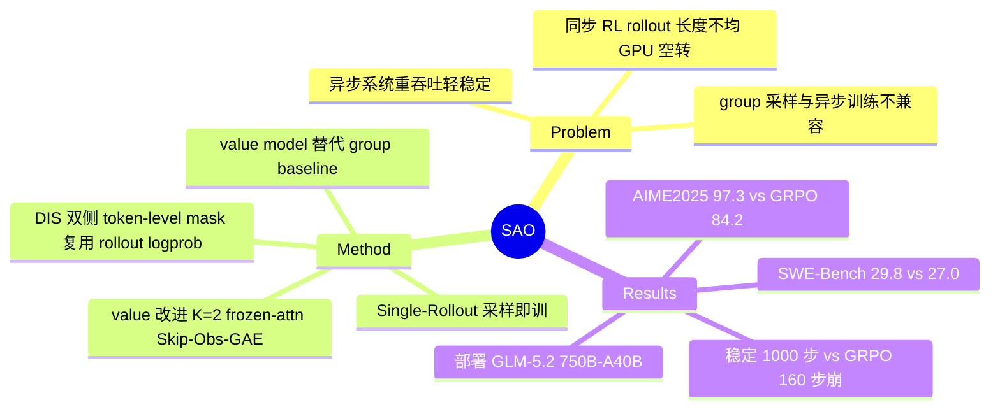

## Summary
针对同步 GRPO 在 long-horizon agentic RL 中因 rollout 长度不均导致 GPU 空转、且 group 采样与异步训练天然冲突的问题，提出 SAO：用 single-rollout 采样 + 复用 rollout log-prob 的双侧 token-level importance sampling（DIS）+ 强化的 value model（critic）替代 group baseline，实现稳定的异步 agentic RL，并已用于训练 GLM-5.2（750B-A40B）。

## Problem & Motivation
Agentic 任务（coding、multi-turn reasoning）的 rollout 长度方差极大，同步 RL pipeline 必须等最慢的 straggler 完成才能开始训练，GPU 集群大量空转。已有异步 RL 系统追求吞吐但牺牲稳定性。作者的核心论点是：**group-wise 采样（GRPO 及其变体）本质上与异步训练不兼容**——一个 group 内所有样本必须凑齐才能算 group-relative reward，最慢样本决定了整个 group 的可用时间，且不同 checkpoint 生成的样本混在一个 group 里会引入 off-policy drift。因此需要一种以单条 trajectory 为粒度、生成完即可训练的方案。

## Method
SAO（Single-rollout Asynchronous Optimization）三大组件：

1. **Single-Rollout Sampling**：每个 prompt 只采一条 rollout，完成即立即进入训练，抛弃 group。由此 advantage 无法再用 group-relative reward 估计，改用 **trained value model（critic）+ GAE** 给出 state-dependent 的 advantage。这是与 GRPO 路线最本质的分歧：回归 actor-critic，用 value model 换取异步友好性。

2. **Direct Double-Sided Importance Sampling（DIS）**：直接复用 rollout 阶段产生的 log-prob（π_θ/π_rollout），无需追踪历史 policy checkpoint。对 importance ratio 做严格的双侧 token-level masking——落在 [1−ε_l, 1+ε_h] 之外的 token 直接从梯度中 mask 掉，而非 clip 到边界。

3. **Value Model 改进**（针对 critic 是瓶颈这一观察）：
   - **Faster value update**：每次 policy 更新对应 K=2 次 critic 更新；
   - **Frozen attention**：RL 期间冻结 value model 的 attention 层，只更新其余参数做正则化；
   - **Skip-Observation GAE**：agentic trace 中把 action-to-action 的 value 直接相连，跳过 environment/observation token，弥合 action 之间的长间隔；
   - **Scaled value pretraining**：扩大 value 预训练数据，缓解 cold-start。

## Key Results
- **Math reasoning（Qwen3-30B-A3B + Python，Table 1）**：AIME2025 SAO 97.3% vs GRPO 84.2%；BeyondAIME 74.8% vs 54.8%；HMMT Nov 2025 88.3% vs 76.0%；IMOAnswerBench 74.0% vs 55.8%。
- **Coding（SWE-Bench Verified，Table 2）**：SAO 29.8% vs GRPO+DIS 27.0%。
- **训练稳定性（Fig 3）**：SAO 稳定训练约 1000 步；vanilla GRPO 在约 160 步崩溃。
- **Ablation（Table 4）**：去掉 faster value update 掉 2-5%；full-parameter value training 显著退化（AIME2025 90.6% vs 97.3%）；用 running-mean baseline 替代 value model 掉到 79.8%（vs 97.3%），验证 critic 是关键。
- **Training dynamics（Fig 4）**：faster value update 在 step 400 时 explained variance 更高；frozen-attention 使 gradient norm 更低更平滑；DIS 有效 clip token，而 VAPO baseline 在约 90 步崩溃。
- **Online learning**：模拟 reward preference shift（cute→chuunibyou→classical），SAO 快速适应，running-mean baseline 有明显 adaptation lag。
- 已部署于 GLM-5.2（750B-A40B）的 agentic RL pipeline，但论文未给该部署的具体数字。

## Strengths & Weaknesses
**Strengths**：
- 问题 formulation 抓得准——"group 采样与异步训练不兼容"是一个 first-principles 层面的观察，而非工程 trick。以单 rollout 为训练粒度是让异步 RL 稳定的合理路径。
- 复用 rollout log-prob 做 DIS 省掉了追踪历史 checkpoint 的开销，工程上干净。
- 稳定性对比很有说服力：GRPO 160 步崩、SAO 1000 步稳，且有 explained variance / gradient norm 的动力学证据支撑，不是只看终点指标。
- ablation 定位到 value model 是核心（running-mean 79.8% vs 97.3%），归因清晰。

**Weaknesses**：
- **异步系统设计本身几乎没写**——全文最该有的"rollout 如何 stream 到训练、staleness 如何界定、吞吐 vs on-policy 的权衡"只有一句"完成即可训练"，作为一篇标榜 asynchronous 的工作，infra 细节的缺失是硬伤。
- **只在 Qwen3-30B-A3B 单一 backbone 上验证**，作者自己承认"may not transfer to smaller models"或 dense-reward 环境；把方法卖点吊到 GLM-5.2（750B）却不给该规模的任何数字，最有分量的证据反而缺席。
- 路线回到 actor-critic，把复杂度从"凑 group"转移到"训一个好 value model"，依赖 value pretraining 解决 cold-start——本质是把问题换了个地方，是否比 GRPO 系省心存疑。
- online learning 只是 controlled simulated preference shift，离真实部署的鲁棒性还有距离。

## Mind Map

## Notes
- 核心张力：这篇同时在推 "single-rollout + value model" 和 "asynchronous"，但真正做实的是前者（算法 + 稳定性），后者（系统）几乎没展开。可读作"如何把 actor-critic RL 做稳"的论文，异步只是动机。
- 与 GRPO 系（GRPO / DAPO / VAPO）的对比是 clean 的 head-to-head，值得进 agentic-RL 训练方法的对比表。
- 待查：DIS 的 double-sided mask 与 DAPO 的 clip-higher、GSPO 的 sequence-level ratio 在处理 importance ratio 上的差异；value model frozen-attention 这个 trick 的来源。
