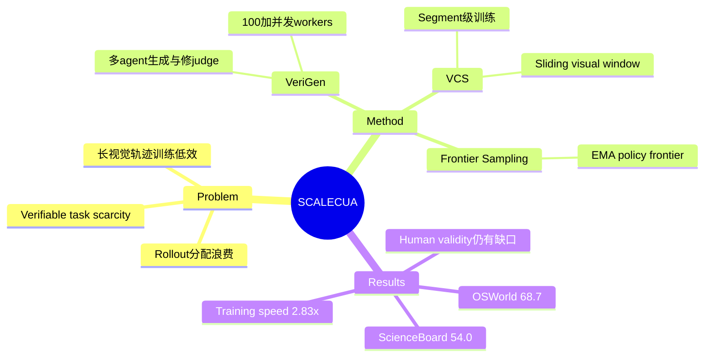

## Summary
SCALECUA 将 computer-use online RL 表述为 task supply、policy-relative sampling 与 multimodal context efficiency 的联合扩展问题。其 VeriGen、Frontier Sampling 与 Visual Context Segmentation 共同把 Qwen3.5-9B 推到 OSWorld 68.7%，但生成任务的人类有效性审计仍显示“judge 可执行”不等于“任务有效”。

## Problem & Motivation
Computer-use RLVR 的瓶颈不只是缺少 trajectory，而是缺少带 deterministic executable judge 的任务；同时 GUI rollout 慢、视觉历史长，标准 step-wise decomposition 会把一条长轨迹膨胀为大量高视觉 token 样本，令 actor/reference training 成为系统瓶颈。静态均匀采样又会持续浪费 rollout 在已掌握或当前不可学的任务上。因此论文主张：若 task generation、sampling 和 context representation 不共同演进，仅替换 RL objective 很难有效 scale。

## Method
**VeriGen** 在 live Docker desktop 中运行多 agent feedback loop，联合生成 task、initial state 与 Python judge。共享 interaction probe 支持 100+ concurrent workers；LLM Judge Agent 检查语义与可判定性，Rule Validator 实际执行 judge，Fix Agent 修复失败的程序，trajectory-guided generation 再利用现有 policy 的成功/失败轨迹提出新任务。24K+ candidates 最终过滤为近 3K 个 RL tasks。

**Frontier Sampling** 为每个任务维护当前 policy 的 EMA success rate，并优先分配 rollout 给通过率处于学习边界的任务，同时保留少量 uniform exploration。它与固定 curriculum 的区别是难度随 policy 更新，而不是由生成器预先定义。

**Visual Context Segmentation（VCS）** 不再把每个 executable turn 单独变成一个视觉训练样本，而是把连续 turns 合为 segment，并只保留最近 K 个 visual observations。Trajectory reward 仍分配给同一 rollout 的各 segments，token stream 和 mask 保留 segment 边界；这样把 step-wise 的 O(nT) 视觉处理压缩到约 O(nT/K)，同时避免把整个长历史塞进单个 context。

## Key Results
- Qwen3.5-9B 在 OSWorld 达 68.7%，在 ScienceBoard 达 54.0%；后者超过论文列出的 Claude Opus 4.6 52.7%。
- 组件消融中，full 68.7%；去掉 VeriGen 回到 base 43.9%，去掉 Frontier Sampling 为 63.7%，去掉 VCS 为 62.2%，三部分均有独立增量。
- VCS 把 actor update 从 485s 降到 154s、reference phase 从 241s 降到 88s，总 step time 从 750s 降到 265s，即 2.83x speedup。K=5 的 OSWorld pass@1 为 58.9%，高于 K=1 的 56.4% 与 K=15 的 56.8%；个案中 K=5 为 7/8，而 K=1、8、15 均为 0/8，呈明显 inverted-U。
- VeriGen 完整流程的 generated-judge executable rate 为 94.5%；移除 LLM Judge / Fix Agent / Rule Validator 后分别降至 62.3% / 78.1% / 86.2%。加入 trajectory-guided tasks 后，OSWorld test score 从 64.6% 提升到 68.7%。
- 任务审计揭示重要边界：160 个跨 domain 样本上 executable judge 与 human label 的加权 agreement 为 82.5%，但 human-valid task 比例在 OSWorld 为 82.0%、ScienceBoard 只有 58.3%。机械可执行的 reward function 并不自动保证 task formulation 合理。

## Strengths & Weaknesses
**已知—亮点。** 论文没有把环境并行、task sampling 和 context packing 当作附属工程，而是用消融证明它们直接影响最终 policy。VCS 的 inverted-U 结果尤其有价值：过短 history 丢失约束，过长 history 引入 stale visual interference，“更多 context 更好”在 GUI RL 中不成立。训练数据还做了 exact instruction、JSON 与 near-duplicate audit，降低了直接 benchmark contamination 的可能。

**已知—负结果与边界。** 24K candidates 只留下近 3K RL tasks，说明可验证任务合成仍有很高淘汰率；ScienceBoard human validity 58.3% 暴露出 task generator 与 executable judge 的语义缺口。实验 episode 上限为 50 turns，仅覆盖 Ubuntu desktop，并只验证 8B–9B VLM；不能据此外推到百步 workflow、Windows/macOS 或更小/更大模型。方法依赖大规模 Docker fleet、600 parallel VM environments 与多 GPU actor/reference stack，所谓“高效”是相对于同规模 step-wise pipeline，而非低资源训练。

**推测。** Frontier Sampling 与 [[Papers/2607-EvoCUA15]] 的 policy-aware filtering 指向同一结论：task quality 是 policy-relative 变量。VCS 则补充了第二个关系——experience value 还取决于当时采用的 context policy；改变 visual window 后，同一 trajectory 实际对应不同的训练状态。

**不知道。** 论文没有隔离“任务数量增加”与“trajectory-guided task 类型改变”各自带来的收益，也没有多 seed 方差报告；68.7% 的稳定性和跨环境复现性仍需独立验证。

## Mind Map

## Notes
- 与 [[Papers/2607-EvoCUA15]] 共同支持 online GUI RL 是 algorithm–data–system co-design；前者重点修正 advantage / group structure，本文重点扩展 task supply 与 visual context packing。
- 与 [[Papers/2607-GRPONullWebAgent]] 对读时应注意：SCALECUA 通过 Frontier Sampling 主动寻找 sampling headroom，避免在已掌握或全失败任务上制造 GRPO null。
- Survey 中不应只引用 68.7% SOTA，而应同时保留 ScienceBoard human-valid 58.3% 和未报告 multi-seed 的证据边界。
