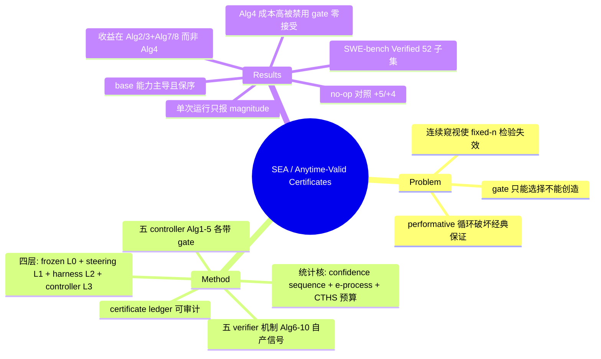

## Summary

SEA 把 self-evolving agent 的自我修改限制在 frozen base model 外围的一个 steering adapter（L1）与 versioned harness（L2）上，每次修改必须通过 anytime-valid gate（confidence sequence / e-process + 全局 error budget 的 CTHS 分配）并留下可审计 certificate；因为 gate 只能在 frozen base 已有行为中做选择，另配五个 verifier-in-the-loop 机制（self-authored reproduction oracle、verified micro-step search 等）从 issue 文本自产密集无 grader 信号。在 52-instance SWE-bench Verified 子集、no-op composite 对照下，套件贡献 +5（Gpt 29→34）与 +4（Glm 5.2 24→28）——但实测收益来自 directive 学习与 verifier 搜索，而标题所指的 certificate gate（Alg 4）因成本被排除在 live stack 之外、消融中接受 0 条编辑。

## Problem & Motivation

- Self-evolving agent 破坏了几乎所有 learning-theoretic 保证的前提：数据、evaluator、组件、hypothesis space 都由正在被更新的 policy 自己产生（performative 循环）。经典的 fixed-n 统计检验在 agent 每轮窥视自己统计量的场景下 "invalid by construction"。
- 作者的两条组织原则：(1) 每次自我修改都过一道 anytime-valid gate——用 e-value/e-process、time-uniform confidence sequence（optional stopping 下依然有效）给每条自我编辑发放对固定 error budget 记账的 certificate；(2) gate 只能**选择** frozen base 已能产生的行为、不能创造能力——当失败是 systematic 而 reward 只在 episode 末尾出现时 gate 无物可选，所以必须把 task verifier 变成主动的 in-loop 控制信号。
- 直接上游是 Statistical Gödel Machine（Wu et al. 2025，e-value gate + harmonic spending 控 familywise error）；SEA 在其上加 performative 修正、非平稳检验与 Seldonian 弃权语义（nsf = no solution found）。

## Method

**四层架构**：部署 policy πₜ = L0 ∘ L1⁽ᵗ⁾ ∘ L2⁽ᵗ⁾。L0 = frozen base LLM（永不更新）；L1 = steering adapter——k 条自然语言 strategy directive 上的 softmax 分布 θ∈ℝᵏ，只用 score-function 梯度在线更新、所有报告实验中从不做权重微调；L2 = versioned harness（system prompt、工具、step/exploration 预算、memory、grown abstraction library、repair pipeline）；L3 = loop controllers，持有 certificate、gate、budget、archive，不在 forward pass 里。每轮 controller 发出一条 **certificate**：结构化审计记录，含决策（accept / hold / reject / nsf）、error budget 消耗、算法指标，构成事后可审计的统一 ledger。

**Anytime-valid 统计核（§6）**：
- **Normal-mixture confidence sequence**（Howard et al. 2021）：对 σ-sub-Gaussian 增量给出对所有 n 同时成立的 time-uniform 半径——controller 每轮读它不膨胀错误率。
- **Hoeffding e-process**（Ramdas et al. 2023）：财富过程仅在 null 为假时期望增长，E_t ≥ 1/δ 即在任意停时安全拒绝；GROW 式 predictable plug-in betting（Alg 2 的 reward-model drift gate）。
- **CTHS（confirm-triggered harmonic spending）**：horizon-free 预算分配 δ_k = δ₀/(Z·k·log²(k+1))（Z≈3.39），把全局 error budget δ₀ 摊到无界多条自我编辑上、经 Ville's inequality 保 familywise error ≤ δ₀（SGM 原 schedule 需预先承诺有限 horizon；naive 的 δ₀/(2k·log²(k+1)) 会超支 ≈1.69δ₀、悄悄破坏 validity）。
- 辅助件：parameter-free coin betting（Krichevsky–Trofimov）+ drift-triggered restarts、seeded wild-bootstrap trend test、精确 1-D Wasserstein（performative 修正项）。

**五个 scheduled controller（Alg 1–5）**：

| Alg | 名称 | 管什么 | 作用层 | Gate 形式 |
|:--|:--|:--|:--|:--|
| 1 | PPB-CL | 无灾难遗忘的 continual learning | L1 | anchor 集 PAC-Bayes forgetting gate + performative trust region + commit gate |
| 2 | PNMP-A | reward model 漂移 / self-training collapse | reward model | 常数-α real-data anchor + Hoeffding e-process drift gate + 两时间尺度 Nash mirror-prox |
| 3 | PA-COCOA | 长时程 credit assignment | L1 | COCOA 反事实贡献 + coin betting + 漂移重启 |
| 4 | SGM-CS | 自我提议的 harness 编辑 | L2 | 并发 baseline/candidate 配对（common random numbers），LCB(paired gain) − ε·W₁ ≥ −ε_tol 才 admit，CTHS 记账，疑则弃权 nsf |
| 5 | SDC-QD | hypothesis-space 增长不塌缩 | L2 library | Stitch MDL 压缩 + DreamCoder wake-sleep + MAP-Elites QD archive |

每个 controller 的组成部件都是已发表结果，但**组合在 endogenous loop 下是否成立，五处全部被作者明示为未证明**（Alg 1 "is a conjecture, not a theorem we establish"；Alg 4 "empirical construct we do not prove safe"；§10 总括 "The endogenous-loop guarantees remain open conjectures"）。协议按构造 "safety over progress"——可以理性地无限期弃权；SWE 实例化用 shadow-best 把"部署哪个 harness"（受 gate）与"提交哪个 patch"（best-so-far）解耦。

**五个 verifier-in-the-loop 机制（Alg 6–10）**：Alg 6 best-of-N/refinement（best-of-2 后被实测移除）；Alg 7 verified micro-step search（一行编辑粒度 beam search + 失败签名记忆 + 级联验证）；**Alg 8 self-authored reproduction oracles**（核心：模型从 issue 文本自写复现测试，只有在 unpatched base 上失败才被接纳；V_self = 被翻转的 admitted oracle 比例；patch 只称 "promising" 从不称 "resolved"；held-out grader 只终端跑一次、从不引导搜索——测量与引导的防火墙）；Alg 9 search-layer control（仅离线仿真验证）；Alg 10 verified self-repair（修复原语须实测提升 apply-rate 才被采纳，曾拒绝人类会直接上的 diff-de-marking 手补 0/34 过闸）。

## Key Results

实验：SWE-bench Verified 的 seeded random draw 52 instances（24 Django、27 Matplotlib、1 Flask），官方执行式 grader，4 模型 × 套件 off/on + Glm 5.2 对照；live 套件开 10 个算法中的 8 个——**Alg 4 因 wall-clock 成本禁用，Alg 6 因净负移除**（Alg 1/2/3/5 以 certificate controllers 身份留在 live stack）。每格单次运行。

| Base（off→on） | off | on | Δ |
|:--|:--|:--|:--|
| Gemma（~31B） | 18 | 22 | +4 |
| Qwen（~27B） | 24 | 25 | +1 |
| Gpt-mini | 25 | 29 | +4 |
| Gpt（最强 base） | 28 | 34 | +6 |
| Glm 5.2（off = no-op 对照） | 24 | 28 | +4 |

- **Base capability 是主导效应**：单趟 baseline 严格保序 18<24<25<28，全套件下仍保序（22,25,29,34）。最好配置 Gpt+套件 34/52（65%）。
- **No-op composite 对照**（scaffolding + directives 开、算法全关）：Gpt 上 29 vs 单趟 28——scaffolding 效应只有 +1；full suite 34，对照上净 +5 归于算法本身。Glm 5.2 同向 +4。均为单次运行。
- **单算法消融（Gpt，对 29 对照重锚）**：Alg 2 +5（34，最佳单项）、Alg 7 / Alg 8 各 +3、Alg 3 +2；full suite 只追平最佳单项——收益重叠而非可加。**Alg 6（best-of-2）净负（26）**，日志显示从未产出第二次尝试反增 apply 失败；**Alg 4 的 36 是 artifact——其 confidence-sequence gate 接受了 0 条编辑，实际跑的是对照配置**，由 event-log 归因识破（论文自曝）。
- **Event-log 证据**：相对对照 run_tests 调用 +约50%、平均 episode +1.3 步——agent 在对自写测试迭代调试而非一次猜测；每轮必 fire 的是 directive learner Alg 2/Alg 3（全程各 52 次 policy 更新，即每 instance 一次）；回归少（full suite 4 个 p2p-flagged vs 对照 3）。consensus-flip：17/52 所有配置都解、10/52 无配置能解（多为 Matplotlib——base 能力墙）。
- 作者定位：固定 base 内的杠杆是套件（由 Alg 2/3 + Alg 7/8 承载）；绝对成绩的杠杆是更强的 base。

## Evidence Ledger

| Claim ID | Claim | Type | Source locator | Evidence excerpt | Status |
|:--|:--|:--|:--|:--|:--|
| C1 | no-op 对照隔离套件贡献 +5（Gpt 29→34，65%）/+4（Glm 5.2 24→28） | number | §9.1 / Tables 3-4 | "the suite's contribution is +5 (Gpt) and +4 (Glm 5.2)... 34/52 (65%)" | source-verified |
| C2 | base 能力主导：baseline 18<24<25<28，全套件保序（22,25,29,34） | number | §9 / Table 3 | "ordering is preserved with the full stack (22,25,29,34)" | source-verified |
| C3 | gate 统计形式 = time-uniform confidence sequence + Hoeffding e-process + CTHS δ_k=δ₀/(Z·k·log²(k+1))（Z≈3.39），Ville 控 familywise error；e-process 用于 Alg 2 drift gate、paired CS+εW₁ 用于 Alg 4 edit gate | causal-mechanism | §6 Eq.12-13 / §4.4 Eq.7 | "mixture supermartingale... through Ville's inequality" | source-verified |
| C4 | Alg 4（certificate gate 旗舰实例）因 wall-clock 成本不在 live stack；消融中 gate 接受 0 编辑、36 为对照 artifact（论文自曝）；Alg 1/2/3/5 仍以 certificate controllers 留在 live stack | benchmark-setting | Table 1/4 captions / §8 / §9.1 | "Alg 4 is omitted from the live SWE stack for wall-clock cost"; "its gate accepted 0 edits, so it ran the control configuration" | source-verified |
| C5 | 实测收益由 Alg 2/3（directive shaping，全程各 52 次 policy 更新）与 Alg 7/8 承载；Alg 2 单独 34（+5 最佳单项）、Alg 7/8 各 +3、Alg 3 +2；full suite 只追平最佳单项 | number | §9.1-9.2 / Table 4 | "the suite's live value is carried by Alg 2/Alg 3... and Alg 7/Alg 8" | source-verified |
| C6 | best-of-2 净负（26 < 29 对照），从未产出第二次尝试，被移出 live stack | number | §9.1 / Table 4 | "net-negative (26) and, per the run logs, never produced a second attempt" | source-verified |
| C7 | V_self 只依赖 issue 文本与 repo 行为；oracle 须在 unpatched base 失败才接纳；held-out grader 仅终端一次 | causal-mechanism | §5.2 | "V_self is a function only of the issue text and the repository's own behavior" | source-verified |
| C8 | 五个 controller 的 endogenous-loop 组合保证均明示未证明（conjecture/open） | sota-novelty | §4.1-4.5 各节 / §10 | "The endogenous-loop guarantees remain open conjectures" | source-verified |
| C9 | event log：run_tests +约50%、episode +1.3 步；回归 4 vs 3；17/52 全解、10/52 无解 | number | §9.2 | "run_tests calls rise by ~50% and mean episode length by ~1.3 steps" | source-verified |
| C10 | 每格单次运行，只报 magnitude 不报 significance | benchmark-setting | Abstract / Table 4 caption / §10 | "one run per cell... we report magnitudes rather than significance" | source-verified |
| C11 | 52 子集 = seeded random draw：24 Django、27 Matplotlib、1 Flask | benchmark-setting | §8 | "a seeded random draw of 52 instances" | source-verified |
| C12 | 称有 "executable reference implementation" 但全文无公开代码仓库链接 | license-code | §1 / 全文扫描 | "an executable reference implementation from which all pseudo-code... is distilled"（无 URL） | source-verified |
| C13 | Biswa Sengupta，JPMorgan Chase（LLM Suite Team），单作者，v1 2026-07-01 | benchmark-setting | 标题页 / abs 页 | "LLM Suite Team, JPMorgan Chase" | source-verified |

## Strengths & Weaknesses

**亮点**
- **给 evolution-step gating 补上了统计学形态学**：这是 gate 家族里第一篇把"演化步验收"形式化为 anytime-valid inference 问题的工作——[[Papers/2605-GRASP]] 的 held-out 探针本质是每次编辑一个 fixed-n 检验（连续窥视下无 familywise 控制），[[Papers/2606-SkillNb]] 的 gate 是运行时谓词；SEA 明确指出 self-evolving agent "每轮窥视自己的统计量"使 fixed-n 检验按构造失效，并给出对症机制包：optional stopping 下有效的 confidence sequence / e-process、无界编辑流上的 CTHS 预算记账、performative（ε·W₁）修正、每轮落 ledger 的 certificate（与 [[Papers/2512-ASGSI]] 的 evidence-bundle 审计诉求同向，但给了具体统计承载）。
- **诚实度罕见**：五处组合保证全部明写未证明；Alg 4 的 36 分被 event-log 归因主动戳破为 artifact；best-of-2 负效应如实报告并移除；self-oracle 的 patch 只称 "promising"；Alg 10 拒绝了人类会直接上的手补。单作者工业论文有这种自曝质量少见。
- **"gate 只能选择、不能创造"是清晰的机制论断**：解释了为什么必须配 verifier-in-the-loop 机制自产变异与密集信号，也解释了 10/52 的 base 能力墙；self-oracle 的 admission 规则 + 测量/引导防火墙设计干净，且 event log 显示它真实改变了行为（run_tests +50%）。

**局限**
- **标题写的 gate 恰恰是实证最弱的部件**：Alg 4 因 wall-clock 成本被排除在 live stack 外，消融中接受 0 条编辑；论文**没有 gate-on vs gate-off 的组内消融**——+5/+4 隔离的是"算法套件 vs scaffolding"，不是"闸门 vs 无闸门"。对比 GRASP 恰好做了后者并把收益归于闸门：SEA 对 "gate 即收益来源" 论题的支持是**形式化贡献强、实证贡献缺位**。
- **保证的实际内容存疑**：作者自陈 anytime-validity 使 gate 保守（PAC-Bayes 项高维下 vacuous、Alg 4 只保 safety 不保 progress、可无限期弃权）；performative sensitivity ε 是手设超参、无在线可估性保证；wild-bootstrap 加宽在 endogenous loop 下只是保守启发。证书在 conjecture 成立的前提下才是证书。
- **实证薄**：每格单次运行、无方差；52 实例单次 seeded draw 且高度偏斜（27/52 Matplotlib）；单 harness 单套超参；slow-loop distillation 设计了但没跑；无公开代码。
- **与 GRASP/SKILL.nb 的适用域差异**：SEA 的密集信号来自"可自写复现测试"的 SWE 域——与 GRASP 的边界发现（探针在开放动作空间失效）同构：V_self 依赖 issue 可复现 + 测试可执行，GUI/OS 域没有这个奢侈。

## Mind Map

## Connections

- [[Papers/2605-GRASP]] / [[Papers/2606-SkillNb]] / [[Papers/2512-ASGSI]] — gate 家族对照：GRASP 用最朴素的检验证明了"闸门是收益来源"，SEA 用最讲究的检验但没能在 live loop 里证明闸门本身的价值（贵到跑不起 + 零接受）。合并读的结论是：**gate 的统计严格性与 gate 的实证收益目前是两条不相交的线**；"严格且付得起"的 gate 仍是空白。
- [[Papers/2603-SEVerA]] — 同批 digest：形式化保证的另一端（Dafny 静态验证 + FGGM contract 对任意参数成立、验证与学习解耦），SEA 是统计协议、SEVerA 是演绎证明；两者共同把 gate 家族从经验验收扩展到形式化谱系。
- [[Papers/2509-Misevolution]] — SEA 的 frozen-base + 有界修改面正面回应 misevolution 风险面（修改限制在可审计的 L1/L2），但其安全论证依赖五个未证明的 conjecture——架构上收窄攻击面是实的，统计保证是期票。
- [[Topics/SelfEvolvingAgents-Survey]] — gating 家族新增**统计协议级**粒度；Open Problem "gate 自身的可信性与成本" 得到新数据点：即便统计上最讲究的 gate，也在成本上跑不进 live loop、在行为上无限弃权——"anytime-valid 的代价是 anytime-abstain"。
- [[Papers/2511-LiveSWEAgent]] — 同域对照（SWE-bench Verified）：Live-SWE 零 gate 拿 77.4%（强 backbone），SEA 满 gate 拿 65%（52 子集、不同 backbone 不可直接比数）——gating 光谱两端在同一任务域上的并存本身就是 open problem 的具象化。

## Notes

- Alg 8 self-oracle 与 GRASP 探针的关键差异：GRASP 的探针来自真实开发集（外部 ground truth 的代理），SEA 的 oracle 是 policy 自写的（无 grader 信号）——后者更 scalable 但引入 oracle 可被自己 game 的新风险，作者以 admission 规则 + 终端 grader 防火墙缓解，未量化 oracle 的 precision/recall。这与 survey 记录的"gate 谓词 precision 未被独立测量"开放问题完全同构。
- CTHS 的 horizon-free 修正（naive schedule 超支 ≈1.69δ₀）是可复用的技术细节，任何想做"无界编辑流上的 familywise 控制"的 gate 设计都会踩这个坑。
- 待查：无代码链接；Glm 5.2 具体来源论文未展开。
